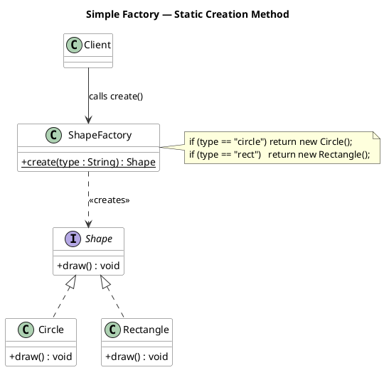
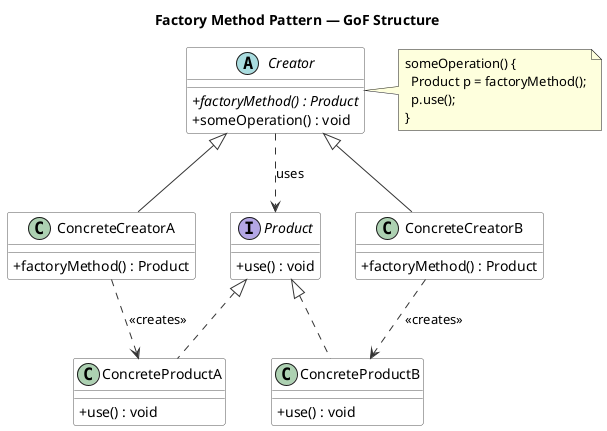
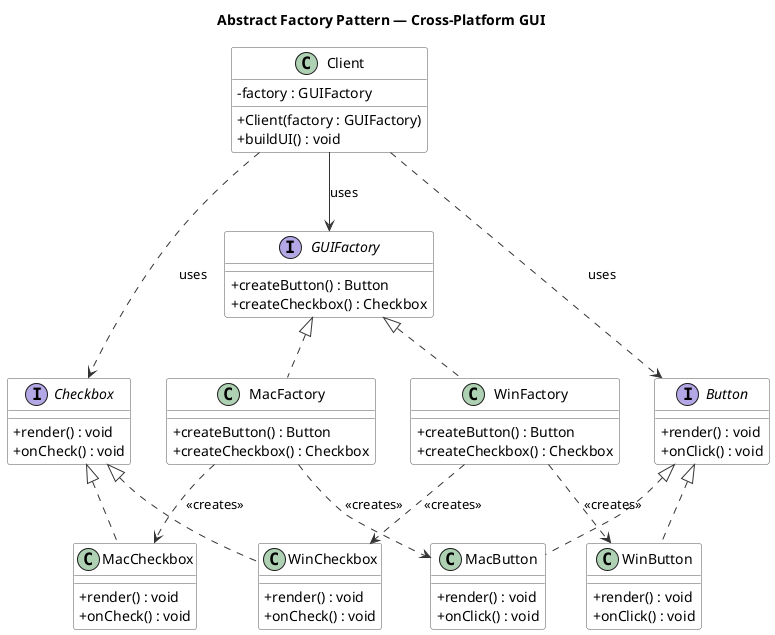
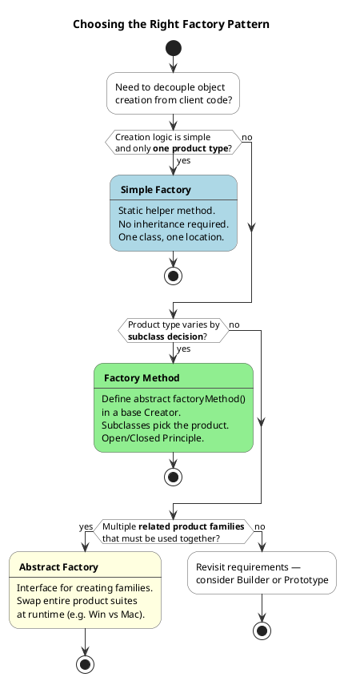

# Exploration: Factory Design Pattern

> Status: DOCUMENTED
> Created: 2026-03-18
> Author: GG

---

## Table of Contents
<!-- TOC -->
* [1. Context](#1-context)
* [2. Proposed Doc Structure](#2-proposed-doc-structure)
* [3. Subtopics](#3-subtopics)
* [4. Diagrams](#4-diagrams)
* [5. Q&A](#5-qa)
* [6. Related Topics](#6-related-topics)
* [7. References](#7-references)
<!-- TOC -->

---

## 1. Context

The Factory Design Pattern is a family of creational design patterns originating from the Gang of Four (GoF) book *Design Patterns: Elements of Reusable Object-Oriented Software* (1994). It addresses a core object-oriented concern: how to decouple the code that **uses** an object from the code that **creates** it.

Without factories, client code calls `new ConcreteClass()` directly, tightly coupling it to a specific implementation. This makes it hard to swap implementations, apply OCP/DIP, or inject different behavior at runtime. The factory family solves this by introducing an abstraction over object creation.

The pattern family spans three closely related variants — Simple Factory (an idiom), Factory Method (GoF), and Abstract Factory (GoF) — with increasing power and complexity. It sits at the foundation of the Creational Patterns category and directly underpins IoC containers, plugin systems, cross-platform toolkits, and framework extension hooks throughout the Java ecosystem (e.g., Spring's `BeanFactory`, `Calendar.getInstance()`, `DocumentBuilderFactory`).

---

## 2. Proposed Doc Structure

```
docs/pages/design-patterns/
├── solid.md                          (exists)
├── behavioral/
│   └── observer.md                   (exists)
└── creational/
    ├── factory.md                    ← overview + pattern comparison (index page)
    └── factory/
        ├── simple-factory.md         ← Simple Factory idiom
        ├── factory-method.md         ← GoF Factory Method pattern
        └── abstract-factory.md       ← GoF Abstract Factory pattern
```

`get-started.md` — The existing `Factory Method` and `Abstract Factory` entries in the Design Patterns section will be linked. A new `creational/` grouping will be introduced.

---

## 3. Subtopics

### Simple Factory
- **Description**: A static or instance helper class that centralises object creation in a single method using a conditional (if/switch). Not a formal GoF pattern — it's a common precursor idiom that trades OCP for simplicity.
- **Key Concepts**:
  - Static factory method
  - Conditional dispatch (`switch`/`if-else`)
  - Single point of creation but violates OCP when new types are added
  - Often the first step before adopting Factory Method
- **Example**:
  ```java
  public class ShapeFactory {
      public static Shape create(String type) {
          return switch (type) {
              case "circle"    -> new Circle();
              case "rectangle" -> new Rectangle();
              default          -> throw new IllegalArgumentException("Unknown: " + type);
          };
      }
  }
  Shape s = ShapeFactory.create("circle");
  ```
- **Own page**: Yes

---

### Factory Method Pattern (GoF)
- **Description**: A formal GoF creational pattern that declares an abstract factory method in a base Creator class. Subclasses override it to decide which ConcreteProduct to instantiate. The Creator's business logic calls the factory method polymorphically — it never refers to concrete types.
- **Key Concepts**:
  - Abstract `factoryMethod()` in the Creator
  - Subclasses (ConcreteCreator) override `factoryMethod()` to return a specific product
  - Open/Closed Principle: add a new product by adding a new subclass, not modifying existing code
  - Participants: Product, ConcreteProduct, Creator, ConcreteCreator
- **Example**:
  ```java
  public abstract class NotificationService {
      public abstract Notification createNotification(); // factory method
      public void notify(String msg) {
          Notification n = createNotification();
          n.send(msg);
      }
  }
  
  public class EmailNotificationService extends NotificationService {
      public Notification createNotification() { return new EmailNotification(); }
  }
  ```
- **Own page**: Yes

---

### Abstract Factory Pattern (GoF)
- **Description**: A formal GoF creational pattern that provides an interface for creating **families** of related objects. Concrete factories implement the interface to produce a consistent set of products. The client is programmed entirely against factory and product interfaces.
- **Key Concepts**:
  - Factory interface declares creation methods for every product in the family
  - Concrete factories produce consistent families (e.g., `WinButton` + `WinCheckbox`)
  - Guarantees product compatibility within a family
  - Participants: AbstractFactory, ConcreteFactory, AbstractProduct, ConcreteProduct, Client
- **Example**:
  ```java
  public interface GUIFactory {
      Button   createButton();
      Checkbox createCheckbox();
  }
  
  public class WinFactory implements GUIFactory {
      public Button   createButton()   { return new WinButton();   }
      public Checkbox createCheckbox() { return new WinCheckbox(); }
  }
  
  public class Application {
      private final GUIFactory factory;
  
      public Application(GUIFactory factory) { 
        this.factory = factory; 
      }
  
      public void buildUI() { factory.createButton().render(); }
  }
  ```
- **Own page**: Yes

---

### Pattern Comparison (Simple vs Method vs Abstract)
- **Description**: Side-by-side analysis of the three variants — their scope, mechanism, SOLID compliance, and decision criteria for choosing between them.
- **Key Concepts**:
  - Simple Factory: one product type, no subclassing, violates OCP
  - Factory Method: one product hierarchy, extensibility via inheritance, satisfies OCP/DIP
  - Abstract Factory: multiple product families, extensibility via new factory classes, satisfies OCP/DIP
  - Common decision heuristic: start Simple → evolve to Method → evolve to Abstract
- **Own page**: No (embedded in `factory.md` overview)

---

### Factory vs Dependency Injection
- **Description**: Comparison of the Factory pattern and DI/IoC containers — when each is appropriate and how they complement each other.
- **Key Concepts**:
  - DI wires dependencies at startup; client is unaware of creation
  - Factory is called at runtime by the client to produce objects on demand
  - DI cannot handle runtime type selection (e.g., based on user input); factories can
  - Best practice: inject a factory interface via DI, then call it at runtime
- **Own page**: Yes

---

## 4. Diagrams

### Diagram 1 — Simple Factory



**Caption:** The Simple Factory pattern centralises object creation in a single static method. The client depends only on the factory and the `Shape` interface, never on concrete classes — but every new type requires modifying `ShapeFactory`.

---

### Diagram 2 — Factory Method Pattern (GoF)



**Caption:** The Factory Method pattern delegates instantiation to subclasses. `Creator.someOperation()` works entirely against the `Product` interface — it never references a concrete class. Adding a new product only requires a new `ConcreteCreator` subclass.

---

### Diagram 3 — Abstract Factory Pattern



**Caption:** The Abstract Factory pattern groups related product families (`WinButton`/`WinCheckbox`, `MacButton`/`MacCheckbox`) behind a common interface. The `Client` is fully decoupled — it knows nothing about which platform-specific family it's working with.

---

### Diagram 4 — Pattern Selection Flow



**Caption:** A decision-flow guide for selecting between the three factory variants based on creation complexity and product family structure.

---

## 5. Q&A

| # | Question | Answer |
|---|----------|--------|
| 1 | What problem does the Factory pattern solve that `new` cannot? | Direct instantiation couples the client to a specific concrete class, making it impossible to swap implementations without changing client code. Factories introduce an abstraction so the client depends on interfaces, not concrete types. |
| 2 | Is Simple Factory the same as Factory Method? | No. Simple Factory is a programming idiom (often a static method with a conditional) not listed in the GoF catalog. Factory Method is a formal pattern that achieves extensibility through polymorphism. Adding a product in Simple Factory requires modifying the factory class; in Factory Method it only requires adding a new subclass. |
| 3 | When should I use Factory Method vs Abstract Factory? | Use Factory Method when delegating creation of a single product type to subclasses. Use Abstract Factory when you need to create families of related products that must be used together and there are multiple variants of that family (e.g., Windows vs Mac UI widgets). |
| 4 | How do Factory patterns relate to the Open/Closed Principle? | Both Factory Method and Abstract Factory allow new product types (or product families) to be introduced by adding new subclasses or new concrete factory implementations — without modifying existing creator or client code. That's OCP: open for extension, closed for modification. |
| 5 | How does a Factory pattern differ from Dependency Injection? | DI wires dependencies at construction time — the client receives pre-built objects and has no awareness of the container. A factory is called at runtime by the client to produce objects on demand. When the type of dependency is only known at runtime (e.g., based on user input), factories are necessary even in a DI-driven application. |
| 6 | What are the signs of Factory pattern overuse? | Key warnings: the factory only ever creates one concrete type; there is no runtime variation; the factory class contains more conditional complexity than the objects it creates; a simpler constructor or DI injection would serve equally well with less ceremony. |
| 7 | Are there Factory patterns in the Java standard library? | Yes. `Calendar.getInstance()`, `NumberFormat.getCurrencyInstance()`, `Charset.forName()`, `DocumentBuilderFactory.newInstance()`, and `EnumSet.of()` all use static factory methods or Abstract Factory variants. The `javax.xml.parsers` package is a canonical Abstract Factory example. |
| 8 | What guarantees does Abstract Factory provide about product compatibility? | Abstract Factory guarantees that all products returned by the same concrete factory are designed to work together (e.g., `WinButton` + `WinCheckbox`). Mixing products from different factories is prevented because the client only ever receives objects from one factory instance. |

---

## 6. Related Topics

| Topic | Relationship |
|-------|-------------|
| SOLID Principles (`docs/pages/design-patterns/solid.md`) | Factory Method directly implements OCP and DIP; prerequisite context for understanding why factories exist |
| Observer Pattern (`docs/pages/design-patterns/behavioral/observer.md`) | Also a GoF pattern; both are often used together in event-driven architectures |
| Builder Pattern | Another GoF creational pattern; complementary to Factory when the constructed object requires many configuration steps |
| Singleton Pattern | Often implemented using static factory methods (`getInstance()`); frequently combined with Factory |
| Prototype Pattern | Third GoF creational pattern; can substitute for Factory when cloning existing objects is cheaper than construction |
| Dependency Injection / IoC | Factory and DI solve related but distinct problems; factories handle runtime type selection, DI handles wiring at startup |
| Spring Framework | Spring's `ApplicationContext` is itself an Abstract Factory / IoC container; `BeanFactory` is a textbook example |
| Object-Oriented Programming | Factory patterns require polymorphism, inheritance, and interface abstractions — core OOP concepts |

---

## 7. References

- [Factory Method — Refactoring.Guru](https://refactoring.guru/design-patterns/factory-method) — Canonical reference with structure, pseudocode, and multi-language examples
- [Abstract Factory — Refactoring.Guru](https://refactoring.guru/design-patterns/abstract-factory) — Canonical reference for the family-of-objects variant
- [Factory Pattern Comparison — Refactoring.Guru](https://refactoring.guru/design-patterns/factory-comparison) — Official side-by-side comparison of all three variants
- [Factory Method Pattern — Wikipedia](https://en.wikipedia.org/wiki/Factory_method_pattern) — Encyclopedic definition with UML and historical GoF context
- [Abstract Factory Pattern — Wikipedia](https://en.wikipedia.org/wiki/Abstract_factory_pattern) — Encyclopedic definition with structural diagrams
- [Applying the Factory Pattern to Java RMI — Oracle Docs](https://docs.oracle.com/javase/8/docs/technotes/guides/rmi/Factory.html) — Official Oracle documentation showing factory usage in the Java platform
- [Factory Method Pattern — OODesign.com](https://www.oodesign.com/factory-method-pattern) — Structured reference with UML diagram and participant descriptions
- [Inversion of Control Containers and the Dependency Injection pattern — Martin Fowler](https://martinfowler.com/articles/injection.html) — Authoritative article on the Factory vs DI distinction
