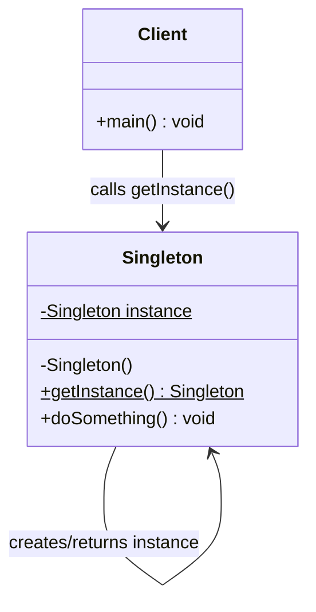
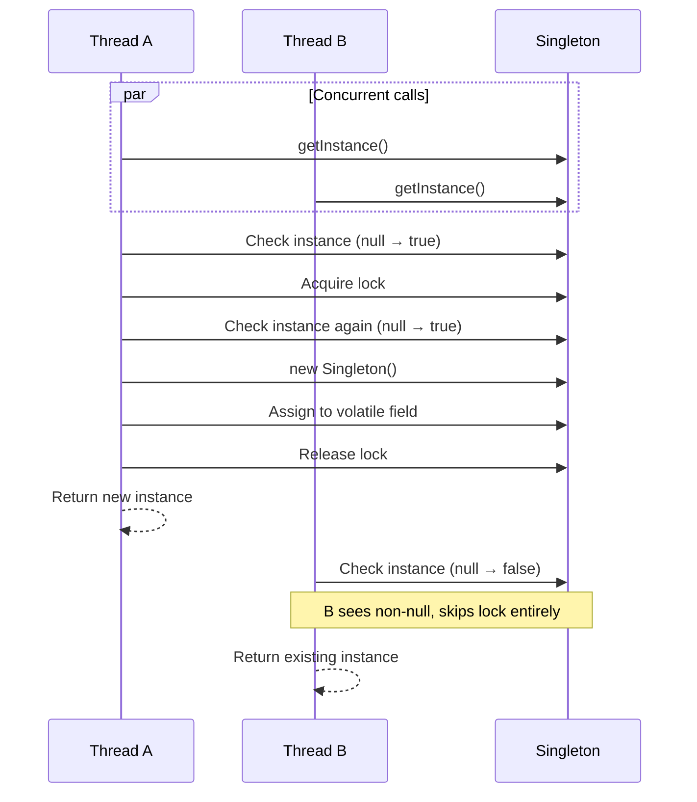
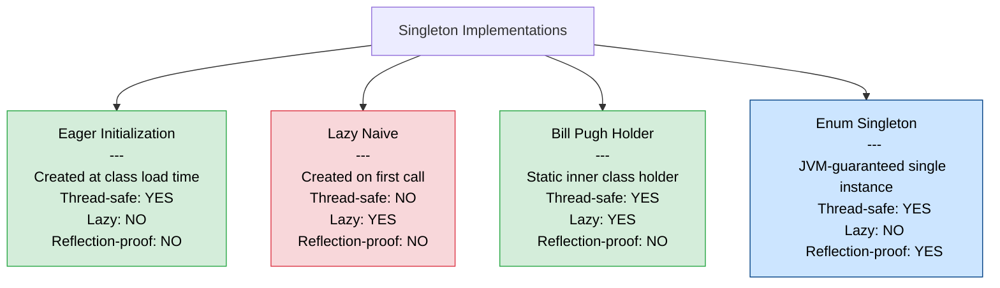

# Exploration: Singleton GoF Design Pattern

> Status: DOCUMENTED
> Created: 2026-03-26
> Author: GG

---

## Table of Contents
<!-- TOC -->
* [1. Context](#1-context)
* [2. Proposed Doc Structure](#2-proposed-doc-structure)
* [3. Subtopics](#3-subtopics)
* [4. Diagrams](#4-diagrams)
* [5. Q&A](#5-qa)
* [6. Related Topics](#6-related-topics)
* [7. References](#7-references)
<!-- TOC -->

---

## 1. Context

The **Singleton** is one of the five GoF creational design patterns, first catalogued in *Design Patterns: Elements of Reusable Object-Oriented Software* (Gamma, Helm, Johnson, Vlissides — 1994). Its intent is to **ensure a class has exactly one instance** and to provide a **global access point** to that instance. It belongs to the creational layer of the GoF taxonomy — controlling object instantiation — and appears frequently in infrastructure concerns: logging, configuration, connection pools, and caches.

It is also one of the most scrutinised patterns in modern software engineering, frequently labelled an anti-pattern when misapplied, because it introduces hidden coupling, hinders testability, and conflates two responsibilities into one class. Understanding Singleton is essential for a software architect both to recognise legitimate uses and to argue persuasively against its overuse.

---

## 2. Proposed Doc Structure

All subtopics are sections of a single page — none require standalone files.

```
docs/pages/design-patterns/
└── creational/
    ├── factory.md                    (existing)
    ├── factory/
    │   ├── simple-factory.md         (existing)
    │   ├── factory-method.md         (existing)
    │   └── abstract-factory.md       (existing)
    └── singleton.md                  (NEW — single page, all subtopics as sections)
```

`docs/get-started.md` already has a `Singleton` stub under Creational Patterns — its link will be updated to `pages/design-patterns/creational/singleton.md`.

---

## 3. Subtopics

### Pattern Intent and Structure
- **Description**: The canonical GoF definition. The Singleton class holds a private static reference to its own instance, exposes a public static `getInstance()` factory method, and hides its constructor to prevent external instantiation.
- **Key Concepts**:
  - Private static field holding the one instance
  - Private constructor
  - Public static `getInstance()` as the sole access point
  - The class is responsible for enforcing uniqueness
- **Example**:
  ```java
  public final class Singleton {
      private static Singleton instance;
      private Singleton() {}
      public static Singleton getInstance() {
          if (instance == null) {
              instance = new Singleton();
          }
          return instance;
      }
  }
  ```
- **Own page**: No

---

### Eager Initialization
- **Description**: The instance is created when the class is loaded by the JVM. Thread-safe by the JVM class-loading guarantee — no synchronization code is needed. The downside is the resource cost is always paid, even if the instance is never used.
- **Key Concepts**:
  - `private static final` field initialized inline
  - Safe in all concurrency scenarios
  - Appropriate when the instance is always needed and cheap to create
- **Example**:
  ```java
  public final class AppConfig {
      private static final AppConfig INSTANCE = new AppConfig();
      private AppConfig() {}
      public static AppConfig getInstance() { return INSTANCE; }
  }
  ```
- **Own page**: No

---

### Lazy Initialization (Naive)
- **Description**: Instance creation is deferred until the first call to `getInstance()`. Saves resources when the instance may never be needed. **Not thread-safe** — two threads can both see `instance == null` before either assigns the field, producing two distinct instances.
- **Key Concepts**:
  - Null-check before instantiation
  - Race condition under concurrent access
  - Only safe in single-threaded applications
- **Example**:
  ```java
  public static Singleton getInstance() {
      if (instance == null) {           // race condition here
          instance = new Singleton();
      }
      return instance;
  }
  ```
- **Own page**: No

---

### Thread-Safe: Double-Checked Locking
- **Description**: Uses a `volatile` field and two null-checks — one before and one inside a `synchronized` block — to achieve lazy initialization with minimal synchronization overhead on the hot path (after initialization, no lock is acquired).
- **Key Concepts**:
  - `volatile` prevents partial-construction visibility across CPU caches (Java Memory Model)
  - First check avoids locking once initialized
  - Second check inside lock prevents double instantiation on first-time concurrent access
  - Requires Java 5+ (JSR-133 memory model)
- **Example**:
  ```java
  public final class ConnectionPool {
      private static volatile ConnectionPool instance;
      private ConnectionPool() {}

      public static ConnectionPool getInstance() {
          ConnectionPool result = instance;
          if (result != null) return result;
          synchronized (ConnectionPool.class) {
              if (instance == null) {
                  instance = new ConnectionPool();
              }
              return instance;
          }
      }
  }
  ```
- **Own page**: No

---

### Bill Pugh / Initialization-on-Demand Holder
- **Description**: Uses a private static inner class whose only member is the singleton instance. The JVM guarantees static inner classes are not loaded until first referenced — achieving lazy initialization without any synchronization code.
- **Key Concepts**:
  - Class-loading guarantee replaces explicit locking
  - No `volatile`, no `synchronized`
  - Preferred lazy approach before Java enums became idiomatic
- **Example**:
  ```java
  public final class Logger {
      private Logger() {}
      private static final class Holder {
          static final Logger INSTANCE = new Logger();
      }
      public static Logger getInstance() {
          return Holder.INSTANCE;
      }
  }
  ```
- **Own page**: No

---

### Enum Singleton (Effective Java / Joshua Bloch)
- **Description**: Declares the singleton as an enum constant. The Java Language Specification guarantees enum constants are instantiated once per JVM. Immune to Reflection API attacks (JLS forbids reflective instantiation of enums) and serialization attacks (enum serialization uses the constant's name, not the object graph).
- **Key Concepts**:
  - JLS-guaranteed single instantiation
  - No reflection vulnerability
  - No `readResolve()` needed for serialization
  - Idiomatic modern Java recommendation (*Effective Java*, Item 3)
  - Not suitable when the singleton must extend a class (enums can implement interfaces)
- **Example**:
  ```java
  public enum DatabaseDriver {
      INSTANCE;

      private final Connection connection;

      DatabaseDriver() {
          this.connection = openConnection();
      }

      public Connection getConnection() { return connection; }
  }

  // Usage:
  DatabaseDriver.INSTANCE.getConnection();
  ```
- **Own page**: No

---

### Serialization and Reflection Vulnerabilities
- **Description**: Default Java serialization creates a new object from the byte stream, breaking the single-instance guarantee. Reflection can invoke a private constructor directly. Both require explicit countermeasures in non-enum implementations.
- **Key Concepts**:
  - `readResolve()` returns the existing instance during deserialization
  - Constructor guard throws `IllegalStateException` if called via reflection after instance exists
  - Enum Singleton is the only approach immune to both by specification
- **Example**:
  ```java
  // Serialization guard
  protected Object readResolve() { return INSTANCE; }

  // Reflection guard (in constructor)
  private Singleton() {
      if (instance != null) throw new IllegalStateException("Use getInstance()");
  }
  ```
- **Own page**: No

---

### Singleton as Anti-Pattern
- **Description**: When applied beyond genuine infrastructure needs, Singleton introduces hidden global state, tight coupling between caller and a concrete class, test pollution across the JVM lifecycle, and SRP violations. The GoF authors acknowledged the dual-responsibility trade-off as intentional; modern architecture guidance treats it as a warning sign.
- **Key Concepts**:
  - Hidden coupling — callers do not declare the dependency
  - Global mutable state — shared across all threads and tests
  - SRP violation — the class manages its own uniqueness **and** its business logic
  - DIP violation — callers depend on a concrete class, not an abstraction
  - Real-world analogy: a shared whiteboard in an open office — everyone reads/writes it, nobody owns it, cleaning it for a test affects everyone
- **Own page**: No

---

### Testing Challenges and the DI Alternative
- **Description**: Because `getInstance()` is a static method, standard mocking frameworks cannot override it with a test double. Shared state persists across tests in the same JVM. Modern best practice is to let a DI container (Spring, Quarkus, CDI) manage singleton scope externally, keeping application code dependency-injectable and mockable.
- **Key Concepts**:
  - Static methods cannot be overridden or proxied by standard mocks
  - Test pollution when static state leaks between test runs
  - DI container approach: `@Component` / `@ApplicationScoped` — singleton scope without static state
  - Constructor injection makes the dependency explicit and replaceable
- **Example**:
  ```java
  @Component  // Spring manages lifecycle — one instance per ApplicationContext
  public class MetricsService {
      public void record(String event) { /* ... */ }
  }

  @Service
  public class OrderService {
      private final MetricsService metrics;   // explicit, mockable

      public OrderService(MetricsService metrics) {
          this.metrics = metrics;
      }
  }
  ```
- **Own page**: No

---

## 4. Diagrams

### Diagram 1 — Class Structure



**Caption:** The Singleton class exposes only a static `getInstance()` factory method, hiding its constructor to enforce a single shared instance accessed by all clients.

---

### Diagram 2 — Initialization Flow

```mermaid
flowchart TD
    A([Client calls getInstance\(\)]) --> B{Is instance null?}
    B -- Yes --> C[Create new Singleton instance]
    C --> D[Assign to static field]
    D --> E([Return instance])
    B -- No --> E
```

**Caption:** `getInstance()` guards construction behind a null-check — creating the object only on the first call and returning the cached reference on all subsequent calls.

---

### Diagram 3 — Thread-Safe Double-Checked Locking (Sequence)



**Caption:** Double-checked locking lets Thread B short-circuit past the `synchronized` block once the instance is visible via the `volatile` field, eliminating lock contention after initialization.

---

### Diagram 4 — Singleton Variants Comparison



**Caption:** The four main Singleton variants trade off laziness, thread safety, and reflection resistance. Enum Singleton is the only variant fully reflection-proof by JVM contract; Bill Pugh Holder offers lazy initialization with class-loader-guaranteed thread safety and no synchronization overhead.

---

## 5. Q&A

| # | Question | Answer |
|---|----------|--------|
| 1 | What problem does the Singleton pattern solve? | It guarantees a class has exactly one instance throughout the application's lifetime and provides a single, well-known access point — useful for shared resources like configuration, logging, or connection pools where multiple instances would cause inconsistency or waste. |
| 2 | What is the difference between eager and lazy initialization? | Eager creates the instance at class-load time — always safe, always available, but cost is paid even if never used. Lazy defers creation to the first `getInstance()` call, saving resources, but requires explicit thread-safety measures. |
| 3 | Why is the naive lazy Singleton not thread-safe? | Two threads can both evaluate `instance == null` as `true` before either assigns the field, causing both to call `new Singleton()` and producing two distinct instances. |
| 4 | Why does double-checked locking require `volatile`? | Without `volatile`, the JVM and CPU may reorder instructions, allowing a thread to observe a non-null reference before the constructor has fully executed (partial construction). `volatile` enforces a happens-before relationship that prevents this reordering. |
| 5 | Why does Joshua Bloch recommend the enum Singleton as the best approach? | The JLS guarantees enum constants are instantiated once per JVM. The Reflection API is explicitly forbidden from instantiating enums. Java's serialization maps enum constants by name — so deserialization always returns the existing constant. No extra defensive code is needed. |
| 6 | How does Singleton violate the Single Responsibility Principle? | The class is responsible for its business logic **and** for enforcing its own uniqueness and providing global access — two distinct responsibilities. The GoF authors acknowledged this trade-off as intentional, but it is why modern design guidance prefers DI containers to manage scope externally. |
| 7 | Why is Singleton difficult to unit test? | Static methods cannot be overridden, so standard mocking frameworks cannot replace `getInstance()` with a test double. Shared static state also persists across tests in the same JVM, causing test pollution where one test's side effects contaminate another's assertions. |
| 8 | When is it appropriate to use Singleton, and when should it be avoided? | Singleton is appropriate for truly global infrastructure with no meaningful variation — a centralized logging facade or a JVM-level metrics registry. Avoid it for business-logic services, repositories, or anything that may need to be swapped per environment, per test, or per tenant. DI containers are the preferred approach for singleton-scoped instances in modern applications. |

---

## 6. Related Topics

| Topic | Relationship |
|-------|-------------|
| Factory Patterns | Both are GoF creational patterns; Factory Method is often used to control how a Singleton instance is created or to return a per-context instance |
| SOLID Principles | Singleton directly tensions with SRP (dual responsibility) and DIP (callers depend on a concrete class, not an abstraction) |
| Observer Pattern | A Singleton event bus or message broker is a common combination of Singleton + Observer |
| Dependency Injection / IoC | The primary modern alternative — DI containers manage singleton scope externally without static global state |
| Concurrent Programming | Thread-safety mechanisms (`volatile`, `synchronized`, class-loading guarantees) apply directly to Singleton implementations |
| Builder Pattern | Another GoF creational pattern, often documented alongside Singleton |
| Prototype Pattern | Directly contrasts with Singleton — Prototype encourages cloning, which is antithetical to single-instance guarantees |

---

## 7. References

- [Singleton — Refactoring.Guru](https://refactoring.guru/design-patterns/singleton) — Canonical visual explanation of intent, structure, pros/cons, and applicability
- [Singleton in Java — Refactoring.Guru](https://refactoring.guru/design-patterns/singleton/java/example) — Concrete Java implementation examples including all major variants
- [The "Double-Checked Locking is Broken" Declaration — Bill Pugh, UMD](https://www.cs.umd.edu/~pugh/java/memoryModel/DoubleCheckedLocking.html) — Original analysis of why pre-Java-5 double-checked locking was unsafe
- [Double-Checked Locking — Wikipedia](https://en.wikipedia.org/wiki/Double-checked_locking) — Historical context, language-specific analysis, and the `volatile` fix explanation
- [Singletons in Java — Baeldung](https://www.baeldung.com/java-singleton) — Comprehensive treatment of all Java variants with code examples
- [Drawbacks of the Singleton Pattern — Baeldung](https://www.baeldung.com/java-patterns-singleton-cons) — Anti-pattern analysis focused on real-world Java consequences
- [Prevent Singleton from Reflection, Serialization and Cloning — GeeksforGeeks](https://www.geeksforgeeks.org/java/prevent-singleton-pattern-reflection-serialization-cloning/) — Practical hardening techniques
- [Why Singleton is Considered an Anti-Pattern — GeeksforGeeks](https://www.geeksforgeeks.org/system-design/why-is-singleton-design-pattern-is-considered-an-anti-pattern/) — Balanced critique for architecture-level understanding
