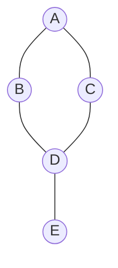

# Graph Algorithms

---

## Table of Contents
<!-- TOC -->
* [Graph Algorithms](#graph-algorithms)
  * [Table of Contents](#table-of-contents)
  * [Overview](#overview)
  * [Depth-First Search (DFS)](#depth-first-search-dfs)
  * [Breadth-First Search (BFS)](#breadth-first-search-bfs)
  * [Dijkstra's Algorithm](#dijkstras-algorithm)
  * [Comparison](#comparison)
  * [Q&A](#qa)
  * [Related Topics](#related-topics)
  * [Ref.](#ref)
<!-- TOC -->

---

Graph algorithms answer the two questions every graph-shaped problem eventually reduces to: "can I get from A to B, and how do I visit everything reachable" (traversal), and "what is the cheapest way to get there" (shortest path). Depth-First Search, Breadth-First Search, and Dijkstra's Algorithm are the three an architect encounters constantly — in dependency resolution, network routing, social graph analysis, and pathfinding. This page assumes familiarity with the [Graph](../data-structures/graph.md) data structure — its vertex/edge model and adjacency list/matrix representations are not re-explained here.

---

## Overview

Traversal algorithms (DFS, BFS) visit every reachable vertex from a starting point exactly once, differing only in the *order* they visit vertices — and that order difference has real architectural consequences: DFS is naturally suited to "does a path exist" and cycle-detection questions, while BFS is naturally suited to "what is the shortest path in terms of hop count" questions on unweighted graphs. Dijkstra's Algorithm answers a strictly harder question — shortest path by cumulative *weight*, not hop count — and is best understood as BFS's weighted generalization, at the cost of needing a priority queue rather than a plain queue.

[Back to top](#table-of-contents)

---

## Depth-First Search (DFS)

Explores as far as possible down one path before backtracking: visit a vertex, mark it visited, then recurse into an unvisited neighbor, only backtracking once a vertex has no unvisited neighbors left. Implemented either recursively (using the call stack) or iteratively with an explicit stack.

**When to use:** cycle detection, topological sorting (ordering tasks by dependency), connected-component analysis, and maze/path-existence problems where *a* path is needed, not necessarily the shortest one. DFS's stack-based nature also makes it the natural fit for backtracking algorithms.

| Aspect | Complexity |
|--------|------------|
| Time | O(V + E) |
| Space | O(V) — recursion stack / explicit stack, worst case |

[Back to top](#table-of-contents)

---

## Breadth-First Search (BFS)

Explores level by level: visit a vertex, then visit *all* of its unvisited neighbors before moving on to any of their neighbors. Implemented with an explicit queue — dequeue a vertex, enqueue all of its unvisited neighbors, repeat.

**When to use:** shortest path by hop count on an unweighted graph (BFS is guaranteed to reach any vertex via the fewest possible edges), level-order traversal, and "find all nodes within N connections" queries such as social-network degree-of-separation lookups.

| Aspect | Complexity |
|--------|------------|
| Time | O(V + E) |
| Space | O(V) — the queue, worst case holds an entire level |

**Caption:** The same graph traversed two ways from A. DFS order: A → B → D → C, then backtrack to visit E from D. BFS order: A → B → C (level 1), then D (level 2), then E (level 3) — BFS visits every neighbor of A before descending further, while DFS commits to one path immediately.

[Back to top](#table-of-contents)

---

## Dijkstra's Algorithm

Finds the shortest path (by cumulative edge weight, not hop count) from a single source vertex to every other reachable vertex in a weighted graph. It works by always expanding the closest not-yet-finalized vertex next — greedily committing to the current cheapest known distance — and relaxing (updating) the tentative distance to each of that vertex's neighbors if a cheaper path through it is found.

**Non-negative weights requirement:** Dijkstra's greedy commitment is only correct if edge weights are non-negative. Once a vertex is finalized as "closest," the algorithm never revisits it — but a negative-weight edge discovered later could make a previously-dismissed path cheaper, silently invalidating an already-finalized result. Graphs with negative edge weights require a different algorithm (e.g., Bellman-Ford) that tolerates them at the cost of worse time complexity.

**Relationship to the Heap:** "always expand the closest not-yet-finalized vertex" is exactly the operation a min-heap-backed priority queue is built to answer in O(log n) — see [Heap](../data-structures/heap.md). A naive implementation that linearly scans for the minimum each iteration works but degrades performance on large graphs; production implementations of Dijkstra's virtually always use a heap as the priority queue.

**When to use:** GPS/road-network shortest routes, network routing protocols (e.g., OSPF's underlying computation), and any "cheapest path" problem with non-negative costs — money, latency, distance.

| Aspect | Complexity |
|--------|------------|
| Time | O((V + E) log V) with a binary heap priority queue |
| Space | O(V) |

[Back to top](#table-of-contents)

---

## Comparison

| Algorithm | Answers | Time | Data Structure Used | Weight Support |
|-----------|---------|------|----------------------|-----------------|
| DFS | Path existence, cycle detection, ordering | O(V + E) | Stack (explicit or call stack) | N/A |
| BFS | Shortest path by hop count | O(V + E) | Queue | Unweighted only |
| Dijkstra's | Shortest path by cumulative weight | O((V + E) log V) | Priority queue (heap) | Non-negative weights |

[Back to top](#table-of-contents)

---

## Q&A

Common questions a software architect trainee would ask about this topic.

**Q: If Dijkstra's generalizes BFS, why not just always use Dijkstra's?**
A: On an unweighted graph, BFS and Dijkstra's produce the same shortest-path result, but BFS gets there in O(V + E) with a plain queue while Dijkstra's costs O((V + E) log V) with a priority queue for no additional correctness benefit — the weight generalization is wasted overhead when every edge weighs the same. Reach for Dijkstra's only when edges actually carry meaningfully different, non-negative weights.

---

**Q: What actually breaks if Dijkstra's runs on a graph with a negative edge weight?**
A: It doesn't error — it can silently return an incorrect shortest-path result, because the algorithm finalizes a vertex's distance as soon as it's dequeued and never reconsiders it, on the assumption that no later-discovered path could possibly be cheaper. A negative edge breaks that assumption. This is analogous to Binary Search's sorted-input precondition (see [Searching Algorithms](searching-algorithms.md)): a precondition violation that fails silently rather than loudly, which is precisely why it matters to know it exists.

---

**Q: When would I choose DFS over BFS if both are O(V + E)?**
A: The choice is about what you need, not raw speed. Use DFS when you need to explore a full path before knowing if it's viable (backtracking, maze-solving), detect cycles, or produce a topological ordering — DFS's stack naturally tracks the current path. Use BFS when "shortest" in terms of hop count matters, or when you need to process the graph in guaranteed distance-order from the source, such as level-by-level analysis.

[Back to top](#table-of-contents)

---

## Related Topics

- [Graph](../data-structures/graph.md) — the underlying vertex/edge structure and adjacency list/matrix representations these algorithms operate on
- [Heap](../data-structures/heap.md) — the priority queue implementation Dijkstra's Algorithm relies on to efficiently select the next closest vertex
- [Searching Algorithms](searching-algorithms.md) — Linear and Binary Search solve the analogous "find a target" problem on flat collections rather than graphs
- [Tree Traversal Algorithms](tree-traversal.md) — a tree is a restricted graph (no cycles, single root), and DFS/BFS generalize the same traversal ideas used there

[Back to top](#table-of-contents)

---

## Ref.

- [Graph Algorithms — GeeksforGeeks](https://www.geeksforgeeks.org/dsa/graph-data-structure-and-algorithms/) — overview of traversal and shortest-path algorithms on graphs
- [Dijkstra's Shortest Path Algorithm — GeeksforGeeks](https://www.geeksforgeeks.org/dsa/dijkstras-shortest-path-algorithm-greedy-algo-7/) — mechanics, complexity, and priority-queue-based implementation

---

[Get Started](../../get-started.md) | [Algorithms](../../get-started.md#algorithms)

---
