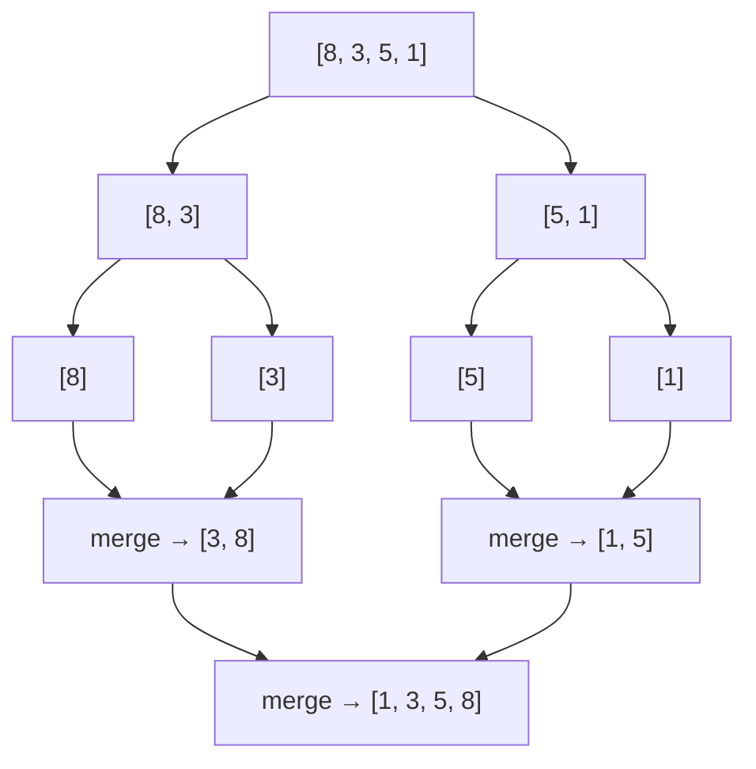

# Sorting Algorithms

---

## Table of Contents
<!-- TOC -->
* [Sorting Algorithms](#sorting-algorithms)
  * [Table of Contents](#table-of-contents)
  * [Overview](#overview)
  * [Bubble Sort](#bubble-sort)
  * [Insertion Sort](#insertion-sort)
  * [Merge Sort](#merge-sort)
  * [Quick Sort](#quick-sort)
  * [Comparison](#comparison)
  * [Q&A](#qa)
  * [Related Topics](#related-topics)
  * [Ref.](#ref)
<!-- TOC -->

---

Sorting is the process of arranging elements of a collection into a defined order, and it is one of the most studied problems in computer science because so many other algorithms (binary search, merge-based joins, deduplication) depend on data already being sorted. An architect rarely hand-writes a sort in production — the standard library's sort is almost always the right call — but recognizing which family an algorithm belongs to, its Big-O behavior, and whether it is stable is what lets you reason about performance and correctness when a library's default doesn't fit.

---

## Overview

Sorting algorithms split broadly into two families: simple **comparison-based** algorithms with O(n²) worst-case behavior (Bubble Sort, Insertion Sort) that are easy to reason about and efficient only on small or nearly-sorted input, and **divide-and-conquer** algorithms with O(n log n) behavior (Merge Sort, Quick Sort) that scale to large datasets. Production language runtimes typically use a hybrid: Java's `Arrays.sort` for primitives uses a dual-pivot Quicksort variant, while its sort for objects uses Timsort (a Merge Sort/Insertion Sort hybrid) specifically because Timsort is stable and objects often carry equality-sensitive ordering.

Two properties matter more than raw speed when choosing a sort: **stability** — whether elements with equal keys keep their relative input order — and **space complexity** — whether the algorithm sorts in place or needs auxiliary memory proportional to input size. Stability matters whenever you sort by one key after already having sorted by another (e.g., sort by last name, then stably sort by department, and last-name order survives within each department).

<sub>[Back to top](#table-of-contents)</sub>

---

## Bubble Sort

Repeatedly steps through the list, comparing adjacent pairs and swapping them if they are out of order. Each full pass "bubbles" the largest remaining unsorted element to its final position at the end of the list. The algorithm terminates early if a full pass makes no swaps, since that means the list is already sorted.

**When to use:** essentially never in production — it exists primarily as a teaching tool for the concept of comparison-and-swap. Its only practical niche is trivially small or already-nearly-sorted lists where its early-exit optimization makes it approach O(n).

| Case | Time | Space |
|------|------|-------|
| Best (already sorted) | O(n) | O(1) |
| Average | O(n²) | O(1) |
| Worst (reverse sorted) | O(n²) | O(1) |

**Stability:** Stable — equal elements are never swapped past each other, since a swap only happens on strict inequality.

<sub>[Back to top](#table-of-contents)</sub>

---

## Insertion Sort

Builds the sorted output one element at a time: it takes each element from the unsorted portion and inserts it into its correct position within the already-sorted portion, shifting larger elements right to make room. Conceptually the same technique most people use to sort a hand of playing cards.

```text
for i = 1 to n-1:
    key = arr[i]
    j = i - 1
    while j >= 0 and arr[j] > key:
        arr[j + 1] = arr[j]
        j = j - 1
    arr[j + 1] = key
```

**When to use:** small arrays (many library sorts fall back to insertion sort below a size threshold, e.g. ~10-20 elements, because its low constant-factor overhead beats O(n log n) algorithms at small n) and nearly-sorted data, where it approaches O(n) since few shifts are needed. It is also an online algorithm — it can sort a stream as elements arrive, without having the whole collection up front.

| Case | Time | Space |
|------|------|-------|
| Best (already sorted) | O(n) | O(1) |
| Average | O(n²) | O(1) |
| Worst (reverse sorted) | O(n²) | O(1) |

**Stability:** Stable — an element is only shifted past elements strictly greater than it, so equal elements retain relative order.

<sub>[Back to top](#table-of-contents)</sub>

---

## Merge Sort

A divide-and-conquer algorithm: split the list in half recursively until each sublist has one element (trivially sorted), then repeatedly merge sorted sublists back together in order. The merge step is the workhorse — it walks two sorted sublists with two pointers, always taking the smaller of the two heads, which is what guarantees the merged result is sorted and preserves original order for equal elements.



**Caption:** Merge Sort recursively splits the array down to single elements, then merges sorted halves back together bottom-up.

**When to use:** whenever a **stable**, guaranteed O(n log n) sort is required regardless of input distribution — external sorting (data too large for memory, since it merges sequential runs well), sorting linked lists (no random access needed), and as the stable half of hybrid sorts like Timsort. The tradeoff is O(n) auxiliary space for the merge buffers.

| Case | Time | Space |
|------|------|-------|
| Best | O(n log n) | O(n) |
| Average | O(n log n) | O(n) |
| Worst | O(n log n) | O(n) |

**Stability:** Stable — the merge step takes from the left sublist on ties, preserving original relative order.

<sub>[Back to top](#table-of-contents)</sub>

---

## Quick Sort

Also divide-and-conquer, but the work happens on the way down rather than on the way up: pick a **pivot** element, **partition** the array so everything smaller than the pivot ends up to its left and everything larger to its right, then recursively sort the two partitions. Unlike Merge Sort, it sorts in place and needs no merge step — but its performance depends entirely on pivot choice.

**When to use:** the default general-purpose in-memory sort when stability is not required — it typically outperforms Merge Sort in practice due to better cache locality and lower constant factors, which is why it (or a dual-pivot variant) backs most primitive-array sorts in language standard libraries. A poor pivot choice (e.g., always picking the first element on already-sorted input) degrades it to O(n²), which is why production implementations use randomized or median-of-three pivot selection.

| Case | Time | Space |
|------|------|-------|
| Best | O(n log n) | O(log n) |
| Average | O(n log n) | O(log n) |
| Worst (bad pivot choice) | O(n²) | O(log n) |

**Stability:** Not stable — partitioning swaps elements across the pivot without regard to their relative order among equal keys.

<sub>[Back to top](#table-of-contents)</sub>

---

## Comparison

| Algorithm | Best | Average | Worst | Space | Stable |
|-----------|------|---------|-------|-------|--------|
| Bubble Sort | O(n) | O(n²) | O(n²) | O(1) | Yes |
| Insertion Sort | O(n) | O(n²) | O(n²) | O(1) | Yes |
| Merge Sort | O(n log n) | O(n log n) | O(n log n) | O(n) | Yes |
| Quick Sort | O(n log n) | O(n log n) | O(n²) | O(log n) | No |

<sub>[Back to top](#table-of-contents)</sub>

---

## Q&A

Common questions a software architect trainee would ask about this topic.

**Q: If Quick Sort has a worse worst-case than Merge Sort, why is it still the more common default?**
A: The O(n²) worst case is rare in practice once randomized or median-of-three pivot selection is used, and Quick Sort's in-place partitioning gives it better cache locality and lower memory overhead than Merge Sort's O(n) auxiliary buffers. When the worst case must be bounded regardless of input (e.g., an adversarial or attacker-influenced input), Merge Sort's guaranteed O(n log n) is the safer choice; when average-case throughput on typical data matters more, Quick Sort usually wins.

---

**Q: Why does stability matter if I'm only sorting by a single key?**
A: It doesn't, for a single-key sort — any algorithm produces the same observable order. Stability matters the moment you sort by multiple criteria in sequence (a common real pattern: sort a list of orders by date, then stably sort that result by customer) or whenever "equal" elements carry other distinguishing state you want preserved, such as original insertion order in a UI list.

---

**Q: When would I ever need to know this instead of just calling a library sort function?**
A: Almost always you should call the library sort. This knowledge matters for three practical situations: choosing between library sort variants that expose a stability or in-place tradeoff (e.g., `Collections.sort` vs. array-based sorts in Java), diagnosing a performance regression caused by near-worst-case input to a naive custom sort, and recognizing when a specialized sort (e.g., a merge step for external/disk-based sorting of data too large for memory) is warranted instead of a generic library call.

<sub>[Back to top](#table-of-contents)</sub>

---

## Related Topics

- [Searching Algorithms](searching-algorithms.md) — Binary Search requires sorted input, making it the direct downstream consumer of these sorting algorithms
- [Graph Algorithms](graph-algorithms.md) — another algorithm family with its own Big-O tradeoffs, built on the graph data structure rather than arrays
- [Tree Traversal Algorithms](tree-traversal.md) — in-order traversal of a Binary Search Tree produces sorted output as a side effect of the structure, an alternative route to the same goal
- [Linear Data Structures](../data-structures/linear-structures.md) — arrays and linked lists are the underlying storage these algorithms operate on

<sub>[Back to top](#table-of-contents)</sub>

---

## Ref.

- [Sorting Algorithms — GeeksforGeeks](https://www.geeksforgeeks.org/dsa/sorting-algorithms/) — overview and comparison of common sorting algorithms
- [Merge Sort — GeeksforGeeks](https://www.geeksforgeeks.org/dsa/merge-sort/) — divide-and-conquer mechanics and complexity analysis

---

[Get Started](../../get-started.md) | [Algorithms](../../get-started.md#algorithms)

---
