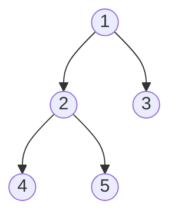

# Tree Traversal Algorithms

---

## Table of Contents
<!-- TOC -->
* [Tree Traversal Algorithms](#tree-traversal-algorithms)
  * [Table of Contents](#table-of-contents)
  * [Overview](#overview)
  * [Inorder Traversal](#inorder-traversal)
  * [Preorder Traversal](#preorder-traversal)
  * [Postorder Traversal](#postorder-traversal)
  * [Comparison](#comparison)
  * [Q&A](#qa)
  * [Related Topics](#related-topics)
  * [Ref.](#ref)
<!-- TOC -->

---

Tree traversal is the process of visiting every node in a tree exactly once, in a defined order. Because a tree has no single "natural" reading order the way an array does, the order chosen — Inorder, Preorder, or Postorder — is a deliberate decision that determines what the traversal is useful for: producing sorted output, copying a tree's structure, or safely tearing one down. This page assumes familiarity with the [Trees](../data-structures/trees.md) data structure page and focuses only on the traversal algorithms themselves.

---

## Overview

All three traversals covered here are **depth-first**: each recursively visits a node's left subtree and right subtree, differing only in *when*, relative to the two subtree recursions, the current node itself is visited — before both (Preorder), between them (Inorder), or after both (Postorder). This single positional difference is the entire distinction between the three algorithms, and each name literally describes where the node's own visit falls: **pre** (before children), **in** (in between children), **post** (after children). A fourth traversal, level-order, visits nodes breadth-first rather than depth-first and is covered as an application of BFS in [Graph Algorithms](graph-algorithms.md) rather than here.

<sub>[Back to top](#table-of-contents)</sub>

---

## Inorder Traversal

Visit the left subtree, then the current node, then the right subtree (Left → Node → Right).

```text
inorder(node):
    if node is null: return
    inorder(node.left)
    visit(node)
    inorder(node.right)
```

**Practical use case:** on a **Binary Search Tree**, Inorder traversal visits every node in ascending sorted order — a direct consequence of the BST ordering property (left subtree always smaller, right subtree always larger). This makes Inorder the traversal of choice whenever a BST needs to produce sorted output, such as generating a sorted report from an in-memory ordered index without a separate sort step.

<sub>[Back to top](#table-of-contents)</sub>

---

## Preorder Traversal

Visit the current node, then the left subtree, then the right subtree (Node → Left → Right).

**Practical use case:** Preorder visits a parent before either of its children, which is exactly the property needed to **copy or serialize** a tree — writing nodes out in Preorder and reading them back in the same order is enough to reconstruct the original structure, since each node is guaranteed to be written before its children (parent pointers/references are always available first). This is the traversal behind tree serialization formats and deep-copy implementations.

<sub>[Back to top](#table-of-contents)</sub>

---

## Postorder Traversal

Visit the left subtree, then the right subtree, then the current node (Left → Right → Node).

**Practical use case:** Postorder visits a node only after both of its children have already been visited, which is exactly the safety property needed for **deletion or cleanup** — freeing a node's children before freeing the node itself avoids ever holding a dangling reference. This is why Postorder is the standard traversal for safely tearing down a tree, evaluating an expression tree (operands before operator), or resolving dependency structures where children must be finalized before their parent.

<sub>[Back to top](#table-of-contents)</sub>

---

## Comparison

Applied to the same small tree:



**Caption:** A small binary tree — node labels are structural positions, not visit order. Root = 1, its children = 2 and 3, and 2's children = 4 and 5.

| Traversal | Order visited | Resulting sequence |
|-----------|----------------|---------------------|
| Inorder (Left, Node, Right) | 4 → 2 → 5 → 1 → 3 | `4, 2, 5, 1, 3` |
| Preorder (Node, Left, Right) | 1 → 2 → 4 → 5 → 3 | `1, 2, 4, 5, 3` |
| Postorder (Left, Right, Node) | 4 → 5 → 2 → 3 → 1 | `4, 5, 2, 3, 1` |

All three traversals share the same time and space complexity — they each visit every node exactly once:

| Aspect | Complexity |
|--------|------------|
| Time | O(n) |
| Space | O(h) — recursion stack, where h is tree height (O(log n) balanced, O(n) degenerate) |

<sub>[Back to top](#table-of-contents)</sub>

---

## Q&A

Common questions a software architect trainee would ask about this topic.

**Q: How do I quickly remember which traversal is which?**
A: The name tells you where the node itself falls relative to its children: Pre**order** visits the node *pre* (before) its children, Post**order** visits it *post* (after) its children, and In**order** visits it *in between* — which only reads as "sorted" because of the BST property, not because of the traversal itself. Applied to a non-BST binary tree, Inorder still visits Left → Node → Right, it just doesn't produce a sorted sequence.

---

**Q: Why does Postorder matter for deletion — couldn't I just delete nodes in any order?**
A: Deleting in the wrong order can leave dangling references or leak memory in languages without garbage collection: if you free a parent before its children, the children become unreachable without being freed. Postorder guarantees children are always processed (and freed) before their parent, which is why it's the standard pattern for tree teardown, and the same principle applies to any operation where children must be finalized before their parent, such as recursive directory deletion.

---

**Q: Is Inorder traversal specific to Binary Search Trees, or does it work on any binary tree?**
A: The algorithm itself — Left → Node → Right — works identically on any binary tree, BST or not. What's specific to the BST is the *interpretation* of the result: only a BST's ordering invariant (left subtree smaller, right subtree larger) guarantees that Inorder output is sorted. Run the same algorithm on an arbitrary (non-search) binary tree and you get a Left-Node-Right sequence with no sorted meaning.

<sub>[Back to top](#table-of-contents)</sub>

---

## Related Topics

- [Trees](../data-structures/trees.md) — the Binary Tree and Binary Search Tree structures these traversals operate on
- [Graph Algorithms](graph-algorithms.md) — DFS generalizes the same depth-first recursive idea from trees to arbitrary graphs; level-order traversal is BFS applied to a tree
- [Sorting Algorithms](sorting-algorithms.md) — Inorder traversal of a BST is an alternative route to sorted output, distinct from array-based sorting algorithms
- [Searching Algorithms](searching-algorithms.md) — Binary Search's halving logic is the array analog of a BST's structure, which Inorder traversal reads back out in order

<sub>[Back to top](#table-of-contents)</sub>

---

## Ref.

- [Tree Traversals — GeeksforGeeks](https://www.geeksforgeeks.org/dsa/tree-traversals-inorder-preorder-and-postorder/) — mechanics and use cases for Inorder, Preorder, and Postorder traversal

---

[Get Started](../../get-started.md) | [Algorithms](../../get-started.md#algorithms)

---
