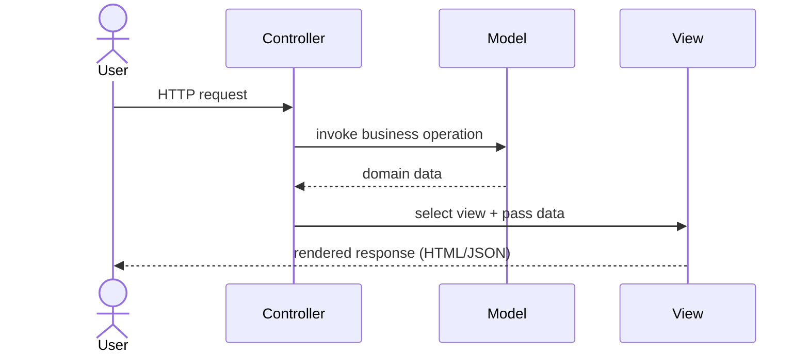

# Model-View-Controller (MVC)

---

## Table of Contents
<!-- TOC -->
* [Model-View-Controller (MVC)](#model-view-controller-mvc)
  * [Table of Contents](#table-of-contents)
  * [Overview](#overview)
  * [Core Components](#core-components)
  * [Request Flow](#request-flow)
  * [MVC vs. MVVM](#mvc-vs-mvvm)
  * [Q&A](#qa)
  * [Related Topics](#related-topics)
  * [Ref.](#ref)
<!-- TOC -->

---

Model-View-Controller (MVC) is an architectural pattern that _separates an application into three interconnected components — Model, View, and Controller — so that each can be developed, tested, and modified independently_. It is one of the oldest and most influential UI architecture patterns, forming the conceptual basis for most modern web frameworks. MVC's central idea is to keep the representation of data (Model) separate from how it is displayed (View), with a mediator (Controller) coordinating the two.

---

## Overview

MVC was first described by Trygve Reenskaug in 1979 while working on Smalltalk-80 at Xerox PARC, originally to separate the internal representation of information from how it is presented and accepted from the user. The pattern later became the dominant structuring approach for desktop GUI toolkits and, from the 2000s onward, for server-side web frameworks — Spring MVC, ASP.NET MVC, Ruby on Rails, and Django all implement variants of it.

The motivation is separation of concerns: business/domain logic should not know about presentation details, and presentation code should not embed business rules. This makes each component independently testable (a Model can be unit-tested with no UI at all) and allows multiple Views to reuse the same Model.

In web frameworks, "Controller" typically refers to a request handler that receives an HTTP request, invokes the appropriate Model operations, and selects a View to render the response — a slightly different flavor from the original desktop-GUI MVC, but the same underlying separation of responsibilities.

<sub>[Back to top](#table-of-contents)</sub>

---

## Core Components

The pattern is built around three collaborating roles, each with a distinct responsibility.

- ### Model:
  Represents the application's domain data and business logic. It is unaware of the View or Controller and does not know how it will be displayed or how requests are triggered. In a web application, the Model layer often delegates persistence to a data-access abstraction.

  > See also: [Repository Pattern](repository-pattern.md)

- ### View:
  Renders the Model's data for the user — an HTML template, a JSON payload, or a desktop widget tree. The View is intentionally "dumb": it contains presentation logic only, not business rules.

- ### Controller:
  Receives input (a user action or an HTTP request), invokes the appropriate operations on the Model, and selects which View to render with the resulting data. The Controller is the mediator — in classic MVC, the View never talks to the Model directly without the Controller orchestrating the interaction.

  ```mermaid
  classDiagram
      class Controller {
          +handleRequest()
      }
      class Model {
          +businessLogic()
          +getData()
      }
      class View {
          +render(data)
      }
      Controller --> Model : invokes operations on
      Controller --> View : selects & populates
      View ..> Controller : user input / actions
  ```

  **Caption:** The Controller mediates all communication between View and Model — the View and Model never reference each other directly.

<sub>[Back to top](#table-of-contents)</sub>

---

## Request Flow

A typical web-application request through an MVC framework follows the same sequence regardless of technology stack.



**Caption:** The Controller receives the request, delegates to the Model, then hands the resulting data to a View for rendering.

<sub>[Back to top](#table-of-contents)</sub>

---

## MVC vs. MVVM

MVC and MVVM are often confused because both separate a domain Model from its presentation, but they differ in how the View is kept in sync with the Model.

In **MVC**, the Controller actively mediates: it pulls data from the Model and pushes it into the View, and it receives user input from the View to invoke Model operations. The View has no automatic awareness of Model changes — synchronization is imperative and driven by the Controller.

In **MVVM**, there is no Controller. Instead, a ViewModel exposes the Model's state as bindable properties and commands, and the View observes the ViewModel directly through a data-binding mechanism provided by the UI framework. When the ViewModel's state changes, the View updates automatically — the synchronization is declarative rather than orchestrated by a mediator. See [Model-View-ViewModel (MVVM)](mvvm.md) for the full comparison.

<sub>[Back to top](#table-of-contents)</sub>

---

## Q&A

Common questions a software architect trainee would ask about this topic.

**Q: Can the View read directly from the Model without going through the Controller?**
A: In strict/classic MVC, no — the Controller owns the interaction and pushes Model data into the View. Many modern web frameworks relax this: the View template can bind directly to a data object the Controller supplies (e.g., a "ViewModel" or DTO), but the Controller is still the one that fetches and prepares that data.

**Q: Is Spring MVC's "Controller" the same concept as the original Smalltalk MVC Controller?**
A: Conceptually yes — it receives an incoming request and coordinates the response — but its scope is narrower. The original desktop-GUI Controller also handled fine-grained UI input events; a web Controller in Spring MVC (or ASP.NET MVC) is essentially a stateless request handler invoked once per HTTP request.

**Q: Why do multiple Views often exist for the same Model in an MVC application?**
A: Because the Model has no knowledge of presentation, the same domain data can be rendered differently by different Views — for example, an HTML page for browsers and a JSON representation for an API client — without changing any business logic.

<sub>[Back to top](#table-of-contents)</sub>

---

## Related Topics

- [Model-View-ViewModel (MVVM)](mvvm.md) — alternative presentation pattern that replaces the Controller with a data-bound ViewModel
- [Repository Pattern](repository-pattern.md) — common way for the Model layer to abstract data access
- [Layered Architecture](layered.md) — MVC is frequently the presentation-layer structure within a broader layered application

<sub>[Back to top](#table-of-contents)</sub>

---

## Ref.

- [Trygve Reenskaug — MVC (original description)](https://folk.universitetetioslo.no/trygver/themes/mvc/mvc-index.html) — the original 1979 write-up of the pattern
- [Microsoft Docs — ASP.NET MVC Overview](https://learn.microsoft.com/en-us/aspnet/mvc/overview/getting-started/introduction/getting-started) — practical implementation reference

---

[Get Started](../../get-started.md) | [Architectural Patterns](../../get-started.md#architectural-patterns)

---
