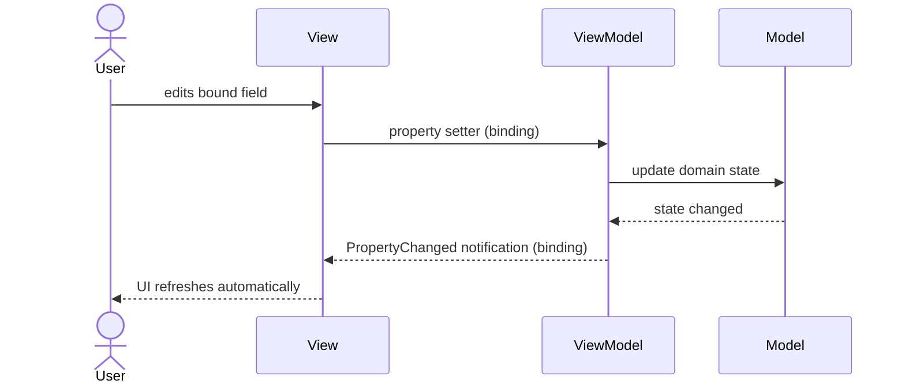

# Model-View-ViewModel (MVVM)

---

## Table of Contents
<!-- TOC -->
* [Model-View-ViewModel (MVVM)](#model-view-viewmodel-mvvm)
  * [Table of Contents](#table-of-contents)
  * [Overview](#overview)
  * [Core Components](#core-components)
  * [Data Binding](#data-binding)
  * [MVVM vs. MVC](#mvvm-vs-mvc)
  * [Q&A](#qa)
  * [Related Topics](#related-topics)
  * [Ref.](#ref)
<!-- TOC -->

---

Model-View-ViewModel (MVVM) is a UI architectural pattern that _introduces a ViewModel as an intermediary between the View and the Model, exposing state and behavior in a form the View can bind to directly_. Instead of a Controller pushing data into the View and pulling input back out, the View observes the ViewModel through a data-binding mechanism, and updates flow automatically in both directions. MVVM is the dominant pattern in binding-capable UI frameworks such as WPF, Xamarin, Angular, and Vue.

---

## Overview

MVVM was introduced by Microsoft architects John Gossman, Ken Cooper, and Ted Peters around 2005, designed specifically for WPF (Windows Presentation Foundation) and Silverlight to take advantage of their built-in data-binding engines. It is a specialization of Martin Fowler's earlier **Presentation Model** pattern, tailored to platforms with native binding and command infrastructure.

The core motivation is to eliminate the boilerplate "glue code" that a Controller would otherwise need to keep the View synchronized with the Model — manually reading form fields, manually updating labels, and so on. By exposing observable properties and commands, the ViewModel lets the binding framework handle synchronization declaratively, which also makes the ViewModel trivially unit-testable since it has no reference to any actual UI control.

MVVM is now common well beyond WPF: Angular's two-way `[(ngModel)]` binding, Vue's reactive data properties, and Xamarin/MAUI's `BindableProperty` all follow the same underlying shape, even though none of them call it a "Controller-free" architecture explicitly.

<sub>[Back to top](#table-of-contents)</sub>

---

## Core Components

- ### Model:
  The domain data and business logic, identical in role to the Model in MVC — it has no knowledge of the View or ViewModel.

- ### View:
  The UI markup (XAML, HTML template, etc.). It declares bindings to the ViewModel's properties and commands but contains no business logic and, ideally, minimal code-behind.

- ### ViewModel:
  Wraps the Model and exposes its data as bindable, observable properties, plus commands the View can invoke (e.g., a "Save" button bound to a `SaveCommand`). The ViewModel converts and formats Model data for display and translates View-triggered commands into Model operations, but it holds no reference to any concrete UI control.

  ```mermaid
  classDiagram
      class Model {
          +businessLogic()
          +data
      }
      class ViewModel {
          +observableProperty
          +command()
          -notifyPropertyChanged()
      }
      class View {
          <<XAML/HTML>>
      }
      ViewModel --> Model : reads/updates
      View ..> ViewModel : data binding (two-way)
  ```

  **Caption:** The View binds directly to the ViewModel's properties and commands; there is no Controller mediating the interaction.

<sub>[Back to top](#table-of-contents)</sub>

---

## Data Binding

Data binding is the mechanism that distinguishes MVVM from MVC in practice: it is what lets the View stay synchronized with the ViewModel without imperative glue code.



**Caption:** A change flows from the View into the ViewModel and Model, and any resulting state change flows back to the View automatically through the binding engine — no explicit mediator required.

<sub>[Back to top](#table-of-contents)</sub>

---

## MVVM vs. MVC

Both patterns keep a domain Model separate from its presentation, but they differ fundamentally in how the View stays synchronized.

**MVC** relies on a Controller as an explicit mediator: it imperatively reads Model data and pushes it into the View, and it receives and interprets user input from the View. The View has no automatic knowledge of Model changes.

**MVVM** removes the mediator entirely. The ViewModel exposes observable, bindable state, and the View's data-binding engine subscribes to it directly — when a bound property changes, the View updates itself with no orchestrating code in between. Because MVVM depends on a framework-provided binding mechanism, it is only practical on platforms that support it; MVC has no such requirement, which is why it remains the default for stateless, request/response server-side web frameworks. See [Model-View-Controller (MVC)](mvc.md) for the full comparison.

<sub>[Back to top](#table-of-contents)</sub>

---

## Q&A

Common questions a software architect trainee would ask about this topic.

**Q: Why is the ViewModel considered easier to unit-test than an MVC Controller?**
A: The ViewModel exposes plain properties and commands with no reference to any actual UI control, so a test can set a property or invoke a command and assert on the resulting state without instantiating any UI framework. A Controller can also be tested this way, but MVVM makes it the natural default because the ViewModel is the only thing the View ever talks to.

**Q: Does MVVM eliminate the need for a Controller entirely?**
A: Within the MVVM triad, yes — there is no separate Controller role. In web-based implementations (e.g., an Angular component), the component class effectively plays the ViewModel role, and routing/navigation concerns that a Controller would traditionally own are typically handled by a router or a separate service.

**Q: Can MVVM be used in a server-side web framework the way MVC is?**
A: Generally not in its pure form, because MVVM depends on a stateful, bidirectional data-binding engine running continuously in the client — something a stateless HTTP request/response cycle doesn't provide. MVVM is the natural fit for rich clients (desktop, mobile, SPA frontends), while MVC (or its variants) remains standard for server-rendered web applications.

<sub>[Back to top](#table-of-contents)</sub>

---

## Related Topics

- [Model-View-Controller (MVC)](mvc.md) — predecessor pattern that uses an explicit Controller instead of data binding
- [Layered Architecture](layered.md) — MVVM commonly describes only the presentation layer of a broader layered application
- [Reactive Systems](reactive.md) — the reactive/observable principles underlying most data-binding implementations

<sub>[Back to top](#table-of-contents)</sub>

---

## Ref.

- [Microsoft Docs — The MVVM Pattern](https://learn.microsoft.com/en-us/dotnet/architecture/maui/mvvm) — official Microsoft architectural guidance
- [Martin Fowler — Presentation Model](https://martinfowler.com/eaaDev/PresentationModel.html) — the pattern MVVM specializes

---

[Get Started](../../get-started.md) | [Architectural Patterns](../../get-started.md#architectural-patterns)

---
