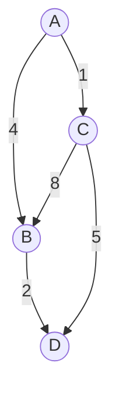

# Graph

---

## Table of Contents
<!-- TOC -->
* [Graph](#graph)
  * [Table of Contents](#table-of-contents)
  * [Overview](#overview)
  * [Directed vs. Undirected, Weighted vs. Unweighted](#directed-vs-undirected-weighted-vs-unweighted)
  * [Representations: Adjacency List vs. Adjacency Matrix](#representations-adjacency-list-vs-adjacency-matrix)
  * [Use Cases](#use-cases)
  * [Complexity](#complexity)
  * [Q&A](#qa)
  * [Related Topics](#related-topics)
  * [Ref.](#ref)
<!-- TOC -->

---

A graph is a data structure consisting of a set of vertices (nodes) connected by edges, capable of modeling arbitrary many-to-many relationships that trees and linear structures cannot express. Wherever a system involves entities and relationships between them — social networks, road networks, dependency chains, network topologies — a graph is the natural model. The two core decisions an architect makes when working with graphs are how to represent them in memory (adjacency list vs. adjacency matrix) and which traversal or shortest-path algorithm fits the problem.

---

## Overview

Unlike a tree, a graph places no restriction on how vertices connect — any vertex may connect to any number of others, cycles are permitted, and there is no single "root." This generality is exactly what makes graphs the right model for relationships that are inherently non-hierarchical: a build system's dependency graph, a city's road network, the topology of a distributed system, or the friend/follower relationships in a social network.

A graph is formally defined as a pair `G = (V, E)` — a set of vertices `V` and a set of edges `E`, where each edge connects two vertices. From this simple definition, two independent classification axes emerge: whether edges have a direction, and whether edges carry a weight (a cost, distance, or capacity). Every graph in practice is some combination of these two axes, and the combination determines which algorithms apply.

The second major decision — separate from the graph's mathematical shape — is how to represent it in memory. Adjacency lists and adjacency matrices make fundamentally different space/time trade-offs, covered below, and the choice depends heavily on the graph's density (how many of the possible edges actually exist).

<sub>[Back to top](#table-of-contents)</sub>

---

## Directed vs. Undirected, Weighted vs. Unweighted

- ### Directed Graph (Digraph):
  Edges have a direction — an edge from A to B does not imply an edge from B to A. Models asymmetric relationships: a "follows" relationship on social media, a task dependency ("build depends on compile"), or a one-way street.

- ### Undirected Graph:
  Edges are symmetric — a connection between A and B is a connection between B and A with no distinction. Models mutual relationships: a friendship, a physical network cable between two routers.

- ### Weighted Graph:
  Each edge carries a numeric cost, distance, or capacity. Required whenever "cheapest" or "shortest" path matters — road distances, network latency, or monetary cost.

- ### Unweighted Graph:
  Edges simply represent presence or absence of a connection, with every edge implicitly costing the same (typically 1). Sufficient when only reachability or hop-count matters, not actual cost.



**Caption:** A small directed, weighted graph — edges have both direction (arrows) and a cost (edge labels).

<sub>[Back to top](#table-of-contents)</sub>

---

## Representations: Adjacency List vs. Adjacency Matrix

- ### Adjacency List:
  Each vertex stores a collection (list, or often a hash table for O(1) edge lookup) of the vertices it connects to. This is the standard choice for **sparse** graphs — graphs where the number of edges is much smaller than the maximum possible (`V²`).

  ```java
  Map<String, List<String>> adjacency = new HashMap<>();
  adjacency.put("A", List.of("B", "C"));
  adjacency.put("B", List.of("D"));
  adjacency.put("C", List.of("D", "B"));
  ```

- ### Adjacency Matrix:
  A `V x V` 2D array where `matrix[i][j]` indicates (or, for weighted graphs, holds the weight of) an edge from vertex `i` to vertex `j`. This is the standard choice for **dense** graphs, or when edge-existence checks must be as fast as possible regardless of memory cost.

  ```java
  // 0 = no edge; non-zero = edge weight
  int[][] matrix = {
      /*      A  B  C  D */
      /* A */{0, 4, 1, 0},
      /* B */{0, 0, 0, 2},
      /* C */{0, 8, 0, 5},
      /* D */{0, 0, 0, 0},
  };
  ```

| Aspect | Adjacency List | Adjacency Matrix |
|--------|-----------------|-------------------|
| Space complexity | O(V + E) | O(V²) |
| Add edge | O(1) | O(1) |
| Check if edge exists | O(degree of vertex) | O(1) |
| Best suited for | Sparse graphs | Dense graphs, frequent edge-existence checks |

The rule of thumb: if `E` is close to `V²` (most vertices connect to most other vertices), a matrix's O(V²) space is no worse than a list's and its O(1) edge lookup wins outright. If `E` is much smaller than `V²` (the common case for real-world graphs like social networks or road maps), a list saves substantial memory at the cost of a slower edge-existence check.

<sub>[Back to top](#table-of-contents)</sub>

---

## Use Cases

- ### Dependency Graphs:
  Build systems, package managers, and task schedulers model "X depends on Y" as a directed graph and use topological sorting to determine a valid execution order — and to detect circular dependencies, which manifest as a cycle in the graph.

- ### Network Topology:
  Routers, switches, and links between them form a graph where shortest-path algorithms (Dijkstra's, backed by a [Heap](heap.md)) determine optimal packet routing. See [Routing and Switching](../networking/routing-switching.md) for how this plays out at the network layer.

- ### Social and Recommendation Graphs:
  Users and their connections (follows, friendships, purchases) form a graph that traversal algorithms mine for recommendations, shortest connection paths ("degrees of separation"), and community detection.

<sub>[Back to top](#table-of-contents)</sub>

---

## Complexity

| Operation | Adjacency List | Adjacency Matrix |
|-----------|-----------------|-------------------|
| Space | O(V + E) | O(V²) |
| Add edge | O(1) | O(1) |
| Check edge exists | O(degree of vertex) | O(1) |
| Traverse all edges of a vertex | O(degree of vertex) | O(V) |

<sub>[Back to top](#table-of-contents)</sub>

---

## Q&A

Common questions a software architect trainee would ask about this topic.

**Q: When should I choose an adjacency list over an adjacency matrix?**
A: Choose an adjacency list for sparse graphs — where the number of edges is much smaller than V² — since it stores only the edges that actually exist, using O(V + E) space instead of the matrix's fixed O(V²). Choose a matrix when the graph is dense, or when O(1) edge-existence checks matter more than memory footprint.

**Q: How does a directed graph model a build/task dependency system?**
A: Each task is a vertex, and a directed edge from task A to task B means "A must complete before B can start." A valid execution order is any topological sort of this graph; if the graph contains a cycle, no valid order exists — which is exactly how build tools detect circular dependencies.

**Q: What's the practical difference between a weighted and unweighted graph in algorithm choice?**
A: An unweighted graph's shortest path (by hop count) can be found with a simple breadth-first search in O(V + E). A weighted graph requires an algorithm like Dijkstra's (non-negative weights, heap-backed, O((V + E) log V)) or Bellman-Ford (handles negative weights, O(V · E)) because BFS alone cannot account for varying edge costs.

<sub>[Back to top](#table-of-contents)</sub>

---

## Related Topics

- [Heap](heap.md) — Dijkstra's and Prim's graph algorithms rely on a min-heap to efficiently select the next vertex to process
- [Hash Table](hash-table.md) — Adjacency lists are commonly implemented as a hash table mapping each vertex to its neighbor list
- [Linear Structures](linear-structures.md) — Adjacency matrices are 2D arrays, and BFS/DFS traversals rely on a queue or stack, both linear structures
- [Trees](trees.md) — A tree is a special case of a graph: connected, acyclic, and with exactly one path between any two vertices
- [Routing and Switching](../networking/routing-switching.md) — Network topology and packet routing are a real-world, large-scale application of weighted graph shortest-path algorithms

<sub>[Back to top](#table-of-contents)</sub>

---

## Ref.

- [Graph (abstract data type) — Wikipedia](https://en.wikipedia.org/wiki/Graph_(abstract_data_type)) — Encyclopedic coverage of graph representations, classifications, and core operations
- [Introduction to Graphs — GeeksforGeeks](https://www.geeksforgeeks.org/dsa/graph-data-structure-and-algorithms/) — Practical overview of graph types, representations, and common algorithms

---

[Get Started](../../get-started.md) | [Data Structures](../../get-started.md#data-structures)

---
