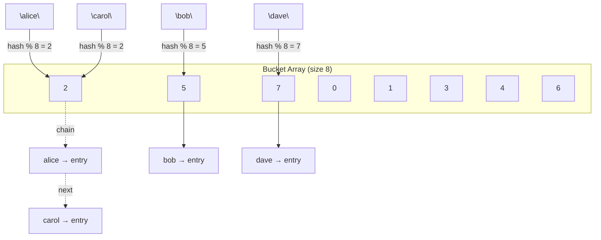

# Hash Table

---

## Table of Contents
<!-- TOC -->
* [Hash Table](#hash-table)
  * [Table of Contents](#table-of-contents)
  * [Overview](#overview)
  * [Hash Functions](#hash-functions)
  * [Collision Resolution](#collision-resolution)
  * [Load Factor and Resizing](#load-factor-and-resizing)
  * [Complexity](#complexity)
  * [Q&A](#qa)
  * [Related Topics](#related-topics)
  * [Ref.](#ref)
<!-- TOC -->

---

A hash table (or hash map) is a data structure that maps keys to values using a hash function to compute an index into an array of buckets. It is the workhorse structure behind dictionaries, caches, database indexes, and language-level associative arrays — offering average-case constant-time lookup, insertion, and deletion. Every mainstream language ships one: Java's `HashMap`, Python's `dict`, JavaScript's `Map`/`Object`, C#'s `Dictionary<K,V>`. Understanding its internals is essential for reasoning about performance cliffs that occur under poor hashing or high load.

---

## Overview

A hash table stores key-value pairs in an underlying array. Instead of scanning the array to find a key (as a list would), the hash function transforms the key directly into an array index, so a well-distributed table can locate an entry in constant time regardless of how many entries it holds. This is the fundamental trade a hash table makes: it spends memory and a computed hash to buy near-constant-time access, in exchange for giving up the ordering that arrays and trees naturally preserve.

The structure emerged from early associative-array implementations in the 1950s–60s and has become the default choice whenever an architect needs fast key-based lookup and does not need the keys to be sorted or the entries traversed in a defined order. When ordering matters, a tree-based map (e.g., a red-black tree, as used by Java's `TreeMap`) is the correct alternative — see [Trees](trees.md).

Two internal concerns dominate hash table design and are the source of almost all real-world performance problems: how well the hash function spreads keys across buckets, and how the table resolves two keys that land on the same bucket (a *collision*). Both are covered below.

<sub>[Back to top](#table-of-contents)</sub>

---

## Hash Functions

A hash function takes a key of arbitrary type and size and deterministically produces a fixed-size integer (the hash code), which is then reduced — typically via modulo — to an index within the current bucket array.

- ### What Makes a Good Hash Function:
  A good hash function is deterministic (same key always produces the same hash), fast to compute, and — most importantly — distributes keys uniformly across the bucket space so that no small subset of buckets absorbs a disproportionate number of entries. A poor hash function that clusters many keys into few buckets degrades the table toward linked-list-like performance.

  ```java
  // Simplified idea of what Java's HashMap does internally
  int hash = key.hashCode();
  int index = (table.length - 1) & (hash ^ (hash >>> 16)); // spreads high bits into low bits
  ```

- ### Hash Code vs. Equality Contract:
  Any type used as a hash table key must satisfy the contract that equal objects produce equal hash codes (in Java, overriding `equals()` requires overriding `hashCode()` consistently). Violating this contract causes keys that are logically equal to be stored in different buckets, silently breaking lookups.

<sub>[Back to top](#table-of-contents)</sub>

---

## Collision Resolution

A collision occurs when two distinct keys hash to the same bucket index. Since the bucket space is finite and keys are effectively unbounded, collisions are unavoidable — the pigeonhole principle guarantees them eventually. Two strategies dominate:

- ### Separate Chaining:
  Each bucket holds a small collection (traditionally a linked list, or in modern Java's `HashMap` a balanced tree once a bucket grows past a threshold) of all entries that hashed to that index. On collision, the new entry is simply appended to the bucket's chain. This is the strategy used by Java's `HashMap`.

- ### Open Addressing:
  All entries live directly in the array itself; on collision, the table probes for the next available slot using a defined sequence (linear probing, quadratic probing, or double hashing). This avoids the memory overhead of chain nodes and tends to have better cache locality, but degrades faster as the table fills up and requires careful handling of deletions (typically via tombstone markers).



**Caption:** `"alice"` and `"carol"` both hash to bucket 2, so they form a collision chain via separate chaining.

<sub>[Back to top](#table-of-contents)</sub>

---

## Load Factor and Resizing

- ### Load Factor:
  Defined as `number of entries / number of buckets`, the load factor measures how full the table is. Java's `HashMap` uses a default load factor of `0.75`, balancing memory usage against collision frequency — higher load factors save memory but increase the average chain length (and therefore lookup time); lower load factors do the opposite.

- ### Resizing (Rehashing):
  When the load factor exceeds its threshold, the table allocates a larger bucket array (typically double the size) and reinserts every existing entry, since the bucket index for each key depends on the array size. This is an O(n) operation, but because it happens infrequently (geometrically, as the table doubles), the *amortized* cost per insertion remains O(1).

  ```mermaid
  flowchart TD
      A(["put(key, value)"]) --> B{"load factor > threshold?"}
      B -- Yes --> C["Allocate larger array"]
      C --> D["Rehash all existing entries"]
      D --> E["Insert new entry"]
      B -- No --> E
      E --> F(["Return"])
  ```

  **Caption:** Insertion triggers a full rehash only when the load factor threshold is crossed.

<sub>[Back to top](#table-of-contents)</sub>

---

## Complexity

| Operation | Average | Worst Case |
|-----------|---------|------------|
| Access (by key) | O(1) | O(n) |
| Search | O(1) | O(n) |
| Insert | O(1) amortized | O(n) |
| Delete | O(1) | O(n) |

The worst case — O(n) — occurs when many or all keys collide into the same bucket, degenerating a chain into a linear scan (or, in the absence of Java's treeification of large buckets, a linked list traversal). This is why hash function quality and load factor management are not implementation details but architectural concerns: an attacker who can predict or influence key hashes can deliberately force worst-case behavior, a class of vulnerability known as *algorithmic complexity attack* or *hash flooding*.

<sub>[Back to top](#table-of-contents)</sub>

---

## Q&A

Common questions a software architect trainee would ask about this topic.

**Q: Why is hash table lookup O(1) on average but O(n) in the worst case?**
A: The hash function ideally spreads keys uniformly across buckets so each bucket holds a small, roughly constant number of entries. If the hash function distributes poorly — or an adversary crafts keys that all collide — every key can land in the same bucket, turning a lookup into a full scan of that bucket's chain, which is O(n).

**Q: When should I choose a hash table over a tree-based map?**
A: Choose a hash table when you need the fastest possible average-case key lookup/insert/delete and do not care about key ordering. Choose a tree-based map (e.g., a red-black tree) when you need keys traversed in sorted order, range queries, or predictable O(log n) worst-case behavior — see [Trees](trees.md).

**Q: Why does Java's `HashMap` require consistent `equals()` and `hashCode()` overrides?**
A: The table uses `hashCode()` to locate the candidate bucket and `equals()` to confirm the exact key match within that bucket's chain. If two objects are `equals()`-equal but produce different hash codes, they can be routed to different buckets, and a lookup for one will never find the other — silently breaking the map's correctness.

<sub>[Back to top](#table-of-contents)</sub>

---

## Related Topics

- [Heap](heap.md) — Another array-backed structure, but organized by priority rather than by hash-derived index
- [Graph](graph.md) — Adjacency lists are frequently implemented as hash tables mapping a vertex to its neighbor list
- [Linear Structures](linear-structures.md) — Arrays underpin the hash table's bucket storage; understanding array trade-offs clarifies resizing costs
- [Trees](trees.md) — The ordered alternative to hash tables when sorted traversal or range queries are required
- [Collections API](../programming/languages/java/java-1_2/collections-api.md) — Java's `HashMap` is a concrete, production-grade implementation of this data structure

<sub>[Back to top](#table-of-contents)</sub>

---

## Ref.

- [HashMap (Java SE 21 & JDK 21)](https://docs.oracle.com/en/java/javase/21/docs/api/java.base/java/util/HashMap.html) — Official Java API documentation, including treeification and resizing behavior
- [Hash table — Wikipedia](https://en.wikipedia.org/wiki/Hash_table) — Encyclopedic coverage of hash functions, collision resolution strategies, and complexity analysis

---

[Get Started](../../get-started.md) | [Data Structures](../../get-started.md#data-structures)

---
