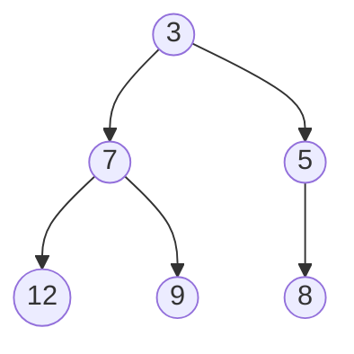

# Heap

---

## Table of Contents
<!-- TOC -->
* [Heap](#heap)
  * [Table of Contents](#table-of-contents)
  * [Overview](#overview)
  * [Heap Property: Min-Heap vs. Max-Heap](#heap-property-min-heap-vs-max-heap)
  * [Array Representation](#array-representation)
  * [Use Cases](#use-cases)
  * [Complexity](#complexity)
  * [Q&A](#qa)
  * [Related Topics](#related-topics)
  * [Ref.](#ref)
<!-- TOC -->

---

A heap is a complete binary tree that satisfies a specific ordering rule — the heap property — which keeps either the smallest or largest element always available at the root in constant time. It is the structure behind priority queues, job schedulers, and Dijkstra's shortest-path algorithm, and it underlies the classic heap sort algorithm. Despite being conceptually a tree, it is almost always implemented as a plain array, which is one of the more elegant space-efficiency tricks in everyday data structure design.

---

## Overview

A heap organizes elements so that every parent node maintains a fixed ordering relationship with its children: in a min-heap the parent is always less than or equal to its children, and in a max-heap the parent is always greater than or equal to its children. This partial ordering is weaker than a fully sorted structure — siblings have no defined relationship to each other — but it is exactly strong enough to guarantee that the minimum (or maximum) element is always at the root, retrievable in O(1).

Heaps are the standard backing structure for a **priority queue**: an abstract data type where elements are dequeued not in insertion order but in priority order. Any system that needs "give me the next most urgent item" — a task scheduler, an event simulation, a pathfinding algorithm's frontier — reaches for a heap-backed priority queue rather than sorting a list on every insertion.

The tree must additionally be a *complete* binary tree — every level fully filled except possibly the last, which fills left to right with no gaps. This completeness constraint is what makes the array representation possible and is the source of the heap's efficiency.

<sub>[Back to top](#table-of-contents)</sub>

---

## Heap Property: Min-Heap vs. Max-Heap

- ### Min-Heap:
  Every parent node's value is less than or equal to both of its children's values. The smallest element in the entire structure is therefore always at the root. Used when repeatedly extracting the smallest item is the goal — e.g., Dijkstra's algorithm always processes the currently-closest unvisited node next.

- ### Max-Heap:
  Every parent node's value is greater than or equal to both of its children's values. The largest element is always at the root. Used for scenarios like "process the highest-priority task first" or as the core mechanism of heap sort (repeatedly extract the max and place it at the end of the array).



**Caption:** A min-heap of six elements — every parent is less than or equal to its children, so `3` sits at the root.

<sub>[Back to top](#table-of-contents)</sub>

---

## Array Representation

Because a heap is always a *complete* binary tree, it can be stored in a plain array with no pointers at all — the tree shape is implied entirely by index arithmetic, saving the memory overhead of child/parent pointers and improving cache locality versus a pointer-based tree.

For a node stored at index `i` (0-indexed array):

- Left child is at index `2i + 1`
- Right child is at index `2i + 2`
- Parent is at index `(i - 1) / 2` (integer division)

```java
// The min-heap {3, 7, 5, 12, 9, 8} above, stored as a plain array:
int[] heap = {3, 7, 5, 12, 9, 8};
// heap[0] = 3  -> root
// heap[1] = 7, heap[2] = 5      -> children of index 0
// heap[3] = 12, heap[4] = 9     -> children of index 1
// heap[5] = 8                   -> left child of index 2
```

Maintaining the heap property after an insertion or extraction requires only local swaps along a single root-to-leaf path — an operation called **sift-up** (after insertion, bubble the new element toward the root while it violates the property) or **sift-down** (after removing the root, move the displaced last element down while it violates the property). Both touch at most `O(log n)` elements, since the tree height is logarithmic in a complete binary tree.

<sub>[Back to top](#table-of-contents)</sub>

---

## Use Cases

- ### Priority Queue:
  The canonical use case. Java's `PriorityQueue`, Python's `heapq`, and most standard libraries implement their priority queue as a binary heap array under the hood — see [Collections API](../programming/languages/java/java-1_2/collections-api.md) for Java's collection interfaces more broadly.

- ### Graph Algorithms:
  Dijkstra's shortest-path and Prim's minimum-spanning-tree algorithms both rely on a min-heap to efficiently select "the next closest/cheapest unvisited node" at every step, turning what would otherwise be an O(n) linear scan into an O(log n) extraction. See [Graph](graph.md).

- ### Heap Sort:
  Building a max-heap from an array and then repeatedly extracting the maximum into the end of the array yields an O(n log n), in-place, non-stable sort. The algorithm's step-by-step mechanics are a topic for a dedicated sorting-algorithms reference — the relevant fact here is that heap sort is a direct, practical application of the extract-max operation.

- ### K-Way Merge / Top-K Problems:
  A fixed-size heap is the standard technique for "find the K largest/smallest elements in a stream" without sorting the entire dataset.

<sub>[Back to top](#table-of-contents)</sub>

---

## Complexity

| Operation | Complexity |
|-----------|------------|
| Insert | O(log n) |
| Extract-Min / Extract-Max | O(log n) |
| Peek (Min/Max) | O(1) |
| Build heap from n elements | O(n) |

Peek is O(1) because the root is always the answer; insert and extract are O(log n) because they each require at most one sift operation along the tree's height. Building a heap from an unsorted array of n elements is a special case that runs in O(n) — not O(n log n) — because most nodes in a complete tree are near the leaves and require very little sifting.

<sub>[Back to top](#table-of-contents)</sub>

---

## Q&A

Common questions a software architect trainee would ask about this topic.

**Q: Why is a heap implemented as an array instead of a pointer-based tree?**
A: A heap is always a *complete* binary tree, meaning its shape is fully determined by the element count — no gaps except possibly at the end of the last level. That regularity lets index arithmetic (`2i+1`, `2i+2`, `(i-1)/2`) reconstruct parent/child relationships without storing any pointers, saving memory and improving cache locality versus a linked node structure.

**Q: What's the difference between a heap and a fully sorted array?**
A: A heap only guarantees a partial ordering — every parent is ≤ (or ≥) its children — not a total ordering between siblings or across the whole structure. This weaker guarantee is what makes insert and extract O(log n) instead of the O(n) an insertion into a sorted array would require, at the cost of not being able to read the structure in sorted order directly.

**Q: When should I use a heap-backed priority queue instead of just sorting a list?**
A: Use a heap when priorities arrive incrementally and you repeatedly need "the next highest/lowest priority item" without re-sorting the whole collection each time. Sorting once is only sufficient for static, one-shot datasets; a heap keeps insert and extract both at O(log n) regardless of how many times you interleave the two operations.

<sub>[Back to top](#table-of-contents)</sub>

---

## Related Topics

- [Hash Table](hash-table.md) — Another array-backed structure, but indexed by hash rather than by tree position
- [Graph](graph.md) — Dijkstra's and Prim's algorithms rely on a min-heap for efficient next-node selection
- [Linear Structures](linear-structures.md) — The heap's underlying array storage is a direct application of linear structure trade-offs
- [Trees](trees.md) — A heap is a constrained, array-backed special case of a binary tree

<sub>[Back to top](#table-of-contents)</sub>

---

## Ref.

- [PriorityQueue (Java SE 21 & JDK 21)](https://docs.oracle.com/en/java/javase/21/docs/api/java.base/java/util/PriorityQueue.html) — Official Java API documentation for the standard binary-heap-backed priority queue
- [Binary heap — Wikipedia](https://en.wikipedia.org/wiki/Binary_heap) — Encyclopedic coverage of heap properties, array representation, and complexity analysis

---

[Get Started](../../get-started.md) | [Data Structures](../../get-started.md#data-structures)

---
