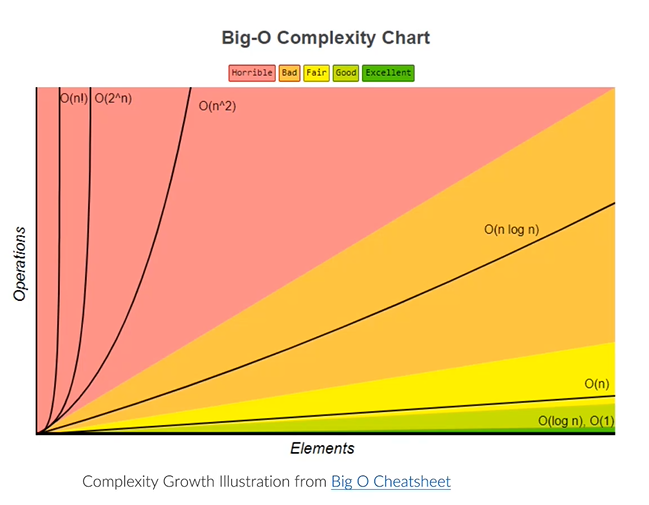
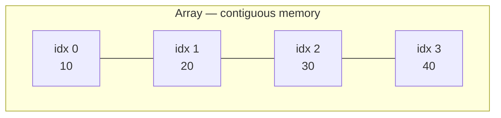
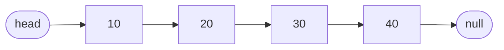
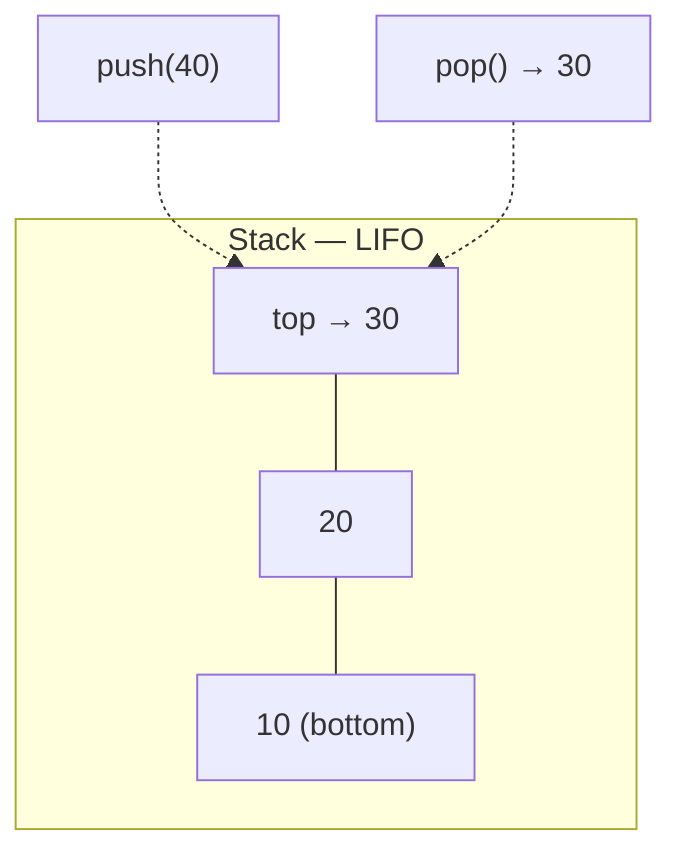
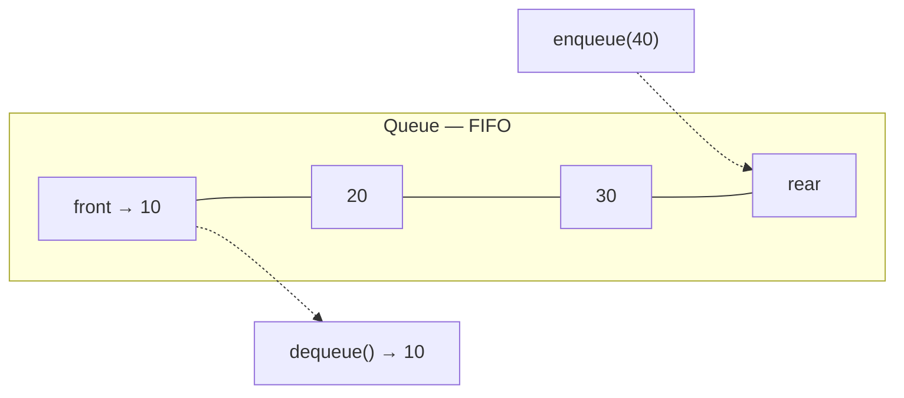

# Linear Data Structures

---

## Table of Contents
<!-- TOC -->
* [Linear Data Structures](#linear-data-structures)
  * [Table of Contents](#table-of-contents)
  * [Overview](#overview)
  * [Understanding Big-O](#understanding-big-o)
  * [Array](#array)
  * [Linked List](#linked-list)
  * [Stack](#stack)
  * [Queue](#queue)
  * [Comparison Table](#comparison-table)
  * [Q&A](#qa)
  * [Related Topics](#related-topics)
  * [Ref.](#ref)
<!-- TOC -->

---

Linear data structures organize elements sequentially, one after another, so that each element (except the first and last) has exactly one predecessor and one successor. Array, Linked List, Stack, and Queue are the four foundational linear structures every architect must be able to reason about — not to reimplement them, but to recognize which one a given access pattern demands and to predict the performance consequences of getting it wrong.

---

## Overview

Every higher-level data structure — hash tables, trees, graphs, even the call stack of a running program — is ultimately built from, or conceptually related to, one of these four linear building blocks. Arrays and linked lists differ primarily in memory layout: contiguous versus scattered. Stack and Queue are not separate memory layouts at all — they are *access disciplines* (LIFO and FIFO respectively) that can be implemented on top of either an array or a linked list.

The practical value of this topic for an architect is decision-making, not implementation. Language standard libraries already provide production-grade implementations (`ArrayList`/`array`, `LinkedList`, `Deque`/`Stack`, `Queue`). What matters is knowing, for a given read/write access pattern, which structure keeps the hot operations cheap — and being able to justify that choice in a design review.

[Back to top](#table-of-contents)

---

## Understanding Big-O

Big-O notation describes how an operation's cost grows as the number of elements `n` grows — it is the language used throughout this page to compare structures.

- **O(1)** — constant time, independent of `n` (e.g., array index lookup).
- **O(log n)** — grows slowly as `n` grows (e.g., balanced tree lookup — see [Trees](trees.md)).
- **O(n)** — grows linearly with `n` (e.g., scanning a list for a value).
- **O(n²)** or worse — grows rapidly; usually a red flag at scale.

For an architect, the relevant question is rarely "what is the exact complexity" but "does this operation stay cheap as our data grows from thousands to millions of rows" — a structure that is fine in a unit test can become the bottleneck in production once `n` is large enough.

[Back to top](#table-of-contents)

---

## Array

A fixed-layout (or dynamically resizable) block of contiguous memory, where each element is located by an index computed with simple pointer arithmetic (`base_address + index * element_size`). This contiguity is what makes array access O(1) — the location of any element is calculated directly, never traversed.

**When to use:** the access pattern is predominantly "read by index" or "iterate the whole collection," the size is known or grows infrequently, and cache-friendly, contiguous memory layout matters for performance (arrays have excellent CPU cache locality compared to pointer-chasing structures).

| Operation | Complexity | Notes |
|-----------|------------|-------|
| Access (by index) | O(1) | Direct address calculation |
| Search (by value) | O(n) | Linear scan required (unless sorted + binary search: O(log n)) |
| Insert | O(n) | Worst case — shifting elements; amortized O(1) for append-only dynamic arrays |
| Delete | O(n) | Worst case — shifting elements to close the gap |

**Caption:** Array elements sit in contiguous, indexable memory slots — any index resolves in O(1).

[Back to top](#table-of-contents)

---

## Linked List

A sequence of nodes, each holding a value and a pointer (or two, for doubly-linked lists) to the next node. Elements are scattered in memory and connected only by references, so there is no direct addressing — reaching the *k*-th element means walking *k* pointers from the head.

**When to use:** the access pattern is predominantly sequential (rarely "give me element #500,000 directly"), and insertions/deletions happen frequently at known positions (typically the head or a node you already hold a reference to) rather than by index. Linked lists avoid the O(n) shifting cost that plagues array insert/delete, at the price of O(n) positional access and worse cache locality.

| Operation | Complexity | Notes |
|-----------|------------|-------|
| Access (by position) | O(n) | Must traverse from the head |
| Search (by value) | O(n) | Linear traversal required |
| Insert (at known node) | O(1) | Pointer relinking only — no shifting |
| Delete (at known node) | O(1) | Pointer relinking only — no shifting |

**Caption:** Linked list nodes are scattered in memory and connected only by next-pointers — insertion at a known node is O(1), but reaching that node may require O(n) traversal.

[Back to top](#table-of-contents)

---

## Stack

A LIFO (Last-In, First-Out) access discipline: elements are added (`push`) and removed (`pop`) only from one end, called the top. A stack can be implemented on top of either an array or a linked list — the discipline, not the memory layout, is what defines it.

**When to use:** whenever the problem is naturally "undo the most recent thing first" — function call frames, undo/redo history, expression parsing and evaluation, backtracking algorithms (maze solving, DFS), and browser back-navigation history.

| Operation | Complexity | Notes |
|-----------|------------|-------|
| Access (top only) | O(1) | Only the top element is directly reachable |
| Access (arbitrary element) | O(n) | Requires popping down to it |
| Search (by value) | O(n) | Linear scan from the top |
| Insert (push) | O(1) | Always at the top |
| Delete (pop) | O(1) | Always from the top |

**Caption:** Both push and pop operate exclusively on the top of the stack — last in, first out.

[Back to top](#table-of-contents)

---

## Queue

A FIFO (First-In, First-Out) access discipline: elements are added (`enqueue`) at the rear and removed (`dequeue`) from the front. Like a stack, a queue can be backed by an array (typically a circular buffer to avoid O(n) shifting) or a doubly-linked list.

**When to use:** whenever processing order must match arrival order — task scheduling, message/event queues, breadth-first traversal, request buffering between producer and consumer services, and rate-limiting buffers.

| Operation | Complexity | Notes |
|-----------|------------|-------|
| Access (front/rear only) | O(1) | Only the two ends are directly reachable |
| Access (arbitrary element) | O(n) | Requires dequeuing down to it |
| Search (by value) | O(n) | Linear scan from the front |
| Insert (enqueue) | O(1) | Always at the rear |
| Delete (dequeue) | O(1) | Always from the front |

**Caption:** Elements enter at the rear and leave from the front — first in, first out.

[Back to top](#table-of-contents)

---

## Comparison Table

A side-by-side summary of all four linear structures for quick reference during design decisions.

| Structure | Access | Search | Insert | Delete | Memory Layout | Typical Use Case |
|-----------|--------|--------|--------|--------|----------------|-------------------|
| Array | O(1) | O(n) | O(n) (amortized O(1) append) | O(n) | Contiguous | Index-based reads, iteration, cache-sensitive workloads |
| Linked List | O(n) | O(n) | O(1)* | O(1)* | Scattered (pointer-linked) | Frequent insert/delete at known positions, unknown/volatile size |
| Stack | O(1) top / O(n) other | O(n) | O(1) | O(1) | Array or Linked List | LIFO workflows — undo, call frames, DFS, parsing |
| Queue | O(1) ends / O(n) other | O(n) | O(1) | O(1) | Array (circular) or Linked List | FIFO workflows — task queues, BFS, message buffering |

* at a known node; O(n) if the position must first be located by traversal.

[Back to top](#table-of-contents)

---

## Q&A

Common questions a software architect trainee would ask about this topic.

**Q: If arrays give O(1) access and linked lists only O(n), why would I ever choose a linked list?**
A: Access speed is only one axis. A linked list gives O(1) insert/delete at a known position (e.g., the head, or a node you're already iterating from) with no shifting cost, and it never needs to be resized or copied as it grows. When your workload is dominated by frequent insertions/removals rather than random-access reads — an LRU cache's eviction list, or a playlist with frequent reordering — a linked list is the better fit despite its worse random access.

---

**Q: The comparison table says array append is "amortized O(1)" — what does that mean, and when does it bite you?**
A: A dynamic array (e.g., Java's `ArrayList`) over-allocates capacity and only reallocates + copies to a larger backing array when it's full, which happens on a shrinking fraction of appends — averaging out to O(1) per append across many operations. The worst case is still O(n) for the one append that triggers the resize. This matters in latency-sensitive paths (real-time systems, request handlers with strict SLAs) where an occasional O(n) spike is unacceptable even if the *average* is fine — pre-sizing the array or choosing a structure with no resize step avoids the spike.

---

**Q: How do I decide between a Stack and a Queue for a processing pipeline?**
A: Ask what order correctness requires. If the most recently produced item must be handled first (undo history, syntax parsing, depth-first backtracking), use a Stack. If items must be handled in the order they arrived (task scheduling, event processing, breadth-first traversal, anything modeling a real-world queue like a request buffer), use a Queue. Picking the wrong discipline doesn't cause a performance problem — it causes a correctness bug, since the processing order itself changes.

[Back to top](#table-of-contents)

---

## Related Topics

- [Trees](trees.md) — Hierarchical structures built from the same node-and-pointer building blocks as a linked list, but with branching instead of a single successor

[Back to top](#table-of-contents)

---

## Ref.

- [Introduction to Data Structures — GeeksforGeeks](https://www.geeksforgeeks.org/dsa/data-structures/) — Broad reference covering all common structures with complexity tables
- [Big-O Cheat Sheet](https://www.bigocheatsheet.com/) — Authoritative quick-reference for time/space complexity across data structures and algorithms

---

[Get Started](../../get-started.md) | [Data Structures](../../get-started.md#data-structures)

---
