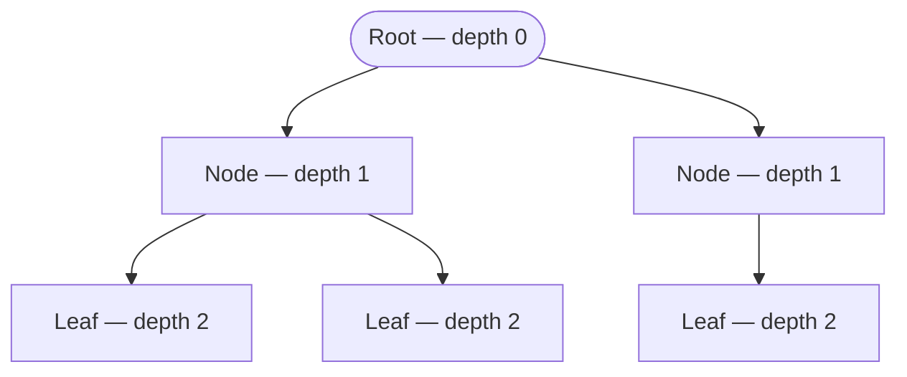
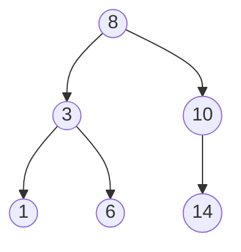
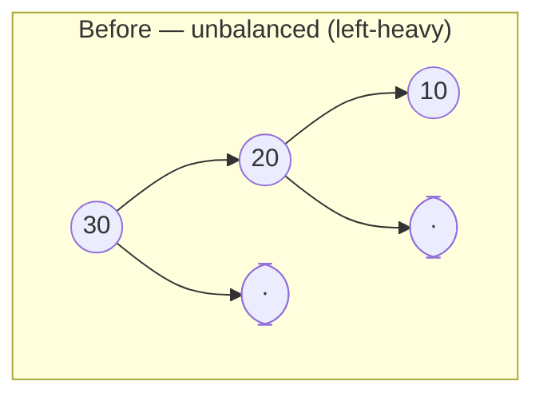
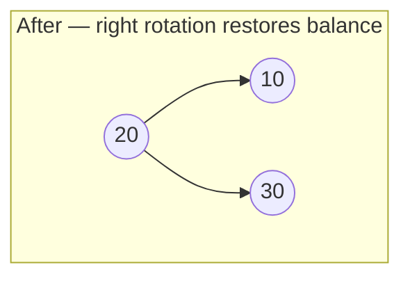
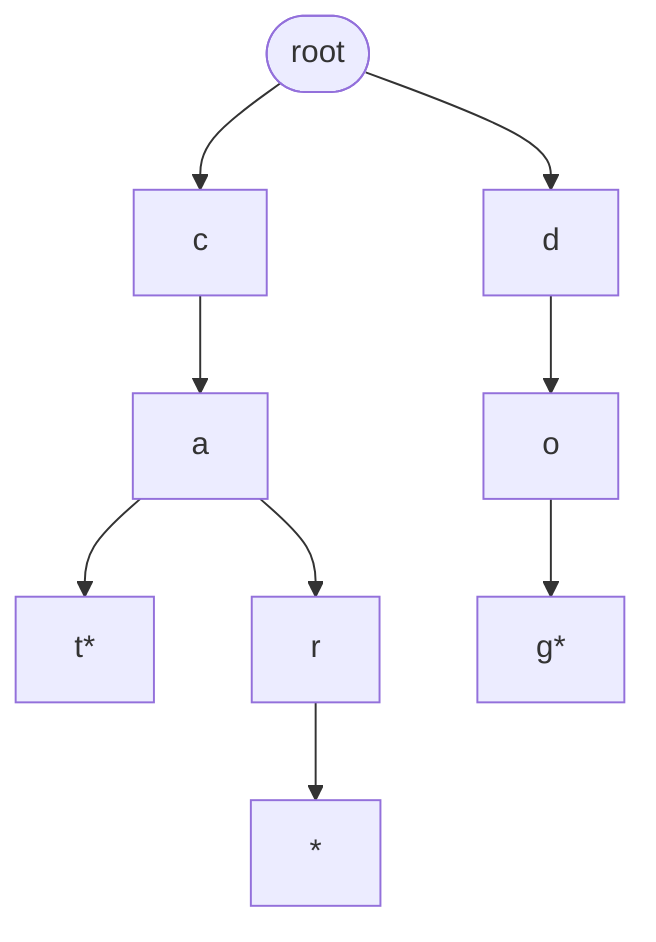

# Trees

---

## Table of Contents
<!-- TOC -->
* [Trees](#trees)
  * [Table of Contents](#table-of-contents)
  * [Overview](#overview)
  * [What Makes a Tree a Tree](#what-makes-a-tree-a-tree)
  * [Binary Tree](#binary-tree)
  * [AVL Tree](#avl-tree)
  * [Trie](#trie)
  * [Q&A](#qa)
  * [Related Topics](#related-topics)
  * [Ref.](#ref)
<!-- TOC -->

---

A tree is a hierarchical data structure built from linked nodes, but organized so that each node has exactly one parent (except a single root) and zero or more children — trading the strict one-predecessor/one-successor chain of a linear structure for branching. Binary Tree, AVL Tree, and Trie are three variants an architect encounters constantly: as the backbone of database indexes, as the balancing mechanism behind sorted-map implementations, and as the engine behind autocomplete and routing lookups.

---

## Overview

Trees exist because plain linear search — and even a sorted array's O(log n) binary search — cannot support efficient *insertion and deletion* on data that changes frequently. A tree keeps data ordered (or otherwise structured) while allowing insert and delete to stay close to O(log n), as long as the tree stays reasonably balanced. That balance guarantee is the recurring theme of this page: an unbalanced tree degrades toward the same O(n) worst case as a linked list, which is precisely the failure mode AVL trees were invented to prevent.

Beyond ordered search, trees generalize naturally to other structuring problems — a Trie organizes strings by shared prefixes rather than by comparison order, which is why it belongs in the same family conceptually even though it answers a different question ("what keys start with this prefix?" rather than "is this key present?").

[Back to top](#table-of-contents)

---

## What Makes a Tree a Tree

A handful of vocabulary terms recur across every tree variant:

| Term | Definition |
|------|------------|
| Root | The single node with no parent — the entry point into the tree |
| Parent / Child | A node directly above / below another, connected by an edge |
| Leaf | A node with no children |
| Height | The number of edges on the longest path from a node down to a leaf |
| Depth | The number of edges from the root down to a given node |
| Balanced | A tree whose left and right subtree heights differ by at most a small, bounded amount at every node |

The height of a tree is the single number that determines the cost of search, insert, and delete — a tree of `n` nodes has a minimum possible height of `O(log n)` (perfectly balanced) and a maximum possible height of `O(n)` (degenerated into a linked-list-like chain). Every self-balancing tree variant exists solely to keep the actual height as close to that `O(log n)` minimum as possible.

**Caption:** Root, parent/child, leaf, and depth relationships in a generic tree — height here is 2.

Traversal (visiting every node in a defined order — pre-order, in-order, post-order, level-order) is the mechanism used to read a tree back out, and level-order traversal is essentially breadth-first search applied to a tree; the traversal algorithms themselves are covered in depth in the future Algorithms material rather than duplicated here.

[Back to top](#table-of-contents)

---

## Binary Tree

A tree in which every node has at most two children, conventionally called *left* and *right*. A plain binary tree imposes no ordering constraint; a **Binary Search Tree (BST)** adds the ordering property that makes search efficient: for every node, all values in the left subtree are smaller and all values in the right subtree are larger.

**When to use:** a BST is the right choice when you need an in-memory structure that stays sorted while supporting efficient insert, delete, and range queries — the foundation beneath `TreeMap`/`TreeSet`-style ordered collections. A plain (non-search) binary tree shows up wherever the domain is naturally binary-branching, such as decision trees or expression trees.

The ordering property is what makes an in-order traversal (left, node, right) visit every node in ascending sorted order — a useful property, but the traversal algorithm itself belongs to the Algorithms material rather than this structural overview.

| Operation | Balanced BST | Unbalanced (worst case) |
|-----------|--------------|--------------------------|
| Access / Search | O(log n) | O(n) |
| Insert | O(log n) | O(n) |
| Delete | O(log n) | O(n) |

**Caption:** A binary search tree — every left subtree holds smaller values, every right subtree holds larger values.

The worst case matters more than it first appears: inserting already-sorted data into a plain BST with no rebalancing produces a degenerate chain — every node with only a right child — collapsing search from O(log n) to O(n). This single failure mode is the entire motivation for the AVL tree below.

[Back to top](#table-of-contents)

---

## AVL Tree

A **self-balancing** binary search tree (Adelson-Velsky and Landis, 1962 — the first such structure invented) that enforces a strict balance invariant: for every node, the heights of its left and right subtrees differ by at most 1. After every insert or delete, the tree checks this invariant along the path back to the root and repairs any violation using a **rotation** — a local restructuring of a small number of nodes that restores balance without violating the BST ordering property.

**When to use:** whenever a workload needs guaranteed O(log n) worst-case performance and cannot tolerate the degenerate O(n) case a plain BST allows — indexing structures, in-memory sorted maps under adversarial or already-sorted input, and any system where predictable tail latency matters more than raw insert throughput. AVL trees stay more strictly balanced than the alternative self-balancing structure (red-black trees), which makes AVL lookups slightly faster but its inserts/deletes slightly more expensive due to more frequent rotations — a trade-off worth knowing exists, even without re-deriving it from scratch.

| Operation | Complexity | Notes |
|-----------|------------|-------|
| Access / Search | O(log n) | Guaranteed — never degrades |
| Insert | O(log n) | Includes rebalancing rotation(s) |
| Delete | O(log n) | Includes rebalancing rotation(s) |

**Caption:** A right rotation at node 30 promotes node 20 to the top, converting a left-heavy 3-node chain into a balanced shape — height drops from 2 to 1.

The key insight for an architect: a rotation is a cheap, constant-time, purely local pointer restructuring — it does not re-scan or re-sort the tree — so the amortized cost of keeping a tree balanced is small relative to the guarantee it buys.

[Back to top](#table-of-contents)

---

## Trie

A **prefix tree**: a tree in which each edge represents a single character (or token), and any path from the root spells out a key. Unlike a BST, a Trie does not compare whole keys against each other — it compares one character at a time, branching by character rather than by value ordering. Keys that share a prefix share the same path from the root, which is what makes prefix operations cheap.

**When to use:** autocomplete and typeahead search, spell-checkers, IP routing tables (longest-prefix match), and any lookup structure where "give me everything starting with X" needs to be fast. A Trie is a poor fit when keys share little to no common structure or when memory overhead per character matters more than lookup speed (each node typically holds an array or map of child pointers, one per possible next character).

| Operation | Complexity | Notes |
|-----------|------------|-------|
| Access / Search | O(m) | `m` = length of the key being searched, independent of how many keys are stored |
| Insert | O(m) | One node created/traversed per character |
| Delete | O(m) | Traverse to the key, then prune now-unused nodes back toward the root |

**Caption:** A trie holding "cat", "car", and "dog" — nodes marked `*` terminate a stored word; "ca" is a shared prefix path for both "cat" and "car".

The complexity table above looks like a free lunch compared to a BST's O(log n) — but the comparison is apples to oranges: Trie cost scales with key *length* (`m`), while BST cost scales with the *number of stored keys* (`n`). For short, highly prefix-shared keys (dictionary words, URLs, IP addresses) a Trie is extremely efficient; for long or largely unrelated keys the per-character node overhead can outweigh the benefit.

[Back to top](#table-of-contents)

---

## Q&A

Common questions a software architect trainee would ask about this topic.

**Q: Why not just always use an AVL tree instead of a plain BST?**
A: An AVL tree guarantees O(log n) but pays for it with rotation overhead on every insert/delete, plus the memory cost of tracking balance factors per node. If the input is known to arrive in a reasonably random order (not sorted, not adversarial), a plain BST typically stays close to balanced in practice without that overhead. Use a plain BST when input order is trusted and simplicity matters; use AVL (or a similar self-balancing structure) whenever the worst case must be bounded regardless of input order — which, in most production systems accepting external or attacker-influenced input, is the safer default.

---

**Q: How is a Trie different from just using a HashMap of strings?**
A: A HashMap gives O(1) average lookup for an exact key match but cannot efficiently answer prefix queries — "find all keys starting with 'ca'" requires scanning every key. A Trie is built exactly for that access pattern: because shared prefixes share a path, "all keys starting with 'ca'" is just "everything reachable below the node at the end of the path c→a" — no scan of unrelated keys required. Choose HashMap for pure exact-match lookups; choose Trie when prefix search, autocomplete, or ordered iteration over keys is a first-class requirement.

---

**Q: What's the actual architectural cost of an unbalanced BST degrading to O(n)?**
A: It's not just slower — it changes an operation from effectively free (a few pointer hops, sub-microsecond) into a linear scan that shows up as a latency spike or timeout under load, and it does so silently: the code and the data structure look identical to the balanced case, so the bug only surfaces once a specific input ordering (e.g., ingesting pre-sorted data) hits production. This is exactly the kind of correctness-adjacent performance bug that justifies choosing a self-balancing structure (AVL, red-black, or a database's B-tree index) up front rather than a plain BST whenever input order cannot be guaranteed random.

[Back to top](#table-of-contents)

---

## Related Topics

- [Linear Data Structures](linear-structures.md) — Array, Linked List, Stack, and Queue are the building blocks trees are constructed from, and share the same Big-O framing used here

[Back to top](#table-of-contents)

---

## Ref.

- [Binary Search Tree — GeeksforGeeks](https://www.geeksforgeeks.org/dsa/binary-search-tree-data-structure/) — Structure, operations, and complexity reference for BSTs
- [AVL Tree — GeeksforGeeks](https://www.geeksforgeeks.org/dsa/avl-tree-set-1-insertion/) — Rotation mechanics and balancing invariant, with worked examples
- [Trie — GeeksforGeeks](https://www.geeksforgeeks.org/dsa/trie-insert-and-search/) — Prefix tree structure, insertion/search mechanics, and common applications

---

[Get Started](../../get-started.md) | [Data Structures](../../get-started.md#data-structures)

---
