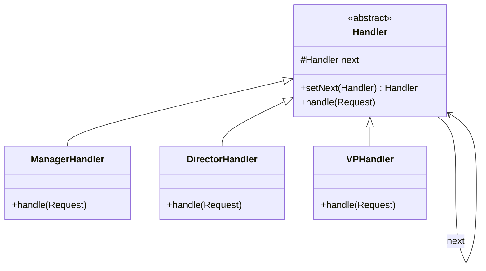

# The Chain of Responsibility Pattern

---

## Table of Contents
<!-- TOC -->
* [The Chain of Responsibility Pattern](#the-chain-of-responsibility-pattern)
  * [Table of Contents](#table-of-contents)
  * [Overview](#overview)
  * [Pattern Structure](#pattern-structure)
  * [Example](#example)
  * [Q&A](#qa)
  * [Related Topics](#related-topics)
  * [Ref.](#ref)
<!-- TOC -->

---

The Chain of Responsibility Pattern is a behavioral design pattern that lets a request travel along a chain of potential handlers until one of them handles it. Each handler decides independently whether it can process the request or should pass it to the next handler in the chain. This decouples the sender of a request from the object(s) that ultimately handle it, allowing the chain's composition to change at runtime.

<sub>[Back to top](#table-of-contents)</sub>

---

## Overview

Chain of Responsibility is common wherever a request might need one of several possible handlers but the sender shouldn't need to know which one, or how many, will actually process it. Classic examples include middleware pipelines (HTTP request processing), GUI event bubbling, logging frameworks with severity-based handlers, and approval workflows (e.g., an expense request escalating from manager to director to VP based on amount).

Each handler in the chain holds a reference to the next handler (`successor`). Upon receiving a request, a handler either processes it, forwards it unchanged, or does some work and *then* forwards it. The chain can be built dynamically at runtime, and handlers can be added, removed, or reordered without affecting the client that issues requests.

The pattern trades a single point of control for flexibility: no single handler needs to know the whole chain, but this also makes it harder to guarantee a request is *always* handled — chains must be built carefully, often ending in a default/fallback handler.

<sub>[Back to top](#table-of-contents)</sub>

---

## Pattern Structure

- **Handler**: declares an interface for handling requests and (usually) a method to set the next handler.
- **ConcreteHandler**: handles requests it is responsible for; otherwise forwards to its successor.
- **Client**: initiates the request into the first handler of the chain, unaware of which handler will ultimately process it.



**Caption:** A request enters at `ManagerHandler` and is passed along `next` references until a handler in the chain (or none) processes it.

<sub>[Back to top](#table-of-contents)</sub>

---

## Example

```java
abstract class ApprovalHandler {
    protected ApprovalHandler next;
    ApprovalHandler setNext(ApprovalHandler next) { this.next = next; return next; }
    abstract void handle(double amount);
}

class ManagerHandler extends ApprovalHandler {
    void handle(double amount) {
        if (amount <= 1000) System.out.println("Manager approved " + amount);
        else if (next != null) next.handle(amount);
    }
}

class DirectorHandler extends ApprovalHandler {
    void handle(double amount) {
        if (amount <= 10000) System.out.println("Director approved " + amount);
        else if (next != null) next.handle(amount);
    }
}

// Client
ApprovalHandler chain = new ManagerHandler();
chain.setNext(new DirectorHandler());
chain.handle(5000); // handled by DirectorHandler
```

The client only interacts with the head of the chain; it has no idea which concrete handler ultimately approves the request.

<sub>[Back to top](#table-of-contents)</sub>

---

## Q&A

Common questions a software architect trainee would ask about this topic.

**Q: How does Chain of Responsibility differ from Decorator, since both wrap objects and forward calls?**
A: Structurally they look similar — both build a linked chain of objects that delegate to a "next" object — but the intent is different. Decorator wraps a single object to *add* behavior around every call, and every layer always runs, contributing to the same combined result. Chain of Responsibility passes a request through candidate handlers looking for the *one* (or more) that will actually process it; a handler can stop the chain entirely, and unrelated handlers may do nothing at all.

---

**Q: How does Chain of Responsibility differ from Mediator, since both coordinate multiple objects around a request?**
A: Mediator centralizes communication: a single mediator object knows about all participants and explicitly orchestrates how they interact, so control flows through one hub. Chain of Responsibility decentralizes control: each handler only knows its immediate successor, no object has a full view of the chain, and the request flows linearly until handled. Mediator is a hub-and-spoke coordinator; Chain of Responsibility is a pipeline.

---

**Q: What happens if no handler in the chain processes the request?**
A: By default, the request silently falls off the end of the chain and nothing happens, which can hide bugs. Robust implementations either terminate the chain with a default/fallback handler that guarantees a response, or have the chain-building code throw/log when a request reaches the end unhandled.

<sub>[Back to top](#table-of-contents)</sub>

---

## Related Topics

- [Mediator Pattern](mediator.md) — centralizes coordination through one hub instead of passing a request along a decentralized chain
- [Decorator Pattern](../structural/decorator.md) — structurally similar (linked wrapping objects) but every layer runs and adds behavior, rather than one handler claiming the request
- [Command Pattern](command.md) — requests are often encapsulated as Command objects before being passed along a chain of handlers

<sub>[Back to top](#table-of-contents)</sub>

---

## Ref.

- [Chain of Responsibility — Refactoring.Guru](https://refactoring.guru/design-patterns/chain-of-responsibility) — structure, applicability, and pros/cons
- [Design Patterns: Elements of Reusable Object-Oriented Software (GoF)](https://en.wikipedia.org/wiki/Design_Patterns) — original catalog defining the Chain of Responsibility pattern

---

[Get Started](../../../get-started.md) | [Design Patterns](../../../get-started.md#design-patterns)

---
