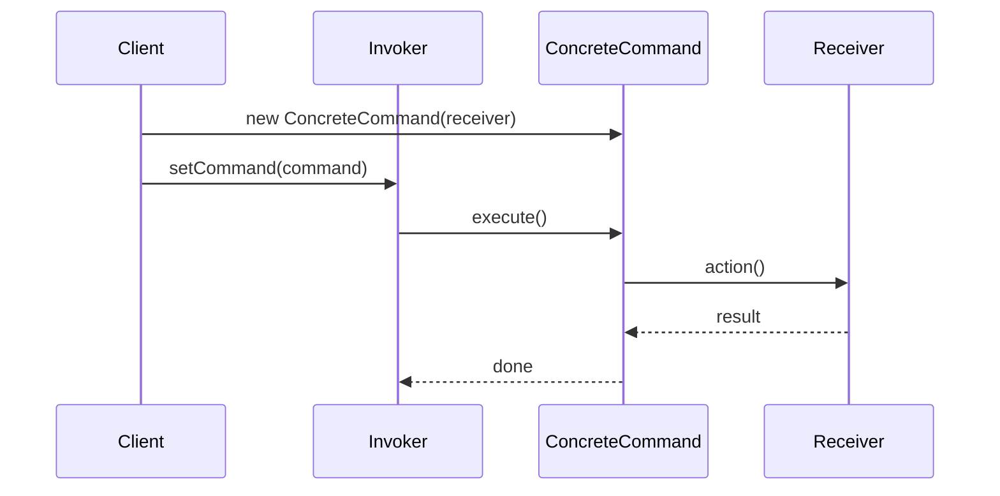

# The Command Pattern

---

## Table of Contents
<!-- TOC -->
* [The Command Pattern](#the-command-pattern)
  * [Table of Contents](#table-of-contents)
  * [Overview](#overview)
  * [Pattern Structure](#pattern-structure)
  * [Code Example](#code-example)
  * [Q&A](#qa)
  * [Related Topics](#related-topics)
  * [Ref.](#ref)
<!-- TOC -->

---

The Command Pattern is a behavioral design pattern that turns a *request into a stand-alone object* containing everything needed to perform an action — the operation to call, its receiver, and its arguments. This decouples the object that invokes an operation (the invoker) from the object that knows how to perform it (the receiver), and makes the request itself a first-class value that can be stored, passed around, queued, logged, or undone.

---

## Overview

Instead of an invoker calling a method directly on a receiver, it calls `execute()` on a `Command` object. The command wraps a receiver reference plus the specific action to invoke, so the invoker never needs to know what the command actually does or which object performs it. This indirection unlocks several things a direct method call cannot easily provide: commands can be queued and executed later, logged for auditing, transmitted across a network, composed into macro-commands, and — if a command also implements the inverse operation — undone.

Command is the pattern behind undo/redo stacks in editors, task queues and job schedulers, GUI action bindings (menu items, toolbar buttons, and keyboard shortcuts all invoking the same underlying command object), and transactional/remote-procedure-style APIs. It's also conceptually close to the *command* half of CQRS (Command Query Responsibility Segregation) — both treat a write intent as an explicit, self-contained object rather than a direct method call — though CQRS is an architectural style for separating reads from writes, not the same as this object-oriented pattern.

<sub>[Back to top](#table-of-contents)</sub>

---

## Pattern Structure

- **Command**: declares an interface (typically `execute()`, and optionally `undo()`) implemented by every concrete command.
- **ConcreteCommand**: binds a specific `Receiver` to a specific action and implements `execute()` by invoking that action on the receiver. Holds any parameters needed for the call.
- **Receiver**: the object that actually knows how to perform the requested operation.
- **Invoker**: holds a command (or a history of commands) and triggers `execute()` without knowing what the command does.
- **Client**: creates a `ConcreteCommand`, configures it with a `Receiver`, and hands it to the `Invoker`.



**Caption:** The `Invoker` only ever calls `execute()` on the `Command` — it never talks to the `Receiver` directly, and doesn't know what concrete action will run.

<sub>[Back to top](#table-of-contents)</sub>

---

## Code Example

```java
interface Command {
    void execute();
    void undo();
}

class Light {
    void on()  { System.out.println("Light on"); }
    void off() { System.out.println("Light off"); }
}

class LightOnCommand implements Command {
    private final Light light;
    LightOnCommand(Light light) { this.light = light; }
    public void execute() { light.on(); }
    public void undo()    { light.off(); }
}

class RemoteControl {
    private Command command;
    void setCommand(Command command) { this.command = command; }
    void pressButton() { command.execute(); }
    void pressUndo()   { command.undo(); }
}
```

`RemoteControl` (the invoker) never references `Light` (the receiver) directly — it only depends on the `Command` interface, so the same button can be rewired to any command without changing `RemoteControl`.

<sub>[Back to top](#table-of-contents)</sub>

---

## Q&A

Common questions a software architect trainee would ask about this topic.

**Q: How is Command different from Strategy — both wrap behavior in an object?**
A: Strategy encapsulates *one interchangeable algorithm* for accomplishing a task the context always performs (e.g., different sorting algorithms), and the client typically injects it once. Command encapsulates *a specific request or action to be performed*, complete with its receiver and arguments, and is designed to be stored, queued, logged, or undone as a discrete unit of work — not just swapped for another way of doing the same thing. See [Strategy Pattern](strategy.md).

---

**Q: How does the Command pattern support undo/redo?**
A: Each `ConcreteCommand` implements an `undo()` alongside `execute()`, reversing the effect of its action. The invoker keeps a history stack of executed commands; undo pops the last command and calls `undo()` on it, redo re-executes it. Because each command is self-contained, the invoker doesn't need any pattern-specific knowledge of what to reverse.

---

**Q: Where does the Command pattern show up outside of GUI button handlers?**
A: Anywhere a request needs to be decoupled from its execution: job queues and task schedulers (a command is enqueued and executed later, possibly on a different thread), transactional outboxes, macro recording (a list of commands replayed in sequence), and the "command" side of CQRS, where a write intent is modeled as an explicit object rather than a direct method call.

<sub>[Back to top](#table-of-contents)</sub>

---

## Related Topics

- [Strategy Pattern](strategy.md) — encapsulates an interchangeable algorithm, as opposed to Command's encapsulation of a discrete, storable request
- [Memento Pattern](memento.md) — often paired with Command to snapshot state for a more robust undo mechanism than reverse-execution alone
- [Mediator Pattern](mediator.md) — can use Command objects internally to represent the messages colleagues send through the hub

<sub>[Back to top](#table-of-contents)</sub>

---

## Ref.

- [Command — Refactoring.Guru](https://refactoring.guru/design-patterns/command) — pattern explanation with structure and examples
- [Command pattern — Wikipedia](https://en.wikipedia.org/wiki/Command_pattern) — background and history

---

[Get Started](../../../get-started.md) | [Design Patterns](../../../get-started.md#design-patterns)

---
