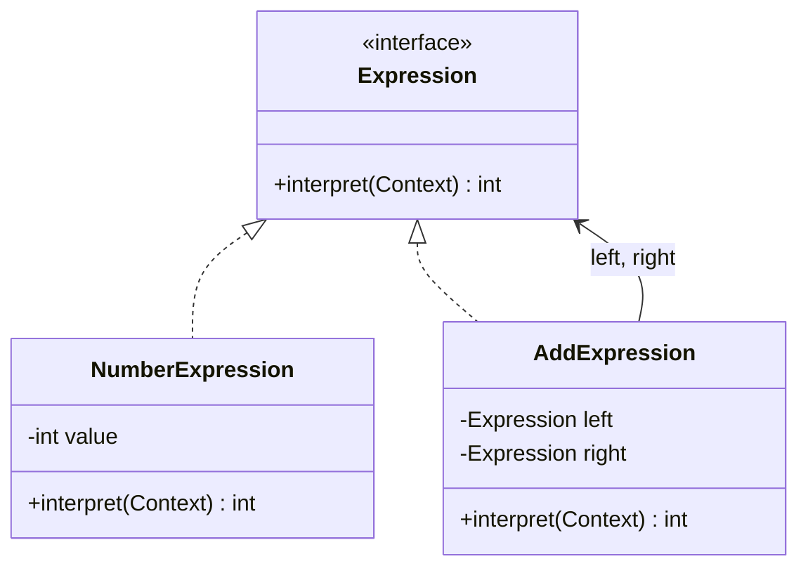

# The Interpreter Pattern

---

## Table of Contents
<!-- TOC -->
* [The Interpreter Pattern](#the-interpreter-pattern)
  * [Table of Contents](#table-of-contents)
  * [Overview](#overview)
  * [Pattern Structure](#pattern-structure)
  * [Example](#example)
  * [Q&A](#qa)
  * [Related Topics](#related-topics)
  * [Ref.](#ref)
<!-- TOC -->

---

The Interpreter Pattern is a behavioral design pattern that defines a representation for a language's grammar, along with an interpreter that evaluates sentences in that language. Each grammar rule is modeled as a class, and a sentence is represented as a tree of these rule objects (an abstract syntax tree). Evaluating the sentence means walking the tree and letting each node interpret itself.

<sub>[Back to top](#table-of-contents)</sub>

---

## Overview

Interpreter is useful when you have a small, well-defined language or grammar that appears repeatedly in your problem domain — arithmetic expressions, search filter syntax, boolean rule engines, regular expressions, or simple configuration languages. Rather than writing a bespoke parser/evaluator by hand, you model each grammar rule (terminal and non-terminal expressions) as a class with an `interpret(context)` method, and combine instances into a tree that mirrors the grammar structure.

Conceptually, Interpreter is a lightweight, object-oriented building block for implementing a **Domain-Specific Language (DSL)** — a small language tailored to a specific problem, as opposed to a general-purpose language. Interpreter shows how to represent and evaluate such a language's grammar with plain classes, though real-world DSL tooling usually pairs it with (or replaces it with) parser generators for anything beyond a handful of grammar rules.

The pattern works well for small, stable grammars but scales poorly: each new grammar rule is a new class, and complex grammars become unwieldy class hierarchies. For anything beyond simple expression languages, a proper parser (hand-written recursive descent, or a generated one) is usually preferable.

<sub>[Back to top](#table-of-contents)</sub>

---

## Pattern Structure

- **AbstractExpression**: declares an `interpret(Context)` method common to all nodes in the grammar tree.
- **TerminalExpression**: implements `interpret` for terminal symbols in the grammar (e.g., a number literal).
- **NonterminalExpression**: implements `interpret` for grammar rules that combine other expressions (e.g., addition, subtraction).
- **Context**: holds global information used during interpretation (e.g., variable bindings).
- **Client**: builds the abstract syntax tree (a specific sentence in the grammar) and triggers interpretation.



**Caption:** `AddExpression` is a non-terminal node composed of two child expressions; interpreting it recursively interprets its children.

<sub>[Back to top](#table-of-contents)</sub>

---

## Example

```java
interface Expression {
    int interpret();
}

class NumberExpression implements Expression {
    private final int value;
    NumberExpression(int value) { this.value = value; }
    public int interpret() { return value; }
}

class AddExpression implements Expression {
    private final Expression left, right;
    AddExpression(Expression left, Expression right) { this.left = left; this.right = right; }
    public int interpret() { return left.interpret() + right.interpret(); }
}

// Client builds and evaluates the sentence: (3 + 4) + 5
Expression expr = new AddExpression(
        new AddExpression(new NumberExpression(3), new NumberExpression(4)),
        new NumberExpression(5));
System.out.println(expr.interpret()); // 12
```

Each class corresponds to one grammar rule, and the tree of objects is literally the parsed sentence.

<sub>[Back to top](#table-of-contents)</sub>

---

## Q&A

Common questions a software architect trainee would ask about this topic.

**Q: Isn't Interpreter just a Composite tree with an `interpret` method?**
A: Structurally, yes — Interpreter is essentially Composite specialized for representing and evaluating grammar rules. The distinction is intent: Composite is about representing part-whole hierarchies generically (e.g., files and folders), while Interpreter specifically models a language's grammar, where each class corresponds to a grammar rule and the tree represents one parsed sentence in that language.

---

**Q: When should I use Interpreter versus writing a "real" parser or using a parser-generator library?**
A: Interpreter is reasonable for very small, rarely-changing grammars — a handful of rules, low complexity, and where you value having each rule as an explicit, testable class. Once the grammar grows (many rules, operator precedence, error recovery, performance concerns), the one-class-per-rule approach becomes unwieldy and a hand-written recursive-descent parser or a generated parser (e.g., ANTLR) is a better fit.

---

**Q: How does Interpreter relate to building a Domain-Specific Language (DSL)?**
A: A DSL is a small language designed for a specific problem domain (e.g., a filter query syntax or a pricing rules language). Interpreter is one of the simplest object-oriented techniques for giving such a language an executable representation: each grammar rule becomes a class, and a sentence in the DSL becomes a tree of those classes that can be evaluated by walking it. It's a good starting point for a tiny internal DSL, though larger DSLs typically move to dedicated parsing/lexing tools.

<sub>[Back to top](#table-of-contents)</sub>

---

## Related Topics

- [Visitor Pattern](visitor.md) — often paired with Interpreter to add new operations (pretty-printing, optimization) over the grammar tree without modifying the expression classes
- [SOLID](../solid.md) — each grammar rule is its own class, keeping interpretation logic single-responsibility and open for extension with new rules

<sub>[Back to top](#table-of-contents)</sub>

---

## Ref.

- [Interpreter Pattern — Refactoring.Guru](https://refactoring.guru/design-patterns/interpreter) — structure, applicability, and pros/cons
- [Design Patterns: Elements of Reusable Object-Oriented Software (GoF)](https://en.wikipedia.org/wiki/Design_Patterns) — original catalog defining the Interpreter pattern

---

[Get Started](../../../get-started.md) | [Design Patterns](../../../get-started.md#design-patterns)

---
