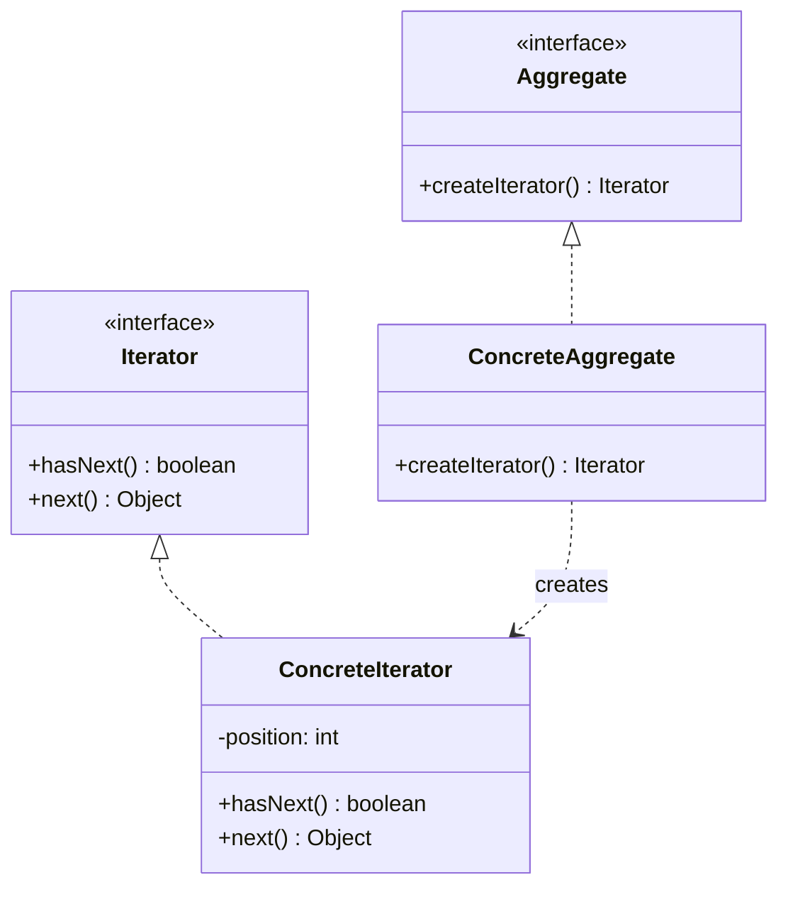

# The Iterator Pattern

---

## Table of Contents
<!-- TOC -->
* [The Iterator Pattern](#the-iterator-pattern)
  * [Table of Contents](#table-of-contents)
  * [Overview](#overview)
  * [Pattern Structure](#pattern-structure)
  * [Code Example](#code-example)
  * [Q&A](#qa)
  * [Related Topics](#related-topics)
  * [Ref.](#ref)
<!-- TOC -->

---

The Iterator Pattern is a behavioral design pattern that provides a way to *access the elements of an aggregate object sequentially*, without exposing that aggregate's underlying representation (array, linked list, tree, hash table, and so on). It extracts the traversal logic out of the collection and into a separate iterator object, so a collection can be traversed uniformly regardless of how it's actually stored.

---

## Overview

Before Iterator, client code that wanted to loop over a collection typically needed to know its internal structure — indexing into an array is very different from walking a linked list or a tree. The pattern standardizes this by defining a common `Iterator` interface (usually `hasNext()` / `next()`) that any aggregate can produce, so client code loops the same way no matter what's underneath.

This also decouples the collection from the number of concurrent traversals it must support: because state (the current position) lives in the iterator object rather than the collection itself, multiple independent iterators can traverse the same collection at once without interfering with each other.

Iterator is one of the most pervasive patterns in mainstream languages precisely because it's baked directly into their standard libraries and syntax — in Java it underlies every `for-each` loop over a `Collection`.

<sub>[Back to top](#table-of-contents)</sub>

---

## Pattern Structure

- **Iterator**: declares the traversal interface, typically `hasNext()` and `next()` (and sometimes `remove()`).
- **ConcreteIterator**: implements the traversal for a specific aggregate, tracking the current position internally.
- **Aggregate**: declares a method to produce an iterator, e.g. `createIterator()` (in Java, `Iterable.iterator()`).
- **ConcreteAggregate**: implements the aggregate interface and returns an instance of the matching `ConcreteIterator`.



**Caption:** `ConcreteAggregate` never exposes its internal storage — it only hands out a `ConcreteIterator` that knows how to walk that storage.

<sub>[Back to top](#table-of-contents)</sub>

---

## Code Example

```java
class NameCollection implements Iterable<String> {
    private final String[] names;
    NameCollection(String[] names) { this.names = names; }

    public Iterator<String> iterator() {
        return new Iterator<String>() {
            private int index = 0;
            public boolean hasNext() { return index < names.length; }
            public String next()     { return names[index++]; }
        };
    }
}

// Client code — identical for any Iterable, regardless of internal storage
NameCollection names = new NameCollection(new String[]{"Ada", "Alan", "Grace"});
for (String name : names) {
    System.out.println(name);
}
```

`NameCollection` implements `java.lang.Iterable`, so the `for-each` loop is really just syntactic sugar over `hasNext()`/`next()` calls on the iterator it returns.

<sub>[Back to top](#table-of-contents)</sub>

---

## Q&A

Common questions a software architect trainee would ask about this topic.

**Q: How does this pattern manifest in Java's own `Iterable`/`Iterator` interfaces?**
A: They *are* the pattern's structure, standardized in the language: `Iterable` is the Aggregate role (`iterator()` is `createIterator()`), and `Iterator` is the Iterator role. Every `Collection` implementation is a ConcreteAggregate, and the `for-each` loop is compiler sugar that calls `iterator()`, then repeatedly `hasNext()`/`next()`. See the deeper coverage of these types in [Java Collections API](../../programming/languages/java/java-1_2/collections-api.md).

---

**Q: Why do `ConcurrentModificationException`s happen, and how do they relate to this pattern?**
A: Most `java.util` iterators are *fail-fast*: the `ConcreteIterator` checks a modification counter on the aggregate at each `next()` call and throws if the collection changed since the iterator was created. This is an implementation choice, not a requirement of the pattern itself — it protects against traversal state becoming inconsistent with the underlying structure mid-loop, but it means the pattern's promise of independent, isolated iterators doesn't fully extend to concurrent mutation of the same collection.

---

**Q: What's the difference between an external iterator (like `Iterator.next()`) and an internal iterator (like `Stream.forEach()`)?**
A: An external iterator hands control to the client: the client calls `next()` and decides when to stop, so it can pause, branch, or interleave traversal with other logic. An internal iterator takes a function and drives the traversal itself, calling that function for each element (e.g., `Collection.forEach(Consumer)` or `Stream` operations) — the client provides *what* to do per element but not *when* to advance, trading flexibility for conciseness and enabling optimizations like lazy evaluation.

<sub>[Back to top](#table-of-contents)</sub>

---

## Related Topics

- [Java Collections API](../../programming/languages/java/java-1_2/collections-api.md) — the concrete, language-level implementation of this pattern that every Java `Collection` relies on
- [Composite Pattern](../structural/composite.md) — Iterator is commonly used to traverse composite tree structures uniformly, whether a node is a leaf or a branch
- [Memento Pattern](memento.md) — both patterns manage internal traversal/state without exposing an aggregate's or originator's internals

<sub>[Back to top](#table-of-contents)</sub>

---

## Ref.

- [Iterator — Refactoring.Guru](https://refactoring.guru/design-patterns/iterator) — pattern explanation with structure and examples
- [Iterator (Java Platform SE)](https://docs.oracle.com/javase/8/docs/api/java/util/Iterator.html) — official `java.util.Iterator` interface documentation

---

[Get Started](../../../get-started.md) | [Design Patterns](../../../get-started.md#design-patterns)

---
