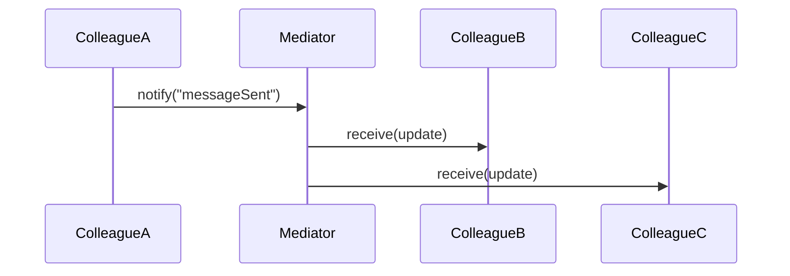

# The Mediator Pattern

---

## Table of Contents
<!-- TOC -->
* [The Mediator Pattern](#the-mediator-pattern)
  * [Table of Contents](#table-of-contents)
  * [Overview](#overview)
  * [Pattern Structure](#pattern-structure)
  * [Code Example](#code-example)
  * [Q&A](#qa)
  * [Related Topics](#related-topics)
  * [Ref.](#ref)
<!-- TOC -->

---

The Mediator Pattern is a behavioral design pattern that defines an object — the *mediator* — to encapsulate how a set of other objects (*colleagues*) interact. Instead of colleagues referring to and calling each other directly, forming a tangled many-to-many web of dependencies, each colleague only knows about the mediator, and all communication is routed through it.

---

## Overview

As a system grows, objects that need to coordinate with several peers tend to accumulate direct references to all of them, and every new interaction adds another edge to an increasingly dense dependency graph. Mediator breaks that web apart: colleagues no longer know about each other at all, only about the mediator's interface. When a colleague needs to notify or affect others, it tells the mediator, and the mediator decides which other colleagues need to react and how.

This centralizes control logic that would otherwise be scattered across many classes, making interaction rules easier to find, understand, and change in one place. The trade-off is that the mediator itself can absorb so much coordination logic that it turns into a God Object — a single class that knows and does too much. Keeping the mediator focused purely on *coordination* (not business logic that rightfully belongs to a colleague) is essential to avoiding that.

Classic examples include a GUI dialog box where widgets (buttons, checkboxes, text fields) don't reference each other directly but instead notify a dialog-level mediator ("the Save button was clicked"), and a chat room where users send messages through a central room object rather than holding direct references to every other participant.

<sub>[Back to top](#table-of-contents)</sub>

---

## Pattern Structure

- **Mediator**: declares the interface colleagues use to communicate with each other, typically a `notify()`-style method.
- **ConcreteMediator**: implements the coordination logic, knowing which colleagues exist and how they should react to each other's notifications.
- **Colleague**: holds a reference to the mediator and calls it instead of calling other colleagues directly.
- **ConcreteColleague**: a specific participant (e.g., a `User` in a chat room, or a `Button` in a dialog) that notifies the mediator of its own events and reacts when the mediator calls back into it.



**Caption:** `ColleagueA` never calls `ColleagueB` or `ColleagueC` directly — it only ever talks to the `Mediator`, which decides who else needs to react.

<sub>[Back to top](#table-of-contents)</sub>

---

## Code Example

```java
interface ChatMediator {
    void sendMessage(String message, User sender);
    void addUser(User user);
}

class ChatRoom implements ChatMediator {
    private final List<User> users = new ArrayList<>();

    public void addUser(User user) { users.add(user); }

    public void sendMessage(String message, User sender) {
        for (User user : users) {
            if (user != sender) {
                user.receive(message);
            }
        }
    }
}

class User {
    private final String name;
    private final ChatMediator mediator;
    User(String name, ChatMediator mediator) {
        this.name = name;
        this.mediator = mediator;
        mediator.addUser(this);
    }
    void send(String message)    { mediator.sendMessage(name + ": " + message, this); }
    void receive(String message) { System.out.println(name + " received: " + message); }
}
```

`User` instances never hold references to each other — `ChatRoom` (the mediator) owns the list of participants and decides how a sent message fans out.

<sub>[Back to top](#table-of-contents)</sub>

---

## Q&A

Common questions a software architect trainee would ask about this topic.

**Q: How does Mediator differ from Observer — both seem to be about objects reacting to each other?**
A: Observer is a one-to-many *broadcast*: a subject notifies a list of observers about its own state changes, with no central coordinator deciding how different observers relate to each other. Mediator is many-to-many *coordination*: multiple peer colleagues route all of their interactions through a single hub, which contains the logic for how one colleague's action should affect the others. A mediator can even be implemented internally using Observer (colleagues "observe" the mediator), but the intent is different — decoupling a whole group of peers from each other, not just publishing state changes. See [Observer Pattern](observer.md).

---

**Q: How does Mediator differ from Facade — both sit in front of a set of objects?**
A: Facade provides a simplified, one-directional interface for *external* client code to a complex subsystem — it doesn't add new coordination behavior, and the subsystem components are typically unaware the facade exists. Mediator sits *between peer objects that are aware of it*, coordinating bidirectional interaction among them — colleagues actively call the mediator, and the mediator actively calls back into colleagues. Facade simplifies access; Mediator centralizes communication. See [Facade Pattern](../structural/facade.md).

---

**Q: What's the main risk of overusing the Mediator pattern, and how do you mitigate it?**
A: The mediator can accumulate so much coordination logic that it becomes a God Object — a single class tightly coupled to every colleague's behavior, hard to test and hard to change safely. Mitigate this by keeping the mediator focused strictly on *routing and coordination rules*, pushing any real business logic back into the colleagues, and splitting one large mediator into several smaller, purpose-specific mediators when it starts covering unrelated concerns.

<sub>[Back to top](#table-of-contents)</sub>

---

## Related Topics

- [Observer Pattern](observer.md) — a one-to-many broadcast without a central coordinator, contrasted with Mediator's centralized many-to-many hub
- [Facade Pattern](../structural/facade.md) — simplifies a subsystem's interface for outside callers, rather than coordinating bidirectional communication among aware peers
- [Command Pattern](command.md) — a mediator can use command objects internally to represent the messages it routes between colleagues

<sub>[Back to top](#table-of-contents)</sub>

---

## Ref.

- [Mediator — Refactoring.Guru](https://refactoring.guru/design-patterns/mediator) — pattern explanation with structure and examples
- [Mediator pattern — Wikipedia](https://en.wikipedia.org/wiki/Mediator_pattern) — background and history

---

[Get Started](../../../get-started.md) | [Design Patterns](../../../get-started.md#design-patterns)

---
