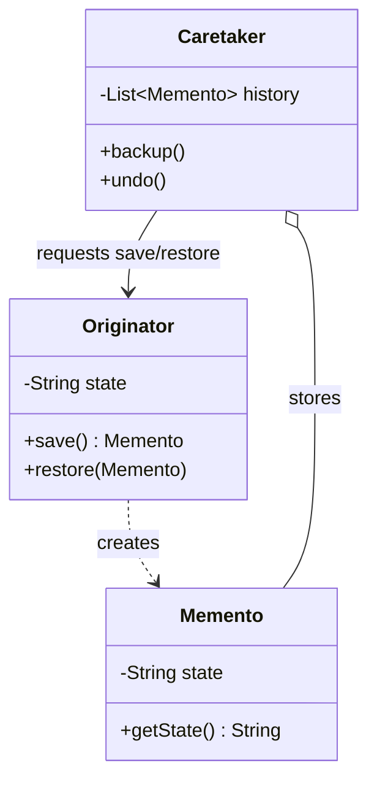

# The Memento Pattern

---

## Table of Contents
<!-- TOC -->
* [The Memento Pattern](#the-memento-pattern)
  * [Table of Contents](#table-of-contents)
  * [Overview](#overview)
  * [Pattern Structure](#pattern-structure)
  * [Example](#example)
  * [Q&A](#qa)
  * [Related Topics](#related-topics)
  * [Ref.](#ref)
<!-- TOC -->

---

The Memento Pattern is a behavioral design pattern that captures an object's internal state at a point in time, without violating its encapsulation, so that the object can later be restored to that state. It is the classic building block for undo/redo functionality, checkpoints, and rollback mechanisms.

<sub>[Back to top](#table-of-contents)</sub>

---

## Overview

The core tension Memento resolves is: how do you save and restore an object's private state from *outside* the object, without exposing its internals through public getters/setters (which would break encapsulation and let any client mutate that state freely)? Memento solves this by having the object itself (the `Originator`) create an opaque snapshot object (the `Memento`) that only the Originator can read the full contents of. An outside object (the `Caretaker`) stores the Memento and hands it back later, but never inspects or modifies it.

This gives you a clean separation of responsibilities: the Originator knows how to save/restore its own state, the Caretaker knows *when* to save/restore and manages history (e.g., an undo stack), but neither the Caretaker nor any other client can reach into the Memento's contents.

Memento is commonly implemented in Java using a private/nested Memento class, or by leveraging language features like serialization to produce an immutable snapshot. It pairs naturally with Command for full undo/redo systems: Command captures *what action* to undo, Memento captures *what state* to restore to.

<sub>[Back to top](#table-of-contents)</sub>

---

## Pattern Structure

- **Originator**: the object whose state needs saving/restoring; creates a `Memento` capturing its current state and can restore itself from one.
- **Memento**: an opaque snapshot of the Originator's state; exposes no public state to the Caretaker.
- **Caretaker**: requests and stores Mementos (e.g., in an undo stack) but never inspects or modifies their contents.



**Caption:** The Caretaker stores opaque Mementos it cannot read; only the Originator that created a Memento knows how to restore from it.

<sub>[Back to top](#table-of-contents)</sub>

---

## Example

```java
class Memento {
    private final String state;
    Memento(String state) { this.state = state; }
    private String getState() { return state; } // package-private, only Originator uses it
}

class Editor {
    private String text = "";
    void type(String words) { text += words; }
    Memento save() { return new Memento(text); }
    void restore(Memento m) { this.text = m.getState(); }
}

class History {
    private final Deque<Memento> undoStack = new ArrayDeque<>();
    void push(Memento m) { undoStack.push(m); }
    Memento pop() { return undoStack.pop(); }
}

// Client
Editor editor = new Editor();
History history = new History();
editor.type("Hello");
history.push(editor.save());
editor.type(", world!");
editor.restore(history.pop()); // back to "Hello"
```

`History` (the Caretaker) never touches `Memento`'s internal `state` field — it only stores and returns opaque snapshot objects.

<sub>[Back to top](#table-of-contents)</sub>

---

## Q&A

Common questions a software architect trainee would ask about this topic.

**Q: How does Memento differ from Command's undo capability, since both are used to implement undo/redo?**
A: They capture different things. Command encapsulates *an action* — a request with enough information to execute it, and often an `undo()` method that reverses that specific action's effect (e.g., "delete the last 5 characters typed"). Memento encapsulates *a state snapshot* — the actual data needed to restore an object to a previous state, regardless of what action produced it. Many undo systems combine both: a Command performs the action and internally uses a Memento to remember the state to roll back to if undone.

---

**Q: Doesn't storing a Memento for every change use a lot of memory?**
A: Yes — naive Memento-per-change history can be expensive for large objects or long histories. Common mitigations include storing only the diff/delta rather than the full state, capping history depth, or combining Memento with the Flyweight pattern to share unchanged portions of state across snapshots.

---

**Q: How do you keep a Memento's state truly hidden from the Caretaker in Java, given there's no built-in "friend class" access like in C++?**
A: A common approach is a private or package-private nested class for the Memento with package-private accessors, so only the Originator (in the same package) can read its contents while the Caretaker — typically in a different package or restricted to a narrow interface — only sees an opaque marker type. Alternatively, the Memento can expose no public accessors at all and rely on the Originator using reflection or being the sole class that constructs and unpacks it.

<sub>[Back to top](#table-of-contents)</sub>

---

## Related Topics

- [Command Pattern](command.md) — encapsulates the undoable action itself; often paired with Memento, which encapsulates the state to restore
- [Iterator Pattern](iterator.md) — like Memento, provides controlled access to an object's internals without exposing its full representation
- [Flyweight Pattern](../structural/flyweight.md) — can reduce the memory cost of storing many Mementos by sharing unchanged state

<sub>[Back to top](#table-of-contents)</sub>

---

## Ref.

- [Memento Pattern — Refactoring.Guru](https://refactoring.guru/design-patterns/memento) — structure, applicability, and pros/cons
- [Design Patterns: Elements of Reusable Object-Oriented Software (GoF)](https://en.wikipedia.org/wiki/Design_Patterns) — original catalog defining the Memento pattern

---

[Get Started](../../../get-started.md) | [Design Patterns](../../../get-started.md#design-patterns)

---
