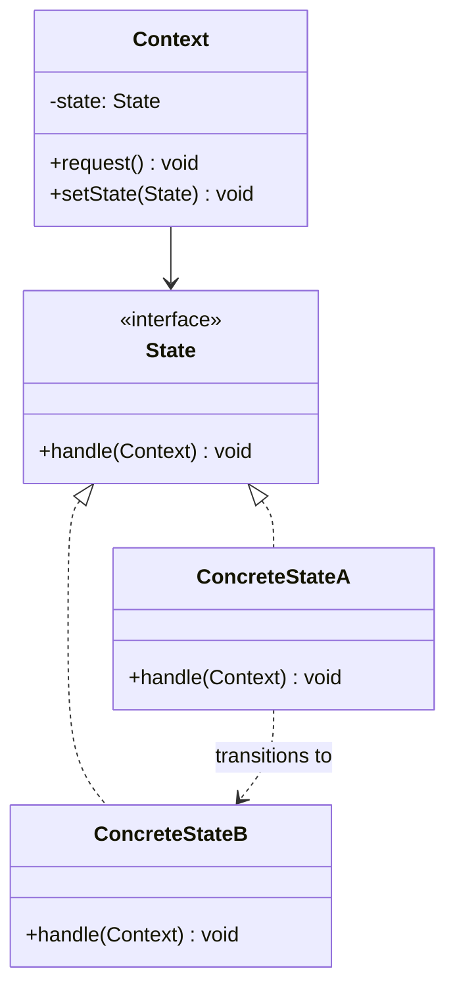

# The State Pattern

---

## Table of Contents
<!-- TOC -->
* [The State Pattern](#the-state-pattern)
  * [Table of Contents](#table-of-contents)
  * [Overview](#overview)
  * [Pattern Structure](#pattern-structure)
  * [Code Example](#code-example)
  * [Q&A](#qa)
  * [Related Topics](#related-topics)
  * [Ref.](#ref)
<!-- TOC -->

---

The State Pattern is a behavioral design pattern that lets an object *alter its behavior when its internal state changes* — from the outside, the object appears to change its class. It encapsulates state-specific behavior into separate state objects and delegates requests to whichever one currently represents the object's state, replacing large conditional blocks with polymorphism.

---

## Overview

Without this pattern, state-dependent behavior tends to accumulate as large `if`/`switch` statements scattered across every method that behaves differently depending on the object's current mode — a traffic light, an order's fulfillment status, a media player's playback mode. Every new state adds another branch to every one of those conditionals, and the logic for a single state ends up spread across the whole class instead of living in one place.

State pulls each state's behavior into its own class implementing a common `State` interface. The `Context` object holds a reference to its *current* state object and delegates requests to it. Critically, a `ConcreteState` is often the one that decides the *next* state and tells the context to transition to it — the object effectively drives its own state machine, one state handing control to the next.

This makes State a natural fit for anything that behaves like a finite state machine: order-processing workflows, TCP connection states, parser/lexer modes, game character states, and UI components with distinct interaction modes.

<sub>[Back to top](#table-of-contents)</sub>

---

## Pattern Structure

- **Context**: maintains a reference to the current `State` and delegates state-specific requests to it; exposes a way to change the current state (often called by the state itself).
- **State**: declares an interface for behavior associated with a particular state of the `Context`.
- **ConcreteState**: implements behavior specific to one state, and frequently triggers the `Context`'s transition to the next `ConcreteState` once that behavior completes.



**Caption:** `Context.request()` delegates to whichever `State` it currently holds; `ConcreteStateA` can itself call `Context.setState(new ConcreteStateB())` to advance the state machine.

<sub>[Back to top](#table-of-contents)</sub>

---

## Code Example

```java
interface OrderState {
    void next(Order order);
}

class NewState implements OrderState {
    public void next(Order order) {
        System.out.println("Order paid");
        order.setState(new PaidState());
    }
}

class PaidState implements OrderState {
    public void next(Order order) {
        System.out.println("Order shipped");
        order.setState(new ShippedState());
    }
}

class ShippedState implements OrderState {
    public void next(Order order) {
        System.out.println("Order already shipped — nothing to do");
    }
}

class Order {
    private OrderState state = new NewState();
    void setState(OrderState state) { this.state = state; }
    void advance() { state.next(this); }
}
```

Calling `order.advance()` repeatedly walks `Order` through New → Paid → Shipped; `Order` itself never contains an `if`/`switch` on its status — each `ConcreteState` decides what happens next.

<sub>[Back to top](#table-of-contents)</sub>

---

## Q&A

Common questions a software architect trainee would ask about this topic.

**Q: How does State differ from Strategy — both delegate behavior to an interchangeable object?**
A: Structurally the two patterns look almost identical, but their intent differs. With Strategy, the *client* explicitly chooses and sets an algorithm, and the strategy object typically doesn't change itself or trigger a switch to another strategy. With State, the *state object itself* commonly decides when and how to transition the context to a different state, so the object drives its own behavioral changes over time in response to events, often without the client being aware a transition even happened. See [Strategy Pattern](strategy.md).

---

**Q: How does the State pattern relate to a finite state machine (FSM)?**
A: It's an object-oriented implementation technique for one: each `ConcreteState` corresponds to a state in the FSM, and `ConcreteState.handle()`/`next()` methods encode the transition table that would otherwise be drawn as an FSM diagram or written as a lookup table. It trades a compact table representation for one class per state, which scales better when each state's behavior is substantial but is overkill for a handful of trivial states.

---

**Q: Who should be responsible for deciding the next state — the `Context` or the `ConcreteState`?**
A: Both approaches are used in practice. Letting each `ConcreteState` decide and call `context.setState(...)` (as in the example above) keeps all the logic for a given state — including what comes after it — in one class, which is usually clearer. Centralizing transition decisions in the `Context` instead keeps the full transition table in one place, which can be easier to audit for complex state machines with many cross-cutting transition rules, at the cost of the context needing to know about every state.

<sub>[Back to top](#table-of-contents)</sub>

---

## Related Topics

- [Strategy Pattern](strategy.md) — a client-selected, typically static algorithm swap, contrasted with State's self-driven behavioral transitions
- [Template Method Pattern](template-method.md) — also varies behavior around a fixed skeleton, but through inheritance and overridden steps rather than delegating to a swappable state object
- [Command Pattern](command.md) — commands are a common way to represent the triggers/events that cause a `Context` to transition between states

<sub>[Back to top](#table-of-contents)</sub>

---

## Ref.

- [State — Refactoring.Guru](https://refactoring.guru/design-patterns/state) — pattern explanation with structure and examples
- [State pattern — Wikipedia](https://en.wikipedia.org/wiki/State_pattern) — background and history

---

[Get Started](../../../get-started.md) | [Design Patterns](../../../get-started.md#design-patterns)

---
