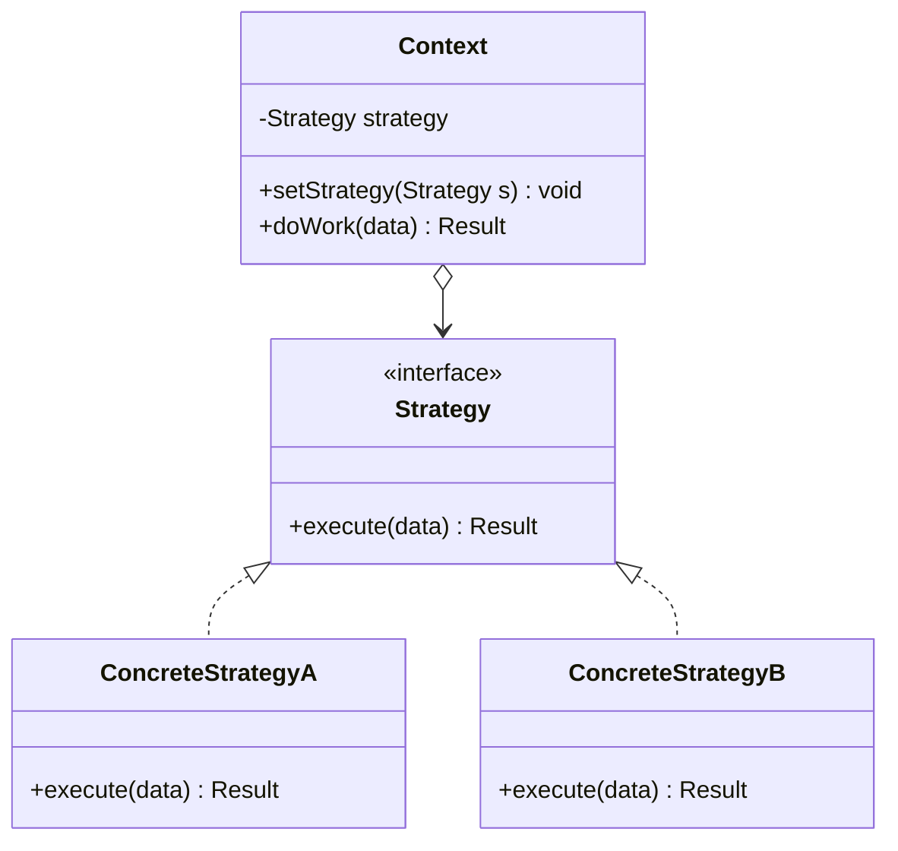

# Strategy Pattern

---

## Table of Contents
<!-- TOC -->
* [Strategy Pattern](#strategy-pattern)
  * [Overview](#overview)
  * [Pattern Structure](#pattern-structure)
  * [Strategy vs. State vs. Template Method](#strategy-vs-state-vs-template-method)
  * [Q&A](#qa)
  * [Related Topics](#related-topics)
  * [Ref.](#ref)
<!-- TOC -->

---

The Strategy is one of the eleven GoF behavioral design patterns. Its intent is to define a family of interchangeable algorithms, encapsulate each one behind a common interface, and let the client select and swap which algorithm a context object uses at runtime. It is the standard alternative to a large conditional (`if`/`switch`) that branches on a type or mode to decide which algorithm to run.

---

## Overview

A class that needs to vary its behavior — a sorting routine, a pricing calculation, a payment method, a compression algorithm — often starts with a conditional that inspects some flag and branches into different logic blocks. As more variants are added, that conditional grows, mixes unrelated algorithms in one method, and violates the Open/Closed Principle: adding a new variant means modifying existing, already-tested code.

Strategy extracts each branch into its own class implementing a shared `Strategy` interface. The `Context` class holds a reference to a `Strategy` object (via composition, typically injected through the constructor or a setter) and delegates the algorithmic work to it, without knowing or caring which concrete strategy it holds. Adding a new algorithm means adding a new class that implements the interface — the `Context` class itself never changes.

The strategy is normally selected once, by the client, at construction or configuration time — `Context` doesn't usually switch strategies on its own mid-lifecycle in response to internal events. Common uses include payment processing (`CreditCardStrategy`, `PayPalStrategy`), sorting (`Comparator` implementations in the Java standard library are a textbook Strategy), and validation or discount rules that vary by customer tier.

<sub>[Back to top](#table-of-contents)</sub>

---

## Pattern Structure

`Context` holds a reference to a `Strategy` and delegates the algorithm to whichever concrete implementation was supplied, without branching on type itself.



**Caption:** `Context` delegates to whichever `Strategy` implementation it currently holds; swapping strategies never requires changing `Context`'s code.

```java
public interface DiscountStrategy {
    double apply(double price);
}

public class NoDiscount implements DiscountStrategy {
    public double apply(double price) { return price; }
}

public class PercentageDiscount implements DiscountStrategy {
    private final double percent;
    public PercentageDiscount(double percent) { this.percent = percent; }
    public double apply(double price) { return price * (1 - percent / 100); }
}

public class ShoppingCart {
    private DiscountStrategy strategy;
    public ShoppingCart(DiscountStrategy strategy) { this.strategy = strategy; }
    public void setStrategy(DiscountStrategy strategy) { this.strategy = strategy; }
    public double checkout(double subtotal) { return strategy.apply(subtotal); }
}
```

The client selects the strategy; `ShoppingCart` never branches on discount type:

```java
ShoppingCart cart = new ShoppingCart(new PercentageDiscount(10));
double total = cart.checkout(100.0); // 90.0

cart.setStrategy(new NoDiscount());
double fullPrice = cart.checkout(100.0); // 100.0
```

<sub>[Back to top](#table-of-contents)</sub>

---

## Strategy vs. State vs. Template Method

Strategy is regularly confused with two other patterns that also encapsulate variable behavior.

- **Strategy vs. [State](state.md).** Structurally the two patterns are nearly identical — both delegate to an interchangeable object held by a context. The difference is who changes the reference and why. In Strategy, the *client* chooses a strategy, usually once, based on external configuration or a user choice, and the strategy itself has no awareness of the others or of triggering a switch. In State, the *state object itself* typically triggers transitions to other states in response to the context's internal events, and the context's observable behavior legitimately changes over its own lifecycle as a result. Strategy answers "which algorithm should this use?"; State answers "what should this object do differently now that its internal condition changed?"
- **Strategy vs. [Template Method](template-method.md).** Both let a fixed step of an algorithm vary while keeping the rest constant, but they use opposite mechanisms. Template Method uses inheritance: a base class defines the algorithm's skeleton and subclasses override specific hook methods to customize a step, fixed at compile time by which subclass you instantiate. Strategy uses composition: the varying part is a fully separate object, injected at runtime, and can be swapped after the `Context` object already exists. Composition-over-inheritance advocates generally prefer Strategy when the same flexibility is achievable either way.
- **Rule of thumb.** If behavior varies because the client picked a mode up front, that's Strategy. If behavior varies because the object's own internal condition changed, that's State. If behavior varies by subclassing and overriding one step of a fixed algorithm, that's Template Method.

<sub>[Back to top](#table-of-contents)</sub>

---

## Q&A

**Q: How does Strategy help satisfy the Open/Closed Principle?**
A: Adding a new algorithm means writing a new class that implements the `Strategy` interface — no existing class, including `Context`, needs to be modified. This is exactly the Open/Closed Principle: the system is open to new behavior via extension but closed to modification of already-tested code. The alternative — a growing `if`/`switch` inside `Context` — requires editing that same method every time a new variant is added.

**Q: Isn't Strategy just a fancy name for passing a function or lambda?**
A: In languages with first-class functions (including modern Java via functional interfaces like `Comparator<T>` or `java.util.function.Function`), a lambda can implement the `Strategy` interface directly and eliminate the boilerplate of a named class per algorithm. The pattern's essential structure — `Context` delegating to an interchangeable, independently-defined algorithm — is exactly what a lambda passed into a method achieves. Named classes are still preferable when a strategy carries meaningful state or configuration of its own.

**Q: When does Strategy add unnecessary complexity?**
A: When there are only two variants that are unlikely to grow, and the difference between them is a single line — a plain conditional is simpler to read than an interface plus two classes. Strategy earns its complexity when the number of algorithms is expected to grow, when algorithms carry their own configuration/state, or when the algorithm choice needs to be injected or swapped independently of the class using it (e.g., for testing).

<sub>[Back to top](#table-of-contents)</sub>

---

## Related Topics

- [State Pattern](state.md) — Structurally similar delegation to a swappable object, but State transitions are driven internally by the object's own lifecycle, while Strategy is selected externally by the client
- [Template Method Pattern](template-method.md) — Solves the same "vary one step of an algorithm" problem using inheritance instead of Strategy's composition
- [Command Pattern](command.md) — Both encapsulate behavior as an object, but Command represents a request to be executed (often later or queued), while Strategy represents an interchangeable algorithm chosen up front
- [Bridge Pattern](../structural/bridge.md) — Both favor composition over inheritance for flexibility; Bridge decouples two whole class hierarchies, Strategy swaps a single algorithm
- [SOLID Principles](../solid.md) — Strategy is a direct, canonical application of the Open/Closed Principle

<sub>[Back to top](#table-of-contents)</sub>

---

## Ref.

- [Strategy — Refactoring.Guru](https://refactoring.guru/design-patterns/strategy) — Structure, applicability, and pros/cons
- [Strategy in Java — Refactoring.Guru](https://refactoring.guru/design-patterns/strategy/java/example) — Annotated Java implementation

---

[Get Started](../../../get-started.md) | [Design Patterns](../../../get-started.md#design-patterns)

---
