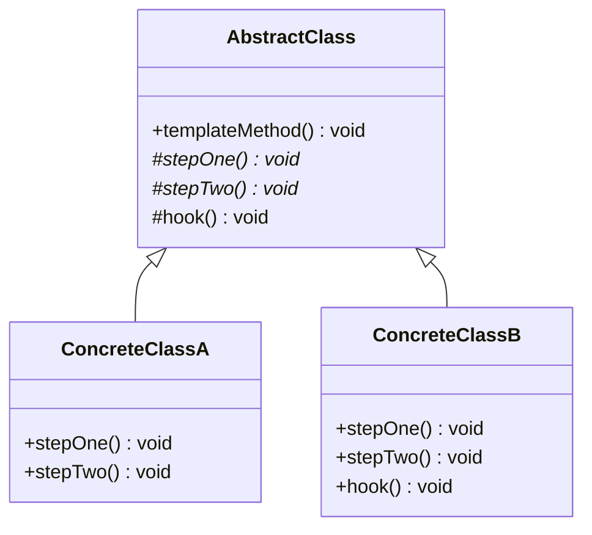

# The Template Method Pattern

---

## Table of Contents
<!-- TOC -->
* [The Template Method Pattern](#the-template-method-pattern)
  * [Table of Contents](#table-of-contents)
  * [Overview](#overview)
  * [Pattern Structure](#pattern-structure)
  * [Code Example](#code-example)
  * [Q&A](#qa)
  * [Related Topics](#related-topics)
  * [Ref.](#ref)
<!-- TOC -->

---

The Template Method Pattern is a behavioral design pattern that defines the *skeleton of an algorithm* in a base class method, deferring some of its individual steps to subclasses. It lets subclasses redefine specific steps of an algorithm without changing the algorithm's overall structure, relying on inheritance rather than composition to vary behavior.

---

## Overview

Template Method is one of the oldest and most common ways to reuse algorithmic structure while allowing controlled variation. A base (abstract) class implements a method — the *template method* — that orchestrates a sequence of steps. Some of those steps are concrete and shared by all subclasses; others are abstract *primitive operations* that each subclass must implement; still others are optional *hooks* with a default (often empty) implementation that subclasses may override to plug into specific points of the algorithm.

Because the template method itself is typically declared `final`, the overall control flow is fixed — subclasses can only change *what* happens at the designated extension points, not the *order* in which things happen. This is a direct application of the Hollywood Principle: "don't call us, we'll call you." The base class calls into the subclass, not the other way around.

Typical use cases include data-processing pipelines (read → validate → transform → save, where each step can vary), UI frameworks (a fixed render lifecycle with overridable hooks), and test frameworks (`setUp()` → `test()` → `tearDown()`).

<sub>[Back to top](#table-of-contents)</sub>

---

## Pattern Structure

- **AbstractClass**: declares the template method, which defines the skeleton of the algorithm by calling a fixed sequence of primitive operations and hooks. The template method is usually `final` so subclasses cannot alter the sequence.
- **Primitive Operations**: abstract methods on `AbstractClass` that concrete subclasses *must* implement.
- **Hook**: a method on `AbstractClass` with a default (often no-op) implementation that subclasses *may* override to extend behavior at an optional point.
- **ConcreteClass**: implements the primitive operations (and optionally overrides hooks), supplying the pattern-specific behavior invoked by the inherited template method.



**Caption:** `templateMethod()` is defined once in `AbstractClass` and calls `stepOne()`, `stepTwo()`, and `hook()` in a fixed order; concrete subclasses only supply the step implementations, and may optionally override the hook.

<sub>[Back to top](#table-of-contents)</sub>

---

## Code Example

```java
abstract class DataProcessor {

    // The template method — fixed algorithm skeleton
    public final void process() {
        readData();
        transformData();
        if (shouldSave()) {   // hook — optional extension point
            saveData();
        }
    }

    protected abstract void readData();
    protected abstract void transformData();
    protected abstract void saveData();

    // Hook with a sensible default; subclasses may override it
    protected boolean shouldSave() {
        return true;
    }
}

class CsvDataProcessor extends DataProcessor {
    protected void readData()      { System.out.println("Reading CSV rows"); }
    protected void transformData() { System.out.println("Normalizing columns"); }
    protected void saveData()      { System.out.println("Writing to database"); }
}
```

`CsvDataProcessor` never calls `readData()`, `transformData()`, or `saveData()` itself — `DataProcessor.process()` does, in a fixed order it fully controls.

<sub>[Back to top](#table-of-contents)</sub>

---

## Q&A

Common questions a software architect trainee would ask about this topic.

**Q: How does Template Method differ from Strategy?**
A: Template Method uses *inheritance*: a base class fixes the algorithm's structure and subclasses override individual steps, so the variation is baked in at compile time via a class hierarchy. Strategy uses *composition*: the client holds a reference to an interchangeable strategy object and can swap the entire algorithm at runtime, without any inheritance relationship between the strategies and the context. See [Strategy Pattern](strategy.md).

---

**Q: Why is the template method usually declared `final`?**
A: To prevent subclasses from overriding the algorithm's control flow itself. The whole point of the pattern is that the *sequence* of steps is fixed and shared; only the individual step implementations vary. Making it `final` enforces the Hollywood Principle and keeps the algorithm's shape consistent across every subclass.

---

**Q: What's the difference between a hook and a mandatory abstract step?**
A: An abstract primitive operation has no implementation in the base class, so every subclass *must* supply one. A hook has a default implementation (often empty or returning a neutral value), so subclasses *may* override it only if they need to customize that particular extension point — most subclasses can safely leave it alone.

<sub>[Back to top](#table-of-contents)</sub>

---

## Related Topics

- [Strategy Pattern](strategy.md) — the composition-based counterpart: swaps a whole algorithm at runtime instead of overriding fixed steps via inheritance
- [Factory Method](../creational/factory/factory-method.md) — itself a specialization of Template Method, applied specifically to object creation
- [SOLID](../solid.md) — Template Method relies on the Liskov Substitution Principle (subclasses must honor the base algorithm's contract) and supports the Open/Closed Principle

<sub>[Back to top](#table-of-contents)</sub>

---

## Ref.

- [Template Method — Refactoring.Guru](https://refactoring.guru/design-patterns/template-method) — pattern explanation with structure and examples
- [Template method pattern — Wikipedia](https://en.wikipedia.org/wiki/Template_method_pattern) — background and history

---

[Get Started](../../../get-started.md) | [Design Patterns](../../../get-started.md#design-patterns)

---
