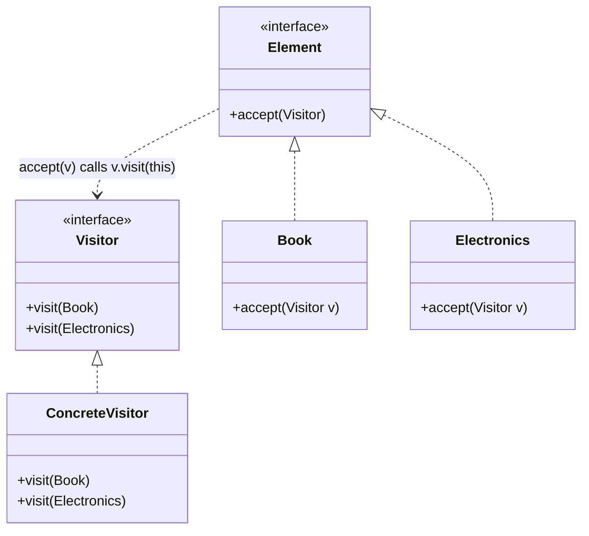

# The Visitor Pattern

---

## Table of Contents
<!-- TOC -->
* [The Visitor Pattern](#the-visitor-pattern)
  * [Table of Contents](#table-of-contents)
  * [Overview](#overview)
  * [Pattern Structure](#pattern-structure)
  * [Example](#example)
  * [Q&A](#qa)
  * [Related Topics](#related-topics)
  * [Ref.](#ref)
<!-- TOC -->

---

The Visitor Pattern is a behavioral design pattern that lets you define a new operation on a family of related classes without changing the classes themselves. It works by separating an algorithm from the object structure it operates on: the algorithm lives in a `Visitor` object, and each element in the structure simply "accepts" a visitor and hands itself back for processing. This is especially useful when an object structure is stable but the operations performed on it change or grow frequently.

<sub>[Back to top](#table-of-contents)</sub>

---

## Overview

Visitor solves a common tension in object-oriented design: adding a new operation to a class hierarchy normally means touching every class in that hierarchy, which violates the Open/Closed Principle. Visitor inverts the relationship — instead of asking each element "how do you perform operation X," the element merely accepts a visitor object and delegates the work to it through **double dispatch**.

Double dispatch means the operation that ultimately executes depends on two types: the concrete type of the element and the concrete type of the visitor. The element's `accept(visitor)` method calls back into `visitor.visit(this)`, and because `this` is statically typed as the concrete element inside its own class, the compiler resolves the correct overload of `visit`. This is how Visitor achieves type-specific behavior in languages (like Java) that only support single dispatch natively.

Visitor is most valuable when the object structure (e.g., an AST, a document object model, a file system tree) is relatively fixed, but new operations (pretty-printing, validation, export, type-checking) are added often. The trade-off is the reverse: adding a new *element* type requires updating every existing visitor.

<sub>[Back to top](#table-of-contents)</sub>

---

## Pattern Structure

- **Visitor**: declares a `visit` method for each concrete element type in the structure.
- **ConcreteVisitor**: implements the operation for each element type (e.g., `ExportVisitor`, `PricingVisitor`).
- **Element**: declares an `accept(Visitor)` method.
- **ConcreteElement**: implements `accept` by calling back `visitor.visit(this)`, triggering double dispatch.
- **ObjectStructure**: a collection of elements that can be iterated and visited (e.g., a shopping cart, a syntax tree).



**Caption:** Each `Element` accepts a `Visitor` and calls back the overload matching its own concrete type — double dispatch in action.

<sub>[Back to top](#table-of-contents)</sub>

---

## Example

```java
interface Visitor {
    void visit(Book book);
    void visit(Electronics item);
}

interface Item {
    void accept(Visitor visitor);
}

class Book implements Item {
    double price;
    public void accept(Visitor visitor) { visitor.visit(this); }
}

class Electronics implements Item {
    double price;
    double warrantyFee;
    public void accept(Visitor visitor) { visitor.visit(this); }
}

class PricingVisitor implements Visitor {
    public void visit(Book book) {
        System.out.println("Book total: " + book.price);
    }
    public void visit(Electronics item) {
        System.out.println("Electronics total: " + (item.price + item.warrantyFee));
    }
}
```

Adding a new operation — say, `TaxReportVisitor` — requires no changes to `Book` or `Electronics`; only a new `Visitor` implementation is needed.

<sub>[Back to top](#table-of-contents)</sub>

---

## Q&A

Common questions a software architect trainee would ask about this topic.

**Q: How is Visitor different from Strategy, since both encapsulate an algorithm in a separate object?**
A: Strategy encapsulates *one* interchangeable algorithm for *one* context class, selected at runtime (e.g., different sorting strategies for one sorter). Visitor encapsulates a *family* of related operations across a *whole hierarchy* of element types, using double dispatch so the correct behavior is picked per concrete element type automatically. Strategy answers "which algorithm to run here," Visitor answers "what operation to perform on each of these different kinds of objects."

---

**Q: Why does Visitor need double dispatch instead of a simple `if (element instanceof X)` check inside the visitor?**
A: Java only dispatches virtual method calls based on the runtime type of the receiver (single dispatch), not on argument types. An `instanceof` chain works but is brittle, unsafe on new subtypes, and violates encapsulation by exposing concrete types outside the hierarchy. Double dispatch delegates the first dispatch to `element.accept(visitor)` (resolves the element's real type) and the second to `visitor.visit(this)` (resolves the correct overload for that type), achieving compile-time-checked double dispatch without reflection or casting.

---

**Q: What is the main cost of using Visitor, and when should I avoid it?**
A: Visitor makes adding new element types expensive — every existing `Visitor` implementation must be updated with a new `visit` overload. It is a poor fit when the object structure changes frequently but the set of operations is stable; in that case, keeping the operations as methods on the elements (or using Strategy per operation) is simpler.

<sub>[Back to top](#table-of-contents)</sub>

---

## Related Topics

- [Strategy Pattern](strategy.md) — also encapsulates behavior in a separate object, but for one algorithm per context rather than an operation family across a type hierarchy
- [SOLID](../solid.md) — Visitor is a direct application of the Open/Closed Principle for adding operations without modifying element classes
- [Iterator Pattern](iterator.md) — often combined with Visitor to traverse an object structure while applying an operation to each element

<sub>[Back to top](#table-of-contents)</sub>

---

## Ref.

- [Visitor Pattern — Refactoring.Guru](https://refactoring.guru/design-patterns/visitor) — structure, applicability, and pros/cons
- [Design Patterns: Elements of Reusable Object-Oriented Software (GoF)](https://en.wikipedia.org/wiki/Design_Patterns) — original catalog defining the Visitor pattern

---

[Get Started](../../../get-started.md) | [Design Patterns](../../../get-started.md#design-patterns)

---
