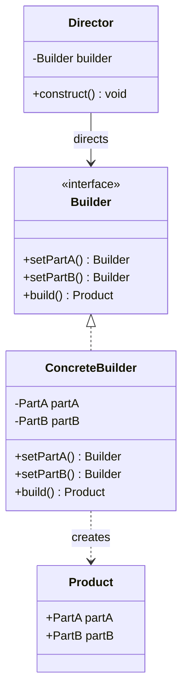
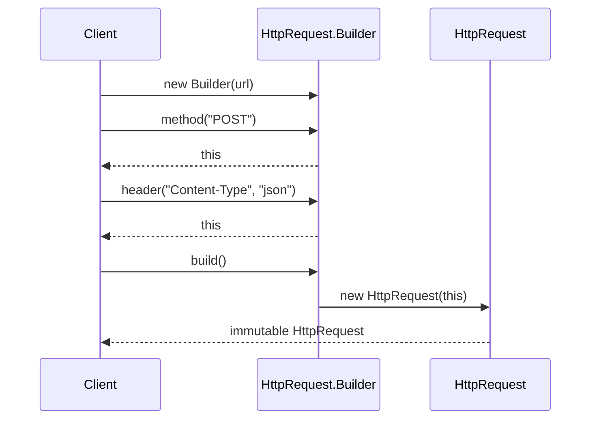

# Builder Pattern

---

## Table of Contents
<!-- TOC -->
* [Builder Pattern](#builder-pattern)
  * [Overview](#overview)
  * [Pattern Structure](#pattern-structure)
  * [Fluent Builder in Java](#fluent-builder-in-java)
  * [Builder vs. Director](#builder-vs-director)
  * [Q&A](#qa)
  * [Related Topics](#related-topics)
  * [Ref.](#ref)
<!-- TOC -->

---

The Builder is one of the five GoF creational design patterns. Its intent is to separate the construction of a complex object from its representation, so that the same construction process can produce different representations. It is the pattern of choice whenever an object requires many optional parameters, a fixed assembly order, or immutability enforced only after every required field has been set.

---

## Overview

Builder addresses a problem that Constructor telescoping makes painful: a class with many optional fields ends up with an overloaded constructor for every meaningful combination of parameters, or a single constructor with a long, error-prone, position-dependent argument list. Builder replaces this with a dedicated object whose entire responsibility is to accumulate configuration step-by-step and produce a finished, validated instance on demand via a `build()` call.

Because construction happens incrementally, Builder is a natural fit for immutable objects — the target class can keep a private constructor and `final` fields, populated only from the builder's accumulated state, so a client can never observe a partially-initialized instance.

The GoF's original formulation separates three roles: the `Builder` interface declaring construction steps, a `ConcreteBuilder` implementing them, and an optional `Director` that sequences the steps to produce a specific representation. In modern Java the Director is frequently dropped in favor of a fluent, self-directed builder — often implemented as a static inner class on the target type itself — but the underlying intent (step-by-step assembly decoupled from the final object's constructor) is unchanged.

<sub>[Back to top](#table-of-contents)</sub>

---

## Pattern Structure

The classic GoF structure separates the abstract `Builder`, its concrete implementation, the `Director` that drives the steps, and the `Product` being assembled.



**Caption:** The Director sequences calls on a Builder interface; a ConcreteBuilder accumulates parts and assembles the final Product on `build()`.

<sub>[Back to top](#table-of-contents)</sub>

---

## Fluent Builder in Java

The idiomatic modern Java form drops the separate `Director` and `Builder` interface, embedding a fluent, self-directed static inner builder class directly on the target type.

```java
public final class HttpRequest {
    private final String url;
    private final String method;
    private final Map<String, String> headers;

    private HttpRequest(Builder b) {
        this.url = b.url;
        this.method = b.method;
        this.headers = Map.copyOf(b.headers);
    }

    public static class Builder {
        private final String url;
        private String method = "GET";
        private final Map<String, String> headers = new HashMap<>();

        public Builder(String url) { this.url = url; }
        public Builder method(String method) { this.method = method; return this; }
        public Builder header(String key, String value) { headers.put(key, value); return this; }
        public HttpRequest build() { return new HttpRequest(this); }
    }
}

// Usage:
HttpRequest req = new HttpRequest.Builder("https://api.example.com")
    .method("POST")
    .header("Content-Type", "application/json")
    .build();
```

Each fluent method returns `this`, so calls chain naturally. The outer class's constructor is private, and every field is `final` — the only way to obtain an `HttpRequest` is through a fully-configured `Builder`, which guarantees the produced object is always in a valid, immutable state.



**Caption:** Each fluent call returns the builder itself; only `build()` produces the final immutable object.

<sub>[Back to top](#table-of-contents)</sub>

---

## Builder vs. Director

Whether to keep a separate `Director` depends on how many distinct representations of the product must be produced from the same construction process.

- ### With a Director:
  Useful when the same sequence of building steps must be reused to produce several different, well-known configurations of a product — for example, a `MealDirector` that calls a `MealBuilder` in a fixed order to produce either a "vegetarian combo" or a "standard combo". The Director owns the *order* of steps; the Builder owns *how* each step is implemented.

- ### Without a Director (fluent self-direction):
  When the client itself decides which optional steps to call and in what order, a Director adds no value — this is the common case in application code (DTOs, request objects, configuration objects), where the fluent builder pattern shown above is idiomatic.

<sub>[Back to top](#table-of-contents)</sub>

---

## Q&A

Common questions a software architect trainee would ask about this topic.

**Q: How is Builder different from Factory Method or Abstract Factory?**
A: A Factory returns a fully-constructed object in a single call, and its main concern is *which concrete class* to instantiate. A Builder constructs an object incrementally over multiple calls, and its main concern is *how to assemble* a single complex object step-by-step — particularly one with many optional parts or a specific required assembly order. Use Factory when object creation is a one-shot decision between variants; use Builder when construction itself is a multi-step process.

---

**Q: How is Builder different from Prototype?**
A: Builder assembles a new object from parts, typically from scratch, following a step-by-step process. Prototype instead copies an existing, already-fully-formed instance and optionally tweaks the copy. Builder is preferred when you must control the construction sequence or validate as you go; Prototype is preferred when creating a new instance is cheaper by cloning a pre-configured template than by re-running full construction logic. See [Prototype](prototype.md).

---

**Q: Why does the fluent builder in Java return `this` from every setter?**
A: Returning `this` (a reference to the builder instance) allows each call to be chained onto the next, producing the fluent `.method(...).header(...).build()` style. Without it, each configuration step would require a separate statement referencing the builder variable, which is more verbose and loses the readability benefit that makes Builder attractive for objects with many optional fields.

<sub>[Back to top](#table-of-contents)</sub>

---

## Related Topics

- [Prototype Pattern](prototype.md) — Both avoid overloaded constructors; Builder assembles from parts, Prototype clones an existing instance
- [Factory Patterns](factory.md) — Factory returns a ready object in one call; Builder constructs a complex object step-by-step
- [Singleton Pattern](singleton.md) — Both are GoF creational patterns; a Builder can itself be lazily held behind a Singleton-managed factory in configuration-heavy systems

<sub>[Back to top](#table-of-contents)</sub>

---

## Ref.

- [Builder — Refactoring.Guru](https://refactoring.guru/design-patterns/builder) — Canonical reference with structure, pseudocode, and applicability guidance
- [Builder in Java — Refactoring.Guru](https://refactoring.guru/design-patterns/builder/java/example) — Java-specific implementation with annotated examples

---

[Get Started](../../../get-started.md) | [Design Patterns](../../../get-started.md#design-patterns)

---
