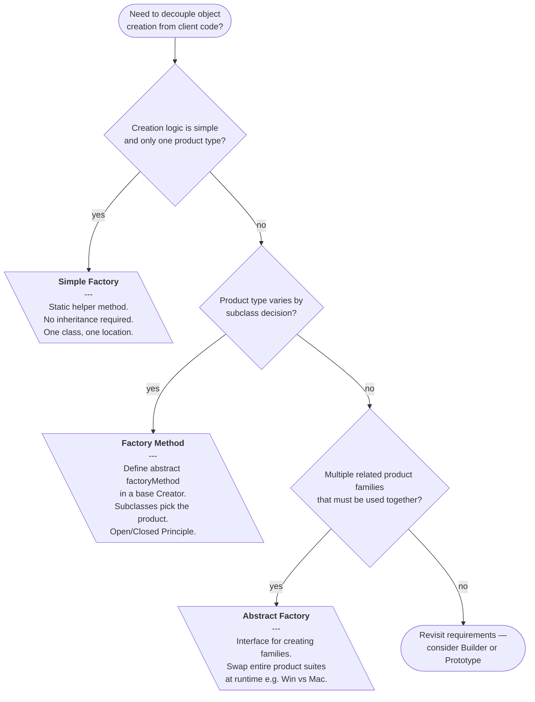

# Factory Patterns

---

## Table of Contents
<!-- TOC -->
* [Factory Patterns](#factory-patterns)
  * [Overview](#overview)
  * [Pattern Variants](#pattern-variants)
  * [Pattern Comparison](#pattern-comparison)
  * [Pattern Selection Flow](#pattern-selection-flow)
  * [Factory vs Dependency Injection](#factory-vs-dependency-injection)
  * [Q&A](#qa)
  * [Related Topics](#related-topics)
  * [Ref.](#ref)
<!-- TOC -->

---

The Factory pattern family is a group of creational design patterns that decouple the code that *uses* objects from the code that *creates* them. Originating in the Gang of Four (GoF) book *Design Patterns: Elements of Reusable Object-Oriented Software* (1994), these patterns sit at the foundation of object-oriented design and underpin plugin systems, cross-platform toolkits, IoC containers, and framework extension hooks throughout the Java ecosystem.

---

## Overview

Without factories, client code calls `new ConcreteClass()` directly — tightly coupling itself to a specific implementation and making it hard to swap behaviour, satisfy OCP/DIP, or inject different logic at runtime. The factory family introduces an abstraction over object creation so that the client depends only on interfaces, never on concrete types.

The family spans three closely related variants. **Simple Factory** is a programming idiom (not a formal GoF pattern) that centralises creation in a single static method. **Factory Method** (GoF) achieves extensibility through inheritance — subclasses decide which product to create. **Abstract Factory** (GoF) extends this to entire families of related products, guaranteeing cross-product compatibility.

Real-world Java examples include `Calendar.getInstance()`, `NumberFormat.getCurrencyInstance()`, `DocumentBuilderFactory.newInstance()`, and Spring's `ApplicationContext` — all of which apply one variant or another of this pattern family.

<sub>[Back to top](#table-of-contents)</sub>

---

## Pattern Variants

The three variants share the same intent — decouple creation from use — but differ in scope and mechanism.

- ### Simple Factory:
  A static or instance helper class with a single creation method that uses a conditional (`switch`/`if-else`) to instantiate the correct type. Not in the GoF catalog — it is a common idiom and often the first step before adopting the formal patterns.

  > See also: [Simple Factory](factory/simple-factory.md)

- ### Factory Method (GoF):
  A formal pattern that declares an abstract factory method in a base `Creator` class. Subclasses override it to return a specific `ConcreteProduct`. Business logic in `Creator` calls the factory method polymorphically without knowing the concrete type. Satisfies OCP and DIP.

  > See also: [Factory Method](factory/factory-method.md)

- ### Abstract Factory (GoF):
  A formal pattern that provides an interface for creating *families* of related objects. Concrete factories implement the interface to produce a consistent product family. The client is programmed entirely against factory and product interfaces, guaranteeing that no incompatible products are mixed.

  > See also: [Abstract Factory](factory/abstract-factory.md)

<sub>[Back to top](#table-of-contents)</sub>

---

## Pattern Comparison

| Dimension | Simple Factory | Factory Method | Abstract Factory |
|-----------|---------------|----------------|-----------------|
| GoF pattern? | No (idiom) | Yes | Yes |
| Scope | One product type | One product hierarchy | Multiple product families |
| Mechanism | Static method + conditional | Inheritance — subclass overrides factory method | Composition — client uses a factory interface |
| OCP compliance | No — adding types modifies the factory | Yes — add a new subclass | Yes — add a new concrete factory |
| DIP compliance | Partial — client depends on factory, not products | Yes | Yes |
| Typical use | Simple scripts, config-driven creation | Framework extension points, plugin hooks | Cross-platform toolkits, UI theme systems |
| Complexity | Low | Medium | High |
| When to evolve | Evolve to Factory Method when new types are added frequently | Evolve to Abstract Factory when multiple related products appear | — |

<sub>[Back to top](#table-of-contents)</sub>

---

## Pattern Selection Flow

The diagram below guides the choice between the three variants based on creation requirements.



**Caption:** A decision-flow guide for selecting between the three factory variants based on creation complexity and product family structure.

<sub>[Back to top](#table-of-contents)</sub>

---

## Factory vs Dependency Injection

Factories and DI/IoC containers solve related but distinct problems and are frequently used together.

- ### Dependency Injection (DI):
  A DI container wires dependencies at application startup. The client receives pre-built objects and has no awareness of the container or the creation process. DI is ideal for wiring static, configuration-driven dependencies.

- ### Factory Pattern:
  A factory is called at *runtime* by the client to produce objects on demand. The client is aware it is requesting a new object. Factories are necessary when the type of object to create is only known at runtime — for example, based on user input, a message type, or a database record.

- ### Complementary Use:
  The best-practice combination is to **inject a factory interface via DI**, then call it at runtime. The container manages the factory lifecycle; the factory manages per-request object creation. This keeps the client decoupled from both concrete products and concrete factories.

  ```java
  // Factory interface injected by DI — called at runtime
  public class OrderProcessor {
      private final NotificationFactory notificationFactory;

      public OrderProcessor(NotificationFactory factory) {
          this.notificationFactory = factory;
      }

      public void process(Order order) {
          Notification n = notificationFactory.create(order.getChannel());
          n.send(order.getSummary());
      }
  }
  ```

<sub>[Back to top](#table-of-contents)</sub>

---

## Q&A

Common questions a software architect trainee would ask about this topic.

**Q: What problem does the Factory pattern solve that `new` cannot?**
A: Direct instantiation with `new ConcreteClass()` couples the client to a specific implementation, making it impossible to swap implementations without modifying the client. Factories introduce an abstraction so the client depends only on interfaces, enabling runtime substitution, easier testing, and compliance with OCP and DIP.

---

**Q: Is Simple Factory the same as Factory Method?**
A: No. Simple Factory is a programming idiom — often a static method with a conditional — that is not listed in the GoF catalog. Factory Method is a formal GoF pattern that achieves extensibility through polymorphism. Adding a new product in Simple Factory requires modifying the factory class; in Factory Method it only requires adding a new subclass.

---

**Q: When should I use Factory Method vs Abstract Factory?**
A: Use Factory Method when delegating creation of a single product type to subclasses. Use Abstract Factory when you need to create families of related products that must be used together and there are multiple variants of that family (for example, Windows vs Mac UI widgets).

---

**Q: How does a Factory pattern differ from Dependency Injection?**
A: DI wires dependencies at construction time — the client receives pre-built objects and is unaware of the container. A factory is called at runtime by the client to produce objects on demand. When the type of dependency is only known at runtime, factories are necessary even in a DI-driven application.

---

**Q: What are signs of Factory pattern overuse?**
A: Key warnings: the factory only ever creates one concrete type; there is no runtime variation; the factory class contains more conditional complexity than the objects it creates; a simpler constructor call or DI injection would serve equally well with less ceremony.

<sub>[Back to top](#table-of-contents)</sub>

---

## Related Topics

- [SOLID Principles](../solid.md) — Factory Method directly implements OCP and DIP; prerequisite context for understanding why factories exist
- [Observer Pattern](../behavioral/observer.md) — Also a GoF pattern; both are often used together in event-driven architectures
- [Simple Factory](factory/simple-factory.md) — The simplest variant; a common precursor idiom
- [Factory Method](factory/factory-method.md) — The GoF pattern for single-product-hierarchy extensibility
- [Abstract Factory](factory/abstract-factory.md) — The GoF pattern for creating families of related products

<sub>[Back to top](#table-of-contents)</sub>

---

## Ref.

- [Factory Method — Refactoring.Guru](https://refactoring.guru/design-patterns/factory-method) — Canonical reference with structure, pseudocode, and multi-language examples
- [Abstract Factory — Refactoring.Guru](https://refactoring.guru/design-patterns/abstract-factory) — Canonical reference for the family-of-objects variant
- [Factory Pattern Comparison — Refactoring.Guru](https://refactoring.guru/design-patterns/factory-comparison) — Official side-by-side comparison of all three variants
- [Factory Method Pattern — Wikipedia](https://en.wikipedia.org/wiki/Factory_method_pattern) — Encyclopedic definition with UML and historical GoF context
- [Abstract Factory Pattern — Wikipedia](https://en.wikipedia.org/wiki/Abstract_factory_pattern) — Encyclopedic definition with structural diagrams
- [Applying the Factory Pattern to Java RMI — Oracle Docs](https://docs.oracle.com/javase/8/docs/technotes/guides/rmi/Factory.html) — Official Oracle documentation showing factory usage in the Java platform
- [Factory Method Pattern — OODesign.com](https://www.oodesign.com/factory-method-pattern) — Structured reference with UML diagram and participant descriptions
- [Inversion of Control Containers and the Dependency Injection pattern — Martin Fowler](https://martinfowler.com/articles/injection.html) — Authoritative article on the Factory vs DI distinction

---

[Get Started](../../get-started.md) | [Design Patterns](../../get-started.md#design-patterns)

---
