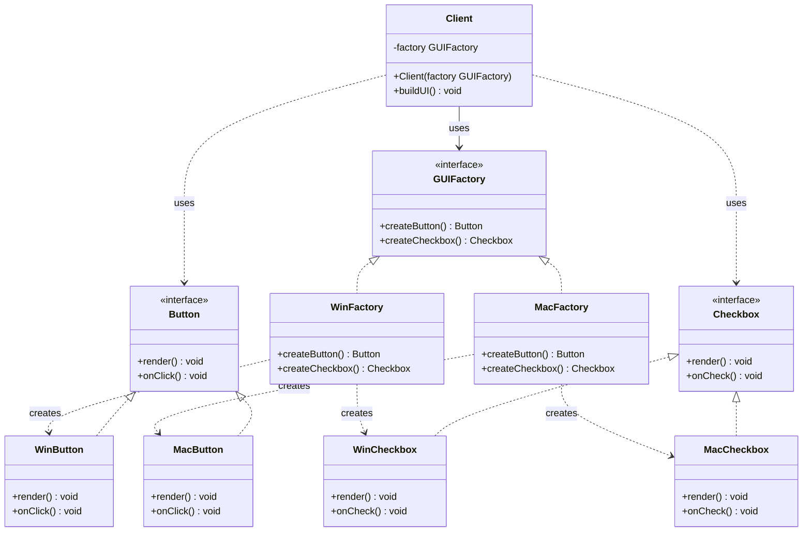

# Abstract Factory Pattern

---

## Table of Contents
<!-- TOC -->
* [Abstract Factory Pattern](#abstract-factory-pattern)
  * [Overview](#overview)
  * [Participants](#participants)
  * [Structure](#structure)
  * [Example](#example)
  * [Product Family Compatibility](#product-family-compatibility)
  * [Q&A](#qa)
  * [Related Topics](#related-topics)
  * [Ref.](#ref)
<!-- TOC -->

---

The Abstract Factory is a formal GoF creational pattern that provides an interface for creating *families* of related objects without specifying their concrete classes. Where Factory Method varies creation along one product dimension through subclassing, Abstract Factory varies an entire product suite through composition — the client holds a factory interface and calls it to obtain a consistent set of products.

---

## Overview

The motivation for Abstract Factory arises when a system must be independent of how its products are created and when those products belong to related families that must be used together. A cross-platform UI toolkit is the canonical example: a `WinButton` must pair with a `WinCheckbox`, never with a `MacCheckbox`. Abstract Factory enforces this constraint structurally.

The client is programmed entirely against factory and product interfaces. The concrete factory — `WinFactory` or `MacFactory` — is selected once (typically at startup) and injected into the client. From that point the client calls `factory.createButton()` and `factory.createCheckbox()` without ever knowing which platform-specific classes it receives.

Abstract Factory is the pattern behind `javax.xml.parsers.DocumentBuilderFactory`, the `javax.sql.DataSource` family, and Spring's `ApplicationContext` which functions as an Abstract Factory and IoC container simultaneously.

<sub>[Back to top](#table-of-contents)</sub>

---

## Participants

The Abstract Factory pattern defines five participants.

- ### AbstractFactory:
  An interface or abstract class declaring a creation method for each product in the family (e.g., `createButton()`, `createCheckbox()`). The client depends exclusively on this abstraction.

- ### ConcreteFactory:
  Implements `AbstractFactory` for a specific product family variant. `WinFactory` creates `WinButton` and `WinCheckbox`; `MacFactory` creates `MacButton` and `MacCheckbox`. Each concrete factory ensures internal consistency — it never mixes products from different families.

- ### AbstractProduct:
  An interface or abstract class for each product kind in the family (e.g., `Button`, `Checkbox`). The client references only these abstractions.

- ### ConcreteProduct:
  A platform-specific implementation of an `AbstractProduct` (e.g., `WinButton`, `MacCheckbox`). Only the corresponding `ConcreteFactory` instantiates it.

- ### Client:
  Holds an `AbstractFactory` reference and calls its creation methods. Receives `AbstractProduct` references. Has no compile-time dependency on any concrete factory or concrete product class.

<sub>[Back to top](#table-of-contents)</sub>

---

## Structure



**Caption:** The `Client` is fully decoupled — it knows nothing about which platform-specific family it works with. Swapping `WinFactory` for `MacFactory` changes the entire product suite without touching any client code.

<sub>[Back to top](#table-of-contents)</sub>

---

## Example

The following Java example shows the cross-platform GUI scenario from the diagram. The `Application` client is injected with a `GUIFactory` and calls it to build a consistent UI.

```java
public interface Button   { void render(); }
public interface Checkbox { void render(); }

public class WinButton   implements Button   { public void render() { /* Win button   */ } }
public class WinCheckbox implements Checkbox { public void render() { /* Win checkbox */ } }
public class MacButton   implements Button   { public void render() { /* Mac button   */ } }
public class MacCheckbox implements Checkbox { public void render() { /* Mac checkbox */ } }

public interface GUIFactory {
    Button   createButton();
    Checkbox createCheckbox();
}

public class WinFactory implements GUIFactory {
    public Button   createButton()   { return new WinButton();   }
    public Checkbox createCheckbox() { return new WinCheckbox(); }
}

public class MacFactory implements GUIFactory {
    public Button   createButton()   { return new MacButton();   }
    public Checkbox createCheckbox() { return new MacCheckbox(); }
}

public class Application {
    private final Button   button;
    private final Checkbox checkbox;

    public Application(GUIFactory factory) {
        this.button   = factory.createButton();
        this.checkbox = factory.createCheckbox();
    }

    public void buildUI() { button.render(); checkbox.render(); }
}
```

Changing from Windows to Mac UI requires only swapping the factory instance passed to `Application`. No other code changes.

<sub>[Back to top](#table-of-contents)</sub>

---

## Product Family Compatibility

Abstract Factory's central guarantee is that all products returned by the same `ConcreteFactory` instance are designed to work together.

- ### Consistency guarantee:
  Because `WinFactory` creates only `WinButton` and `WinCheckbox`, it is structurally impossible for the `Application` to receive a `WinButton` paired with a `MacCheckbox`. The type system enforces family consistency.

- ### Runtime family switching:
  Swapping the concrete factory instance at startup changes the entire product family uniformly. The client code, business logic, and product interface definitions remain untouched.

- ### Adding a new family variant:
  Adding a `LinuxFactory` with `LinuxButton` and `LinuxCheckbox` requires no modification to existing code — only new classes are added. This satisfies the Open/Closed Principle.

- ### Adding a new product kind:
  This is the one scenario that requires modifying all existing factories. If a new `Scrollbar` product must be added to `GUIFactory`, every concrete factory must implement `createScrollbar()`. This is the main cost of Abstract Factory and a signal to evaluate whether the design has stabilised.

<sub>[Back to top](#table-of-contents)</sub>

---

## Q&A

Common questions a software architect trainee would ask about this topic.

**Q: What is the key difference between Factory Method and Abstract Factory?**
A: Factory Method uses inheritance — a subclass overrides a single factory method to return one product type. Abstract Factory uses composition — a client holds a factory interface that creates multiple related product types. Factory Method varies creation along one dimension; Abstract Factory varies an entire family.

---

**Q: What guarantees does Abstract Factory provide about product compatibility?**
A: All products returned by the same concrete factory are guaranteed to be from the same family and designed to work together. Mixing products from different factories is prevented structurally because the client only ever interacts with one factory instance.

---

**Q: When does Abstract Factory become the wrong choice?**
A: When a new product type (a new method on the `AbstractFactory` interface) needs to be added frequently. Every such addition forces changes across all concrete factory implementations. Abstract Factory is best suited for stable product families where the set of product types is fixed and only the variants change.

---

**Q: Where does Abstract Factory appear in the Java ecosystem?**
A: `javax.xml.parsers.DocumentBuilderFactory` and `javax.xml.transform.TransformerFactory` are canonical examples — they abstract over different XML parser implementations. Spring's `ApplicationContext` is a large-scale Abstract Factory / IoC container that produces beans of many types from a configured family of definitions.

<sub>[Back to top](#table-of-contents)</sub>

---

## Related Topics

- [Factory Patterns Overview](../factory.md) — Context for the full factory family and selection criteria
- [Factory Method](factory-method.md) — The single-product pattern that Abstract Factory generalises
- [SOLID Principles](../../solid.md) — OCP and DIP, which Abstract Factory satisfies; adding a product kind temporarily stresses both

<sub>[Back to top](#table-of-contents)</sub>

---

## Ref.

- [Abstract Factory — Refactoring.Guru](https://refactoring.guru/design-patterns/abstract-factory) — Canonical reference for the family-of-objects variant
- [Abstract Factory Pattern — Wikipedia](https://en.wikipedia.org/wiki/Abstract_factory_pattern) — Encyclopedic definition with structural diagrams
- [Factory Pattern Comparison — Refactoring.Guru](https://refactoring.guru/design-patterns/factory-comparison) — Side-by-side comparison of all three variants
- [Applying the Factory Pattern to Java RMI — Oracle Docs](https://docs.oracle.com/javase/8/docs/technotes/guides/rmi/Factory.html) — Official Oracle documentation showing factory usage in the Java platform

---

[Get Started](../../../get-started.md) | [Factory Patterns](../factory.md)

---
