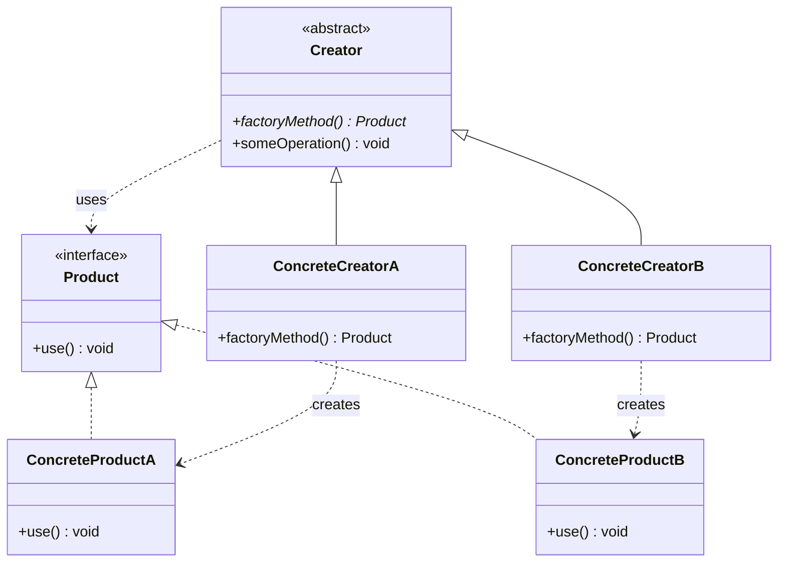

# Factory Method Pattern

---

## Table of Contents
<!-- TOC -->
* [Factory Method Pattern](#factory-method-pattern)
  * [Overview](#overview)
  * [Participants](#participants)
  * [Structure](#structure)
  * [Example](#example)
  * [SOLID Compliance](#solid-compliance)
  * [Q&A](#qa)
  * [Related Topics](#related-topics)
  * [Ref.](#ref)
<!-- TOC -->

---

The Factory Method is a formal GoF creational pattern that defines an abstract method for object creation in a base class and lets subclasses decide which concrete type to instantiate. It replaces the conditional logic of Simple Factory with polymorphism, satisfying the Open/Closed and Dependency Inversion principles.

---

## Overview

In the Simple Factory idiom, all creation decisions live in a single conditional block. Every new product type requires modifying that block. Factory Method eliminates this by declaring an abstract `factoryMethod()` in a `Creator` base class. The `Creator`'s business logic calls this method without knowing what it returns — it only knows the `Product` interface. Each `ConcreteCreator` subclass overrides the method to return a specific `ConcreteProduct`.

The result is that adding a new product type requires adding a new `ConcreteCreator` subclass — no existing code is modified. This is the Open/Closed Principle in direct action.

Factory Method is the pattern behind many Java standard library hooks (`javax.xml.parsers.DocumentBuilderFactory`, `java.util.Iterator`) and is widely used in frameworks that allow application code to extend or replace default behaviour.

<sub>[Back to top](#table-of-contents)</sub>

---

## Participants

The Factory Method pattern defines four participants.

- ### Product:
  An interface or abstract class that defines the contract all concrete products must fulfil. The `Creator` works exclusively against this abstraction.

- ### ConcreteProduct:
  A specific implementation of `Product`. Created only by its paired `ConcreteCreator`.

- ### Creator:
  The abstract base class that declares the factory method: `public abstract Product factoryMethod()`. It contains the business logic (`someOperation()`) that calls `factoryMethod()` to obtain a product, but never references any concrete type.

- ### ConcreteCreator:
  Extends `Creator` and overrides `factoryMethod()` to return a specific `ConcreteProduct`. This is the only place that references a concrete class.

<sub>[Back to top](#table-of-contents)</sub>

---

## Structure



**Caption:** `Creator.someOperation()` works entirely against the `Product` interface and never references a concrete class. Adding a new product only requires a new `ConcreteCreator` subclass.

<sub>[Back to top](#table-of-contents)</sub>

---

## Example

The following Java example models a notification system. The abstract `NotificationService` contains the delivery logic; each subclass decides which `Notification` type to create.

```java
public interface Notification {
    void send(String message);
}

public class EmailNotification  implements Notification {
    public void send(String msg) { /* send email */ }
}

public class SMSNotification implements Notification {
    public void send(String msg) { /* send SMS   */ }
}

public abstract class NotificationService {
    public abstract Notification createNotification(); // factory method

    public void notify(String message) {
        Notification n = createNotification();         // polymorphic call
        n.send(message);
    }
}

public class EmailNotificationService extends NotificationService {
    public Notification createNotification() { return new EmailNotification(); }
}

public class SMSNotificationService extends NotificationService {
    public Notification createNotification() { return new SMSNotification(); }
}
```

Adding a push notification channel requires only a new `PushNotificationService` subclass. No existing class is modified.

<sub>[Back to top](#table-of-contents)</sub>

---

## SOLID Compliance

Factory Method directly satisfies two of the five SOLID principles.

- ### Open/Closed Principle (OCP):
  The `Creator` and all existing `ConcreteCreator` classes are closed for modification. Adding a new product type opens the hierarchy by adding a new subclass. No existing code changes.

- ### Dependency Inversion Principle (DIP):
  The high-level `Creator` class depends on the `Product` abstraction, not on any concrete implementation. `ConcreteCreator` classes depend on both the `Creator` abstraction and their specific `ConcreteProduct`, but the dependency flows through interfaces at every layer that matters to the client.

  > See also: [SOLID Principles](../../solid.md)

<sub>[Back to top](#table-of-contents)</sub>

---

## Q&A

Common questions a software architect trainee would ask about this topic.

**Q: What is the key structural difference between Simple Factory and Factory Method?**
A: Simple Factory uses a single static method with a conditional to choose the product. Factory Method replaces that conditional with polymorphism: the `Creator` calls an abstract method, and each subclass determines the product. Factory Method is open for extension without modification; Simple Factory is not.

---

**Q: Does the Creator have to be abstract?**
A: Not strictly. A `Creator` can provide a default implementation of `factoryMethod()` that returns a reasonable default product. Subclasses then override only when they need different behaviour. This is common in template-method style frameworks where extension is optional.

---

**Q: How does Factory Method relate to the Template Method pattern?**
A: Factory Method is often implemented using the Template Method structure — `Creator.someOperation()` is a template method that calls `factoryMethod()` as a hook. The two patterns are frequently used together; Factory Method specifically governs the creation step within a larger algorithm.

---

**Q: When should I prefer Factory Method over Abstract Factory?**
A: Use Factory Method when you need to vary the creation of a single product type through subclassing. Use Abstract Factory when you have multiple related product types that must be created together as a consistent family. Abstract Factory is the natural evolution of Factory Method when a second product dimension appears.

<sub>[Back to top](#table-of-contents)</sub>

---

## Related Topics

- [Factory Patterns Overview](../factory.md) — Context for the full factory family and selection criteria
- [Simple Factory](simple-factory.md) — The idiom that Factory Method supersedes for extensible designs
- [Abstract Factory](abstract-factory.md) — The evolution when multiple product families are required
- [SOLID Principles](../../solid.md) — OCP and DIP, which Factory Method directly satisfies

<sub>[Back to top](#table-of-contents)</sub>

---

## Ref.

- [Factory Method — Refactoring.Guru](https://refactoring.guru/design-patterns/factory-method) — Canonical reference with structure, pseudocode, and multi-language examples
- [Factory Method Pattern — Wikipedia](https://en.wikipedia.org/wiki/Factory_method_pattern) — Encyclopedic definition with UML and historical GoF context
- [Factory Method Pattern — OODesign.com](https://www.oodesign.com/factory-method-pattern) — Structured reference with UML diagram and participant descriptions
- [Factory Pattern Comparison — Refactoring.Guru](https://refactoring.guru/design-patterns/factory-comparison) — Side-by-side comparison of all three variants

---

[Get Started](../../../get-started.md) | [Factory Patterns](../factory.md)

---
