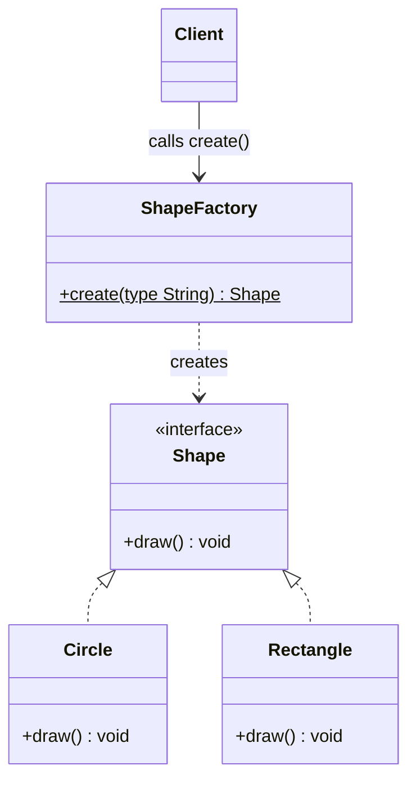

# Simple Factory

---

## Table of Contents
<!-- TOC -->
* [Simple Factory](#simple-factory)
  * [Overview](#overview)
  * [Participants](#participants)
  * [Structure](#structure)
  * [Example](#example)
  * [When to Use](#when-to-use)
  * [Q&A](#qa)
  * [Related Topics](#related-topics)
  * [Ref.](#ref)
<!-- TOC -->

---

The Simple Factory is a programming idiom — not a formal GoF pattern — that centralises object creation in a single static method using a conditional dispatch. It trades the Open/Closed Principle for simplicity and is a common first step before adopting the formal Factory Method pattern.

---

## Overview

Without any factory, every caller that needs a `Shape` must decide which concrete class to instantiate and call `new Circle()` or `new Rectangle()` directly. This scatters creation logic across the codebase and couples every caller to concrete types.

Simple Factory extracts that conditional into one class. All callers depend only on the factory and the `Shape` interface. When the set of supported types is small and stable, this is a pragmatic solution that avoids the ceremony of subclassing.

The trade-off is OCP compliance: every time a new product type is added, the factory class must be modified. When types change frequently, Simple Factory is a signal to evolve to [Factory Method](factory-method.md).

<sub>[Back to top](#table-of-contents)</sub>

---

## Participants

The Simple Factory pattern involves four elements.

- ### Client:
  The code that needs a `Shape` object. It calls `ShapeFactory.create()` with a type string and receives a `Shape` interface reference. The client never references `Circle` or `Rectangle` directly.

- ### ShapeFactory:
  The factory class. Contains the static `create()` method and the conditional logic that maps a type string to a concrete class. This is the single point of modification when a new type is added.

- ### Shape (Product Interface):
  Defines the contract that all concrete products must fulfil. The client and factory both refer to this interface, not to any concrete type.

- ### ConcreteProducts (Circle, Rectangle):
  Implement the `Shape` interface. They are unknown to the client — only the factory knows about them.

<sub>[Back to top](#table-of-contents)</sub>

---

## Structure



**Caption:** The Simple Factory centralises object creation in a single static method. The client depends only on the factory and the `Shape` interface, never on concrete classes — but every new type requires modifying `ShapeFactory`.

<sub>[Back to top](#table-of-contents)</sub>

---

## Example

The following Java example shows a `ShapeFactory` using a `switch` expression to map a string key to a concrete product.

```java
public interface Shape {
    void draw();
}

public class Circle    implements Shape { public void draw() { /* ... */ } }
public class Rectangle implements Shape { public void draw() { /* ... */ } }

public class ShapeFactory {
    public static Shape create(String type) {
        return switch (type) {
            case "circle"    -> new Circle();
            case "rectangle" -> new Rectangle();
            default          -> throw new IllegalArgumentException("Unknown shape: " + type);
        };
    }
}

// Client code — no reference to Circle or Rectangle
Shape s = ShapeFactory.create("circle");
s.draw();
```

The client receives a `Shape` reference. It has no compile-time dependency on `Circle` or `Rectangle`.

<sub>[Back to top](#table-of-contents)</sub>

---

## When to Use

**Use Simple Factory when:**
- The set of product types is small and changes rarely
- You want to centralise creation without introducing subclass hierarchies
- The pattern is used internally within a single module or package
- Simplicity and readability matter more than strict OCP compliance

**Do not use Simple Factory when:**
- New product types are added frequently — each addition requires modifying the factory class, violating OCP
- Different environments or configurations require different product families — use [Abstract Factory](abstract-factory.md)
- The creation decision belongs to a subclass, not a conditional — use [Factory Method](factory-method.md)

<sub>[Back to top](#table-of-contents)</sub>

---

## Q&A

Common questions a software architect trainee would ask about this topic.

**Q: If Simple Factory is not a GoF pattern, why is it worth learning?**
A: It is the most common introduction to the concept of decoupling creation from use. Understanding its limitations — specifically that every new type requires modifying the factory class — is precisely what motivates learning the formal GoF patterns. Most production codebases contain Simple Factories, so recognising them is a practical skill.

---

**Q: Does Simple Factory violate the Open/Closed Principle?**
A: Yes. Every time a new product type is needed, the `create()` method must be modified. This is the primary design limitation of the idiom. Factory Method resolves this by replacing the conditional with polymorphism — a new product type requires only a new subclass, not a modification to existing code.

---

**Q: Can Simple Factory be non-static?**
A: Yes. A non-static factory can hold configuration or state that influences which product to create. However, the structural limitation — a single class containing all creation decisions — remains the same regardless of whether the method is static.

<sub>[Back to top](#table-of-contents)</sub>

---

## Related Topics

- [Factory Patterns Overview](../factory.md) — Context for the full factory family and when to choose each variant
- [Factory Method](factory-method.md) — The GoF pattern to adopt when OCP compliance becomes important
- [SOLID Principles](../../solid.md) — OCP and DIP: the principles that motivate moving beyond Simple Factory

<sub>[Back to top](#table-of-contents)</sub>

---

## Ref.

- [Factory Pattern Comparison — Refactoring.Guru](https://refactoring.guru/design-patterns/factory-comparison) — Official side-by-side comparison of all three variants
- [Factory Method — Refactoring.Guru](https://refactoring.guru/design-patterns/factory-method) — The GoF pattern that supersedes Simple Factory for extensible designs
- [Factory Method Pattern — OODesign.com](https://www.oodesign.com/factory-method-pattern) — Structured reference with participant descriptions

---

[Get Started](../../../get-started.md) | [Factory Patterns](../factory.md)

---
