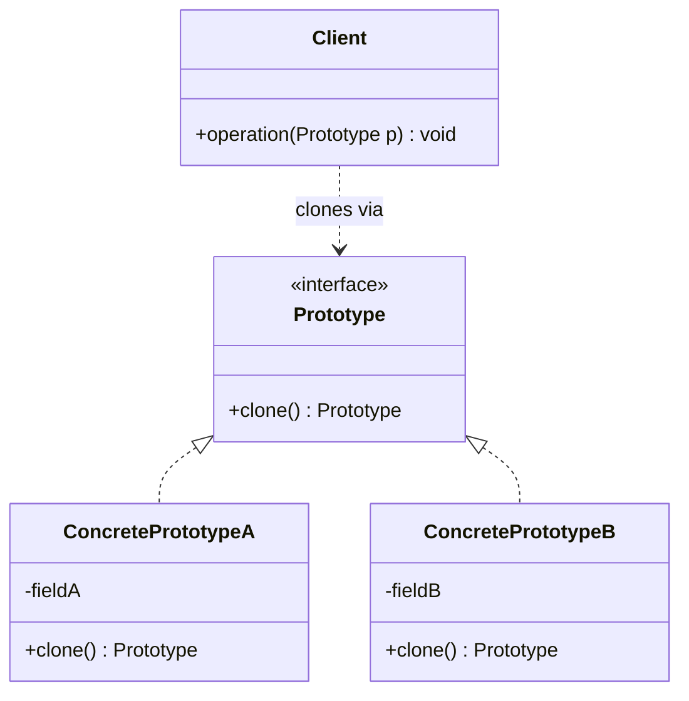
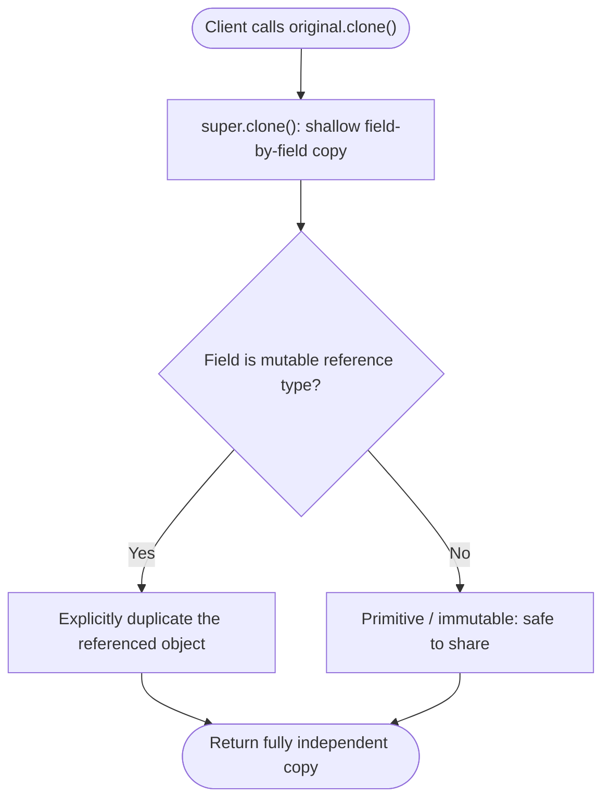

# Prototype Pattern

---

## Table of Contents
<!-- TOC -->
* [Prototype Pattern](#prototype-pattern)
  * [Overview](#overview)
  * [Pattern Structure](#pattern-structure)
  * [Shallow vs. Deep Cloning in Java](#shallow-vs-deep-cloning-in-java)
  * [Prototype Registry](#prototype-registry)
  * [Q&A](#qa)
  * [Related Topics](#related-topics)
  * [Ref.](#ref)
<!-- TOC -->

---

The Prototype is one of the five GoF creational design patterns. Its intent is to specify the kinds of objects to create using a prototypical instance, and to create new objects by copying that prototype rather than by instantiating a class directly. It is most valuable when creating an object from scratch is more expensive — in setup cost, configuration complexity, or resource acquisition — than duplicating an already-configured instance.

---

## Overview

Prototype decouples client code from the concrete classes it needs to instantiate. Instead of calling `new ConcreteClass(...)` — which requires knowing the exact class and how to configure it — the client asks an existing object to `clone()` itself. Because every prototype implements a common cloning interface, the client can copy any registered prototype without knowing its concrete type at compile time.

This is especially useful when object construction is costly: objects that load data from a database or file, perform expensive computation during initialization, or hold a complex graph of pre-configured sub-objects. Cloning a fully-initialized prototype avoids repeating that setup cost for every new instance.

Prototype is also useful when the set of possible object states is effectively unbounded and cannot be captured by a fixed set of Factory subclasses — a design tool where users can save any configuration of a shape as a reusable template is a canonical example. In Java, the pattern is often implemented via the `Cloneable` interface and `Object.clone()`, though many teams prefer an explicit copy constructor or a dedicated `copy()` method to avoid the well-documented pitfalls of `Cloneable`.

<sub>[Back to top](#table-of-contents)</sub>

---

## Pattern Structure

The `Prototype` interface declares a `clone()` operation; each `ConcretePrototype` implements it to return a copy of itself, and the `Client` requests copies without knowing the concrete type.



**Caption:** The Client depends only on the Prototype interface; each ConcretePrototype knows how to copy itself.

<sub>[Back to top](#table-of-contents)</sub>

---

## Shallow vs. Deep Cloning in Java

`Object.clone()` performs a shallow copy by default — primitive and immutable fields are duplicated correctly, but reference fields are copied by reference, so the clone and the original share the same nested mutable objects.

```java
public class Document implements Cloneable {
    private String title;
    private List<String> tags;

    public Document(String title, List<String> tags) {
        this.title = title;
        this.tags = tags;
    }

    @Override
    public Document clone() {
        try {
            Document copy = (Document) super.clone();
            copy.tags = new ArrayList<>(this.tags); // deep-copy the mutable field
            return copy;
        } catch (CloneNotSupportedException e) {
            throw new AssertionError(e); // Cloneable was declared, so this never happens
        }
    }
}
```

Without explicitly rebuilding the `tags` list inside `clone()`, both the original and the copy would reference the same `ArrayList`, and mutating one would silently mutate the other. Every mutable reference field must be independently duplicated to achieve a true deep copy; immutable fields (like `String`) can safely be shared by reference.



**Caption:** A correct deep clone requires manually duplicating every mutable reference field after the shallow `super.clone()` copy.

<sub>[Back to top](#table-of-contents)</sub>

---

## Prototype Registry

A registry keyed by name or type stores a set of pre-configured prototypes that clients clone on demand instead of constructing from scratch.

```java
public class ShapeRegistry {
    private final Map<String, Shape> prototypes = new HashMap<>();

    public void register(String key, Shape prototype) {
        prototypes.put(key, prototype);
    }

    public Shape create(String key) {
        return prototypes.get(key).clone();
    }
}

// Usage:
registry.register("default-circle", new Circle(0, 0, 10));
Shape c1 = registry.create("default-circle"); // clone, not a fresh construction
```

Because a registry is typically accessed globally and holds long-lived, shared prototype instances, it is common to implement the registry itself as a Singleton — see [Singleton](singleton.md) for the trade-offs of that combination.

<sub>[Back to top](#table-of-contents)</sub>

---

## Q&A

Common questions a software architect trainee would ask about this topic.

**Q: When is Prototype preferable to Factory or Builder?**
A: Factory and Builder construct objects from scratch — Factory in one call, Builder step-by-step. Prototype instead duplicates an already fully-configured instance, which is preferable when construction is expensive (heavy computation, I/O, or a complex object graph) and a suitable template already exists in memory. If there is no cheap-to-copy template, Factory or Builder is the better fit.

---

**Q: Why is a shallow copy usually insufficient for Prototype?**
A: `Object.clone()`'s default shallow copy duplicates the object's own fields, but any reference field still points at the same nested object as the original. Mutating that shared nested object through the clone would silently corrupt the original too. A correct Prototype implementation must deep-copy every mutable reference field so the clone is fully independent.

---

**Q: Why might a team avoid `Cloneable` and `Object.clone()` entirely?**
A: `Cloneable` is a marker interface with no methods of its own, `clone()` is protected on `Object` and must be overridden and widened to `public`, `CloneNotSupportedException` is checked despite never applying once `Cloneable` is declared, and `super.clone()` bypasses constructors, which can skip invariant checks. Many Java style guides (including Joshua Bloch's *Effective Java*) recommend a copy constructor or a static `copyOf()` factory method instead, since both integrate normally with final fields and validation logic.

<sub>[Back to top](#table-of-contents)</sub>

---

## Related Topics

- [Builder Pattern](builder.md) — Builder assembles a new object from parts; Prototype duplicates an existing, already-assembled instance
- [Factory Patterns](factory.md) — Factory returns a new object per rules; Prototype returns a copy of a pre-existing template object
- [Singleton Pattern](singleton.md) — A Prototype registry is frequently implemented as a Singleton to provide one shared, globally-accessible set of templates

<sub>[Back to top](#table-of-contents)</sub>

---

## Ref.

- [Prototype — Refactoring.Guru](https://refactoring.guru/design-patterns/prototype) — Canonical reference with structure, pseudocode, and applicability guidance
- [Prototype in Java — Refactoring.Guru](https://refactoring.guru/design-patterns/prototype/java/example) — Java-specific implementation with annotated examples

---

[Get Started](../../../get-started.md) | [Design Patterns](../../../get-started.md#design-patterns)

---
