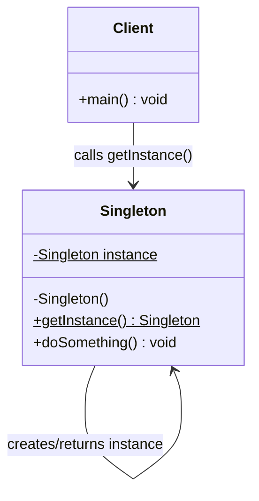
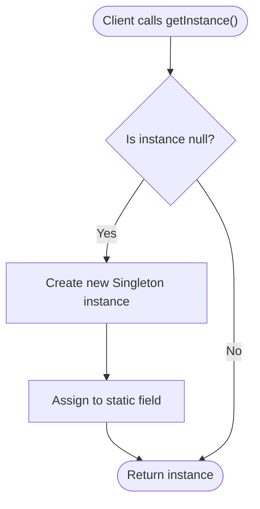
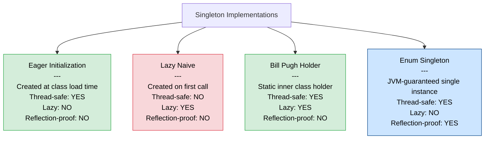

# Singleton Pattern

---

## Table of Contents
<!-- TOC -->
* [Singleton Pattern](#singleton-pattern)
  * [Overview](#overview)
  * [Pattern Structure](#pattern-structure)
  * [Initialization Variants](#initialization-variants)
  * [Vulnerabilities and Guards](#vulnerabilities-and-guards)
  * [Singleton as Anti-Pattern](#singleton-as-anti-pattern)
  * [Testing Challenges and the DI Alternative](#testing-challenges-and-the-di-alternative)
  * [Q&A](#qa)
  * [Related Topics](#related-topics)
  * [Ref.](#ref)
<!-- TOC -->

---

The Singleton is one of the five GoF creational design patterns, first catalogued in *Design Patterns: Elements of Reusable Object-Oriented Software* (Gamma, Helm, Johnson, Vlissides — 1994). Its intent is to ensure a class has exactly one instance and to provide a global access point to that instance. It appears frequently in infrastructure concerns such as logging, configuration, connection pools, and caches — and is equally well-known as one of the most scrutinised patterns in modern software engineering, often labelled an anti-pattern when misapplied.

---

## Overview

The Singleton controls object instantiation at the class level. A private constructor prevents external code from calling `new`, a private static field holds the sole instance, and a public static `getInstance()` method is the only way to obtain it. This guarantees that all callers share the same object throughout the JVM lifetime.

The pattern has legitimate uses for truly global infrastructure — a logging facade, a metrics registry, or a configuration object loaded once at startup. In these cases a single shared instance is an accurate model of the domain and the overhead of managing it elsewhere (such as through dependency injection) may be unnecessary.

However, Singleton is also a source of hidden coupling, global mutable state, and testability problems. It conflates two responsibilities into one class: the business logic the class exists to provide, and the enforcement of its own uniqueness. For this reason a software architect must understand both the correct application of the pattern and the stronger modern alternative: a dependency injection container managing object scope.

The four main implementation strategies — eager initialization, naive lazy initialization, double-checked locking, the Bill Pugh holder idiom, and enum Singleton — each make different trade-offs between laziness, thread safety, and resistance to reflection and serialization attacks.

<sub>[Back to top](#table-of-contents)</sub>

---

## Pattern Structure

The canonical Singleton class structure exposes only a static `getInstance()` factory method and hides its constructor to enforce a single shared instance.



**Caption:** The Singleton class exposes only a static `getInstance()` factory method, hiding its constructor to enforce a single shared instance.

The basic structure in Java:

```java
public final class Singleton {
    private static Singleton instance;
    private Singleton() {}
    public static Singleton getInstance() {
        if (instance == null) {
            instance = new Singleton();
        }
        return instance;
    }
}
```

The `getInstance()` method guards construction behind a null-check — creating the object only on the first call.



**Caption:** `getInstance()` guards construction behind a null-check — creating the object only on the first call.

<sub>[Back to top](#table-of-contents)</sub>

---

## Initialization Variants

There are four main strategies for implementing Singleton in Java, each making different trade-offs between laziness, thread safety, and protection against reflection and serialization.



**Caption:** The four main variants trade off laziness, thread safety, and reflection resistance.

- ### Eager Initialization:
  The instance is created at class-load time as a static final field. Thread-safe by JVM guarantee with no synchronization overhead required. The resource cost is always paid upfront, even if the instance is never used.

  ```java
  public final class AppConfig {
      private static final AppConfig INSTANCE = new AppConfig();
      private AppConfig() {}
      public static AppConfig getInstance() { return INSTANCE; }
  }
  ```

- ### Lazy Initialization (Naive):
  The instance is deferred until the first `getInstance()` call. Not thread-safe — two threads can both observe `instance == null` before either assigns the field, producing two distinct instances.

  ```java
  public static Singleton getInstance() {
      if (instance == null) {
          instance = new Singleton();  // race condition
      }
      return instance;
  }
  ```

- ### Double-Checked Locking:
  Uses a `volatile` field and two null-checks — one outside and one inside a `synchronized` block. The outer check avoids locking on every call (the hot path); the inner check prevents a second instantiation by a thread that passed the outer check before the lock was acquired. Requires Java 5+ for the `volatile` happens-before guarantee.

  ```java
  public final class ConnectionPool {
      private static volatile ConnectionPool instance;
      private ConnectionPool() {}
      public static ConnectionPool getInstance() {
          ConnectionPool result = instance;
          if (result != null) return result;
          synchronized (ConnectionPool.class) {
              if (instance == null) {
                  instance = new ConnectionPool();
              }
              return instance;
          }
      }
  }
  ```

  Thread B short-circuits past the synchronized block once the instance is visible via the volatile field.

  ```mermaid
  sequenceDiagram
      participant A as Thread A
      participant B as Thread B
      participant S as Singleton
      par Concurrent calls
          A ->> S: getInstance()
          B ->> S: getInstance()
      end
      A ->> S: Check instance (null → true)
      A ->> S: Acquire lock
      A ->> S: Check instance again (null → true)
      A ->> S: new Singleton()
      A ->> S: Assign to volatile field
      A ->> S: Release lock
      A -->> A: Return new instance
      B ->> S: Check instance (null → false)
      Note over B,S: B sees non-null, skips lock entirely
      B -->> B: Return existing instance
  ```

  **Caption:** Thread B short-circuits past the synchronized block once the instance is visible via the volatile field.

- ### Bill Pugh / Initialization-on-Demand Holder:
  A private static inner class is not loaded by the JVM until it is first referenced. This gives lazy initialization and thread safety with zero synchronization overhead, relying entirely on JVM class-loading guarantees.

  ```java
  public final class Logger {
      private Logger() {}
      private static final class Holder {
          static final Logger INSTANCE = new Logger();
      }
      public static Logger getInstance() {
          return Holder.INSTANCE;
      }
  }
  ```

- ### Enum Singleton (Effective Java / Joshua Bloch):
  The Java Language Specification guarantees one instantiation of each enum constant per JVM. The Reflection API is forbidden from instantiating enums. Serialization maps by name, not by object graph, so the contract survives deserialization. This is the idiomatic modern Java recommendation.

  ```java
  public enum DatabaseDriver {
      INSTANCE;
      private final Connection connection;
      DatabaseDriver() { this.connection = openConnection(); }
      public Connection getConnection() { return connection; }
  }
  // Usage: DatabaseDriver.INSTANCE.getConnection();
  ```

<sub>[Back to top](#table-of-contents)</sub>

---

## Vulnerabilities and Guards

Two mechanisms can break the Singleton contract in non-enum implementations:

- ### Serialization:
  Default Java serialization creates a new object from the serialized byte stream, bypassing the constructor but still producing a second instance. The guard is to implement `readResolve()`, which returns the existing instance during deserialization and causes the deserialized object to be discarded.

- ### Reflection:
  The Java Reflection API can invoke private constructors directly, breaking the uniqueness guarantee. A constructor guard throws `IllegalStateException` if an instance already exists when the constructor is called. This check adds a small overhead on every construction call.

- ### Enum as the Complete Solution:
  The enum variant is the only implementation that is fully proof against both serialization and reflection attacks without requiring additional guard code. For security-sensitive or long-lived infrastructure components it is the recommended approach.

<sub>[Back to top](#table-of-contents)</sub>

---

## Singleton as Anti-Pattern

Singleton is frequently labelled an anti-pattern when applied outside its narrow legitimate domain.

- ### Hidden Coupling:
  Any class that calls `Singleton.getInstance()` takes on a hard dependency on a concrete class — not on an interface. This coupling is invisible at the API boundary and cannot be detected or overridden by callers.

- ### Global Mutable State:
  A Singleton holding mutable state is functionally equivalent to a global variable. Any code anywhere in the application can read or modify it, making behaviour difficult to reason about and bugs difficult to reproduce.

- ### Single Responsibility Principle Violation:
  The class simultaneously manages its business logic and enforces its own uniqueness — two distinct responsibilities that SRP requires to be separated.

- ### Dependency Inversion Principle Violation:
  Callers depend directly on the Singleton's concrete class rather than on an abstraction, inverting the dependency hierarchy that DIP requires.

> See also: [SOLID Principles](../solid.md)

<sub>[Back to top](#table-of-contents)</sub>

---

## Testing Challenges and the DI Alternative

Static `getInstance()` methods cannot be intercepted or replaced by standard mocking frameworks. Shared static state persists across tests within the same JVM, meaning a test that modifies Singleton state can corrupt the environment for every subsequent test in the suite.

The modern alternative is to let a dependency injection container manage object scope. A class annotated `@Component` or `@ApplicationScoped` is instantiated once by the container and injected wherever it is needed. The class itself has no awareness of its scope, can implement an interface, and can be replaced with a mock in tests.

```java
@Component
public class MetricsService { ... }

@Service
public class OrderService {
    private final MetricsService metrics;
    public OrderService(MetricsService metrics) { this.metrics = metrics; }
}
```

The key distinction: with DI the container manages scope externally; with Singleton the class manages scope internally. DI-managed beans are testable, swappable, and decoupled.

<sub>[Back to top](#table-of-contents)</sub>

---

## Q&A

Common questions a software architect trainee would ask about this topic.

**Q: What problem does the Singleton pattern solve?**
A: It guarantees exactly one instance of a class and provides a single global access point — useful for shared infrastructure resources like configuration objects, logging facades, or connection pools where multiple instances would be incorrect or wasteful.

---

**Q: What is the difference between eager and lazy initialization?**
A: Eager initialization creates the instance at class-load time, paying the resource cost unconditionally but requiring no synchronization. Lazy initialization defers creation to the first `getInstance()` call, saving resources when the instance may never be needed, but requiring thread safety measures in concurrent environments.

---

**Q: Why is the naive lazy Singleton not thread-safe?**
A: Two threads can both evaluate `instance == null` as true before either has assigned the field. Each proceeds to create a new instance, resulting in two distinct objects being returned to different callers — breaking the Singleton contract.

---

**Q: Why does double-checked locking require `volatile`?**
A: Without `volatile`, the CPU or JVM may reorder instructions such that the reference to the new object is written to the static field before the object's constructor has fully completed. A second thread could then observe a non-null but partially-constructed instance. `volatile` enforces a happens-before guarantee that prevents this reordering.

---

**Q: Why does Joshua Bloch recommend the enum Singleton?**
A: The Java Language Specification guarantees one instantiation per enum constant per JVM. The Reflection API cannot instantiate enums, and serialization maps by name rather than by object graph. The enum variant is therefore the only implementation that is fully proof against both reflection and serialization attacks without additional guard code.

---

**Q: How does Singleton violate the Single Responsibility Principle?**
A: The class is responsible for both its business logic and for enforcing its own uniqueness. These are two distinct responsibilities. SRP requires each class to have only one reason to change; a Singleton has at least two.

---

**Q: Why is Singleton hard to unit test?**
A: Static methods cannot be overridden or intercepted by standard mocking frameworks. The shared static field persists across tests within the same JVM, so a test that modifies Singleton state can corrupt subsequent tests in the suite.

---

**Q: When should Singleton be used versus avoided?**
A: Use Singleton for truly global, stateless or immutable infrastructure concerns — a logging facade or a metrics registry. Avoid it for business-logic services, stateful components, or anything that needs to be swapped or mocked in tests. In those cases prefer a DI container-managed scoped bean.

<sub>[Back to top](#table-of-contents)</sub>

---

## Related Topics

- [Factory Patterns](factory.md) — Both are GoF creational patterns; Factory often controls how a Singleton instance is accessed or assembled
- [SOLID Principles](../solid.md) — Singleton tensions with SRP (dual responsibility) and DIP (concrete coupling); understanding SOLID clarifies when Singleton is a liability
- [Observer Pattern](../behavioral/observer.md) — A Singleton event bus combined with Observer is a common architectural combination in event-driven systems

<sub>[Back to top](#table-of-contents)</sub>

---

## Ref.

- [Singleton — Refactoring.Guru](https://refactoring.guru/design-patterns/singleton) — Canonical reference with structure, pseudocode, and applicability guidance
- [Singleton in Java — Refactoring.Guru](https://refactoring.guru/design-patterns/singleton/java/example) — Java-specific implementation with annotated examples
- [The Double-Checked Locking Declaration — Bill Pugh, UMD](https://www.cs.umd.edu/~pugh/java/memoryModel/DoubleCheckedLocking.html) — Original analysis of the broken DCL pattern and the volatile fix
- [Double-Checked Locking — Wikipedia](https://en.wikipedia.org/wiki/Double-checked_locking) — Encyclopedic coverage of the pattern, its history, and language-specific correctness requirements
- [Singletons in Java — Baeldung](https://www.baeldung.com/java-singleton) — Practical guide covering all major Java implementation variants
- [Drawbacks of the Singleton Pattern — Baeldung](https://www.baeldung.com/java-patterns-singleton-cons) — In-depth analysis of testability, coupling, and anti-pattern concerns
- [Prevent Singleton from Reflection, Serialization and Cloning — GeeksforGeeks](https://www.geeksforgeeks.org/java/prevent-singleton-pattern-reflection-serialization-cloning/) — Guard techniques for non-enum implementations
- [Why Singleton is Considered an Anti-Pattern — GeeksforGeeks](https://www.geeksforgeeks.org/system-design/why-is-singleton-design-pattern-is-considered-an-anti-pattern/) — Architectural critique covering global state, SRP, and DIP violations

---

[Get Started](../../../get-started.md) | [Design Patterns](../../../get-started.md#design-patterns)

---
