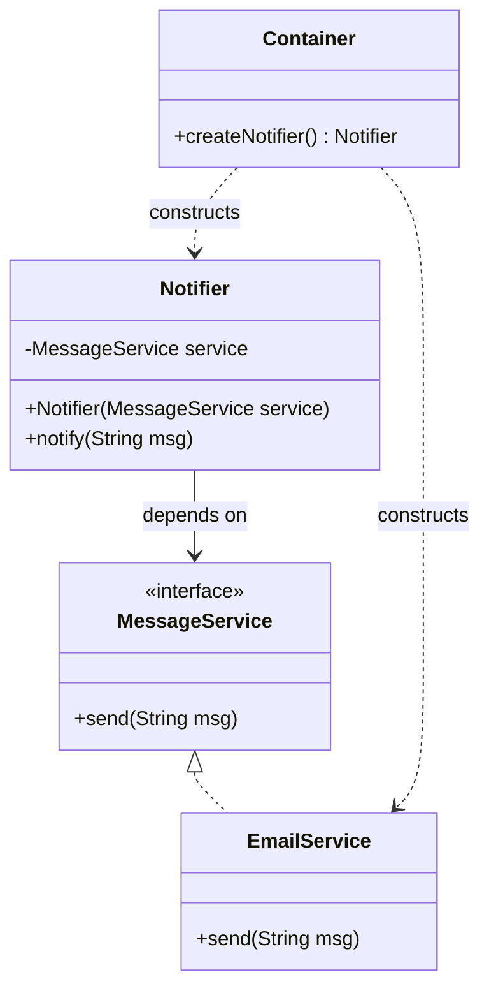

# The Dependency Injection Pattern

---

## Table of Contents
<!-- TOC -->
* [The Dependency Injection Pattern](#the-dependency-injection-pattern)
  * [Table of Contents](#table-of-contents)
  * [Overview](#overview)
  * [Pattern Structure](#pattern-structure)
  * [Example](#example)
  * [Q&A](#qa)
  * [Related Topics](#related-topics)
  * [Ref.](#ref)
<!-- TOC -->

---

Dependency Injection (DI) is a pattern for achieving Inversion of Control (IoC) between objects and their dependencies. Instead of an object constructing or looking up the collaborators it needs, those collaborators are supplied ("injected") from the outside — typically via a constructor, setter, or field. The consuming object stays unaware of how, or by what, its dependencies are created.

<sub>[Back to top](#table-of-contents)</sub>

---

## Overview

In a tightly coupled design, a class instantiates its own dependencies with `new`, hard-wiring itself to concrete implementations and making unit testing (swapping in a mock) and future substitution difficult. Dependency Injection flips this: the class declares what it needs (usually through an interface-typed constructor parameter) and an external party — application wiring code or a **DI container/framework** (e.g., Spring, Guice) — is responsible for constructing the dependency graph and passing the right instances in.

There are three common injection styles: **constructor injection** (dependencies passed as constructor parameters, enabling immutability and guaranteeing the object is never in an invalid state), **setter injection** (dependencies assigned via setter methods, allowing optional or reconfigurable dependencies), and **field injection** (dependencies injected directly into fields via reflection, common in frameworks but harder to unit test without the framework). Constructor injection is generally preferred for required dependencies because it makes them explicit and enforces them at construction time.

DI is the mechanism that makes the Dependency Inversion Principle (the "D" in SOLID) practical at scale: high-level modules depend on abstractions, and a container wires the concrete implementations together at startup, keeping business logic free of object-construction concerns.

<sub>[Back to top](#table-of-contents)</sub>

---

## Pattern Structure

- **Client**: the class that requires a dependency to do its work; depends only on an abstraction (interface).
- **Service (abstraction)**: the interface the Client depends on.
- **ConcreteService**: a specific implementation of the Service interface.
- **Injector / Container**: external code (or a DI framework) that constructs ConcreteService instances and supplies them to the Client, typically via its constructor.



**Caption:** `Notifier` depends only on the `MessageService` abstraction; the `Container` constructs the concrete `EmailService` and injects it via the constructor — `Notifier` never instantiates its own dependency.

<sub>[Back to top](#table-of-contents)</sub>

---

## Example

```java
interface MessageService {
    void send(String msg);
}

class EmailService implements MessageService {
    public void send(String msg) { System.out.println("Email: " + msg); }
}

class Notifier {
    private final MessageService service; // dependency, not created here

    // Constructor injection — dependency pushed in from outside
    Notifier(MessageService service) {
        this.service = service;
    }

    void notify(String msg) { service.send(msg); }
}

// Composition root — the one place that wires concrete types together
MessageService service = new EmailService();
Notifier notifier = new Notifier(service);
notifier.notify("Build succeeded");
```

`Notifier` never calls `new EmailService()` itself; a test can inject a mock `MessageService` without changing `Notifier` at all.

<sub>[Back to top](#table-of-contents)</sub>

---

## Q&A

Common questions a software architect trainee would ask about this topic.

**Q: How does Dependency Injection differ from the Service Locator pattern? Don't they solve the same problem?**
A: Both aim for loose coupling from concrete implementations, but the direction of control differs. With DI, dependencies are *pushed* into the consumer (via constructor/setter) by external wiring code, so the consumer's dependencies are visible in its constructor signature and the consumer has no knowledge of any registry. With Service Locator, the consumer actively *pulls* dependencies at runtime by querying a central locator/registry (e.g., `locator.get(MessageService.class)`), which hides the dependency inside the method body and makes it invisible from the class's public API. DI is generally preferred because it keeps dependencies explicit and testable; Service Locator can look convenient but tends to hide coupling. See [Service Locator](service-locator.md) for the detailed comparison.

---

**Q: Why is constructor injection usually preferred over field or setter injection?**
A: Constructor injection makes required dependencies explicit in the class's public API and lets the object enforce its invariants at construction — the object can never exist in a state where a required dependency is missing, and dependencies can be declared `final`/immutable. Field and setter injection allow an object to be constructed in a partially-initialized state (dependencies set later, or never), which can lead to null-pointer failures deep in the call stack and makes plain unit testing (without the DI framework) harder.

---

**Q: If a DI container constructs objects and wires their dependencies, isn't that job similar to what a Factory does?**
A: Yes — a DI container is essentially a generalized, configuration-driven factory. Where a hand-written Factory pattern typically constructs one family of related objects, a DI container builds the entire object graph for an application, resolving constructor dependencies transitively based on registered type mappings (interface → implementation) and lifecycle rules (singleton, per-request, transient). See [Factory Pattern](../creational/factory.md) for the narrower, manually-coded version of the same idea.

<sub>[Back to top](#table-of-contents)</sub>

---

## Related Topics

- [Service Locator](service-locator.md) — the alternative IoC approach where the consumer pulls dependencies from a registry instead of having them pushed in
- [Factory Pattern](../creational/factory.md) — DI containers generalize the factory idea, resolving and constructing an entire dependency graph rather than one object family
- [SOLID](../solid.md) — Dependency Injection is the primary mechanism for applying the Dependency Inversion Principle in real applications

<sub>[Back to top](#table-of-contents)</sub>

---

## Ref.

- [Inversion of Control Containers and the Dependency Injection pattern — Martin Fowler](https://martinfowler.com/articles/injection.html) — the canonical article defining DI and contrasting it with Service Locator
- [Spring Framework — Dependency Injection](https://docs.spring.io/spring-framework/reference/core/beans/dependencies.html) — reference documentation for a widely used DI container

---

[Get Started](../../../get-started.md) | [Design Patterns](../../../get-started.md#design-patterns)

---
