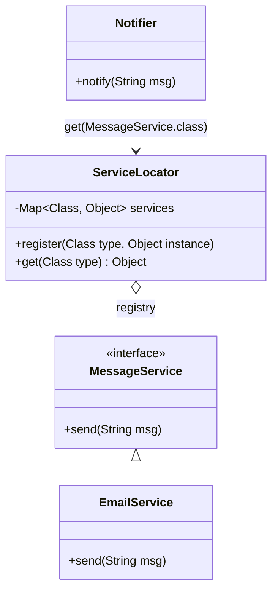

# The Service Locator Pattern

---

## Table of Contents
<!-- TOC -->
* [The Service Locator Pattern](#the-service-locator-pattern)
  * [Table of Contents](#table-of-contents)
  * [Overview](#overview)
  * [Pattern Structure](#pattern-structure)
  * [Example](#example)
  * [Q&A](#qa)
  * [Related Topics](#related-topics)
  * [Ref.](#ref)
<!-- TOC -->

---

The Service Locator Pattern is an Inversion-of-Control pattern that centralizes object/service lookup behind a registry object — the `ServiceLocator`. Instead of dependencies being pushed into a consumer from the outside, the consumer actively asks the locator for whatever service it needs, by type or by name, whenever it needs it.

<sub>[Back to top](#table-of-contents)</sub>

---

## Overview

Service Locator was popularized as a way to decouple client code from concrete service implementations without requiring a full dependency-injection framework: a class that needs a `PaymentService` simply calls `ServiceLocator.get(PaymentService.class)` rather than being handed one through its constructor. The locator itself is typically implemented as a registry — often backed by a Singleton — mapping service interfaces or names to concrete instances or factories.

At first glance this looks like it solves the same coupling problem as Dependency Injection, and it does decouple the consumer from *concrete* implementations. However, it does so by hiding the dependency *inside* the method body rather than exposing it in the class's public API (constructor signature). A reader of the class's public interface cannot tell what services it depends on without reading the implementation; a DI-based class exposes that same information openly via its constructor.

For this reason, Service Locator is widely considered a controversial or even **anti-pattern** in modern application architecture, much like the Singleton pattern it's often built on. Modern DI containers (Spring, Guice, .NET's built-in DI) have made pure DI practical enough that Service Locator's main historical justification — avoiding heavyweight IoC container setup — mostly no longer applies. It still shows up legitimately in contexts where a full object graph can't be constructed upfront (e.g., plugin systems, legacy code that can't be refactored to constructor injection all at once).

<sub>[Back to top](#table-of-contents)</sub>

---

## Pattern Structure

- **ServiceLocator**: a registry that maps service types/names to concrete instances or factories, and exposes a `get`/`resolve` lookup method.
- **Service (abstraction)**: the interface a client looks up and depends on.
- **ConcreteService**: a specific implementation registered with the locator.
- **Client**: pulls the service it needs from the locator at the point of use, rather than receiving it from outside.



**Caption:** `Notifier` actively pulls its `MessageService` from the `ServiceLocator` at runtime, instead of receiving it via a constructor — the dependency is hidden inside `notify`, not visible in `Notifier`'s public API.

<sub>[Back to top](#table-of-contents)</sub>

---

## Example

```java
interface MessageService {
    void send(String msg);
}

class EmailService implements MessageService {
    public void send(String msg) { System.out.println("Email: " + msg); }
}

class ServiceLocator {
    private static final Map<Class<?>, Object> services = new HashMap<>();

    static void register(Class<?> type, Object instance) {
        services.put(type, instance);
    }

    static <T> T get(Class<T> type) {
        return type.cast(services.get(type));
    }
}

class Notifier {
    void notify(String msg) {
        // Dependency pulled here, not injected — invisible from outside the method
        MessageService service = ServiceLocator.get(MessageService.class);
        service.send(msg);
    }
}

// Bootstrap
ServiceLocator.register(MessageService.class, new EmailService());
new Notifier().notify("Build succeeded");
```

Notice `Notifier`'s constructor gives no hint that it depends on a `MessageService` at all — the coupling only becomes visible by reading `notify`'s body.

<sub>[Back to top](#table-of-contents)</sub>

---

## Q&A

Common questions a software architect trainee would ask about this topic.

**Q: If both patterns decouple from concrete implementations, why is Service Locator considered worse than Dependency Injection?**
A: The difference is transparency, not decoupling. DI pushes dependencies in through the constructor, so anyone reading a class's public signature immediately sees what it depends on, and a test can supply mocks without any global state. Service Locator has the class *pull* dependencies from a registry inside its methods, hiding those dependencies from its public API — you have to read the implementation to know what a class actually needs, and tests must configure a shared, often static, locator before running. See [Dependency Injection](dependency-injection.md) for the contrasting approach.

---

**Q: Why is Service Locator often called an anti-pattern, similar to Singleton?**
A: Both patterns tend to rely on shared, globally-accessible state (the locator registry is frequently implemented as a Singleton), and both make dependencies implicit rather than explicit. This hurts testability (tests must reset/reconfigure global state between runs), obscures a class's true coupling from code reviewers, and can lead to runtime failures (missing registration) that could have been compile-time or construction-time failures with DI. The [Singleton as Anti-Pattern](../creational/singleton.md#singleton-as-anti-pattern) discussion covers the same underlying critique — global mutable access points undermining SRP and testability — that applies here.

---

**Q: Is there ever a legitimate reason to use Service Locator today instead of a DI container?**
A: Yes, in narrower cases: plugin/extensibility architectures where services are registered dynamically at runtime and aren't known at compile time or startup wiring; legacy codebases being incrementally migrated away from `new`-based construction, where introducing a locator is a smaller intermediate step than a full constructor-injection refactor; or environments too constrained to host a full DI container. Even then, it's usually treated as a transitional or last-resort tool rather than a default architectural choice.

<sub>[Back to top](#table-of-contents)</sub>

---

## Related Topics

- [Dependency Injection](dependency-injection.md) — the preferred alternative that pushes dependencies in explicitly instead of having consumers pull them from a registry
- [Singleton as Anti-Pattern](../creational/singleton.md#singleton-as-anti-pattern) — a parallel discussion of how global, implicitly-accessed state undermines testability and SRP
- [Factory Pattern](../creational/factory.md) — Service Locator registries often construct or return instances much like a factory, but accessed globally rather than passed explicitly

<sub>[Back to top](#table-of-contents)</sub>

---

## Ref.

- [Inversion of Control Containers and the Dependency Injection pattern — Martin Fowler](https://martinfowler.com/articles/injection.html) — contrasts Service Locator with Dependency Injection and explains the trade-offs
- [Service Locator Pattern — Microsoft Learn (.NET Application Architecture Guidance)](https://learn.microsoft.com/en-us/dotnet/architecture/cloud-native/service-locator-anti-pattern) — discusses why Service Locator is considered an anti-pattern in modern .NET architecture

---

[Get Started](../../../get-started.md) | [Design Patterns](../../../get-started.md#design-patterns)

---
