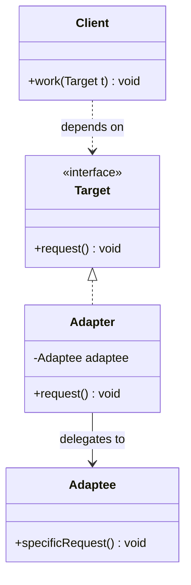

# Adapter Pattern

---

## Table of Contents
<!-- TOC -->
* [Adapter Pattern](#adapter-pattern)
  * [Overview](#overview)
  * [Pattern Structure](#pattern-structure)
  * [Object Adapter in Java](#object-adapter-in-java)
  * [Adapter vs. Facade vs. Decorator](#adapter-vs-facade-vs-decorator)
  * [Q&A](#qa)
  * [Related Topics](#related-topics)
  * [Ref.](#ref)
<!-- TOC -->

---

The Adapter is one of the seven GoF structural design patterns. Its intent is to convert the interface of an existing class into another interface that client code expects, letting classes work together that otherwise couldn't because of incompatible interfaces. It is the pattern of choice for integrating third-party libraries, legacy code, or external APIs without modifying either the client or the class being adapted.

---

## Overview

Adapter solves an interface-compatibility problem, not a behavior problem: the `Adaptee` already does what the client needs, but its method names, parameter shapes, or protocol don't match what the client's code was written to call. The Adapter sits between the two, translating calls from the interface the client expects (the `Target`) into calls the Adaptee actually understands.

A common real-world trigger is integrating a third-party or legacy component whose source cannot be changed — a payment gateway SDK with its own method signatures, a legacy XML-based service being consumed by code that expects a modern JSON-based interface, or a new implementation of an old interface contract. Rather than rewriting the client or the external class, an Adapter is introduced so both sides keep their existing interfaces intact.

Java supports two structural variants: the **class adapter**, which uses multiple inheritance (implementing the target interface while extending the adaptee — only possible in languages with multiple inheritance, and awkward in Java, which lacks multiple class inheritance), and the far more common **object adapter**, which holds a reference to the adaptee via composition and implements the target interface by delegating to it.

<sub>[Back to top](#table-of-contents)</sub>

---

## Pattern Structure

The Adapter implements the interface the `Client` expects (`Target`) and internally delegates calls to the incompatible `Adaptee`.



**Caption:** The Client calls `request()` on the Target interface; the Adapter translates that call into `specificRequest()` on the incompatible Adaptee.

<sub>[Back to top](#table-of-contents)</sub>

---

## Object Adapter in Java

The object adapter holds the adaptee by composition and implements the target interface the client already depends on.

```java
// Target interface the client code expects
public interface JsonPaymentGateway {
    void pay(String customerId, double amount);
}

// Adaptee: a legacy third-party SDK with an incompatible interface
public class LegacyPaymentSdk {
    public void submitTransaction(int accountNumber, long amountInCents) { /* ... */ }
}

// Adapter: translates the Target call into the Adaptee's call
public class LegacyPaymentAdapter implements JsonPaymentGateway {
    private final LegacyPaymentSdk legacySdk;

    public LegacyPaymentAdapter(LegacyPaymentSdk legacySdk) {
        this.legacySdk = legacySdk;
    }

    @Override
    public void pay(String customerId, double amount) {
        int accountNumber = Integer.parseInt(customerId);
        long amountInCents = Math.round(amount * 100);
        legacySdk.submitTransaction(accountNumber, amountInCents);
    }
}
```

Client code depends only on `JsonPaymentGateway` and never sees `LegacyPaymentSdk` directly — the Adapter absorbs the translation between customer ID formats, currency units, and method names.

<sub>[Back to top](#table-of-contents)</sub>

---

## Adapter vs. Facade vs. Decorator

Three structural patterns wrap another object, and trainees frequently confuse them because all three sit "in front of" existing code.

- ### Adapter — changes the interface:
  The wrapped object (the Adaptee) already provides the needed behavior; the Adapter's only job is to make its interface match what the client expects. Nothing about the behavior itself is added or changed — just its shape.

  > See also: [Facade Pattern](facade.md), [Decorator Pattern](decorator.md)

- ### Facade — simplifies a subsystem:
  A Facade doesn't translate one interface into another; it introduces a brand-new, simplified interface in front of a complex subsystem of many classes, hiding that complexity. There is typically no pre-existing interface the Facade is required to match — it is designed from scratch for convenience.

- ### Decorator — adds behavior, keeps the interface:
  A Decorator wraps an object that already implements the interface the client expects and adds new responsibilities around it (logging, caching, validation) without changing that interface at all. Adapter changes the interface without adding behavior; Decorator adds behavior without changing the interface.

<sub>[Back to top](#table-of-contents)</sub>

---

## Q&A

Common questions a software architect trainee would ask about this topic.

**Q: How is Adapter different from Facade?**
A: Adapter makes an existing interface match one the client already expects — it is about interface *compatibility*, typically wrapping a single class. Facade introduces a new, simpler interface in front of a complex multi-class subsystem — it is about *simplification*, and there is no pre-existing target interface it must conform to. If you're bridging two incompatible interfaces, it's Adapter; if you're hiding subsystem complexity behind a simpler entry point, it's Facade.

---

**Q: How is Adapter different from Decorator, given both wrap an object?**
A: Adapter changes the interface exposed to the client — the wrapped object's methods don't match what the client calls, so the Adapter translates between them. Decorator keeps the same interface the client already uses and adds new behavior around each call (e.g., logging before delegating). If the wrapped object already satisfies the caller's interface and you're adding behavior, it's Decorator; if the interfaces don't match at all, it's Adapter.

---

**Q: When would a class adapter be preferred over an object adapter in Java?**
A: Rarely. A class adapter requires extending the Adaptee's concrete class, which Java's single-inheritance model makes awkward when the Adapter also needs to implement the Target interface with overriding behavior, and it locks the Adapter to one specific Adaptee subclass at compile time. The object adapter (composition over inheritance) is nearly always preferred in Java: it can adapt any subclass of the Adaptee polymorphically and keeps the Adapter free to extend something else if needed.

<sub>[Back to top](#table-of-contents)</sub>

---

## Related Topics

- [Decorator Pattern](decorator.md) — Adapter changes an interface to match expectations; Decorator keeps the interface and adds behavior
- [Facade Pattern](facade.md) — Adapter bridges one incompatible interface; Facade simplifies access to an entire subsystem
- [Bridge Pattern](bridge.md) — Both involve indirection between interfaces, but Bridge is designed upfront to let abstraction and implementation vary independently, while Adapter is retrofitted onto existing incompatible code

<sub>[Back to top](#table-of-contents)</sub>

---

## Ref.

- [Adapter — Refactoring.Guru](https://refactoring.guru/design-patterns/adapter) — Canonical reference with structure, pseudocode, and applicability guidance
- [Adapter in Java — Refactoring.Guru](https://refactoring.guru/design-patterns/adapter/java/example) — Java-specific implementation with annotated examples

---

[Get Started](../../../get-started.md) | [Design Patterns](../../../get-started.md#design-patterns)

---
