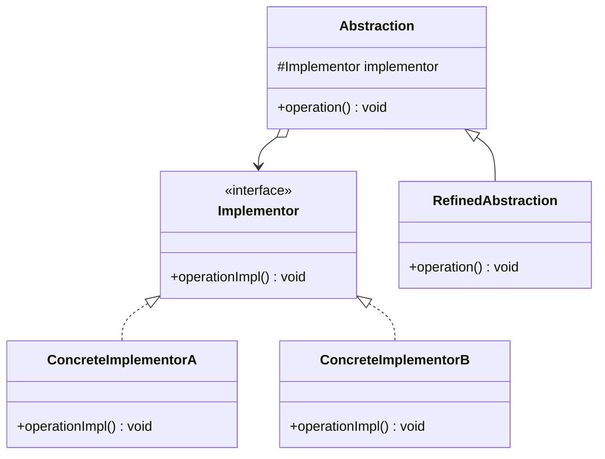

# Bridge Pattern

---

## Table of Contents
<!-- TOC -->
* [Bridge Pattern](#bridge-pattern)
  * [Overview](#overview)
  * [Pattern Structure](#pattern-structure)
  * [Bridge vs. Adapter](#bridge-vs-adapter)
  * [Q&A](#qa)
  * [Related Topics](#related-topics)
  * [Ref.](#ref)
<!-- TOC -->

---

The Bridge is one of the seven GoF structural design patterns. Its intent is to decouple an abstraction from its implementation so that the two can vary independently, replacing a rigid inheritance hierarchy with two smaller hierarchies connected by object composition. It matters whenever a class family has two dimensions of variation that would otherwise multiply into a combinatorial explosion of subclasses.

---

## Overview

Without Bridge, a class hierarchy that varies along two independent axes — say, shape type (`Circle`, `Square`) and rendering engine (`VectorRenderer`, `RasterRenderer`) — tends toward one subclass per combination: `VectorCircle`, `RasterCircle`, `VectorSquare`, `RasterSquare`. Adding a third shape or a third renderer multiplies the class count further. This is the exact problem Bridge is designed to solve.

Bridge splits the hierarchy in two: an `Abstraction` hierarchy (`Shape`, `Circle`, `Square`) that holds a reference to an `Implementor` interface (`Renderer`), and a separate `Implementor` hierarchy (`VectorRenderer`, `RasterRenderer`) that the abstraction delegates the actual work to. The abstraction is composed with, not inherited from, its implementor — so any abstraction can be paired with any implementor at runtime, and each hierarchy can grow independently without affecting the other.

The defining trait of Bridge, as distinct from other patterns that also separate interfaces, is that this split is deliberate and designed in from the start, anticipating that both the abstraction and the implementation will need to vary. Common real applications include cross-platform UI toolkits (a `Window` abstraction bridged to platform-specific `WindowImpl` implementors), device drivers, and persistence layers bridged to different storage backends.

<sub>[Back to top](#table-of-contents)</sub>

---

## Pattern Structure

`Abstraction` holds a reference to an `Implementor` and delegates the low-level work to it; `RefinedAbstraction` and concrete `Implementor`s can each be extended independently.



**Caption:** `Abstraction` delegates to an `Implementor` via composition rather than inheritance, so the abstraction hierarchy and the implementor hierarchy can each grow independently.

```java
public interface Renderer {
    void renderCircle(float radius);
}

public class VectorRenderer implements Renderer {
    public void renderCircle(float radius) {
        System.out.println("Drawing vector circle of radius " + radius);
    }
}

public class RasterRenderer implements Renderer {
    public void renderCircle(float radius) {
        System.out.println("Drawing raster circle of radius " + radius);
    }
}

public abstract class Shape {
    protected final Renderer renderer;
    protected Shape(Renderer renderer) { this.renderer = renderer; }
    public abstract void draw();
}

public class Circle extends Shape {
    private final float radius;
    public Circle(Renderer renderer, float radius) {
        super(renderer);
        this.radius = radius;
    }
    public void draw() { renderer.renderCircle(radius); }
}
```

Any shape can be paired with any renderer at construction time, without a subclass for each combination:

```java
Shape vectorCircle = new Circle(new VectorRenderer(), 5);
Shape rasterCircle = new Circle(new RasterRenderer(), 5);
vectorCircle.draw();
rasterCircle.draw();
```

<sub>[Back to top](#table-of-contents)</sub>

---

## Bridge vs. Adapter

Both Bridge and [Adapter](adapter.md) wrap one interface behind another via composition, and their class diagrams can look nearly identical — the distinction is about intent and timing, not structure.

- **When it's introduced.** Bridge is designed in upfront, before either the abstraction or the implementation has multiple variants, specifically to let both sides evolve independently. Adapter is applied after the fact, to make an already-existing, otherwise-incompatible class work with code that expects a different interface.
- **What problem it solves.** Bridge prevents a combinatorial class explosion across two dimensions of variation that the architect anticipated in advance. Adapter solves a one-off interface mismatch — often between your code and a third-party library you don't control and can't redesign.
- **Relationship to the wrapped object.** In Bridge, the abstraction and implementor are typically designed together as a matched pair of hierarchies. In Adapter, the adaptee usually predates the adapter and was never designed with it in mind.
- **In short:** if you're designing two hierarchies to vary independently from day one, that's Bridge. If you're retrofitting compatibility onto an interface you didn't design and can't change, that's Adapter.

<sub>[Back to top](#table-of-contents)</sub>

---

## Q&A

**Q: How is Bridge different from just having `Shape` implement `Renderer` directly?**
A: If `Shape` implemented `Renderer` directly (or extended a renderer base class), every new shape/renderer combination would require a new subclass, and shape logic would be tangled with rendering logic in one class. Bridge instead composes `Shape` with a `Renderer` reference, so shape count and renderer count multiply independently rather than combinatorially — N shapes and M renderers need N + M classes instead of N × M.

**Q: Does the Implementor interface have to mirror the Abstraction's interface?**
A: No, and usually it shouldn't. The Implementor interface should expose only the low-level primitive operations the Abstraction needs to compose its higher-level behavior from. The Abstraction's public API can be richer, simpler, or shaped completely differently from the Implementor's — the Implementor is a service the Abstraction consumes, not a mirror of it.

**Q: When is Bridge overkill?**
A: When there is genuinely only one dimension of variation, or the implementation side is never expected to change. Introducing a full Abstraction/Implementor split for a class that will only ever have one implementor adds a layer of indirection with no corresponding flexibility payoff — a plain inheritance hierarchy or a single concrete class is simpler and equally correct.

<sub>[Back to top](#table-of-contents)</sub>

---

## Related Topics

- [Adapter Pattern](adapter.md) — Structurally similar composition-based wrapping, but Adapter retrofits compatibility after the fact while Bridge is designed in upfront for independent variation
- [Facade Pattern](facade.md) — Both decouple clients from implementation details, but Facade simplifies access rather than enabling two hierarchies to vary independently
- [Abstract Factory](../creational/factory/abstract-factory.md) — Often used to construct matching Abstraction/Implementor pairs so callers don't have to wire them manually
- [Strategy Pattern](../behavioral/strategy.md) — Both favor composition over inheritance to swap behavior; Strategy swaps one algorithm, Bridge decouples two whole hierarchies

<sub>[Back to top](#table-of-contents)</sub>

---

## Ref.

- [Bridge — Refactoring.Guru](https://refactoring.guru/design-patterns/bridge) — Structure, applicability, and pros/cons
- [Bridge in Java — Refactoring.Guru](https://refactoring.guru/design-patterns/bridge/java/example) — Annotated Java implementation

---

[Get Started](../../../get-started.md) | [Design Patterns](../../../get-started.md#design-patterns)

---
