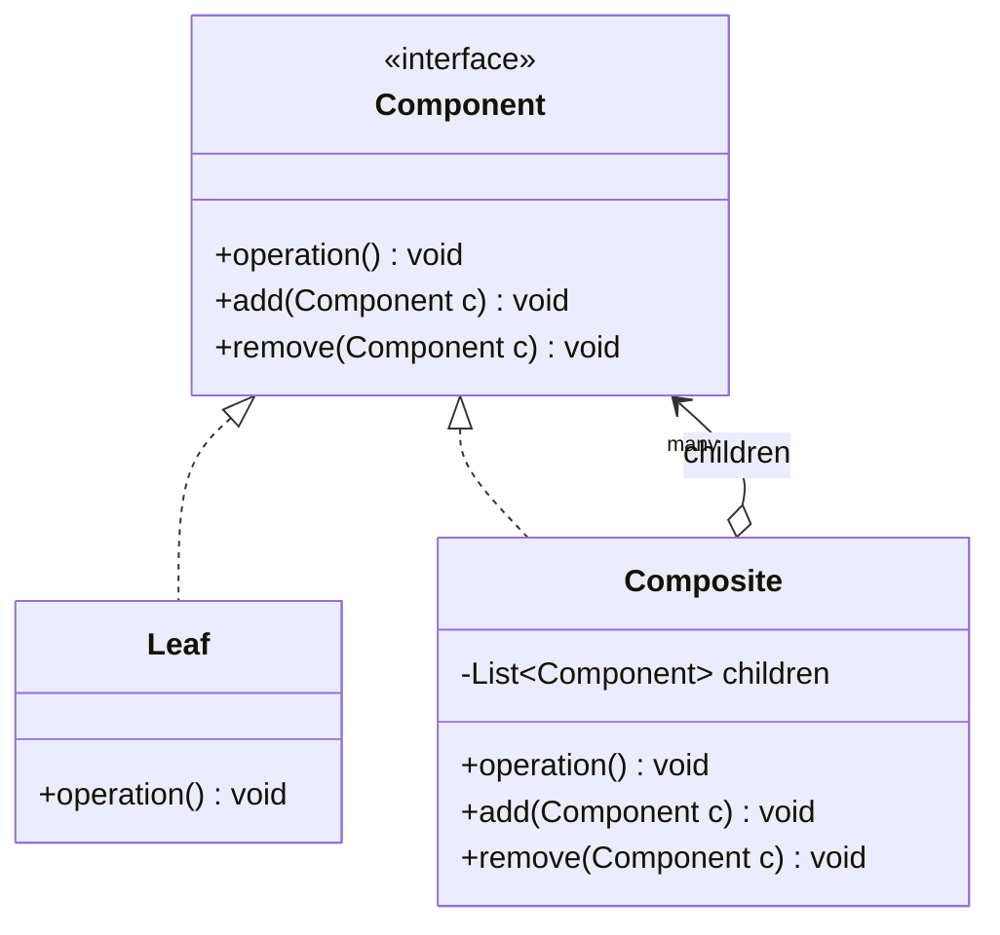

# Composite Pattern

---

## Table of Contents
<!-- TOC -->
* [Composite Pattern](#composite-pattern)
  * [Overview](#overview)
  * [Pattern Structure](#pattern-structure)
  * [Composite vs. Decorator](#composite-vs-decorator)
  * [Q&A](#qa)
  * [Related Topics](#related-topics)
  * [Ref.](#ref)
<!-- TOC -->

---

The Composite is one of the seven GoF structural design patterns. Its intent is to compose objects into tree structures that represent part-whole hierarchies, and to let clients treat individual objects and compositions of objects uniformly. It is the standard answer whenever a domain naturally forms a recursive tree — file systems, UI component trees, organization charts, or menu structures — and client code should not need to know whether it is holding a single item or a whole subtree.

---

## Overview

Composite defines a common interface (or abstract class) shared by both the individual "leaf" objects and the "composite" objects that contain other components — including other composites. Because leaves and composites implement the same interface, a client can call `render()`, `getPrice()`, or `execute()` on either one without an `if (isLeaf)` check anywhere in its code. Recursion does the traversal work: a composite's operation simply delegates to each of its children, which may themselves be composites.

The pattern trades a small amount of interface purity for large gains in client simplicity. Leaf classes are typically forced to implement child-management operations (`add`, `remove`, `getChild`) that don't make sense for them, either as no-ops or by throwing `UnsupportedOperationException`. This is a deliberate design trade-off GoF calls out explicitly: safety (leaves don't expose child operations) versus transparency (leaves and composites share one interface). Most real-world implementations favor transparency.

Composite is common in GUI toolkets (a `Panel` contains `Button`s and other `Panel`s), file systems (a `Directory` contains `File`s and other `Directory`s), and order/pricing systems (an `Order` contains `LineItem`s and nested `Bundle`s).

<sub>[Back to top](#table-of-contents)</sub>

---

## Pattern Structure

`Component` declares the operation common to both leaves and composites. `Composite` maintains a collection of child `Component`s and implements the operation by delegating to each child.



**Caption:** `Composite` holds a collection of `Component`s — which may themselves be `Leaf`s or further `Composite`s — and delegates its operation recursively to each child.

```java
public interface Component {
    void render(int depth);
}

public class Leaf implements Component {
    private final String name;
    public Leaf(String name) { this.name = name; }
    public void render(int depth) {
        System.out.println("-".repeat(depth) + name);
    }
}

public class Composite implements Component {
    private final String name;
    private final List<Component> children = new ArrayList<>();
    public Composite(String name) { this.name = name; }
    public void add(Component c) { children.add(c); }
    public void remove(Component c) { children.remove(c); }
    public void render(int depth) {
        System.out.println("-".repeat(depth) + name);
        for (Component child : children) {
            child.render(depth + 2);
        }
    }
}
```

A client builds and renders the tree without ever distinguishing leaves from composites:

```java
Composite root = new Composite("root");
Composite docs = new Composite("docs");
docs.add(new Leaf("readme.md"));
docs.add(new Leaf("license.md"));
root.add(docs);
root.add(new Leaf("build.gradle"));
root.render(0); // single call recurses through the whole tree
```

<sub>[Back to top](#table-of-contents)</sub>

---

## Composite vs. Decorator

Composite and [Decorator](decorator.md) are both built on recursive composition through a shared component interface, and both are frequently confused.

- **Intent differs.** Composite models a part-whole tree where a group of objects should be treated the same way as a single object — the point is uniform treatment of hierarchy. Decorator wraps a single object one layer at a time to add or modify its behavior — the point is extending responsibilities without subclassing.
- **Shape differs.** A Composite tree typically has many children per node and arbitrary depth driven by the domain data. A Decorator chain is a linear stack of wrappers, each holding exactly one wrapped component.
- **They combine well.** A UI toolkit can use Composite for the containment hierarchy (panels containing buttons) and Decorator for cross-cutting visual behavior (a `ScrollableDecorator` or `BorderDecorator` wrapped around any component, leaf or composite).

<sub>[Back to top](#table-of-contents)</sub>

---

## Q&A

**Q: Why do Leaf classes end up with `add()`/`remove()` methods that make no sense for them?**
A: This is the safety-versus-transparency trade-off GoF describes explicitly. Putting child-management methods on the shared `Component` interface (transparency) lets clients treat leaves and composites identically, at the cost of leaves having to implement operations they can't meaningfully support — usually as a no-op or by throwing `UnsupportedOperationException`. The alternative (safety) puts `add`/`remove` only on `Composite`, which is type-safe but forces clients to type-check and downcast before adding children, defeating much of the pattern's purpose.

**Q: How does a Composite operation avoid an explicit `if (isLeaf) ... else ...` in client code?**
A: Both `Leaf` and `Composite` implement the same `operation()` method from the shared `Component` interface. A `Leaf` implements it directly; a `Composite` implements it by looping over its children and calling `operation()` on each — polymorphism handles the recursion. The client only ever calls `component.operation()` and never needs to know which concrete type it holds.

**Q: When is Composite the wrong choice?**
A: When the hierarchy isn't actually recursive — e.g., a strictly two-level parent/children structure with no nesting — a Composite's generality is unnecessary complexity; a simple collection field is clearer. It's also a poor fit when leaves and composites have too little behavior in common to share a meaningful interface, since forcing a shared contract in that case produces awkward stub methods.

<sub>[Back to top](#table-of-contents)</sub>

---

## Related Topics

- [Decorator Pattern](decorator.md) — Both use recursive composition through a shared interface; Composite models part-whole trees, Decorator layers added behavior
- [Iterator Pattern](../behavioral/iterator.md) — Commonly paired with Composite to traverse the tree without exposing its internal structure
- [Visitor Pattern](../behavioral/visitor.md) — An alternative way to add operations across a Composite tree without modifying the Component hierarchy itself
- [Builder Pattern](../creational/builder.md) — Often used to construct a complex Composite tree step by step

<sub>[Back to top](#table-of-contents)</sub>

---

## Ref.

- [Composite — Refactoring.Guru](https://refactoring.guru/design-patterns/composite) — Structure, applicability, and pros/cons
- [Composite in Java — Refactoring.Guru](https://refactoring.guru/design-patterns/composite/java/example) — Annotated Java implementation

---

[Get Started](../../../get-started.md) | [Design Patterns](../../../get-started.md#design-patterns)

---
