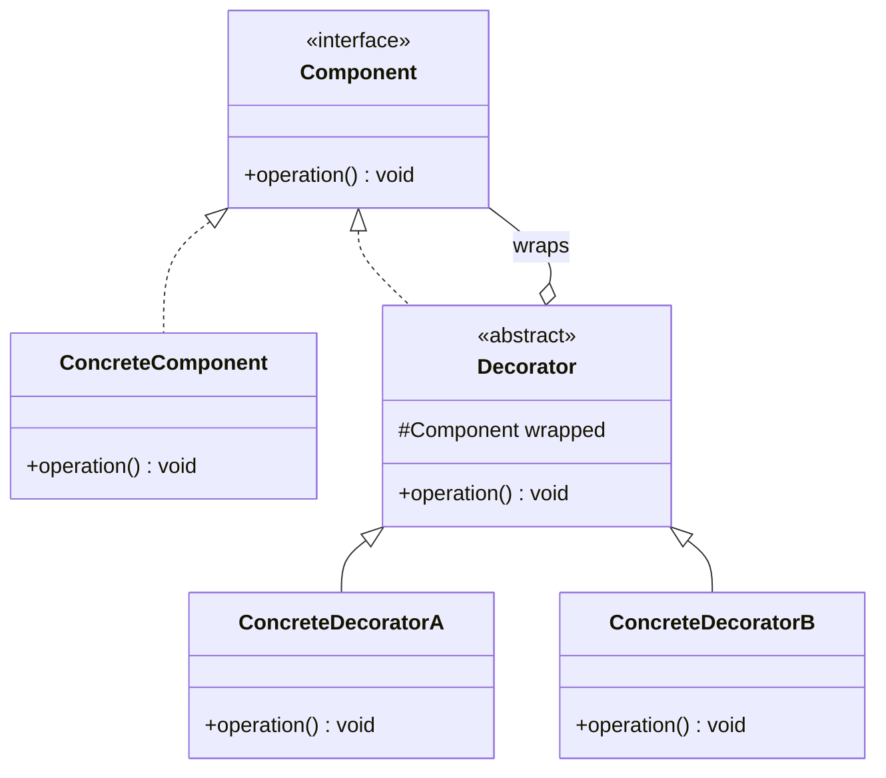

# Decorator Pattern

---

## Table of Contents
<!-- TOC -->
* [Decorator Pattern](#decorator-pattern)
  * [Overview](#overview)
  * [Pattern Structure](#pattern-structure)
  * [Stacking Decorators in Java](#stacking-decorators-in-java)
  * [Decorator vs. Proxy vs. Adapter](#decorator-vs-proxy-vs-adapter)
  * [Q&A](#qa)
  * [Related Topics](#related-topics)
  * [Ref.](#ref)
<!-- TOC -->

---

The Decorator is one of the seven GoF structural design patterns. Its intent is to attach additional responsibilities to an object dynamically, providing a flexible alternative to subclassing for extending behavior. Java's own `java.io` stream classes (`BufferedInputStream` wrapping a `FileInputStream`) are the most widely-recognized real-world example of this pattern.

---

## Overview

Decorator solves the problem of combinatorial subclass explosion. If a base behavior needs to be extended in several independent, optional ways — buffering, compression, encryption around a stream, for example — subclassing every combination (`BufferedCompressedFileInputStream`, `EncryptedCompressedFileInputStream`, and so on) grows exponentially with the number of independent features. Decorator instead wraps the base object in layers, each layer implementing the same interface and adding one responsibility before or after delegating to the wrapped object.

Because every Decorator implements the same component interface as the object it wraps, decorators are composable and transparent to the client: a client holding a reference to the interface cannot tell, and does not need to know, whether it holds the plain base object or an arbitrarily deep stack of decorators around it. New behavior can be added, removed, or reordered at runtime simply by changing which decorators are wrapped around the base object, which is precisely what static subclassing cannot offer.

The trade-off is indirection: a deeply decorated object requires following several layers of delegation to understand the final behavior, and debugging a long decorator chain can be harder than reading a single subclass.

<sub>[Back to top](#table-of-contents)</sub>

---

## Pattern Structure

`ConcreteDecorator` and `ConcreteComponent` both implement the same `Component` interface; each decorator holds a reference to a wrapped `Component` and adds behavior around its delegated call.



**Caption:** Each Decorator implements the same Component interface it wraps, allowing decorators to be stacked in any combination.

<sub>[Back to top](#table-of-contents)</sub>

---

## Stacking Decorators in Java

Each decorator implements the shared interface, wraps another instance of it, and adds behavior before or after delegating.

```java
public interface Coffee {
    double cost();
    String description();
}

public class Espresso implements Coffee {
    public double cost() { return 2.0; }
    public String description() { return "Espresso"; }
}

public abstract class CoffeeDecorator implements Coffee {
    protected final Coffee wrapped;
    protected CoffeeDecorator(Coffee wrapped) { this.wrapped = wrapped; }
}

public class MilkDecorator extends CoffeeDecorator {
    public MilkDecorator(Coffee wrapped) { super(wrapped); }
    public double cost() { return wrapped.cost() + 0.5; }
    public String description() { return wrapped.description() + " + Milk"; }
}

public class WhipDecorator extends CoffeeDecorator {
    public WhipDecorator(Coffee wrapped) { super(wrapped); }
    public double cost() { return wrapped.cost() + 0.7; }
    public String description() { return wrapped.description() + " + Whip"; }
}

// Usage:
Coffee order = new WhipDecorator(new MilkDecorator(new Espresso()));
order.cost();          // 3.2
order.description();   // "Espresso + Milk + Whip"
```

Each layer calls `wrapped.cost()` first and adds its own increment — the same delegation pattern `BufferedInputStream.read()` uses internally when wrapping a `FileInputStream`.

<sub>[Back to top](#table-of-contents)</sub>

---

## Decorator vs. Proxy vs. Adapter

Decorator, Proxy, and Adapter share the same structural shape — a wrapper class implementing the same or a related interface as a wrapped object — but their intents differ sharply.

- ### Decorator — adds behavior, same interface, no access control:
  The wrapped object is always reachable and functional; the Decorator's job is purely additive (logging, formatting, caching), and any number of decorators can be freely stacked.

  > See also: [Proxy Pattern](proxy.md), [Adapter Pattern](adapter.md)

- ### Proxy — controls access, same interface:
  A Proxy also implements the same interface as the object it wraps, but its intent is to control *access* to that object — lazily instantiating it, checking permissions, or forwarding to a remote instance — rather than to add new behavior to it. A Proxy typically wraps exactly one object and is not designed to be stacked.

- ### Adapter — changes the interface, no added behavior:
  An Adapter's wrapped object does not implement the interface the client expects at all; the Adapter's sole job is translating between two incompatible interfaces. Decorator's wrapped object already implements the interface the client uses — nothing needs translating, only extending.

<sub>[Back to top](#table-of-contents)</sub>

---

## Q&A

Common questions a software architect trainee would ask about this topic.

**Q: How is Decorator different from simply subclassing?**
A: Subclassing fixes behavior combinations at compile time — every combination of optional features needs its own subclass, which grows exponentially with the number of independent features. Decorator composes behavior at runtime by wrapping objects in layers, so any combination of decorators can be assembled dynamically without creating a new class for each combination.

---

**Q: How is Decorator different from Proxy, since both wrap an object behind the same interface?**
A: The distinguishing factor is intent, not structure. Decorator adds new responsibilities to an object that is already fully accessible — logging, formatting, or extra computation around each call. Proxy controls access to the wrapped object itself — deferring its creation (virtual proxy), checking permissions (protection proxy), or forwarding calls across a process boundary (remote proxy) — without adding behavior to what the object does once access is granted.

---

**Q: Why does `java.io` rely so heavily on Decorator?**
A: Streams have several independent, optional concerns — buffering, compression, character encoding, object serialization — that can apply to any underlying stream source (file, socket, memory buffer). Rather than a subclass for every combination of source and concern, `java.io` defines a common `InputStream`/`OutputStream` interface and layers decorators like `BufferedInputStream` and `GZIPInputStream` around any base stream, letting a client compose exactly the behaviors it needs.

<sub>[Back to top](#table-of-contents)</sub>

---

## Related Topics

- [Proxy Pattern](proxy.md) — Both wrap an object behind the same interface; Decorator adds behavior, Proxy controls access
- [Adapter Pattern](adapter.md) — Adapter changes an incompatible interface to match expectations; Decorator keeps the interface and adds behavior
- [Composite Pattern](composite.md) — Decorators and Composite nodes are both commonly built on a shared component interface, and decorators can wrap composite structures transparently

<sub>[Back to top](#table-of-contents)</sub>

---

## Ref.

- [Decorator — Refactoring.Guru](https://refactoring.guru/design-patterns/decorator) — Canonical reference with structure, pseudocode, and applicability guidance
- [Decorator in Java — Refactoring.Guru](https://refactoring.guru/design-patterns/decorator/java/example) — Java-specific implementation with annotated examples

---

[Get Started](../../../get-started.md) | [Design Patterns](../../../get-started.md#design-patterns)

---
