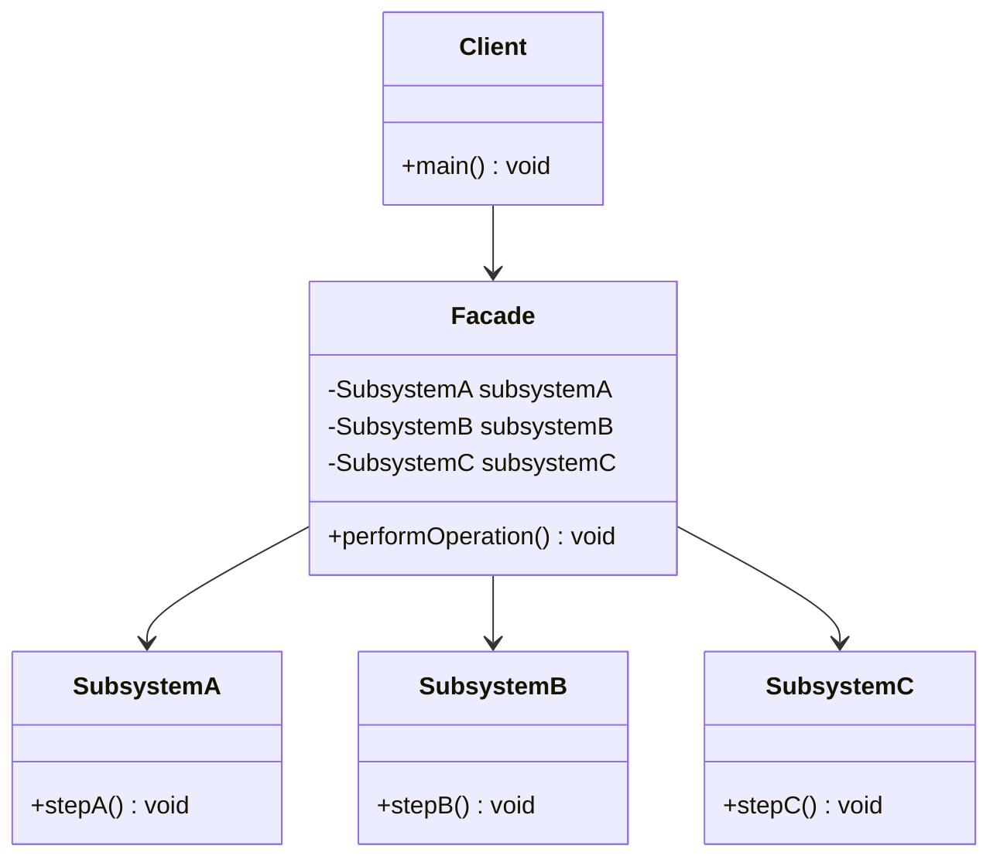

# Facade Pattern

---

## Table of Contents
<!-- TOC -->
* [Facade Pattern](#facade-pattern)
  * [Overview](#overview)
  * [Pattern Structure](#pattern-structure)
  * [Facade vs. Adapter vs. Mediator](#facade-vs-adapter-vs-mediator)
  * [Q&A](#qa)
  * [Related Topics](#related-topics)
  * [Ref.](#ref)
<!-- TOC -->

---

The Facade is one of the seven GoF structural design patterns. Its intent is to provide a unified, simplified interface to a set of interfaces in a subsystem, making the subsystem easier to use. It is the pattern of choice whenever client code needs to talk to a complex library or set of collaborating classes but should not be coupled to their internal structure or calling order.

---

## Overview

A subsystem — a video conversion library, a set of ORM/DAO classes, a cloud SDK — is often made of many classes that must be instantiated and called in a specific sequence to accomplish one coherent task. Without a Facade, every client that needs that task ends up duplicating the orchestration logic and becomes coupled to every class in the subsystem. Facade introduces one class that knows the correct sequence and exposes a small number of high-level methods, hiding the subsystem's internal classes from the client entirely.

Critically, Facade does not replace the subsystem's classes or forbid direct access to them — a client with advanced needs can still bypass the Facade and use the subsystem directly. The Facade is an additional, optional simplification layer, not a wrapper that must be worked around. This is a key difference from patterns that fully encapsulate what they wrap.

Facade is common at architectural boundaries: a `PaymentFacade` hiding a fraud-check service, a ledger service, and a notification service behind one `charge()` call; or a `ReportFacade` hiding data-fetching, formatting, and PDF-rendering subsystems behind one `generate()` call.

<sub>[Back to top](#table-of-contents)</sub>

---

## Pattern Structure

`Facade` holds references to the subsystem classes and exposes a small set of high-level methods that internally coordinate calls across them, in the correct order.



**Caption:** `Facade` coordinates calls across `SubsystemA`, `SubsystemB`, and `SubsystemC` behind one high-level method; the client never talks to the subsystem classes directly.

```java
class InventoryService {
    boolean reserve(String sku, int qty) { /* ... */ return true; }
}
class PaymentService {
    boolean charge(String customerId, double amount) { /* ... */ return true; }
}
class ShippingService {
    void schedule(String orderId) { /* ... */ }
}

public class OrderFacade {
    private final InventoryService inventory = new InventoryService();
    private final PaymentService payment = new PaymentService();
    private final ShippingService shipping = new ShippingService();

    public boolean placeOrder(String orderId, String sku, int qty,
                               String customerId, double amount) {
        if (!inventory.reserve(sku, qty)) return false;
        if (!payment.charge(customerId, amount)) return false;
        shipping.schedule(orderId);
        return true;
    }
}
```

The client calls one method instead of orchestrating three services itself:

```java
OrderFacade orders = new OrderFacade();
orders.placeOrder("ORD-1001", "SKU-42", 2, "cust-77", 59.90);
```

<sub>[Back to top](#table-of-contents)</sub>

---

## Facade vs. Adapter vs. Mediator

Facade is regularly confused with two other patterns that also sit between callers and other objects.

- **Facade vs. [Adapter](adapter.md).** Adapter's job is to convert one interface into another that a client already expects — it changes the shape of a single component so it becomes compatible. Facade's job is to simplify access to many components behind one new, deliberately smaller interface; it doesn't necessarily change the shape of anything, it reduces how much of it the client has to see. Adapter typically wraps one adaptee to satisfy a fixed contract; Facade typically wraps many collaborators to remove orchestration burden.
- **Facade vs. [Mediator](../behavioral/mediator.md).** Both reduce direct coupling between objects, but the direction of communication differs. Facade is essentially one-directional: the client calls the Facade, the Facade calls the subsystem, and the subsystem classes are not aware the Facade exists and don't call back through it. Mediator coordinates many peer objects that need to communicate with *each other* — the Colleague objects know about the Mediator and go through it to reach one another, so communication flows in multiple directions through a central hub.
- **Rule of thumb.** If you're hiding a one-way "call these three things in order" workflow, that's Facade. If you're decoupling a group of objects that all need to talk to each other, that's Mediator. If you're making one incompatible interface fit an expected one, that's Adapter.

<sub>[Back to top](#table-of-contents)</sub>

---

## Q&A

**Q: Does a Facade prevent clients from using the subsystem classes directly?**
A: No. Facade is an optional convenience layer, not an enforced boundary. A client with unusual requirements can still instantiate and call the subsystem classes directly, bypassing the Facade entirely. This is different from patterns like Proxy, where the wrapped object typically should not be reached except through the wrapper.

**Q: Isn't Facade just the same as Adapter with more classes wrapped?**
A: No — the intents differ even though both involve wrapping. Adapter exists to make an incompatible interface match one the client expects; the adaptee's interface is "wrong" for the context. Facade exists to reduce the surface area a client must learn and coordinate; none of the subsystem interfaces are necessarily wrong, there's just too much of them to deal with directly.

**Q: Can a system have more than one Facade over the same subsystem?**
A: Yes, and it's common. Different client contexts often need different simplified views of the same subsystem — e.g., an `AdminOrderFacade` exposing cancellation and refund operations versus a `CustomerOrderFacade` exposing only placement and tracking, both sitting over the same inventory, payment, and shipping services.

<sub>[Back to top](#table-of-contents)</sub>

---

## Related Topics

- [Adapter Pattern](adapter.md) — Converts one interface to another expected shape; Facade simplifies access to many interfaces without necessarily changing any of them
- [Mediator Pattern](../behavioral/mediator.md) — Coordinates bidirectional communication among peer objects; Facade is a one-directional simplification of subsystem access
- [Proxy Pattern](proxy.md) — Both add an indirection layer, but Proxy controls access to a single object with the same interface, while Facade simplifies access to many objects with a new interface
- [Bridge Pattern](bridge.md) — Both decouple a client from implementation details, but Bridge separates an abstraction from its implementation for independent variation, not simplification

<sub>[Back to top](#table-of-contents)</sub>

---

## Ref.

- [Facade — Refactoring.Guru](https://refactoring.guru/design-patterns/facade) — Structure, applicability, and pros/cons
- [Facade in Java — Refactoring.Guru](https://refactoring.guru/design-patterns/facade/java/example) — Annotated Java implementation

---

[Get Started](../../../get-started.md) | [Design Patterns](../../../get-started.md#design-patterns)

---
