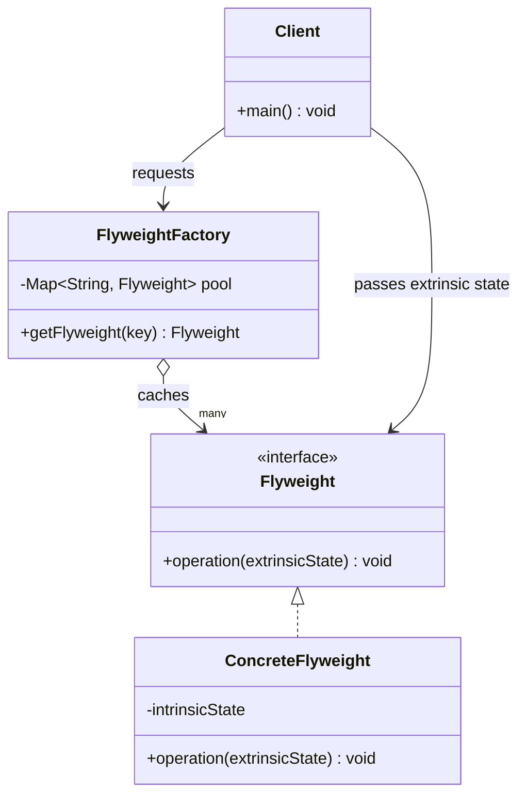

# Flyweight Pattern

---

## Table of Contents
<!-- TOC -->
* [Flyweight Pattern](#flyweight-pattern)
  * [Overview](#overview)
  * [Pattern Structure](#pattern-structure)
  * [Flyweight vs. Singleton](#flyweight-vs-singleton)
  * [Q&A](#qa)
  * [Related Topics](#related-topics)
  * [Ref.](#ref)
<!-- TOC -->

---

The Flyweight is one of the seven GoF structural design patterns. Its intent is to minimize memory usage by sharing as much data as possible with other similar objects, splitting an object's state into a shareable, immutable "intrinsic" part and a caller-supplied, context-dependent "extrinsic" part. It is the standard answer when an application needs to represent a very large number of fine-grained objects — glyphs in a text editor, tiles in a game map, particles in a simulation — and instantiating one full object per logical entity would exhaust memory.

---

## Overview

Consider rendering a million trees in a forest simulation. Each tree has a position (unique per tree) and a mesh, texture, and color palette (identical across every tree of the same species). Without Flyweight, a million `Tree` objects each carry their own copy of the mesh and texture data, even though that data is byte-for-byte identical across most of them. Flyweight splits `Tree` into two pieces: a shared, immutable `TreeType` (species, mesh, texture — the *intrinsic* state) and a lightweight `Tree` that holds only its unique position (the *extrinsic* state) plus a reference to its shared `TreeType`.

A `FlyweightFactory` maintains a pool of `TreeType` instances keyed by species, creating a new one only the first time a species is requested and returning the cached instance on every subsequent request. A million trees of ten species now require only ten `TreeType` objects in memory, not a million — the extrinsic position data is comparatively tiny and must still be stored per-tree, but it's passed into methods rather than stored redundantly inside each shared object.

The trade-off is added complexity: intrinsic state must be strictly immutable (since it's shared across many contexts) and callers must supply extrinsic state on every call, which couples client code to the split. Flyweight is worth the complexity only when the object count is large enough that the memory savings materially matter — it is a memory-time trade-off, not a general-purpose object-reduction technique.

<sub>[Back to top](#table-of-contents)</sub>

---

## Pattern Structure

`FlyweightFactory` caches and reuses `Flyweight` instances keyed by their intrinsic state; the `Client` supplies extrinsic state on each operation call rather than storing it in the shared flyweight.



**Caption:** The factory returns a cached `ConcreteFlyweight` for a given intrinsic key instead of constructing a new one; the client supplies extrinsic (context-specific) state on each call.

```java
public final class TreeType { // shared, immutable intrinsic state
    private final String species;
    private final String texture;
    public TreeType(String species, String texture) {
        this.species = species;
        this.texture = texture;
    }
    public void render(int x, int y) { // extrinsic state passed in
        System.out.println("Rendering " + species + " at (" + x + "," + y + ")");
    }
}

public final class TreeTypeFactory {
    private static final Map<String, TreeType> pool = new HashMap<>();
    public static TreeType get(String species, String texture) {
        return pool.computeIfAbsent(species, s -> new TreeType(s, texture));
    }
}

public final class Tree { // lightweight, holds only extrinsic state + a reference
    private final int x, y;
    private final TreeType type;
    public Tree(int x, int y, TreeType type) {
        this.x = x; this.y = y; this.type = type;
    }
    public void render() { type.render(x, y); }
}
```

A million trees of ten species share just ten `TreeType` instances:

```java
List<Tree> forest = new ArrayList<>();
for (int i = 0; i < 1_000_000; i++) {
    TreeType type = TreeTypeFactory.get("Oak", "oak_bark.png"); // reused, not recreated
    forest.add(new Tree(randomX(), randomY(), type));
}
```

<sub>[Back to top](#table-of-contents)</sub>

---

## Flyweight vs. Singleton

Both patterns funnel object creation through a controlling access point, and both are implemented with a static registry, but their goals are opposite.

- **Cardinality.** Singleton restricts a class to exactly one instance, globally, for the whole application lifetime. Flyweight deliberately maintains many shared instances — one per distinct intrinsic-state key — so the count is driven by how much variation exists in the data, not fixed at one.
- **Motivation.** Singleton exists to model something that is conceptually singular (one configuration, one logging facade). Flyweight exists purely as a memory optimization for a large population of otherwise-similar objects; the shared instances have no special conceptual singularity, they just happen to be identical and therefore safe to reuse.
- **State.** A Singleton frequently holds mutable state (it's often the whole point — a shared config or cache). A Flyweight's shared intrinsic state must be immutable, precisely because it's handed out to many unrelated contexts simultaneously; mutating it would corrupt every context sharing it.
- **They can combine.** The `FlyweightFactory` that maintains the shared pool is often itself implemented as a Singleton — the pool is a single global registry, even though it produces multiple shared Flyweight instances.

<sub>[Back to top](#table-of-contents)</sub>

---

## Q&A

**Q: What exactly is the difference between intrinsic and extrinsic state?**
A: Intrinsic state is the data that is identical across many objects and therefore safe to share — it's stored once inside the shared Flyweight and must be immutable. Extrinsic state is unique per logical object — position, current health, a runtime context — and cannot be shared; it's computed or stored by the client and passed into the Flyweight's methods as parameters at call time.

**Q: Why must intrinsic state be immutable?**
A: Because a single Flyweight instance is referenced by many different contexts simultaneously. If intrinsic state could be mutated, a change made on behalf of one context would silently corrupt the behavior observed by every other context sharing that same instance — there is no way to scope a mutation to just one caller.

**Q: When does introducing Flyweight actually pay off?**
A: Only when object count is large enough and enough of each object's state is shareable that the memory savings outweigh the added indirection and the complexity of threading extrinsic state through every call. For a few thousand objects, or objects with mostly-unique state, the pattern's bookkeeping overhead isn't justified — plain objects are simpler and the memory difference is negligible.

<sub>[Back to top](#table-of-contents)</sub>

---

## Related Topics

- [Singleton Pattern](../creational/singleton.md) — Both control instance creation through a static access point, but Singleton restricts to exactly one instance while Flyweight shares many
- [Factory Method](../creational/factory/factory-method.md) — The `FlyweightFactory` is a specialized factory that caches and reuses instances instead of always constructing new ones
- [Composite Pattern](composite.md) — Flyweight leaves in a Composite tree can share intrinsic state while each retains a unique position in the tree as extrinsic state
- [Proxy Pattern](proxy.md) — Both introduce an indirection object, but Proxy controls access to one real subject while Flyweight shares one instance across many logical contexts

<sub>[Back to top](#table-of-contents)</sub>

---

## Ref.

- [Flyweight — Refactoring.Guru](https://refactoring.guru/design-patterns/flyweight) — Structure, applicability, and pros/cons
- [Flyweight in Java — Refactoring.Guru](https://refactoring.guru/design-patterns/flyweight/java/example) — Annotated Java implementation

---

[Get Started](../../../get-started.md) | [Design Patterns](../../../get-started.md#design-patterns)

---
