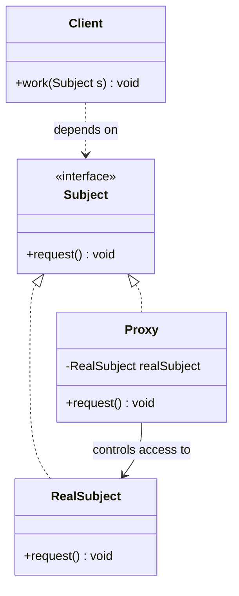
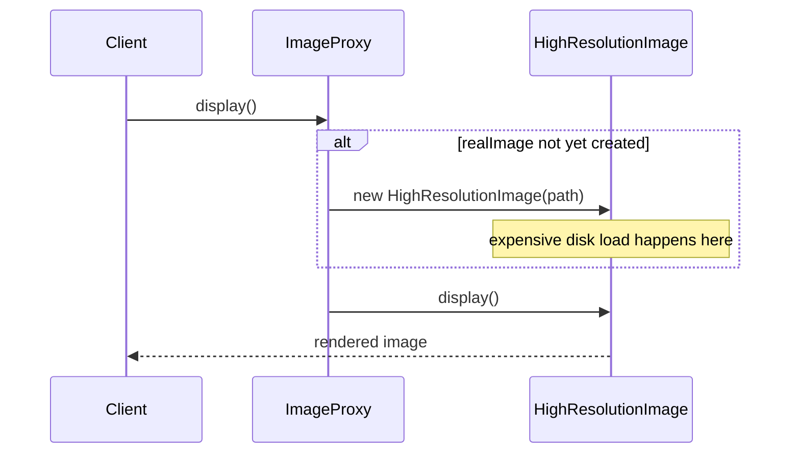

# Proxy Pattern

---

## Table of Contents
<!-- TOC -->
* [Proxy Pattern](#proxy-pattern)
  * [Overview](#overview)
  * [Pattern Structure](#pattern-structure)
  * [Virtual Proxy in Java](#virtual-proxy-in-java)
  * [Common Proxy Types](#common-proxy-types)
  * [Proxy vs. Decorator](#proxy-vs-decorator)
  * [Q&A](#qa)
  * [Related Topics](#related-topics)
  * [Ref.](#ref)
<!-- TOC -->

---

The Proxy is one of the seven GoF structural design patterns. Its intent is to provide a surrogate or placeholder for another object in order to control access to it. The proxy implements the same interface as the real object, so it can stand in for that object anywhere the client expects it, while adding logic around when and how the real object is actually reached.

---

## Overview

Proxy addresses situations where direct, unconditional access to an object is undesirable or impossible — the object is expensive to create, lives behind a permission boundary, or lives on a different machine entirely. Rather than making every client responsible for handling these concerns, a Proxy implementing the same interface as the real subject sits in front of it and handles the concern once, centrally.

The pattern is structurally similar to Decorator and Adapter — all three wrap another object behind a shared or related interface — but Proxy's defining characteristic is *access control* rather than added behavior or interface translation. A client holding a reference to the interface cannot tell whether it is talking to the real object or to a proxy standing in for it.

Common infrastructure built on Proxy includes Java's `java.lang.reflect.Proxy` (dynamic proxies used heavily by Spring AOP and Hibernate for lazy-loaded entity associations), ORM lazy-loading proxies, RPC/RMI client stubs, and caching proxies in front of expensive remote calls.

<sub>[Back to top](#table-of-contents)</sub>

---

## Pattern Structure

The `Proxy` implements the same `Subject` interface as the `RealSubject` and controls access to it, often creating or forwarding to the real object only when needed.



**Caption:** The Client depends only on the Subject interface; the Proxy decides when, whether, and how to forward each call to the RealSubject.

<sub>[Back to top](#table-of-contents)</sub>

---

## Virtual Proxy in Java

A virtual proxy defers creation of an expensive object until it's actually needed.

```java
public interface Image {
    void display();
}

public class HighResolutionImage implements Image {
    private final String path;

    public HighResolutionImage(String path) {
        this.path = path;
        loadFromDisk(path); // expensive: only run when this class is actually instantiated
    }

    private void loadFromDisk(String path) { /* costly I/O */ }

    @Override
    public void display() { /* render pixels */ }
}

public class ImageProxy implements Image {
    private final String path;
    private HighResolutionImage realImage; // not created until needed

    public ImageProxy(String path) { this.path = path; }

    @Override
    public void display() {
        if (realImage == null) {
            realImage = new HighResolutionImage(path); // lazy instantiation
        }
        realImage.display();
    }
}
```

The client holds an `Image` reference and calls `display()` normally — it never needs to know whether the expensive `HighResolutionImage` has been loaded yet, only the `ImageProxy` does.



**Caption:** The proxy defers the expensive `HighResolutionImage` construction until the first `display()` call actually requires it.

<sub>[Back to top](#table-of-contents)</sub>

---

## Common Proxy Types

The GoF catalog and common practice distinguish several proxy sub-types by what access concern they address:

| Type | Purpose |
|------|---------|
| Virtual Proxy | Defers creation of an expensive object until first actual use |
| Protection Proxy | Checks caller permissions before forwarding a call to the real object |
| Remote Proxy | Represents an object that lives in a different address space or on a different machine (e.g., RMI stubs) |
| Caching Proxy | Stores results of expensive calls and returns cached results for repeated requests |
| Logging/Smart Reference Proxy | Adds bookkeeping around access — reference counting, logging, or lazy loading of related objects (common in ORM associations) |

<sub>[Back to top](#table-of-contents)</sub>

---

## Proxy vs. Decorator

Both patterns wrap an object behind an identical interface, but the parallel structure hides a difference in intent.

- ### Proxy — controls access:
  The proxy decides *whether, when,* or *how* a call reaches the real subject — deferring creation, checking permissions, or crossing a network boundary. It typically wraps exactly one specific real subject and is not designed to be stacked with other proxies.

- ### Decorator — adds behavior:
  A decorator assumes the wrapped object is already fully accessible and adds new responsibilities around each call. Decorators are designed to be stacked arbitrarily, layering multiple independent behaviors on top of the same base object.

  > See also: [Decorator Pattern](decorator.md)

<sub>[Back to top](#table-of-contents)</sub>

---

## Q&A

Common questions a software architect trainee would ask about this topic.

**Q: How is Proxy different from Decorator if both implement the same interface as the wrapped object?**
A: The difference is intent, not structure. A Proxy controls *access* to the real object — deferring its creation, checking permissions, or forwarding across a process boundary — while presenting exactly the same interface and behavior once access is granted. A Decorator assumes the object is already freely accessible and adds *new behavior* around it. Proxies typically wrap one specific real subject; decorators are designed to be freely stacked.

---

**Q: What is a virtual proxy and when would you use one?**
A: A virtual proxy defers instantiation of an expensive object until it's actually needed, standing in for it in the meantime. It's used when an object is costly to create — large image loading, expensive database queries, remote object initialization — and the cost should only be paid if the object is genuinely used. ORM frameworks use this pattern extensively for lazy-loaded entity associations.

---

**Q: How does Java's `java.lang.reflect.Proxy` relate to the GoF Proxy pattern?**
A: `java.lang.reflect.Proxy` generates a dynamic proxy class implementing a given set of interfaces at runtime, routing every method call through an `InvocationHandler`. It is a generic mechanism for implementing the Proxy pattern (and also Decorator-like AOP behavior) without hand-writing a proxy class per interface — Spring AOP and Hibernate both use it to transparently wrap beans and entities with cross-cutting or lazy-loading logic.

<sub>[Back to top](#table-of-contents)</sub>

---

## Related Topics

- [Decorator Pattern](decorator.md) — Both wrap an object behind the same interface; Proxy controls access, Decorator adds behavior
- [Adapter Pattern](adapter.md) — Adapter translates between incompatible interfaces; Proxy preserves the same interface while mediating access
- [Facade Pattern](facade.md) — Facade simplifies access to a whole subsystem; Proxy controls access to a single object behind an identical interface

<sub>[Back to top](#table-of-contents)</sub>

---

## Ref.

- [Proxy — Refactoring.Guru](https://refactoring.guru/design-patterns/proxy) — Canonical reference with structure, pseudocode, and applicability guidance
- [Proxy in Java — Refactoring.Guru](https://refactoring.guru/design-patterns/proxy/java/example) — Java-specific implementation with annotated examples

---

[Get Started](../../../get-started.md) | [Design Patterns](../../../get-started.md#design-patterns)

---
