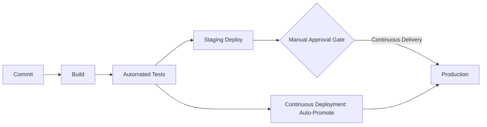

# CI/CD: Continuous Integration, Delivery, and Deployment

---

## Table of Contents
<!-- TOC -->
* [CI/CD: Continuous Integration, Delivery, and Deployment](#cicd-continuous-integration-delivery-and-deployment)
  * [Table of Contents](#table-of-contents)
  * [Overview](#overview)
  * [Continuous Integration (CI)](#continuous-integration-ci)
  * [Continuous Delivery (CD)](#continuous-delivery-cd)
  * [Continuous Deployment](#continuous-deployment)
  * [Key Concepts](#key-concepts)
  * [Q&A](#qa)
  * [Related Topics](#related-topics)
  * [Ref.](#ref)
<!-- TOC -->

---

CI/CD is the automation backbone of modern software delivery: a set of practices that move code from a developer's commit to running production software in small, frequent, low-risk increments. The three letters that make up "CI/CD" actually describe three distinct, progressively more automated stages — Continuous Integration, Continuous Delivery, and Continuous Deployment — and conflating them is one of the most common points of confusion for architects and engineers alike. Understanding where each stage ends and the next begins is essential for designing a pipeline that matches an organization's risk tolerance and release cadence.

---

## Overview

CI/CD emerged from the Agile and DevOps movements as a response to slow, error-prone, manual release processes. Instead of integrating large batches of work infrequently — the classic "integration hell" of long-lived feature branches — teams merge small changes constantly and let automation verify, package, and (optionally) release them. The practice is as much cultural as technical: it requires trunk-based or short-lived-branch workflows, a comprehensive automated test suite, and a shared team commitment to keeping the main branch always in a releasable state.

The three stages build on one another. CI is the foundation — it guarantees that code compiles, passes tests, and merges cleanly. Continuous Delivery extends CI by producing a deployable, release-ready artifact after every successful build, with a human deciding when to push it to production. Continuous Deployment goes one step further and removes that human gate entirely: every change that passes the pipeline is automatically released to production. All three stages typically run inside the same pipeline tool — GitHub Actions, GitLab CI, Jenkins, and similar platforms — the difference lies in how far the pipeline is allowed to go unattended.

[Back to top](#table-of-contents)

---

## Continuous Integration (CI)

Continuous Integration is the practice of merging all developers' working copies into a shared mainline frequently — multiple times a day — with every merge automatically built and tested.

- ### Frequent, Small Merges:
  Developers integrate their changes into the trunk (or a short-lived branch merged quickly) as often as possible. Small diffs are easier to review, test, and roll back than large ones.

- ### Automated Build and Test:
  Every push triggers an automated pipeline that compiles the code and runs the test suite (unit, and often integration, tests). A failing build is treated as a stop-the-line event that the team fixes before doing other work.

  > See also: [Automated Testing](devops-culture-practices.md#automated-testing)

- ### Fast Feedback:
  The goal is to catch integration bugs — conflicting changes, broken contracts, regressions — within minutes of a commit, not days or weeks later when the cause is much harder to trace.

[Back to top](#table-of-contents)

---

## Continuous Delivery (CD)

Continuous Delivery extends CI so that every change which passes the automated pipeline results in a build that is **always in a deployable state** — but a human still decides when it actually goes to production.

- ### Deployable Artifact, Every Time:
  The pipeline builds, tests, and packages the application (container image, binary, package) so that a release could happen at any moment, with a single, low-risk action.

- ### Staging Environments:
  Builds are typically promoted through one or more pre-production environments (staging, UAT) where further automated and sometimes manual verification happens before the release candidate is signed off.

- ### The Manual Approval Gate:
  This is the defining feature of Continuous Delivery: a person — a release manager, product owner, or the team itself — explicitly approves the push to production. The organization retains a deliberate checkpoint, often to align releases with business timing, compliance requirements, or change-management policy.

[Back to top](#table-of-contents)

---

## Continuous Deployment

Continuous Deployment is the natural extension of Continuous Delivery: **the manual approval gate is removed**. Every change that passes the automated pipeline is deployed to production automatically, with no human in the loop.

- ### No Human Gate:
  If the build passes every automated check — tests, security scans, quality gates — it ships. This demands a very high level of confidence in the automated test suite, since it is now the only thing standing between a bug and production users.

- ### Progressive Delivery Techniques:
  To keep this safe, teams commonly pair Continuous Deployment with canary releases, blue-green deployments, and feature flags, so that a bad change can be rolled back or its blast radius limited automatically.

  > See also: [Independent Deployability in Microservices](../architectural-patterns/microservices.md)

- ### Organizational Prerequisites:
  Continuous Deployment is not just a tooling choice — it requires strong observability, fast automated rollback, and a culture that trusts the pipeline. Many organizations deliberately stop at Continuous Delivery because the business needs a release gate, not because their tooling can't go further.

[Back to top](#table-of-contents)

**Caption:** After commit, build, and test, Continuous Delivery stops at a manual approval gate before production, while Continuous Deployment skips the gate and promotes automatically.

---

## Key Concepts

| Term | Definition |
|------|------------|
| Continuous Integration (CI) | Frequently merging and automatically building/testing code changes |
| Continuous Delivery (CD) | Every passing build is release-ready; a human approves the push to production |
| Continuous Deployment | Every passing build is automatically released to production, no human gate |
| Pipeline | The automated sequence of build, test, and release stages |
| Release Cadence | How often an organization chooses to ship — CI/CD enables high cadence, it doesn't mandate it |

[Back to top](#table-of-contents)

---

## Q&A

Common questions a software architect trainee would ask about this topic.

**Q: What is the actual difference between Continuous Delivery and Continuous Deployment?**
A: Both guarantee that every change passing the pipeline produces a release-ready artifact. The difference is a single decision point: Continuous Delivery keeps a manual approval gate before production, while Continuous Deployment removes it and deploys automatically. Delivery is about being *always able* to release; Deployment is about *always releasing*.

---

**Q: Why would a mature engineering organization choose Continuous Delivery over Continuous Deployment?**
A: The choice is often business-driven, not technical. Regulated industries, coordinated marketing launches, or contractual release windows may require a human checkpoint regardless of how good the automated test suite is. Continuous Deployment also demands very strong observability and automated rollback — some organizations aren't ready to remove the human safety net.

---

**Q: How does CI/CD relate to microservices architecture?**
A: Independently deployable services are only valuable if they can actually be deployed independently, quickly, and safely — which is exactly what CI/CD pipelines provide. Each microservice typically gets its own pipeline, so a change to one service doesn't require rebuilding or re-releasing the entire system.

[Back to top](#table-of-contents)

---

## Related Topics

- [Infrastructure as Code and Configuration Management](infrastructure-as-code.md) — provisions and configures the environments that CI/CD pipelines deploy into
- [DevOps Culture and Practices](devops-culture-practices.md) — the testing, monitoring, and cultural practices that make a CI/CD pipeline trustworthy
- [Microservices Architecture](../architectural-patterns/microservices.md) — independent deployability is a primary driver for adopting Continuous Delivery/Deployment

[Back to top](#table-of-contents)

---

## Ref.

- [GitHub Actions Documentation](https://docs.github.com/en/actions) — official CI/CD pipeline documentation
- [GitLab CI/CD Documentation](https://docs.gitlab.com/ee/ci/) — official CI/CD pipeline documentation
- [Jenkins Documentation](https://www.jenkins.io/doc/) — official documentation for the Jenkins automation server

---

[Get Started](../../get-started.md) | [DevOps Practices](../../get-started.md#devops-practices)

---
