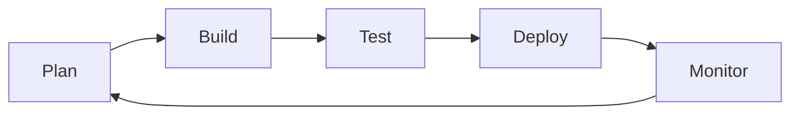

# DevOps Culture and Practices

---

## Table of Contents
<!-- TOC -->
* [DevOps Culture and Practices](#devops-culture-and-practices)
  * [Table of Contents](#table-of-contents)
  * [Overview](#overview)
  * [Agile Development](#agile-development)
  * [Version Control](#version-control)
  * [Automated Testing](#automated-testing)
  * [Collaboration and Communication](#collaboration-and-communication)
  * [DevOps Culture](#devops-culture)
  * [Continuous Monitoring](#continuous-monitoring)
  * [Q&A](#qa)
  * [Related Topics](#related-topics)
  * [Ref.](#ref)
<!-- TOC -->

---

DevOps is often reduced to its tooling — pipelines, containers, dashboards — but at its core it is a set of process and cultural practices that determine whether an organization can ship software quickly *and* safely. This page connects six practices that reinforce each other in a single feedback loop: Agile Development sets the cadence, Version Control is the shared substrate everything is built on, Automated Testing gates what moves through the pipeline, Collaboration/Communication and DevOps Culture form the human layer that makes the technical practices sustainable, and Continuous Monitoring closes the loop by feeding production reality back into the next iteration of planning.

---

## Overview

DevOps arose as a reaction to the traditional wall between development teams (who wanted to ship change) and operations teams (who wanted stability) — a structural conflict that produced slow, high-friction, blame-heavy releases. Rather than a specific tool or job title, DevOps names a philosophy: the people who build software should also be accountable for running it, and the feedback from running it should flow back into how it's built.

None of the six practices below function well in isolation. Agile cadence without automated testing just means shipping bugs faster. Version control without collaboration norms becomes a source of conflict rather than coordination. Monitoring without a culture that treats incidents as learning opportunities produces blame instead of improvement. The value of DevOps comes from treating these as one connected system, not a checklist of unrelated initiatives.

[Back to top](#table-of-contents)

---

## Agile Development

Agile development provides the iterative cadence that DevOps automation operates within. Rather than planning and delivering software in large, infrequent releases, Agile breaks work into short iterations (sprints) with continuous re-prioritization based on feedback.

This cadence is what makes CI/CD valuable in the first place — a pipeline that can deploy in minutes is only useful to an organization that is also willing to plan, build, and re-plan in small increments. Agile's retrospectives are also where the output of Continuous Monitoring (see below) gets converted back into the next iteration's priorities, closing the loop described at the end of this page.

[Back to top](#table-of-contents)

---

## Version Control

Version control (predominantly Git) is the substrate that every other practice on this page is built on top of. Application code, infrastructure code, configuration, and increasingly documentation and pipeline definitions all live in the same version-controlled history.

- ### Single Source of Truth:
  A version control system gives every change an author, a timestamp, a diff, and a reviewable history — the foundation that CI/CD pipelines trigger from and that audits and rollbacks depend on.

- ### Branching Strategy:
  Trunk-based development or short-lived feature branches merged frequently are the norm in high-performing DevOps organizations, since they minimize the integration risk that Continuous Integration is designed to catch early.

  > See also: [CI/CD](ci-cd.md)

[Back to top](#table-of-contents)

---

## Automated Testing

Automated testing is the gate that determines whether a change is allowed to progress through the pipeline. Without a trustworthy automated test suite, neither Continuous Delivery nor Continuous Deployment is safe to practice.

- ### Test Pyramid:
  A healthy suite favors many fast unit tests, fewer integration tests, and a small number of slow end-to-end tests — this shape keeps feedback fast while still catching cross-component issues.

- ### Shifting Left:
  Running tests as early as possible — on every commit, in the developer's own environment — catches defects when they are cheapest to fix, rather than after they've reached staging or production.

[Back to top](#table-of-contents)

---

## Collaboration and Communication

DevOps depends on fast, low-friction communication between the people who write code and the people who keep it running — which, ideally, are largely the same people.

- ### ChatOps:
  Running operational commands (deployments, rollbacks, status checks) directly from chat tools like Slack or Microsoft Teams keeps the team's actions visible to everyone, instead of hidden in an individual's terminal.

- ### Blameless Postmortems:
  When an incident happens, the goal of the retrospective is to understand the contributing systems and process gaps, not to assign fault to an individual. This is what makes engineers willing to be transparent about mistakes — a prerequisite for actually learning from them.

[Back to top](#table-of-contents)

---

## DevOps Culture

DevOps culture is the set of organizational norms that make the technical practices above sustainable rather than performative.

- ### Breaking Down Silos:
  Traditional organizations separate "Dev" (who write code) from "Ops" (who run it) as distinct teams with different incentives. DevOps culture pushes toward cross-functional teams that share both the upside (shipping features) and the downside (production incidents) of their software.

- ### "You Build It, You Run It":
  Popularized by Amazon, this principle makes the team that writes a service responsible for operating it in production, including being on call for it. This aligns incentives naturally: teams that feel the pain of a bad deploy write better tests and safer rollout strategies.

- ### Continuous Improvement:
  DevOps culture treats process itself as something to iterate on — retrospectives, postmortems, and metrics reviews are expected to produce concrete changes to how the team works, not just documentation of what happened.

[Back to top](#table-of-contents)

---

## Continuous Monitoring

Continuous Monitoring closes the feedback loop back to Agile planning. Logging, metrics, and tracing collected from running production systems tell the team whether their last set of changes actually improved things — and surface problems that only appear under real production load.

- ### Observability Signals:
  Logs, metrics, and distributed traces together let teams answer both expected questions (is the service within its SLOs?) and unexpected ones (why is this specific request slow?).

- ### Feeding Back into Planning:
  Alerts, dashboards, and incident postmortems are direct inputs into the next Agile iteration's backlog — monitoring isn't just an operational safety net, it's a primary source of what to build or fix next.

[Back to top](#table-of-contents)

**Caption:** The DevOps feedback loop — production monitoring data flows back into the next round of Agile planning, closing the cycle.

[Back to top](#table-of-contents)

---

## Q&A

Common questions a software architect trainee would ask about this topic.

**Q: Is "DevOps" just a rebranding of good Agile practice, or is it something distinct?**
A: They're complementary but distinct. Agile is primarily about how work is planned and iterated on with the customer/business in mind. DevOps extends that iterative mindset across the entire software lifecycle, including operations — it specifically addresses the dev/ops organizational split and the automation (CI/CD, IaC, monitoring) needed to make frequent releases safe.

---

**Q: How does "you build it, you run it" affect system design decisions, not just team structure?**
A: When the team that writes a service also carries the pager for it, they have a direct incentive to design for operability from the start — better logging, saner defaults, graceful degradation, and simpler rollback paths — rather than treating those as someone else's problem to solve after the fact.

---

**Q: Why are blameless postmortems considered a technical practice and not just a "soft skill"?**
A: Postmortems are the mechanism that converts an incident into a concrete engineering improvement — a new test, a monitoring alert, a design change. If postmortems assign blame, engineers become guarded and omit details, which directly degrades the quality of the root-cause analysis and the fixes that follow. Psychological safety is a precondition for accurate incident data.

[Back to top](#table-of-contents)

---

## Related Topics

- [CI/CD](ci-cd.md) — the automated pipeline that Automated Testing gates and that Version Control triggers
- [Infrastructure as Code and Configuration Management](infrastructure-as-code.md) — applies the same version-control and automation discipline described here to infrastructure itself
- [Microservices Architecture](../architectural-patterns/microservices.md) — organizational alignment around independently owned services reflects the "you build it, you run it" principle

[Back to top](#table-of-contents)

---

## Ref.

- [Google Cloud: What is DevOps?](https://cloud.google.com/devops) — vendor-neutral overview of DevOps principles and practices
- [Atlassian: DevOps Guide](https://www.atlassian.com/devops) — overview of Agile, collaboration, and monitoring practices within DevOps

---

[Get Started](../../get-started.md) | [DevOps Practices](../../get-started.md#devops-practices)

---
