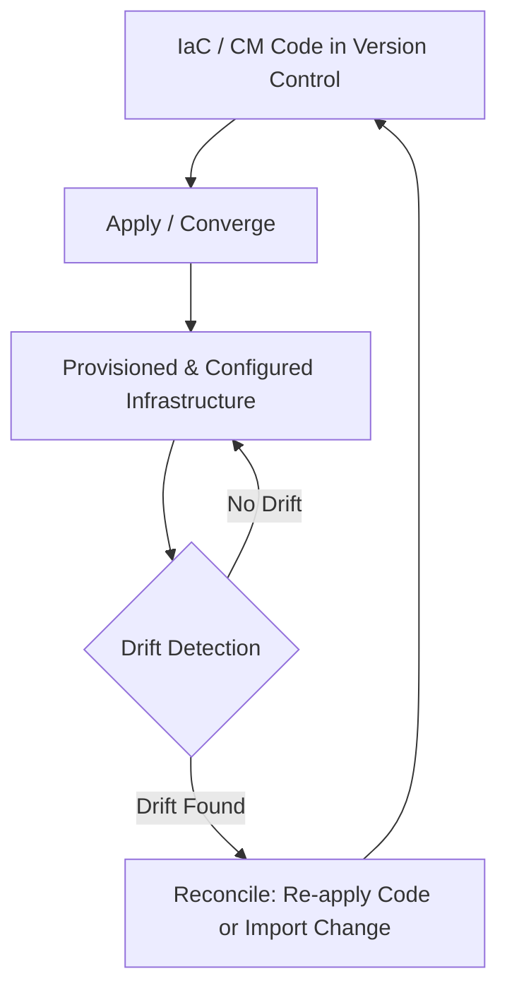

# Infrastructure as Code and Configuration Management

---

## Table of Contents
<!-- TOC -->
* [Infrastructure as Code and Configuration Management](#infrastructure-as-code-and-configuration-management)
  * [Table of Contents](#table-of-contents)
  * [Overview](#overview)
  * [Infrastructure as Code (IaC)](#infrastructure-as-code-iac)
  * [Configuration Management](#configuration-management)
  * [Key Concepts](#key-concepts)
  * [Q&A](#qa)
  * [Related Topics](#related-topics)
  * [Ref.](#ref)
<!-- TOC -->

---

Infrastructure as Code and Configuration Management are the two practices that let teams treat servers, networks, and application configuration as versioned, repeatable, testable artifacts instead of hand-tuned machines. Together they replace the "pet server" mindset — where a unique, manually-configured box is nursed and feared — with reproducible, disposable infrastructure that can be recreated from source control at any time. They are closely related, frequently confused, and increasingly implemented by overlapping tools, but they solve two conceptually different problems.

---

## Overview

Before IaC and Configuration Management became standard practice, infrastructure was typically provisioned and configured by hand or through ad-hoc scripts, following runbooks that drifted from reality the moment someone made an undocumented change directly on a server. This produced environments that were slow to reproduce, impossible to audit reliably, and terrifying to rebuild after a failure.

Both practices address this by applying software engineering discipline — version control, code review, automated testing, repeatability — to infrastructure and configuration. IaC is concerned with *what infrastructure exists*: the virtual machines, networks, load balancers, and managed services that make up an environment. Configuration Management is concerned with *the state of software running on that infrastructure*: installed packages, configuration files, running services, users, and permissions. In modern cloud-native stacks, the two are usually combined — IaC provisions a virtual machine or Kubernetes cluster, and Configuration Management (or a container image build) ensures the software on it is in the correct state.

[Back to top](#table-of-contents)

---

## Infrastructure as Code (IaC)

Infrastructure as Code is the practice of defining and provisioning infrastructure through machine-readable definition files, rather than manual configuration or interactive tools.

- ### Declarative vs. Imperative:
  Declarative IaC describes the *desired end state* ("there should be one load balancer with these two backend instances") and lets the tool figure out how to get there — this is the dominant model (Terraform, CloudFormation, Pulumi in declarative mode). Imperative IaC describes the *sequence of steps* to reach that state ("create a VM, then attach a disk, then configure networking"). Declarative approaches are generally preferred because they are idempotent by design and easier to reason about at scale.

- ### Idempotency:
  Applying the same IaC definition multiple times should produce the same result without unintended side effects. Re-running a declarative plan against infrastructure that already matches the desired state should be a no-op; this property is what makes IaC safe to run repeatedly and to use as the single source of truth.

- ### Drift:
  Drift occurs when the real state of infrastructure diverges from what the code declares — typically because someone made a manual change outside the IaC workflow. Detecting and reconciling drift (either by re-applying the code or importing the manual change back into it) is an ongoing operational concern in any IaC-managed environment.

- ### Tooling Landscape:
  Terraform, AWS CloudFormation, and Pulumi are among the most widely used IaC tools, each with different language models (HCL, JSON/YAML, and general-purpose languages respectively). This page intentionally does not teach any single tool's syntax — consult the official documentation linked below for hands-on usage.

[Back to top](#table-of-contents)

---

## Configuration Management

Configuration Management is the practice of maintaining systems, software, and configuration files in a known, consistent, and desired state over time.

- ### Configuring What Already Exists:
  Where IaC answers "what infrastructure should exist," Configuration Management answers "what should be installed and configured on it" — packages, users, file contents, running services, permissions — on servers that IaC (or manual provisioning) has already created.

- ### Common Tools:
  Ansible, Chef, and Puppet are the most established Configuration Management tools. They range from agentless and push-based (Ansible) to agent-based and pull-based (Chef, Puppet), but all share the goal of converging a machine's actual state toward a declared desired state.

- ### The Blurred Line with IaC:
  In practice, the boundary between IaC and Configuration Management has blurred considerably. Terraform provisioners can run configuration scripts at boot; Ansible can create cloud infrastructure; and container-based workflows often fold configuration entirely into the image build (a Dockerfile is arguably both IaC and Configuration Management at once). Immutable infrastructure — replacing a whole instance or container rather than patching it in place — has further reduced the need for traditional post-provisioning configuration management in many cloud-native architectures.

[Back to top](#table-of-contents)

**Caption:** Code in version control is applied to produce infrastructure, which is periodically checked for drift; any divergence is reconciled back through the same code-first workflow.

---

## Key Concepts

| Term | Definition |
|------|------------|
| Declarative | Describes the desired end state; the tool determines how to reach it |
| Imperative | Describes the explicit steps to reach a state |
| Idempotency | Re-applying the same definition produces the same result with no unintended side effects |
| Drift | Divergence between actual infrastructure state and the state declared in code |
| Immutable Infrastructure | Replacing instances/containers wholesale instead of modifying them in place |

[Back to top](#table-of-contents)

---

## Q&A

Common questions a software architect trainee would ask about this topic.

**Q: If a tool like Terraform can also run a provisioning script, and Ansible can also create cloud resources, is the IaC vs. Configuration Management distinction still meaningful?**
A: Conceptually yes, even though the tooling has blurred. IaC's core concern is the existence and topology of infrastructure resources; Configuration Management's core concern is the state of software on top of that infrastructure. Most architectures still benefit from keeping these responsibilities separated — for example, Terraform for provisioning and Ansible or a container image build for configuration — even when a single tool is technically capable of doing both.

---

**Q: Why is idempotency so important in IaC and Configuration Management?**
A: Pipelines re-apply the same code repeatedly — on every deploy, on a schedule, or in response to drift detection. If applying the same definition twice produced different results (e.g., creating a duplicate resource), automation would be unsafe to run unattended, defeating the purpose of codifying infrastructure in the first place.

---

**Q: How does immutable infrastructure change the role of Configuration Management?**
A: When servers or containers are replaced wholesale rather than patched in place, there is no long-lived instance to converge toward a desired state — the desired state is baked into the image at build time. This shifts much of Configuration Management's traditional responsibility into the CI pipeline that builds the image, reducing (but not eliminating) the need for runtime configuration tools.

[Back to top](#table-of-contents)

---

## Related Topics

- [CI/CD](ci-cd.md) — pipelines commonly invoke IaC and Configuration Management tooling as deployment steps
- [DevOps Culture and Practices](devops-culture-practices.md) — version control and automated testing apply to infrastructure code the same way they do to application code
- [Microservices Architecture](../architectural-patterns/microservices.md) — independently deployable services rely on IaC to provision consistent, repeatable environments per service

[Back to top](#table-of-contents)

---

## Ref.

- [Terraform Documentation](https://developer.hashicorp.com/terraform/docs) — official Infrastructure as Code documentation
- [Ansible Documentation](https://docs.ansible.com/) — official Configuration Management documentation

---

[Get Started](../../get-started.md) | [DevOps Practices](../../get-started.md#devops-practices)

---
