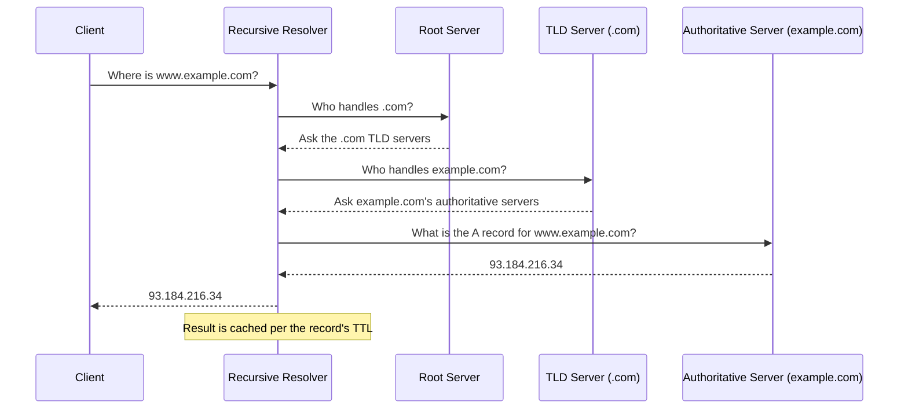

# DNS (Domain Name System)

---

## Table of Contents
<!-- TOC -->
* [DNS (Domain Name System)](#dns-domain-name-system)
  * [Table of Contents](#table-of-contents)
  * [Overview](#overview)
  * [How DNS Resolution Works](#how-dns-resolution-works)
  * [Common DNS Record Types](#common-dns-record-types)
  * [Why DNS Matters Architecturally](#why-dns-matters-architecturally)
  * [Q&A](#qa)
  * [Related Topics](#related-topics)
  * [Ref.](#ref)
<!-- TOC -->

---

**DNS (Domain Name System)** is the Internet's distributed, hierarchical naming system — it translates human-readable domain names (`example.com`) into the IP addresses (see [IP Addressing](ip-addressing.md)) that machines actually route traffic to. It's easy to take for granted, but DNS underpins service discovery, CDN routing, and failover strategy in almost every distributed system an architect designs.

---

## Overview

DNS was created in the early 1980s to replace a single, manually maintained `HOSTS.TXT` file that no longer scaled as the ARPANET grew — the same class of scaling problem that later motivates service discovery inside a microservices system. Its design is deliberately hierarchical and distributed: no single server holds the entire namespace, and authority is delegated downward from root servers to top-level domain (TLD) servers to the authoritative servers for each domain.

Beyond simple name-to-IP lookup, DNS is a general-purpose, globally distributed key-value lookup system, which is why it's reused for so much more than "find the server for this website" — mail routing (MX), domain verification and anti-spam policy (TXT), and traffic steering for CDNs and multi-region failover.

[Back to top](#table-of-contents)

---

## How DNS Resolution Works

A DNS lookup is a chain of delegated queries, typically starting from a **recursive resolver** (often run by your ISP or a public service like `8.8.8.8` or `1.1.1.1`) that does the legwork on behalf of the client.

**Caption:** A recursive resolver walks the DNS hierarchy from root to TLD to authoritative server on behalf of the client, then caches the answer for the record's TTL.

- ### Recursive Resolver:
  The entry point for a client's query. It either has the answer cached, or performs the full walk down the hierarchy and returns the final answer to the client.

[Back to top](#table-of-contents)

- ### Root and TLD Servers:
  Root servers know which servers are authoritative for each top-level domain (`.com`, `.org`, `.io`, etc.); TLD servers in turn know which servers are authoritative for each specific domain registered under them.

[Back to top](#table-of-contents)

- ### Authoritative Server:
  The final source of truth for a domain's records — this is where a domain's actual DNS configuration (A records, MX records, etc.) lives, typically managed through a DNS hosting provider or the cloud provider's DNS service.

[Back to top](#table-of-contents)

- ### Caching and TTL:
  Every DNS record has a **TTL (Time To Live)** dictating how long resolvers may cache it before re-querying. This is a direct architectural lever: a low TTL enables fast failover (change the record, clients pick it up quickly) at the cost of more query volume; a high TTL reduces load and latency but slows how quickly changes propagate.

[Back to top](#table-of-contents)

---

## Common DNS Record Types

| Record | Purpose |
|---|---|
| **A** | Maps a domain name to an IPv4 address |
| **AAAA** | Maps a domain name to an IPv6 address |
| **CNAME** | Aliases one domain name to another (common for pointing a subdomain at a CDN or load balancer hostname) |
| **MX** | Specifies the mail servers responsible for receiving email for the domain, with a priority |
| **TXT** | Holds arbitrary text, commonly used for domain ownership verification, SPF/DKIM anti-spam policy, and other metadata |

[Back to top](#table-of-contents)

---

## Why DNS Matters Architecturally

- ### Service Discovery Parallel:
  Internally, systems solve the same "name to location" problem DNS solves globally — Kubernetes' internal DNS, service meshes, and service registries are conceptually the same pattern applied at a smaller, faster-changing scale. Understanding public DNS resolution makes internal service discovery mechanisms easier to reason about.

[Back to top](#table-of-contents)

- ### CDN and Traffic Routing:
  CDNs and global load balancers frequently use DNS itself as the routing mechanism: a CNAME or specialized DNS response can direct different clients to different, geographically nearer edge servers based on the resolver's location — this is how many CDNs implement geo-routing without any special client logic.

[Back to top](#table-of-contents)

- ### Failover Strategy:
  DNS TTL directly bounds how fast a DNS-based failover can take effect — a disaster-recovery plan that relies on repointing a DNS record needs a TTL short enough (often minutes, not the default 24 hours) to make failover happen inside the recovery time objective (RTO). Architects designing multi-region failover need to plan TTLs ahead of the incident, not during it.

[Back to top](#table-of-contents)

---

## Q&A

Common questions a software architect trainee would ask about this topic.

**Q: Why does DNS TTL matter for a disaster-recovery or failover design?**
A: TTL sets an upper bound on how long clients (and intermediate resolvers) keep using a stale, cached answer after a record changes. If a failover plan involves repointing a DNS record to a healthy region, a 24-hour TTL means some clients could keep hitting the failed region for up to a day; architects who anticipate DNS-based failover set a much shorter TTL on the relevant records ahead of time.

---

**Q: What's the difference between an A record and a CNAME, and why would I choose one over the other?**
A: An A record maps a name directly to an IP address; a CNAME maps a name to another name, which is then resolved further. CNAMEs are preferred when the target's IP might change (e.g., pointing at a CDN or managed load balancer hostname) because the CDN/provider can change its own IP without you updating your DNS. A records are typically used at the apex/root domain since some DNS providers restrict CNAMEs there.

---

**Q: How is internal service discovery in a microservices system related to DNS?**
A: They solve the same fundamental problem — resolving a stable name to a current, possibly-changing network location — just at different scales and speeds. Kubernetes' internal DNS (`my-service.namespace.svc.cluster.local`) and service mesh registries apply the DNS pattern to the much faster churn of pods and instances being created and destroyed, where public DNS's TTL-based caching would be far too slow.

[Back to top](#table-of-contents)

---

## Related Topics

- [IP Addressing](ip-addressing.md) — DNS ultimately resolves to the IP addresses this page covers
- [TCP/IP](tcp-ip.md) — DNS queries typically travel over UDP (falling back to TCP for large responses)
- [The OSI Model](osi-model.md) — DNS is an Application-layer (Layer 7) protocol
- [Microservices Architecture](../architectural-patterns/microservices.md) — service discovery inside a microservices system mirrors DNS's name-to-location resolution pattern

[Back to top](#table-of-contents)

---

## Ref.

- [RFC 1035 — Domain Names: Implementation and Specification](https://www.rfc-editor.org/rfc/rfc1035) — the core DNS protocol specification
- [What is DNS? — Cloudflare Learning Center](https://www.cloudflare.com/learning/dns/what-is-dns/) — accessible architect-level overview

---

[Get Started](../../get-started.md) | [Networking Concepts](../../get-started.md#networking-concepts)

---
