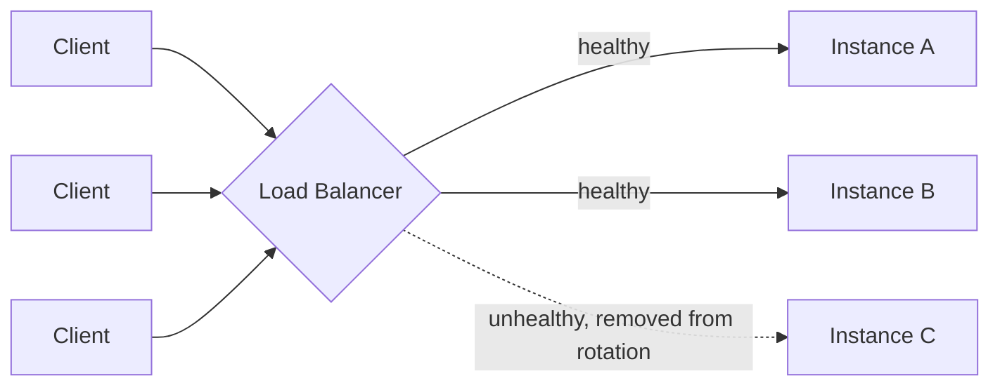

# Load Balancing

---

## Table of Contents
<!-- TOC -->
* [Load Balancing](#load-balancing)
  * [Table of Contents](#table-of-contents)
  * [Overview](#overview)
  * [Load Balancing Algorithms](#load-balancing-algorithms)
  * [Layer 4 vs. Layer 7 Load Balancing](#layer-4-vs-layer-7-load-balancing)
  * [Health Checks](#health-checks)
  * [Why This Matters for Architecture](#why-this-matters-for-architecture)
  * [Q&A](#qa)
  * [Related Topics](#related-topics)
  * [Ref.](#ref)
<!-- TOC -->

---

Load balancing is the practice of distributing incoming network traffic across multiple backend instances so that no single instance becomes a bottleneck or a single point of failure. It is arguably the single most architecturally consequential networking concept in this training path: almost every horizontally-scaled system — microservices, web tiers, API gateways — depends on a load balancer sitting somewhere in the request path, and the choice of algorithm and layer has direct, visible consequences for reliability, latency, and cost.

---

## Overview

Before load balancing, scaling a service meant scaling a single machine vertically (more CPU, more RAM) — an approach with a hard ceiling and no fault tolerance. Load balancing enabled horizontal scaling: run many smaller, replaceable instances behind a single logical address, and let the load balancer decide, request by request or connection by connection, which instance handles the work.

A load balancer can be a dedicated hardware appliance, a software process (NGINX, HAProxy, Envoy), or a managed cloud service (AWS ELB/ALB/NLB, Azure Load Balancer, GCP Cloud Load Balancing). Regardless of implementation, it plays the same architectural role: a single, stable entry point in front of a fleet of interchangeable, disposable instances.

[Back to top](#table-of-contents)

---

## Load Balancing Algorithms

The algorithm determines *which* backend instance receives the next request or connection.

- ### Round Robin:
  Requests are distributed sequentially across the pool of backends in a fixed rotation. It's simple and works well when instances are roughly equal in capacity and requests are roughly equal in cost — but it ignores current load, so a backend still processing a slow request can still receive the next one.

[Back to top](#table-of-contents)

- ### Least Connections:
  The load balancer tracks how many active connections each backend currently holds and routes the next request to the instance with the fewest. This adapts better than round robin when request processing times vary significantly, since it naturally avoids piling more work onto an already-busy instance.

[Back to top](#table-of-contents)

- ### IP Hash:
  The client's IP address (or another request attribute) is hashed to consistently map a given client to the same backend instance. This provides **session affinity** (sometimes called "sticky sessions") without needing a shared session store — useful for stateful backends, but it can cause uneven load distribution if client IPs aren't uniformly distributed, and it complicates scaling the backend pool up or down since the hash mapping shifts.

[Back to top](#table-of-contents)

---

## Layer 4 vs. Layer 7 Load Balancing

- ### Layer 4 (Transport Layer):
  A Layer 4 load balancer makes routing decisions based on IP address and TCP/UDP port alone, without inspecting the content of the request. It simply forwards packets/connections to a backend. This is fast and protocol-agnostic (works for any TCP/UDP traffic, not just HTTP), but it can't route based on anything inside the payload — no URL path, no HTTP header, no cookie.

[Back to top](#table-of-contents)

- ### Layer 7 (Application Layer):
  A Layer 7 load balancer terminates the connection and inspects the actual application-layer content — HTTP method, URL path, headers, cookies — before deciding where to route. This enables content-based routing (e.g., `/api/orders` to the orders service, `/api/users` to the users service), which is exactly the mechanism behind an API Gateway routing to different microservices. The cost is more processing overhead per request and protocol-specific logic (typically HTTP/HTTPS/gRPC).

  > See also: [Microservices Architecture](../architectural-patterns/microservices.md) — Layer 7 load balancing and API Gateway routing are the mechanism that makes a microservices system's individually-scaled services addressable behind a single entry point.

[Back to top](#table-of-contents)

---

## Health Checks

A load balancer is only as good as its knowledge of which backends are actually healthy.

- ### Active and Passive Health Checks:
  Active health checks have the load balancer periodically poll each backend (e.g., an HTTP `GET /health` endpoint) and remove it from rotation if it fails to respond correctly. Passive health checks observe real traffic — if a backend starts returning errors or timing out on live requests, it's marked unhealthy without a dedicated probe. Most production load balancers combine both: active checks catch a dead instance before it receives real traffic, passive checks catch degradation that only shows up under real load.

[Back to top](#table-of-contents)

**Caption:** The load balancer distributes client requests across healthy backend instances using its configured algorithm, while continuously health-checking each instance and pulling failing ones out of rotation.

[Back to top](#table-of-contents)

---

## Why This Matters for Architecture

Load balancing is not an infrastructure afterthought — it directly shapes several architectural decisions: whether a service can be scaled horizontally at all depends on whether it can tolerate any instance handling any request (statelessness); the choice of Layer 4 vs. Layer 7 determines whether path-based routing to different services is even possible; the choice of algorithm affects tail latency under uneven request costs; and health-check design determines how quickly the system detects and routes around a failing instance, which is a first-order contributor to overall availability.

[Back to top](#table-of-contents)

---

## Q&A

Common questions a software architect trainee would ask about this topic.

**Q: Why does session affinity (IP hash) make horizontal scaling harder?**
A: If a client is pinned to a specific backend instance, that instance can't be freely removed or added without disrupting in-flight sessions for the clients hashed to it, and load can become uneven if traffic isn't uniformly distributed across client IPs. The more scalable alternative is to keep backends stateless and externalize session state to a shared store (e.g., a distributed cache), so any instance can serve any request.

---

**Q: When would you choose a Layer 4 load balancer over a Layer 7 one?**
A: When you need to balance non-HTTP TCP/UDP traffic (databases, custom protocols, raw sockets), when you need the lowest possible latency and don't need content-based routing, or when TLS should terminate at the backend rather than at the load balancer for end-to-end encryption requirements.

---

**Q: How does load balancing relate to the Circuit Breaker pattern used in microservices?**
A: They're complementary but operate at different points: the load balancer prevents an unhealthy instance from receiving new traffic (an infrastructure-level, external control), while a circuit breaker inside a calling service stops that service from repeatedly calling a downstream dependency that's failing (an application-level, client-side control). A well-architected system typically uses both.

[Back to top](#table-of-contents)

---

## Related Topics

- [Microservices Architecture](../architectural-patterns/microservices.md) — load balancing is one of the core patterns enabling independently-scaled microservice instances
- [Routing, Switching, and VLANs](routing-switching.md) — the network layer that load-balanced traffic ultimately traverses to reach backend instances
- [Firewall and VPN](firewall-vpn.md) — load balancers and firewalls are often deployed together at the network edge
- [Bandwidth and Latency](bandwidth-latency.md) — load balancer placement and algorithm choice directly affect observed request latency

[Back to top](#table-of-contents)

---

## Ref.

- [AWS: What Is Load Balancing?](https://aws.amazon.com/what-is/load-balancing/) — vendor overview covering Layer 4/Layer 7 concepts and algorithms
- [NGINX: Load Balancing Methods](https://docs.nginx.com/nginx/admin-guide/load-balancer/http-load-balancer/) — authoritative reference on load balancing algorithms and configuration

---

[Get Started](../../get-started.md) | [Networking Concepts](../../get-started.md#networking-concepts)

---
