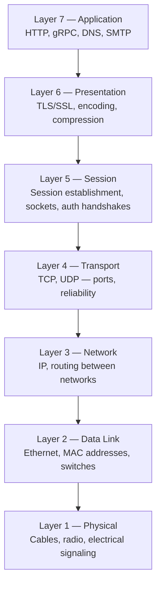

# The OSI Model

---

## Table of Contents
<!-- TOC -->
* [The OSI Model](#the-osi-model)
  * [Table of Contents](#table-of-contents)
  * [Overview](#overview)
  * [The Seven Layers](#the-seven-layers)
  * [OSI vs. TCP/IP](#osi-vs-tcpip)
  * [Why Architects Should Care](#why-architects-should-care)
  * [Q&A](#qa)
  * [Related Topics](#related-topics)
  * [Ref.](#ref)
<!-- TOC -->

---

The **OSI (Open Systems Interconnection) Model** is a conceptual framework that divides network communication into seven distinct layers, each with a well-defined responsibility. It was developed by the ISO in the late 1970s to standardize how different vendors' systems could interoperate. Few real stacks implement all seven layers as cleanly separated software, but the model remains the shared vocabulary architects, network engineers, and vendors use to describe *where* a problem or a design decision lives — "that's a Layer 7 concern" is a common and useful shorthand.

---

## Overview

Before OSI, networking vendors built proprietary, incompatible stacks. The OSI model gave the industry a common reference: any protocol, device, or piece of middleware can be located at one (or more) of its seven layers, which makes it possible to reason about interoperability, troubleshoot systematically ("is this a routing problem or an application problem?"), and design systems with clean separation of concerns.

In practice, the Internet runs on the simpler **TCP/IP 4-layer model** (covered in [TCP/IP](tcp-ip.md)), which collapses several OSI layers together. OSI is still the model most architects reach for conceptually, because its extra granularity — especially the split between Session, Presentation, and Application — maps cleanly onto real architectural decisions like TLS termination, serialization format, and API design.

[Back to top](#table-of-contents)

---

## The Seven Layers

**Caption:** The seven OSI layers stacked from the application a user interacts with down to the raw physical medium; each layer only talks to the layers directly above and below it.

- ### Layer 7 — Application:
  Where user-facing protocols live: HTTP, gRPC, DNS, SMTP. This is the layer application developers and architects spend most of their time in — API design, REST/gRPC contracts, and service-to-service protocols are all Layer 7 decisions.

[Back to top](#table-of-contents)

- ### Layer 6 — Presentation:
  Responsible for translating data between the application and the network format: encryption (TLS/SSL), compression, and character encoding. When you decide "TLS terminates at the load balancer" or "we serialize payloads as Protobuf," you're making a Presentation-layer decision.

[Back to top](#table-of-contents)

- ### Layer 5 — Session:
  Manages the establishment, maintenance, and teardown of a communication session between two hosts — think of the logical conversation a socket represents, or the login/handshake state in a stateful protocol. In modern stacks this is often folded into the transport or application layer, but it's conceptually distinct.

[Back to top](#table-of-contents)

- ### Layer 4 — Transport:
  Provides end-to-end communication semantics between two processes, identified by **ports**. TCP (reliable, ordered, connection-oriented) and UDP (fast, connectionless, best-effort) live here. Choosing between them is one of the most consequential protocol decisions an architect makes — see [TCP/IP](tcp-ip.md) for the trade-off in depth.

[Back to top](#table-of-contents)

- ### Layer 3 — Network:
  Handles logical addressing and routing of packets across interconnected networks. IP (IPv4/IPv6) is the defining protocol here; routers operate at this layer, deciding the next hop for a packet based on its destination IP. See [IP Addressing](ip-addressing.md) for how addresses are structured and allocated.

[Back to top](#table-of-contents)

- ### Layer 2 — Data Link:
  Handles node-to-node delivery across a single physical or logical segment, using **MAC addresses**. Ethernet and Wi-Fi frames, and the switches that forward them, operate here. This is the boundary where "network" stops being about IP routing and starts being about physical/local delivery.

[Back to top](#table-of-contents)

- ### Layer 1 — Physical:
  The actual transmission medium and its electrical, optical, or radio signaling: copper cabling, fiber, Wi-Fi radio waves, connectors. Architects rarely design at this layer directly, but its properties (bandwidth, latency, reliability of the physical link) set the ceiling for everything above it.

[Back to top](#table-of-contents)

---

## OSI vs. TCP/IP

The Internet's actual protocol suite doesn't implement seven separate layers — it uses a simpler, four-layer model that emerged pragmatically alongside TCP/IP's development. The two models roughly map onto each other:

| OSI Layer | TCP/IP Layer |
|-----------|--------------|
| Application, Presentation, Session (7, 6, 5) | Application |
| Transport (4) | Transport |
| Network (3) | Internet |
| Data Link, Physical (2, 1) | Network Access (Link) |

OSI is a *reference model* used for teaching and troubleshooting; TCP/IP is the *implemented* model the real Internet runs on. Full details, including TCP vs. UDP and the three-way handshake, are covered in [TCP/IP](tcp-ip.md).

[Back to top](#table-of-contents)

---

## Why Architects Should Care

Knowing which layer a technology or a problem belongs to sharpens design conversations and speeds up troubleshooting:

| Term | Definition |
|------|------------|
| Layer 7 load balancing | Routes traffic based on HTTP content (path, headers, cookies) — enables features like sticky sessions or path-based routing |
| Layer 4 load balancing | Routes traffic based on IP/port only, without inspecting payload — faster, protocol-agnostic |
| "It's a network problem" | A vague statement worth pinning to a layer: DNS failure (L7), TLS handshake failure (L6), TCP connection refused (L4), unreachable host (L3) all look different and are diagnosed differently |

[Back to top](#table-of-contents)

---

## Q&A

Common questions a software architect trainee would ask about this topic.

**Q: If almost nothing implements OSI's seven layers literally, why does it still matter?**
A: OSI gives the industry a shared, precise vocabulary for describing where a component, protocol, or failure lives. Saying "our load balancer operates at Layer 7" or "that's a Layer 3 routing issue" communicates precisely to any engineer, regardless of the actual implementation stack.

---

**Q: What's the practical difference between a Layer 4 and a Layer 7 load balancer?**
A: A Layer 4 load balancer only sees IP addresses and ports, so it's fast and protocol-agnostic but can't make decisions based on request content. A Layer 7 load balancer inspects the HTTP request (path, headers, cookies), enabling routing decisions like path-based service selection, sticky sessions, or A/B testing — at the cost of extra processing and needing to terminate/understand the application protocol.

---

**Q: Where does TLS termination fit in the OSI model, and why does it matter for architecture?**
A: TLS operates at the Presentation layer (Layer 6), encrypting/decrypting data before it reaches the Application layer. Deciding *where* TLS terminates — at the edge load balancer, at an API gateway, or all the way at the service — is a major architecture decision affecting security posture (encryption-in-transit inside the cluster), certificate management complexity, and performance.

[Back to top](#table-of-contents)

---

## Related Topics

- [TCP/IP](tcp-ip.md) — the practical 4-layer model the Internet actually runs on, including TCP vs. UDP
- [IP Addressing](ip-addressing.md) — details Layer 3 addressing, subnetting, NAT, and DHCP
- [DNS](dns.md) — a Layer 7 application protocol used for name resolution
- [Microservices Architecture](../architectural-patterns/microservices.md) — API Gateway and Load Balancing patterns operate at Layers 4/7 discussed here

[Back to top](#table-of-contents)

---

## Ref.

- [OSI Model — Cloudflare Learning Center](https://www.cloudflare.com/learning/ddos/glossary/open-systems-interconnection-model-osi/) — accessible architect-level overview
- [ISO/IEC 7498-1](https://www.iso.org/standard/20269.html) — the original OSI reference model standard

---

[Get Started](../../get-started.md) | [Networking Concepts](../../get-started.md#networking-concepts)

---
