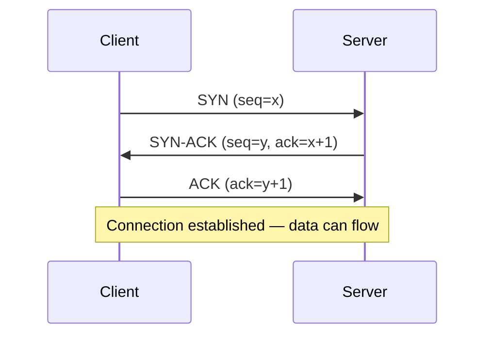

# TCP/IP

---

## Table of Contents
<!-- TOC -->
* [TCP/IP](#tcpip)
  * [Table of Contents](#table-of-contents)
  * [Overview](#overview)
  * [The TCP/IP 4-Layer Model](#the-tcpip-4-layer-model)
  * [TCP vs. UDP](#tcp-vs-udp)
  * [The TCP Three-Way Handshake](#the-tcp-three-way-handshake)
  * [Q&A](#qa)
  * [Related Topics](#related-topics)
  * [Ref.](#ref)
<!-- TOC -->

---

**TCP/IP** (Transmission Control Protocol / Internet Protocol) is the protocol suite that the Internet actually runs on. Where the [OSI Model](osi-model.md) is a seven-layer teaching and reference framework, TCP/IP is the pragmatic, implemented four-layer stack: Network Access, Internet, Transport, and Application. For architects, the most consequential part of this suite is the Transport layer choice between **TCP** and **UDP** — a decision that shapes reliability, latency, and failure behavior for every network call a system makes.

---

## Overview

TCP/IP predates OSI's formalization and was designed pragmatically by DARPA-funded researchers (Cerf and Kahn) to let heterogeneous networks interoperate — the design goal that became the modern Internet. Rather than seven cleanly separated layers, TCP/IP groups responsibilities into four broader layers, reflecting how the protocols were actually built and deployed.

Every HTTP request, every gRPC call, every database connection your system makes ultimately rides on TCP or UDP at the Transport layer, and IP at the Internet layer. Understanding this suite — and in particular knowing when to reach for TCP versus UDP — is foundational to designing systems that behave predictably under network stress, packet loss, and latency.

[Back to top](#table-of-contents)

---

## The TCP/IP 4-Layer Model

| TCP/IP Layer | Responsibility | Example Protocols | Roughly Maps to OSI |
|---|---|---|---|
| Application | User-facing protocols and data formats | HTTP, gRPC, DNS, SMTP, TLS | Layers 5–7 |
| Transport | End-to-end delivery between processes (ports) | TCP, UDP | Layer 4 |
| Internet | Logical addressing and routing across networks | IP (v4/v6), ICMP | Layer 3 |
| Network Access (Link) | Delivery across a physical/local segment | Ethernet, Wi-Fi, ARP | Layers 1–2 |

See [The OSI Model](osi-model.md) for the full seven-layer breakdown this simplifies.

[Back to top](#table-of-contents)

---

## TCP vs. UDP

This is the single most architecturally significant choice at the Transport layer, and it recurs constantly: REST APIs, database drivers, video calls, DNS lookups, and multiplayer games all had to make this choice.

- ### TCP (Transmission Control Protocol):
  **Connection-oriented and reliable.** TCP establishes a connection (via the three-way handshake below) before any data flows, guarantees ordered delivery, retransmits lost packets, and applies flow/congestion control. The cost is overhead: handshake latency, acknowledgment traffic, and head-of-line blocking (a lost packet stalls everything behind it until it's retransmitted).

  Used for: HTTP/HTTPS, database connections, file transfer, and any workload where correctness matters more than raw speed.

[Back to top](#table-of-contents)

- ### UDP (User Datagram Protocol):
  **Connectionless and best-effort.** UDP sends datagrams with no handshake, no delivery guarantee, no ordering, and no built-in retransmission. This makes it fast and low-overhead, but the application must handle any reliability it needs itself.

  Used for: DNS lookups (small, latency-sensitive queries), video/voice calls and live streaming (a dropped frame is better than a stalled one), online gaming, and modern protocols like QUIC/HTTP-3 (which layer their own reliability over UDP to avoid TCP's head-of-line blocking).

[Back to top](#table-of-contents)

- ### Choosing Between Them:
  As an architect, the question is rarely "which is better" but "does this workload need guaranteed, ordered delivery, or does it need to minimize latency and tolerate loss?" A payments API needs TCP's guarantees. A live video feed is often better served by dropping a frame than by stalling to retransmit it — so UDP-based protocols are preferred.

[Back to top](#table-of-contents)

---

## The TCP Three-Way Handshake

Before any data is exchanged over TCP, the client and server synchronize sequence numbers through a three-step handshake:

**Caption:** The three-way handshake establishes a reliable, bidirectional TCP connection before any application data is sent, which is why TCP connections have inherent setup latency that UDP does not.

This handshake — and the equivalent four-way teardown (FIN/ACK exchange) on close — is why TCP connection setup adds a round trip (or more, once TLS is layered on top) before the first byte of application data moves. It's also why connection reuse patterns (HTTP keep-alive, connection pooling) exist: paying the handshake cost once per connection instead of once per request matters at scale.

[Back to top](#table-of-contents)

---

## Q&A

Common questions a software architect trainee would ask about this topic.

**Q: Why does gRPC use HTTP/2 over TCP, but many real-time/gaming systems use UDP directly?**
A: gRPC needs TCP's ordered, reliable delivery for correctness (RPC calls, streaming responses) and benefits from HTTP/2 multiplexing over a single connection. Real-time systems (games, live media) prioritize low, consistent latency over perfect delivery — a stale or missing update is often less disruptive than waiting for TCP to retransmit and stall the whole stream.

---

**Q: What's the practical cost of the TCP handshake at scale, and how do architects mitigate it?**
A: Every new TCP connection costs at least one round trip before data flows (more with TLS on top). At scale this adds up — hence connection pooling, HTTP keep-alive/persistent connections, and protocols like HTTP/2 and HTTP/3 that multiplex many logical streams over one physical connection to amortize handshake cost.

---

**Q: If UDP has no reliability guarantees, why would anything critical use it?**
A: Because the application can implement exactly the reliability semantics it needs on top of UDP, instead of inheriting TCP's one-size-fits-all guarantees. QUIC (the transport behind HTTP/3) does this: it adds its own reliability and congestion control over UDP but avoids TCP's head-of-line blocking, so one lost packet doesn't stall unrelated streams.

[Back to top](#table-of-contents)

---

## Related Topics

- [The OSI Model](osi-model.md) — the seven-layer reference model TCP/IP's four layers simplify
- [IP Addressing](ip-addressing.md) — how the Internet layer's addressing, subnetting, NAT, and DHCP work
- [DNS](dns.md) — a UDP-based (typically) application-layer protocol for name resolution
- [Event Streaming](../data-processing/real-time/event-streaming.md) — streaming brokers typically run over persistent TCP connections to guarantee ordered delivery

[Back to top](#table-of-contents)

---

## Ref.

- [RFC 793 — Transmission Control Protocol](https://www.rfc-editor.org/rfc/rfc793) — original TCP specification
- [TCP/IP — Cloudflare Learning Center](https://www.cloudflare.com/learning/ddos/glossary/tcp-ip/) — accessible architect-level overview

---

[Get Started](../../get-started.md) | [Networking Concepts](../../get-started.md#networking-concepts)

---
