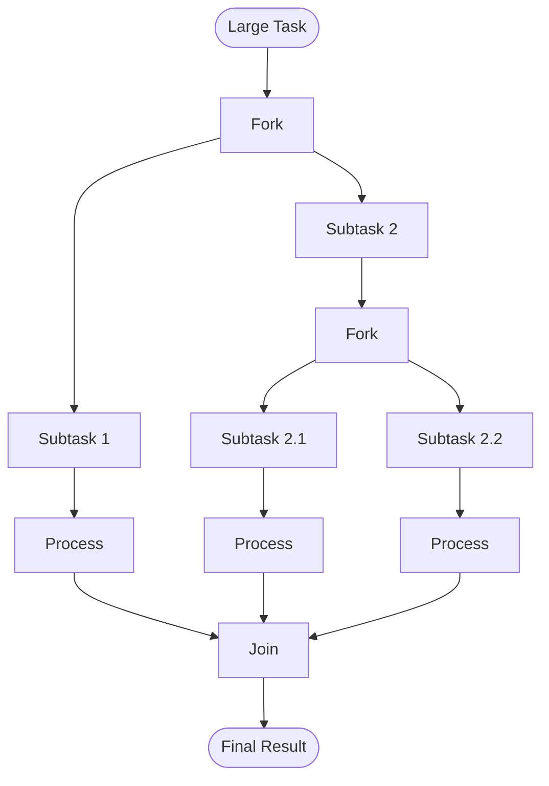
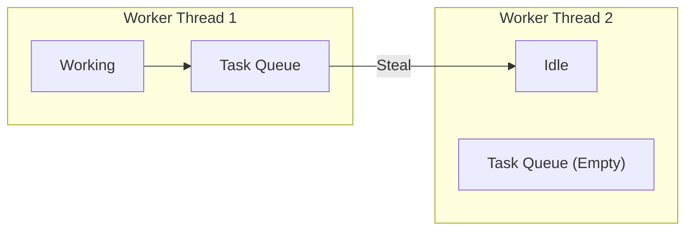

# Fork/Join Framework


---

## Table of Contents
<!-- TOC -->
* [Fork/Join Framework](#forkjoin-framework)
  * [Table of Contents](#table-of-contents)
  * [Overview](#overview)
  * [Core Concepts](#core-concepts)
  * [ForkJoinPool](#forkjoinpool)
  * [RecursiveTask](#recursivetask)
  * [RecursiveAction](#recursiveaction)
  * [Work-Stealing Algorithm](#work-stealing-algorithm)
  * [Best Practices](#best-practices)
  * [Common Pitfalls](#common-pitfalls)
  * [Ref.](#ref)
<!-- TOC -->

---

## Overview

The **Fork/Join Framework** (Java 7+) is designed for **parallel processing** of tasks that can be broken down recursively into smaller subtasks.

**Key Idea:**
1. **Fork**: Split large task into smaller subtasks
2. **Process**: Process subtasks in parallel
3. **Join**: Combine results

**Use Cases:**
- Recursive algorithms (divide-and-conquer)
- Processing large arrays/collections in parallel
- Tasks that can be split into independent subtasks

**Core Classes:**
- `ForkJoinPool`: Executor for fork/join tasks
- `ForkJoinTask`: Base class for fork/join tasks
  - `RecursiveTask<V>`: Returns a result
  - `RecursiveAction`: No result (void)

<sub>[Back to top](#table-of-contents)</sub>

---

## Core Concepts

### Divide-and-Conquer Pattern



### Basic Pattern

```java
if (task is small enough) {
    solve directly
} else {
    fork task into subtasks
    recursively invoke subtasks
    join results
}
```

<sub>[Back to top](#table-of-contents)</sub>

---

## ForkJoinPool

**ForkJoinPool** is a specialized `ExecutorService` for fork/join tasks.

### Creating ForkJoinPool

```java
import java.util.concurrent.ForkJoinPool;

// Use common pool (recommended)
ForkJoinPool pool = ForkJoinPool.commonPool();

// Create custom pool with specific parallelism
ForkJoinPool customPool = new ForkJoinPool(4);  // 4 worker threads

// Use default parallelism (# of CPU cores)
ForkJoinPool defaultPool = new ForkJoinPool();
```

### Submitting Tasks

```java
// Submit and get result
ForkJoinTask<Integer> task = new MyRecursiveTask(data);
Integer result = pool.invoke(task);  // Blocks until complete

// Submit without blocking
ForkJoinTask<Integer> future = pool.submit(task);
Integer result = future.join();  // Get result later

// Execute (no return value)
pool.execute(task);
```

### Common Pool

```java
// Java 8+ provides a shared common pool
ForkJoinPool commonPool = ForkJoinPool.commonPool();

// Parallelism = number of CPU cores - 1
int parallelism = commonPool.getParallelism();

// Used automatically by parallel streams
list.parallelStream()
    .map(...)
    .collect(Collectors.toList());
```

<sub>[Back to top](#table-of-contents)</sub>

---

## RecursiveTask

`RecursiveTask<V>` is used for tasks that **return a result**.

### Example: Parallel Sum

```java
import java.util.concurrent.RecursiveTask;

public class SumTask extends RecursiveTask<Long> {
    private static final int THRESHOLD = 1000;  // Sequential threshold
    private final long[] array;
    private final int start;
    private final int end;

    public SumTask(long[] array, int start, int end) {
        this.array = array;
        this.start = start;
        this.end = end;
    }

    @Override
    protected Long compute() {
        int length = end - start;

        // Base case: small enough, compute directly
        if (length <= THRESHOLD) {
            return computeDirectly();
        }

        // Recursive case: split into subtasks
        int mid = start + length / 2;

        SumTask leftTask = new SumTask(array, start, mid);
        SumTask rightTask = new SumTask(array, mid, end);

        // Fork left task to execute asynchronously
        leftTask.fork();

        // Compute right task directly (reuse current thread)
        Long rightResult = rightTask.compute();

        // Wait for left task to complete
        Long leftResult = leftTask.join();

        // Combine results
        return leftResult + rightResult;
    }

    private Long computeDirectly() {
        long sum = 0;
        for (int i = start; i < end; i++) {
            sum += array[i];
        }
        return sum;
    }
}

// Usage
long[] numbers = new long[10_000_000];
// ... fill array

SumTask task = new SumTask(numbers, 0, numbers.length);
Long result = ForkJoinPool.commonPool().invoke(task);
```

### Example: Parallel Fibonacci

```java
public class FibonacciTask extends RecursiveTask<Integer> {
    private final int n;

    public FibonacciTask(int n) {
        this.n = n;
    }

    @Override
    protected Integer compute() {
        if (n <= 1) {
            return n;
        }

        FibonacciTask f1 = new FibonacciTask(n - 1);
        FibonacciTask f2 = new FibonacciTask(n - 2);

        f1.fork();  // Fork first task
        int result2 = f2.compute();  // Compute second directly
        int result1 = f1.join();  // Join first

        return result1 + result2;
    }
}

// Usage
int result = ForkJoinPool.commonPool().invoke(new FibonacciTask(40));
```

### Optimized Pattern: invokeAll()

```java
@Override
protected Long compute() {
    if (length <= THRESHOLD) {
        return computeDirectly();
    }

    int mid = start + length / 2;
    SumTask left = new SumTask(array, start, mid);
    SumTask right = new SumTask(array, mid, end);

    // Fork both subtasks
    invokeAll(left, right);

    // Join results
    return left.join() + right.join();
}
```

<sub>[Back to top](#table-of-contents)</sub>

---

## RecursiveAction

`RecursiveAction` is used for tasks that **do not return a result** (void).

### Example: Parallel Array Increment

```java
import java.util.concurrent.RecursiveAction;

public class IncrementTask extends RecursiveAction {
    private static final int THRESHOLD = 1000;
    private final long[] array;
    private final int start;
    private final int end;

    public IncrementTask(long[] array, int start, int end) {
        this.array = array;
        this.start = start;
        this.end = end;
    }

    @Override
    protected void compute() {
        int length = end - start;

        if (length <= THRESHOLD) {
            // Small enough: process directly
            for (int i = start; i < end; i++) {
                array[i]++;
            }
        } else {
            // Split into subtasks
            int mid = start + length / 2;

            IncrementTask left = new IncrementTask(array, start, mid);
            IncrementTask right = new IncrementTask(array, mid, end);

            // Fork both subtasks and wait
            invokeAll(left, right);
        }
    }
}

// Usage
long[] array = new long[10_000_000];
IncrementTask task = new IncrementTask(array, 0, array.length);
ForkJoinPool.commonPool().invoke(task);
```

### Example: Parallel Quicksort

```java
public class QuicksortTask extends RecursiveAction {
    private final int[] array;
    private final int low;
    private final int high;
    private static final int THRESHOLD = 1000;

    public QuicksortTask(int[] array, int low, int high) {
        this.array = array;
        this.low = low;
        this.high = high;
    }

    @Override
    protected void compute() {
        if (high - low <= THRESHOLD) {
            // Use sequential sort for small arrays
            Arrays.sort(array, low, high + 1);
        } else {
            int pivotIndex = partition(array, low, high);

            QuicksortTask left = new QuicksortTask(array, low, pivotIndex - 1);
            QuicksortTask right = new QuicksortTask(array, pivotIndex + 1, high);

            invokeAll(left, right);
        }
    }

    private int partition(int[] array, int low, int high) {
        int pivot = array[high];
        int i = low - 1;

        for (int j = low; j < high; j++) {
            if (array[j] <= pivot) {
                i++;
                swap(array, i, j);
            }
        }
        swap(array, i + 1, high);
        return i + 1;
    }

    private void swap(int[] array, int i, int j) {
        int temp = array[i];
        array[i] = array[j];
        array[j] = temp;
    }
}
```

<sub>[Back to top](#table-of-contents)</sub>

---

## Work-Stealing Algorithm

**ForkJoinPool** uses a **work-stealing** algorithm for load balancing.

### How It Works

1. Each worker thread has its own **deque** (double-ended queue)
2. Worker threads push/pop tasks from **their own** deque (LIFO)
3. **Idle threads steal** tasks from **other threads'** deques (FIFO)



**Benefits:**
- **Load balancing**: Idle threads help busy threads
- **Cache locality**: Threads primarily work on their own tasks
- **Minimal synchronization**: Stealing is rare

### Deque Behavior

```java
// Worker thread (owns deque):
task.fork();           // Push to HEAD (LIFO)
task.compute();        // Pop from HEAD (LIFO)

// Stealing thread:
stolenTask = steal();  // Take from TAIL (FIFO)
```

**Why LIFO for owner, FIFO for stealer?**
- Owner works on **recent** tasks (better cache locality)
- Stealer takes **oldest** tasks (likely larger, worth stealing)

<sub>[Back to top](#table-of-contents)</sub>

---

## Best Practices

### 1. Choose Appropriate Threshold

```java
// TOO SMALL: Overhead of forking > benefit of parallelism
private static final int THRESHOLD = 10;

// TOO LARGE: Not enough parallelism
private static final int THRESHOLD = 1_000_000;

// GOOD: Balance between overhead and parallelism
private static final int THRESHOLD = 1000;  // Experiment to find optimal value
```

**Guidelines:**
- Threshold should be **large enough** to amortize forking overhead
- Threshold should be **small enough** to create sufficient parallelism
- Experiment with different values

### 2. Avoid Blocking Operations

```java
// BAD: Blocking in compute()
@Override
protected Integer compute() {
    // Blocks worker thread!
    Thread.sleep(1000);
    return result;
}

// GOOD: Only CPU-bound operations
@Override
protected Integer compute() {
    // Pure computation
    return heavyComputation();
}
```

### 3. Use invokeAll() for Multiple Subtasks

```java
// GOOD: Efficient forking of multiple subtasks
invokeAll(task1, task2, task3);

// Less efficient:
task1.fork();
task2.fork();
task3.fork();
task1.join();
task2.join();
task3.join();
```

### 4. Don't Create Too Many Tasks

```java
// BAD: Creates millions of tiny tasks
if (n == 1) {  // Base case too small
    return compute();
}

// GOOD: Reasonable base case
if (length <= 1000) {
    return compute();
}
```

### 5. Use Common Pool When Possible

```java
// GOOD: Reuse common pool
ForkJoinPool.commonPool().invoke(task);

// Less optimal: Create custom pool (unless needed)
ForkJoinPool customPool = new ForkJoinPool();
customPool.invoke(task);
customPool.shutdown();  // Don't forget cleanup!
```

<sub>[Back to top](#table-of-contents)</sub>

---

## Common Pitfalls

### ❌ 1. Forgetting Base Case

```java
// INFINITE RECURSION!
@Override
protected Integer compute() {
    Task left = new Task(...);
    Task right = new Task(...);
    left.fork();
    return right.compute() + left.join();
    // Missing base case!
}
```

### ❌ 2. join() Before fork()

```java
// WRONG: Sequential execution!
left.fork();
left.join();   // Waits immediately (no parallelism!)
right.fork();
right.join();

// CORRECT:
left.fork();
right.fork();
int r1 = left.join();
int r2 = right.join();
```

### ❌ 3. Using synchronized or Locks

```java
// BAD: Defeats purpose of Fork/Join
@Override
protected Integer compute() {
    synchronized (lock) {  // All threads wait for lock!
        // ...
    }
}

// GOOD: Lock-free, use atomic operations or immutable data
@Override
protected Integer compute() {
    // Pure computation, no shared mutable state
}
```

### ❌ 4. Not Shutting Down Custom Pool

```java
// Memory leak if not shutdown!
ForkJoinPool pool = new ForkJoinPool();
pool.invoke(task);
pool.shutdown();  // MUST shutdown custom pools
```

### ❌ 5. I/O or Blocking Operations

```java
// BAD: Blocks worker threads
@Override
protected Data compute() {
    return database.query(...);  // I/O operation!
}

// GOOD: Use Fork/Join only for CPU-bound tasks
```

<sub>[Back to top](#table-of-contents)</sub>

---

## Ref.

**Official Documentation:**
- [ForkJoinPool JavaDoc](https://docs.oracle.com/javase/8/docs/api/java/util/concurrent/ForkJoinPool.html)
- [RecursiveTask JavaDoc](https://docs.oracle.com/javase/8/docs/api/java/util/concurrent/RecursiveTask.html)
- [RecursiveAction JavaDoc](https://docs.oracle.com/javase/8/docs/api/java/util/concurrent/RecursiveAction.html)

**Articles:**
- [Oracle: Fork/Join Tutorial](https://docs.oracle.com/javase/tutorial/essential/concurrency/forkjoin.html)
- [Doug Lea: A Java Fork/Join Framework](http://gee.cs.oswego.edu/dl/papers/fj.pdf) (Original paper)

**Books:**
- [Java Concurrency in Practice](https://jcip.net/)

**Guides:**
- [Baeldung: Guide to the Fork/Join Framework](https://www.baeldung.com/java-fork-join)
- [Baeldung: Java 8 Parallel Streams](https://www.baeldung.com/java-when-to-use-parallel-stream)

**Related Topics:**
- [Executors](executors.md) - Thread pools
- [Parallel Streams](../stream-api.md#parallel-streams) - Built on Fork/Join
- [CompletableFuture](completable-future.md) - Async programming

---

[Get Started](../../../../../../get-started.md) |
[Java Concurrency](../concurrency.md) |
[Java 8](../../versions.md#java-8-lts)

---
