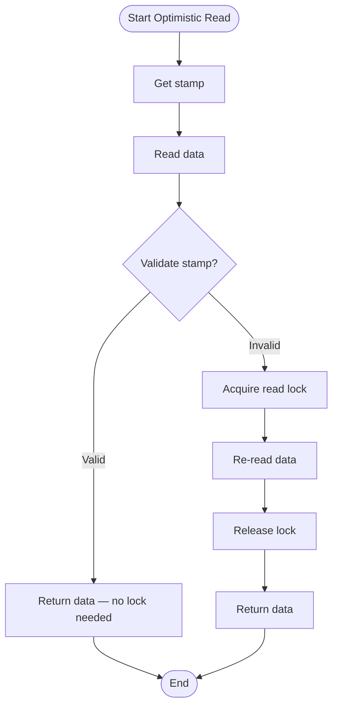

# Locks and Conditions


---

## Table of Contents
<!-- TOC -->
* [Locks and Conditions](#locks-and-conditions)
  * [Table of Contents](#table-of-contents)
  * [Overview](#overview)
  * [ReentrantLock](#reentrantlock)
  * [Lock vs synchronized](#lock-vs-synchronized)
  * [Condition Interface](#condition-interface)
  * [ReadWriteLock](#readwritelock)
  * [StampedLock](#stampedlock)
  * [Best Practices](#best-practices)
  * [Common Pitfalls](#common-pitfalls)
  * [Ref.](#ref)
<!-- TOC -->

---

## Overview

The `java.util.concurrent.locks` package provides more flexible and powerful locking mechanisms than the `synchronized` keyword.

**Key Interfaces:**
- **Lock**: Basic locking interface
- **ReadWriteLock**: Separate locks for reading and writing
- **Condition**: await/signal mechanism (like wait/notify)

**Key Implementations:**
- **ReentrantLock**: Reentrant mutual exclusion lock
- **ReentrantReadWriteLock**: Reentrant read-write lock
- **StampedLock**: Optimistic locking support (Java 8+)

**Advantages over synchronized:**
- **Trylock**: Attempt to acquire lock without blocking
- **Timed lock**: Acquire lock with timeout
- **Interruptible lock**: Can be interrupted while waiting
- **Fairness**: Optional fair ordering of waiting threads
- **Multiple conditions**: Multiple condition variables per lock
- **Lock polling**: Check if lock is available

<sub>[Back to top](#table-of-contents)</sub>

---

## ReentrantLock

`ReentrantLock` is a reentrant mutual exclusion lock with extended capabilities.

### Basic Usage

```java
import java.util.concurrent.locks.Lock;
import java.util.concurrent.locks.ReentrantLock;

public class Counter {
    private final Lock lock = new ReentrantLock();
    private int count = 0;

    public void increment() {
        lock.lock();  // Acquire lock
        try {
            count++;
        } finally {
            lock.unlock();  // ALWAYS unlock in finally!
        }
    }

    public int getCount() {
        lock.lock();
        try {
            return count;
        } finally {
            lock.unlock();
        }
    }
}
```

**Critical Pattern:**
```java
lock.lock();
try {
    // Critical section
} finally {
    lock.unlock();  // Ensures unlock even if exception thrown
}
```

### tryLock() - Non-Blocking Acquisition

```java
public class BankAccount {
    private final Lock lock = new ReentrantLock();
    private int balance = 1000;

    public boolean withdraw(int amount) {
        if (lock.tryLock()) {  // Try to acquire without blocking
            try {
                if (balance >= amount) {
                    balance -= amount;
                    return true;
                }
                return false;
            } finally {
                lock.unlock();
            }
        } else {
            System.out.println("Could not acquire lock, try later");
            return false;
        }
    }
}
```

### tryLock(timeout) - Timed Acquisition

```java
import java.util.concurrent.TimeUnit;

public void transfer(Account from, Account to, int amount)
        throws InterruptedException {
    // Try to acquire both locks with timeout
    if (from.getLock().tryLock(1, TimeUnit.SECONDS)) {
        try {
            if (to.getLock().tryLock(1, TimeUnit.SECONDS)) {
                try {
                    from.debit(amount);
                    to.credit(amount);
                } finally {
                    to.getLock().unlock();
                }
            } else {
                System.out.println("Timeout acquiring destination lock");
            }
        } finally {
            from.getLock().unlock();
        }
    } else {
        System.out.println("Timeout acquiring source lock");
    }
}
```

### lockInterruptibly() - Interruptible Lock

```java
public void processWithInterruption() throws InterruptedException {
    lock.lockInterruptibly();  // Can be interrupted while waiting
    try {
        // Process data
        longRunningOperation();
    } finally {
        lock.unlock();
    }
}

// In another thread:
processingThread.interrupt();  // Will throw InterruptedException
```

### Fair vs Unfair Locks

```java
// Unfair lock (default) - better performance
Lock unfairLock = new ReentrantLock();

// Fair lock - FIFO ordering, prevents starvation
Lock fairLock = new ReentrantLock(true);
```

**Fair Lock:**
- Threads acquire lock in order they requested it
- Prevents starvation
- Lower throughput due to overhead

**Unfair Lock:**
- Threads may "barge" ahead of waiting threads
- Better performance
- Risk of thread starvation

### Lock Information Methods

```java
ReentrantLock lock = new ReentrantLock();

lock.lock();
try {
    boolean held = lock.isHeldByCurrentThread();  // true
    int holdCount = lock.getHoldCount();  // 1 (or more if nested)
    boolean locked = lock.isLocked();  // true
    boolean fair = lock.isFair();  // false (default)
} finally {
    lock.unlock();
}
```

<sub>[Back to top](#table-of-contents)</sub>

---

## Lock vs synchronized

| Feature | synchronized | ReentrantLock |
|---------|-------------|---------------|
| **Syntax** | Language keyword | Class with methods |
| **Acquire Lock** | Automatic | `lock()` |
| **Release Lock** | Automatic | `unlock()` (in finally!) |
| **Try Lock** | ❌ No | ✅ `tryLock()` |
| **Timed Lock** | ❌ No | ✅ `tryLock(time, unit)` |
| **Interruptible** | ❌ No | ✅ `lockInterruptibly()` |
| **Fairness** | ❌ No | ✅ Optional |
| **Multiple Conditions** | ❌ One (implicit) | ✅ Multiple |
| **Lock Status** | ❌ No query | ✅ `isLocked()`, `getHoldCount()` |
| **Deadlock Detection** | ❌ No | ✅ Can be detected |
| **Performance** | Slightly better | Slightly worse |

**When to use synchronized:**
- Simple mutual exclusion
- Cleaner syntax
- Automatic lock release
- Most common case

**When to use ReentrantLock:**
- Need try-lock or timed lock
- Need interruptible lock acquisition
- Need fairness guarantees
- Need multiple condition variables
- Need to hand-off lock between methods

<sub>[Back to top](#table-of-contents)</sub>

---

## Condition Interface

`Condition` provides await/signal mechanisms similar to wait/notify, but **more powerful**.

### Basic Usage

```java
import java.util.concurrent.locks.Condition;
import java.util.concurrent.locks.Lock;
import java.util.concurrent.locks.ReentrantLock;

public class BoundedBuffer<T> {
    private final Lock lock = new ReentrantLock();
    private final Condition notFull = lock.newCondition();
    private final Condition notEmpty = lock.newCondition();

    private final T[] buffer;
    private int count, putIndex, takeIndex;

    @SuppressWarnings("unchecked")
    public BoundedBuffer(int capacity) {
        buffer = (T[]) new Object[capacity];
    }

    public void put(T item) throws InterruptedException {
        lock.lock();
        try {
            while (count == buffer.length) {
                notFull.await();  // Wait until not full
            }
            buffer[putIndex] = item;
            putIndex = (putIndex + 1) % buffer.length;
            count++;
            notEmpty.signal();  // Signal waiting consumers
        } finally {
            lock.unlock();
        }
    }

    public T take() throws InterruptedException {
        lock.lock();
        try {
            while (count == 0) {
                notEmpty.await();  // Wait until not empty
            }
            T item = buffer[takeIndex];
            takeIndex = (takeIndex + 1) % buffer.length;
            count--;
            notFull.signal();  // Signal waiting producers
            return item;
        } finally {
            lock.unlock();
        }
    }
}
```

### Condition vs wait/notify

| Feature | wait/notify | Condition |
|---------|-------------|-----------|
| **Conditions per Object** | 1 (implicit) | Multiple |
| **Signal Specific** | ❌ No | ✅ Yes (different conditions) |
| **Spurious Wakeups** | ⚠️ Possible | ⚠️ Possible (use while loop) |
| **Timed Wait** | ✅ Yes | ✅ `await(time, unit)` |
| **Uninterruptible Wait** | ❌ No | ✅ `awaitUninterruptibly()` |
| **Wait Until Time** | ❌ No | ✅ `awaitUntil(deadline)` |

### Multiple Conditions Example

```java
public class PriorityQueue<T> {
    private final Lock lock = new ReentrantLock();
    private final Condition highPriorityAvailable = lock.newCondition();
    private final Condition lowPriorityAvailable = lock.newCondition();

    private Queue<T> highPriority = new LinkedList<>();
    private Queue<T> lowPriority = new LinkedList<>();

    public void addHighPriority(T item) {
        lock.lock();
        try {
            highPriority.add(item);
            highPriorityAvailable.signal();  // Signal high-priority waiters
        } finally {
            lock.unlock();
        }
    }

    public void addLowPriority(T item) {
        lock.lock();
        try {
            lowPriority.add(item);
            lowPriorityAvailable.signal();  // Signal low-priority waiters
        } finally {
            lock.unlock();
        }
    }

    public T takeHighPriority() throws InterruptedException {
        lock.lock();
        try {
            while (highPriority.isEmpty()) {
                highPriorityAvailable.await();
            }
            return highPriority.remove();
        } finally {
            lock.unlock();
        }
    }
}
```

<sub>[Back to top](#table-of-contents)</sub>

---

## ReadWriteLock

`ReadWriteLock` maintains a pair of locks: one for read-only operations, one for writing.

**Concept:**
- **Multiple readers** can hold the read lock simultaneously
- **Only one writer** can hold the write lock
- **No readers** when write lock is held

### Basic Usage

```java
import java.util.concurrent.locks.ReadWriteLock;
import java.util.concurrent.locks.ReentrantReadWriteLock;

public class CachedData {
    private final ReadWriteLock rwLock = new ReentrantReadWriteLock();
    private final Lock readLock = rwLock.readLock();
    private final Lock writeLock = rwLock.writeLock();

    private Map<String, String> cache = new HashMap<>();

    // Multiple threads can read simultaneously
    public String get(String key) {
        readLock.lock();
        try {
            return cache.get(key);
        } finally {
            readLock.unlock();
        }
    }

    // Only one thread can write
    public void put(String key, String value) {
        writeLock.lock();
        try {
            cache.put(key, value);
        } finally {
            writeLock.unlock();
        }
    }

    // No reads or writes allowed during clear
    public void clear() {
        writeLock.lock();
        try {
            cache.clear();
        } finally {
            writeLock.unlock();
        }
    }
}
```

### When to Use ReadWriteLock

**Good Use Cases:**
- Read-heavy workloads (90%+ reads)
- Long read operations
- Infrequent writes

**Poor Use Cases:**
- Write-heavy workloads
- Short operations (lock overhead not worth it)
- Simple data structures (use AtomicReference)

### Fairness and Ordering

```java
// Unfair (default) - writers can barge ahead
ReadWriteLock unfair = new ReentrantReadWriteLock();

// Fair - FIFO ordering
ReadWriteLock fair = new ReentrantReadWriteLock(true);
```

<sub>[Back to top](#table-of-contents)</sub>

---

## StampedLock

`StampedLock` (Java 8+) provides an **optimistic reading** mechanism for better performance.

**Three Modes:**
1. **Writing**: Exclusive access
2. **Reading**: Shared access (like ReadWriteLock)
3. **Optimistic Reading**: Non-blocking read (unique to StampedLock)

### Basic Usage

```java
import java.util.concurrent.locks.StampedLock;

public class Point {
    private final StampedLock lock = new StampedLock();
    private double x, y;

    // Write lock (exclusive)
    public void move(double deltaX, double deltaY) {
        long stamp = lock.writeLock();
        try {
            x += deltaX;
            y += deltaY;
        } finally {
            lock.unlockWrite(stamp);
        }
    }

    // Optimistic read (non-blocking!)
    public double distanceFromOrigin() {
        long stamp = lock.tryOptimisticRead();  // Non-blocking!
        double currentX = x;  // Read without lock
        double currentY = y;

        if (!lock.validate(stamp)) {  // Check if values changed
            // Data changed, acquire read lock
            stamp = lock.readLock();
            try {
                currentX = x;
                currentY = y;
            } finally {
                lock.unlockRead(stamp);
            }
        }

        return Math.sqrt(currentX * currentX + currentY * currentY);
    }

    // Pessimistic read lock
    public double getX() {
        long stamp = lock.readLock();
        try {
            return x;
        } finally {
            lock.unlockRead(stamp);
        }
    }
}
```

### Optimistic Reading Flow



### Lock Upgrade/Downgrade

```java
public void updateConditionally(double newX, double newY) {
    long stamp = lock.readLock();  // Start with read lock
    try {
        while (x == 0.0 && y == 0.0) {
            long writeStamp = lock.tryConvertToWriteLock(stamp);
            if (writeStamp != 0L) {  // Upgrade succeeded
                stamp = writeStamp;
                x = newX;
                y = newY;
                break;
            } else {  // Upgrade failed
                lock.unlockRead(stamp);
                stamp = lock.writeLock();  // Acquire write lock explicitly
            }
        }
    } finally {
        lock.unlock(stamp);
    }
}
```

### StampedLock vs ReadWriteLock

| Feature | ReadWriteLock | StampedLock |
|---------|--------------|-------------|
| **Optimistic Read** | ❌ No | ✅ Yes |
| **Non-blocking Reads** | ❌ No | ✅ Yes (optimistic) |
| **Reentrancy** | ✅ Yes | ❌ No |
| **Condition Support** | ✅ Yes | ❌ No |
| **Performance** | Good | Better (with optimistic reads) |
| **Complexity** | Lower | Higher |

**When to use StampedLock:**
- Very read-heavy workloads (95%+ reads)
- Short read operations
- Can tolerate optimistic read retries
- Don't need reentrancy

<sub>[Back to top](#table-of-contents)</sub>

---

## Best Practices

### 1. Always Unlock in finally

```java
// BAD: Unlock might not happen
lock.lock();
criticalSection();
lock.unlock();  // If criticalSection() throws, lock never released!

// GOOD: Always unlock in finally
lock.lock();
try {
    criticalSection();
} finally {
    lock.unlock();  // Always executes
}
```

### 2. Use try-with-resources Pattern (Custom)

```java
// Create a helper class for cleaner syntax
public class LockResource implements AutoCloseable {
    private final Lock lock;

    public LockResource(Lock lock) {
        this.lock = lock;
        lock.lock();
    }

    @Override
    public void close() {
        lock.unlock();
    }
}

// Usage
try (LockResource ignored = new LockResource(lock)) {
    // Critical section
}  // Auto-unlock
```

### 3. Prefer tryLock with Timeout

```java
// GOOD: Avoid indefinite blocking
if (lock.tryLock(10, TimeUnit.SECONDS)) {
    try {
        // Critical section
    } finally {
        lock.unlock();
    }
} else {
    // Handle timeout (log, retry, fail gracefully)
    throw new TimeoutException("Could not acquire lock");
}
```

### 4. Use Condition for Complex Wait Scenarios

```java
// Multiple conditions for different states
Lock lock = new ReentrantLock();
Condition dataReady = lock.newCondition();
Condition spaceAvailable = lock.newCondition();

// Much clearer than single wait/notify
```

### 5. Document Lock Ordering

```java
/**
 * Lock ordering: Always acquire locks in this order to prevent deadlock:
 * 1. accountLock
 * 2. transactionLock
 * 3. auditLock
 */
public class BankingSystem {
    private final Lock accountLock = new ReentrantLock();
    private final Lock transactionLock = new ReentrantLock();
    private final Lock auditLock = new ReentrantLock();
}
```

<sub>[Back to top](#table-of-contents)</sub>

---

## Common Pitfalls

### ❌ 1. Forgetting to Unlock

```java
// WRONG: If exception occurs, lock never released
lock.lock();
riskyOperation();
lock.unlock();  // Never reached if exception thrown!

// CORRECT:
lock.lock();
try {
    riskyOperation();
} finally {
    lock.unlock();
}
```

### ❌ 2. Unlocking Without Holding Lock

```java
// WRONG: IllegalMonitorStateException
lock.unlock();  // Don't hold lock!

// WRONG: Unbalanced lock/unlock
lock.lock();
lock.unlock();
lock.unlock();  // IllegalMonitorStateException
```

### ❌ 3. Using StampedLock as Reentrant

```java
// WRONG: StampedLock is NOT reentrant!
StampedLock lock = new StampedLock();
long stamp = lock.writeLock();
long stamp2 = lock.writeLock();  // DEADLOCK! Can't reacquire
```

### ❌ 4. Holding Lock During I/O

```java
// BAD: Holding lock during slow I/O
lock.lock();
try {
    data = fetchDataFromNetwork();  // Slow! Others blocked
    process(data);
} finally {
    lock.unlock();
}

// GOOD: Fetch outside lock
data = fetchDataFromNetwork();  // No lock
lock.lock();
try {
    process(data);  // Only protect critical section
} finally {
    lock.unlock();
}
```

### ❌ 5. Not Checking tryLock Result

```java
// WRONG: Assuming lock acquired
lock.tryLock();
criticalSection();  // Might execute without lock!
lock.unlock();

// CORRECT: Check return value
if (lock.tryLock()) {
    try {
        criticalSection();
    } finally {
        lock.unlock();
    }
}
```

<sub>[Back to top](#table-of-contents)</sub>

---

## Ref.

**Official Documentation:**
- [Lock Interface JavaDoc](https://docs.oracle.com/javase/8/docs/api/java/util/concurrent/locks/Lock.html)
- [ReentrantLock JavaDoc](https://docs.oracle.com/javase/8/docs/api/java/util/concurrent/locks/ReentrantLock.html)
- [ReadWriteLock JavaDoc](https://docs.oracle.com/javase/8/docs/api/java/util/concurrent/locks/ReadWriteLock.html)
- [StampedLock JavaDoc](https://docs.oracle.com/javase/8/docs/api/java/util/concurrent/locks/StampedLock.html)
- [Condition JavaDoc](https://docs.oracle.com/javase/8/docs/api/java/util/concurrent/locks/Condition.html)

**Books:**
- [Java Concurrency in Practice](https://jcip.net/) - Chapter 13 (Explicit Locks)

**Guides:**
- [Baeldung: Guide to java.util.concurrent.Locks](https://www.baeldung.com/java-concurrent-locks)
- [Baeldung: StampedLock in Java 8](https://www.baeldung.com/java-stampedlock)
- [Oracle Tutorial: Lock Objects](https://docs.oracle.com/javase/tutorial/essential/concurrency/newlocks.html)

**Related Topics:**
- [Thread Synchronization](synchronization.md) - Traditional synchronized blocks
- [Java Memory Model](java-memory-model.md) - Memory visibility guarantees
- [Atomic Variables](atomic-variables.md) - Lock-free alternatives

---

[Get Started](../../../../../../get-started.md) |
[Java Concurrency](../concurrency.md) |
[Java 8](../../versions.md#java-8-lts)

---
